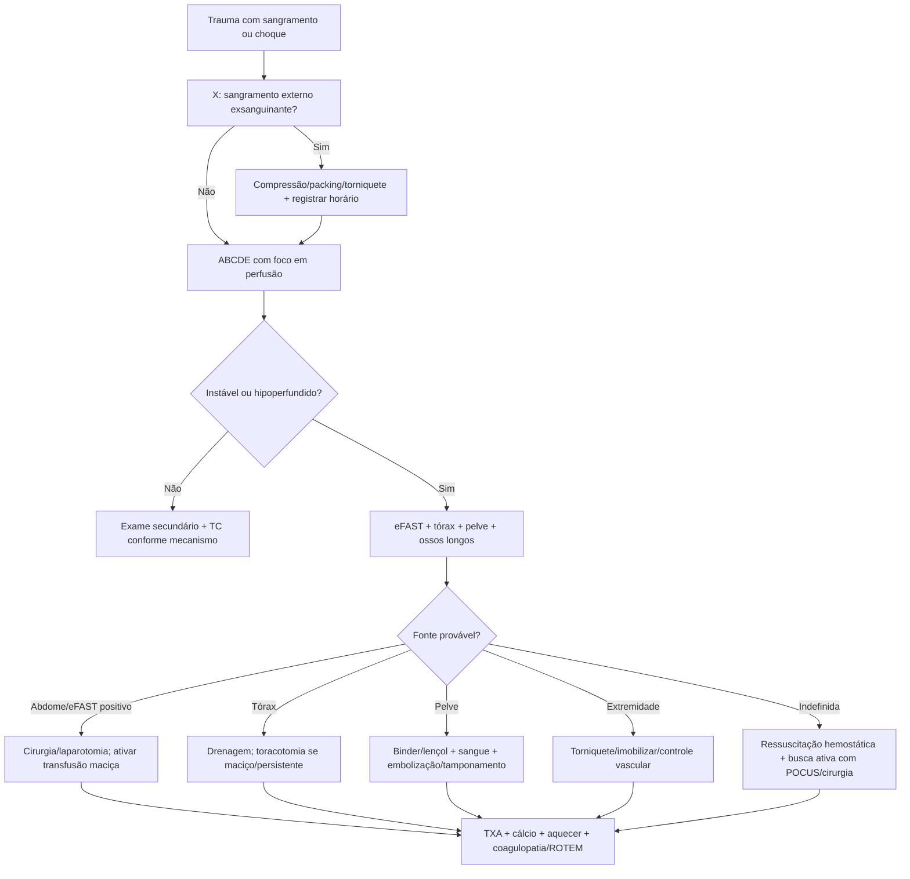

# Trauma Hemorrágico, Controle De Dano E Transfusão Maciça

## Leitura de 30 segundos

- Hemorragia é uma das principais causas evitáveis de morte no trauma: controle mecânico do sangramento vem antes de cristaloide bonito.
- No XABCDE, o **X** e hemorragia exsanguinante: compressão, packing, torniquete, estabilização pélvica e cirurgia/intervenção precoce.
- Choque hemorrágico não espera hipotensão: taquicardia, TEC lento, pele fria, confusão, lactato/base déficit e mecanismo grave já bastam para agir.
- Se precisa de transfusão maciça: aquecer, TXA precoce, sangue/componentes balanceados, cálcio, coagulopatia/ROTEM e controle definitivo do foco.
- A banca TEME gosta de torniquete, 1:1:1 ou sangue total, eFAST com instabilidade, pelve, hipotermia e armadilhas contra excesso de cristaloide.

## Por que cai

Trauma foi um dos blocos mais recorrentes nas provas TEME22-25 e aparece nas estações práticas. A estação de trauma de 2025 cobrou exatamente o que importa: XABCDE, identificar hemorragia exsanguinante, torniquete correto, horário do torniquete, choque hemorrágico, eFAST, pelve/ossos longos, protocolo de transfusão maciça, TXA, cálcio, aquecimento, exames de coagulopatia/ROTEM e avaliação cirúrgica.

O que a banca costuma testar:

- Controle imediato de sangramento externo antes de se perder em via aérea/TC.
- Trauma instável + eFAST positivo = cirurgia/controle de fonte, não tomografia.
- Amputação ou sangramento volumoso de extremidade = torniquete cedo, sem afrouxar a cada 15 min.
- Choque hemorrágico = sangue/componentes balanceados; cristaloide e ponte curta.
- TXA deve ser precoce, idealmente dentro de 3 horas.
- Hipotermia, acidose e coagulopatia formam a tríade letal; hoje muitos incluem hipocalcemia como quarto pilar.
- Fratura pélvica instável pode sangrar muito e precisa de estabilização mecânica imediata.

## Conceitos que sustentam a conduta

O trauma hemorrágico mata por perda de volume, perda de capacidade de transporte de oxigênio e coagulopatia induzida pelo trauma. Cristaloide em excesso dilui fatores, piora hipotermia, desfaz coágulo e aumenta sangramento. Por isso, a ressuscitação moderna é hemostática: controlar a fonte e repor sangue/componentes de forma balanceada.

O paciente pode estar em choque antes da PAS cair. Jovens compensam com taquicardia e vasoconstrição; gestantes e idosos podem enganar; betabloqueador máscara frequência. A avaliação é sindrômica: mecanismo, perfusão, estado mental, pele, pulso, lactato/base déficit, eFAST e resposta ao tratamento.

Controle de dano tem duas metades inseparaveis:

- **Controle anatômico:** torniquete, compressão, packing, binder pélvico, cirurgia, embolização, toracotomia/laparotomia quando indicado.
- **Ressuscitação fisiológica:** sangue, plasma, plaquetas, TXA, cálcio, fibrinogênio/crio quando indicado, aquecimento e permissão de PA menor até controlar sangramento, exceto situações especiais.

## Abordagem prática

### 1. XABCDE Sem Perder O X

1. **X:** hemorragia externa exsanguinante: compressão direta, packing, torniquete, curativo hemostático.
2. **A:** via aérea com restrição de movimento cervical; IOT sé indicação, sem atrasar controle de sangramento.
3. **B:** procurar pneumotórax hipertensivo, Hemotórax maciço, tórax instável, tamponamento.
4. **C:** pulso, pele, TEC, PA, eFAST, pelve, ossos longos, acessos calibrosos/IO, sangue.
5. **D:** Glasgow, pupilas, glicemia se necessário; TCE muda alvo pressor.
6. **E:** expor tudo e aquecer agressivamente.

Mensagem de prova: se o sangramento e catastrofico, ele é tratado antes do A. Não existe intubação bonita em paciente que está exsanguinando sem controle.

### 2. Controle Hemorragia Externa

| situação | Conduta |
|---|---|
| Sangramento compressível | Compressão direta forte e contínua |
| Ferida profunda/juncional | Packing com eaze, preferir hemostática se disponível, mais pressão |
| Extremidade com sangramento grave | Torniquete proximal, apertar até parar sangramento e pulso distal |
| Torniquete insuficiente | Revisar posição/aperto e colocar segundo torniquete acima |
| Depois de controlar | Curativo compressivo, registrar horário, não afrouxar no atendimento inicial |

Torniquete:

- Usar preferencialmente torniquete comercial.
- Colocar 5-7 cm acima da ferida quando o local e claro; em Cenário confuso, alto e apertado no membro.
- Não colocar sobre articulação.
- Apertar até cessar sangramento.
- Registrar horário.
- Não afrouxar periodicamente.

### 3. Suspeite Das Quatro Fontes De Sangue Oculto

No politrauma instável, procure sangramento em:

| Fonte | Como suspeitar | Controle inicial |
|---|---|---|
| Tórax | MV reduzido, macicez, choque, eFAST pleural | Drenagem; cirurgia se maciço/persistente |
| Abdome | eFAST positivo, dor, distensão, mecanismo | Laparotomia se instável |
| Pelve/retroperitônio | dor/instabilidade pélvica, mecanismo, choque | Binder/lençol; sangue; embolização/tamponamento/cirurgia |
| Ossos longos/externo | deformidade, fratura femur, amputação, sangramento | Imobilização, tração se indicada, torniquete/compressão |

Regra de prova: paciente instável não vai passear na tomografia para "definir melhor" uma hemorragia que já está matando.

### 4. Ative Transfusão Maciça Cedo

Ative se houver:

- Choque com suspeita de hemorragia.
- Sangramento ativo importante.
- Necessidade prevista de múltiplos hemocomponentes.
- Trauma penetrante ou contuso grave com instabilidade.
- eFAST positivo + instabilidade.
- Pelve instável + choque.
- Shock index elevado, lactato/base déficit importantes ou piora progressiva.

Conduta da primeira hora:

1. Acionar cirurgia/trauma/intervenção imediatamente.
2. Dois acessos calibrosos ou intraosseo.
3. Aquecer paciente, sala, fluidos e sangue.
4. Enviar tipagem, provas, hemograma, gasometria, lactato, coagulograma, fibrinogênio, cálcio iônico, ROTEM/TEG se disponível.
5. Transfusão balanceada 1:1:1 ou sangue total se protocolo local.
6. TXA se dentro da janela e sangramento/risco de sangramento importante.
7. Cálcio durante transfusão.
8. Reavaliar fonte: tórax, abdome, pelve, ossos longos, externo.

## Fluxograma

## Doses, alvos e números

### Ressuscitação Hemostática

| Item | Número | observação TEME |
|---|---:|---|
| TXA trauma | 1 g EV em 10 min + 1 g EV em 8 h | Referência clássica CRASH-2; administrar até 3 h do trauma |
| Transfusão maciça | CH:PFC:Plaquetas 1:1:1 | Sangue total também aceito se disponível/protocolo |
| Cristaloide | 1.000-1.500 mL aquecido como ponte | Evitar litros repetidos se choque hemorrágico |
| Cálcio | 1-2 ampolas a cada 4 hemoderivados | A estação 2025 cobrou exatamente esse padrão |
| Temperatura | evitar < 35-36 C | Hipotermia piora coagulopatia |
| Fibrinogênio | tratar se baixo; alvo prático > 150-200 mg/dL | Usar crio/fibrinogênio conforme protocolo/ROTEM |
| Plaquetas | alvo > 50.000; no TCE/hemorragia SNC mirar > 100.000 | Prova pode cobrar alvo maior no neurotrauma |
| PAS em hemorragia sem TCE | alvo aproximado 80-90 mmHg até controle | Hipotensão permissiva não vale para TCE grave |
| PAS em TCE grave | manter pelo menos > 100-110 mmHg | Evitar hipotensão e hipoxemia |

### Perdas Em Fraturas

| Lesão | Perda estimada |
|---|---:|
| Radio/ulna | 150-250 mL |
| Umero | ~250 mL |
| Tibia/fibula | ~500 mL |
| Femur | ~1.000 mL |
| Pelve | 1.500-3.000 mL ou mais |

### Hemotórax

| Achado | Conduta |
|---|---|
| Hemotórax com instabilidade | Drenagem imediata + sangue + cirurgia conforme resposta |
| Drenagem inicial > 1.500 mL | Toracotomia/avaliação cirúrgica urgente |
| Sangramento > 200 mL/h por 3 h | Toracotomia/avaliação cirúrgica |

### Trauma Pediátrico

| Item | Número |
|---|---:|
| Cristaloide inicial | 20 mL/kg |
| Concentrado de hemácias | 10-20 mL/kg |
| Hipotensão sistolica minima | 70 + 2 x idade |

## eFAST No Choque Hemorrágico

O eFAST responde Perguntas objetivas:

- Tem líquido livre abdominal?
- Tem tamponamento?
- Tem pneumotórax?
- Tem Hemotórax?

Intérprete pelo contexto:

| Cenário | Conduta provável |
|---|---|
| Instável + FAST abdominal positivo | Laparotomia/controle cirúrgico |
| Instável + janela pericardica positiva | Tamponamento: cirurgia/toracotomia/pericardiocentese como ponte |
| Instável + pneumotórax | Descompressão imediata |
| estável + mecanismo abdominal | TC com contraste, mesmo se FAST negativo |
| FAST negativo + choque | Procurar pelve, tórax, retroperitônio, ossos longos e choque não hemorrágico |

Pegadinha: eFAST negativo não exclui lesão abdominal em paciente estável, nem sangramento retroperitoneal/pélvico.

## Pelve E Retroperitônio

Quando suspeitar:

- Mecanismo de alta energia.
- Dor pélvica, instabilidade, encurtamento/rotação de membro.
- Equimose perineal/escrotal, sangue em meato uretral.
- Choque sem outra fonte clara.

Conduta inicial:

1. Não "testar" pelve repetidamente.
2. Binder pélvico ou lençol no nível dos grandes trocanteres, não na cintura.
3. Evitar sondagem vesical se sangue no meato, equimose perineal ou suspeita de lesão uretral; fazer uretrografia retrógrada.
4. Transfusão hemostática.
5. Acionar ortopedia/cirurgia/intervenção: fixação, tamponamento pré-peritoneal e/ou embolização conforme serviço.

## Trauma Abdominal

| Cenário | Conduta |
|---|---|
| Instável + peritonite/evisceracao/FAST positivo | Laparotomia imediata |
| estável + trauma contuso | TC com contraste |
| Lesão esplênica/hepática em estável | Manejo não operatório pode ser possível em centro com suporte |
| Trauma penetrante anterior estável sem peritonite | exploração local/TC/observação conforme protocolo |
| Peritonite, pneumoperitonio, evisceracao importante | Cirurgia |

Pegadinha: lesão esplênica grau alto na TC não é indicação automática de laparotomia se o paciente está estável e em centro capaz de monitorar/embolizar.

## Extremidades

### Fratura Exposta

1. Controlar sangramento.
2. Avaliar neurovascular antes e depois.
3. Remover contaminação grosseira.
4. Cobrir com curativo esteril.
5. Imobilizar.
6. Antibiótico precoce.
7. Profilaxia tetanica.
8. Cirurgia/ortopedia.

| Gustilo-Anderson | Antibiótico inicial típico |
|---|---|
| I-II sem contaminação grosseira | Cefazolina |
| III | Cefazolina + gentamicina |
| Solo/fezes/água ou contaminação importante | Ampliar cobertura conforme exposição/protocolo |

### Síndrome Compartimental

Sinais precoces:

- Dor desproporcional.
- Dor ao estiramento passivo.
- Parestesia.
- Compartimento tenso.

Pulso ausente, palidez e paralisia são tardios. Conduta: retirar constrições e chamar cirurgia para fasciotomia.

## Populações Especiais

### Gestante

- Prioridade e salvar a mãe.
- Sinais maternos podem subestimar perda: aumento de volume plasmático máscara choque.
- Deslocar útero para esquerda se gestação avançada.
- Oxigenar e evitar hipotensão.
- Monitor fetal se viável e disponível, sem atrasar cuidado materno.
- Rh negativo + trauma: imunoglobulina anti-D conforme protocolo.

### Idoso

- Menor reserva e maior mortalidade com lesões aparentemente pequenas.
- Betabloqueador e marcapasso mascaram taquicardia.
- Anticoagulantes mudam risco é conduta.
- Limiar menor para imagem, observação e reversão de coagulopatia quando indicado.

### Criança

- Hipotensão e tardia.
- Taquicardia, TEC lento, palidez e letargia são sinais precoces.
- FAST tem menor sensibilidade que em adulto; não use para "liberar" criança instável.
- Aquecimento e glicemia importam.

## Para prova vs na prática

> **Para prova TEME:** se o caso descreve choque hemorrágico, responda com controle de fonte, cirurgia precoce, transfusão 1:1:1 ou sangue total, TXA 1 g + 1 g dentro de 3 horas, cálcio a cada 4 hemoderivados, aquecimento e coleta de coagulopatia/ROTEM.
>
> **Na prática clínica:** protocolos atuais valorizam sangue total de baixo titulo quando disponível, reposição guiada por viscoelásticos, cálcio iônico monitorado, fibrinogênio/crio precoces quando baixo e métricas de desempenho. O mais importante contínua sendo não atrasar transporte/centro cirúrgico/intervenção por medidas adjuntas.

## Pegadinhas TEME

- **Afrouxar torniquete a cada 15 min:** errado.
- **Mais cristaloide para choque hemorrágico persistente:** geralmente errado; precisa sangue e controle de fonte.
- **FAST negativo exclui trauma abdominal:** errado.
- **Instável vai para TC:** errado, salvo exceções muito selecionadas e com equipe adequada.
- **Hipotensão permissiva em TCE grave:** errado; TCE precisa evitar hipotensão.
- **Binder pélvico na cintura:** errado; fica nos trocanteres.
- **Sondar paciente com sangue no meato:** errado; fazer uretrografia retrógrada.
- **Plaqueta cai cedo na coagulopatia do trauma:** nem sempre; fibrinogênio pode cair precocemente.
- **TXA depois de 3 horas como rotina:** evitar; benefício é precoce.
- **Fratura exposta sem contaminação pode esperar antibiótico no centro cirúrgico:** errado; antibiótico precoce.

## Erros fatais na prática

- Não olhar dorso, axila, virilha e períneo.
- Controlar via aérea e esquecer hemorragia compressível.
- Não registrar horário do torniquete.
- Repetir palpação pélvica e desorganizar coágulo.
- Mandar instável para TC sem controle de fonte.
- Deixar o paciente hipotermico na sala vermelha.
- Transfundir muito sem cálcio.
- Não acionar cirurgia/intervenção cedo.
- Não reavaliar resposta: pulso, pele, consciência, lactato, base déficit, eFAST e sangramento.

## Checklist de revisão

- [ ] Sei executar XABCDE com X antes do A quando há hemorragia exsanguinante.
- [ ] Sei indicar compressão, packing e torniquete.
- [ ] Sei que torniquete não deve ser afrouxado periodicamente.
- [ ] Sei as quatro fontes ocultas de sangue no trauma.
- [ ] Sei quando eFAST positivo manda para laparotomia.
- [ ] Sei usar binder/lençol na pelve no nível dos trocanteres.
- [ ] Sei ativar transfusão maciça e responder 1:1:1 ou sangue total.
- [ ] Sei dose e janela do TXA.
- [ ] Sei repor cálcio durante transfusão maciça.
- [ ] Sei evitar hipotermia, acidose, coagulopatia e hipocalcemia.
- [ ] Sei que hipotensão permissiva não vale para TCE grave.

## Questões e estações relacionadas

**Provas teóricas**

- TEME22: questões 3, 39, 42, 45, 61, 74, 91.
- TEME23: questões 13, 27, 34, 43, 44, 47, 94.
- TEME24: questões 5, 17, 43, 54, 73, 74, 77, 85.
- TEME25: questões 7, 17, 19, 33, 39, 42, 66, 75, 76.

**Práticas**

- 2025: estação trauma com XABCDE, torniquete, horário, choque hemorrágico, eFAST, pelve/ossos longos, transfusão maciça 1:1:1 ou sangue total, cristaloide aquecido, TXA, cálcio, aquecimento, coagulopatia/ROTEM e avaliação cirúrgica.
- 2024: trauma pediátrico com politrauma, eFAST, choque, TC e concentrado de hemácias.
- 2022: trauma + POCUS com choque hemorrágico e FAST.

## Referências

**Prova/TEME**

- Conteúdo programático oficial TEME26: trauma e causas externas; medicina pré-hospitalar; cuidados críticos.
- Referências bibliográficas TEME26: Tratado de Medicina de Emergência ABRAMEDE; Atendimento pré-hospitalar ABRAMEDE; diretriz europeia de sangramento no trauma; POCUS ABRAMEDE.
- Provas teóricas TEME22, TEME23, TEME24, TEME25 e estações práticas disponíveis no projeto.

**Material local**

- Emergency Talks: Aula 04 - Avaliação inicial do politraumatizado.
- Emergency Talks: Aula 10 - Trauma torácico.
- Emergency Talks: Aula 13 - Choque.
- Emergency Talks: Aula 17 - Trauma abdominopelvico.
- Emergency Talks: Aula 18 - POCUS no trauma, vascular e neuro.
- Emergency Talks: Aula 39 - Trauma de extremidades.
- Emergency Talks: Aula 45 - Trauma cranioencefálico.
- Emergency Talks: Aula 46 - Trauma em populações especiais I.
- Emergency Talks: Aula 49 - Trauma em populações especiais II.

**Atualização clínica**

- Rossaint R et al. The European guideline on management of major bleeding and coagulopathy following trauma: sixth edition. Critical Care, 2023. DOI: https://doi.org/10.1186/s13054-023-04327-7
- Joint Trauma System. Damage Control Resuscitation Clinical Practice Guideline, 2019/atualizado no portal JTS. https://jts.health.mil/assets/docs/cpgs/Damage_Control_Resuscitation_12_Jul_2019_ID18.pdf
- American Association for the Surgery of Trauma/American College of Surgeons Committee on Trauma. Clinical protocol for damage-control resuscitation for the adult trauma patient. Journal of Trauma and Acute Care Surgery, 2024. DOI: https://doi.org/10.1097/TA.0000000000003555
- American Heart Association/American Red Cross. 2024 First Aid Guidelines: external bleeding control. https://cpr.heart.org/en/resuscitation-science/2024-first-aid-guidelines
