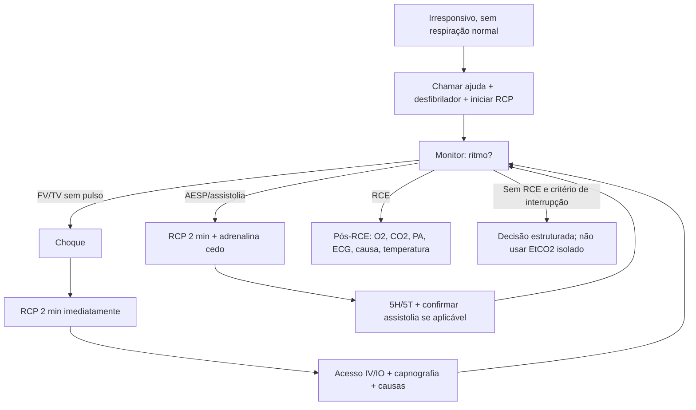
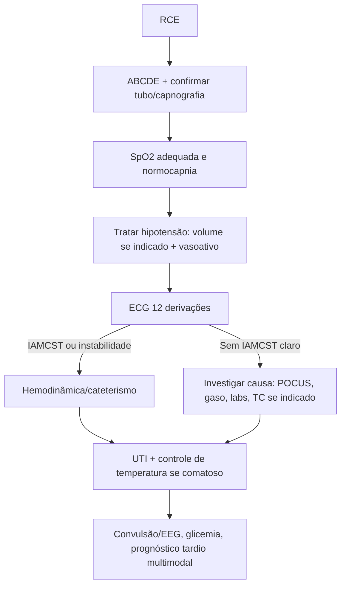

# reanimação/PCR Adulto, Pediátrica E Pós-RCE

## Leitura de 30 segundos

- PCR e prova de prioridade: reconhecer, chamar ajuda, compressão de alta qualidade e desfibrilação precoce salvam mais do que tubo e droga.
- Separe rápido: **FV/TV sem pulso = choque**; **AESP/assistolia = RCP + adrenalina precoce + causa reversível**.
- Em ritmo chocável, não pare para medicação antes de tentar desfibrilar. Em ritmo não chocável, adrenalina entra assim que possível.
- Via aérea avançada ajuda se for feita sem pausa longa; capnografia confirma tubo, mede qualidade e ajuda a reconhecer RCE.
- POCUS só presta se couber na pausa de pulso. Se vira "aula de ultrassom" durante PCR, virou dano.
- Pós-RCE é outra emergência: ECG, oxigenação/ventilação, pressão, temperatura, causa da PCR, convulsão e UTI.

## Por que cai

Reanimação aparece de forma repetida nas provas TEME22-25 e nas estações práticas. O padrão é muito consistente: a banca quer ver prioridade, algoritmo, doses básicas, ritmos, causas reversíveis e segurança operacional.

O que já apareceu ou foi fortemente sugerido nas provas/estações:

- TEME22: compressão 100-120/min, prioridade da RCP, FV/TV sem pulso, adrenalina/amiodarona, POCUS/CASA e bradicardia.
- TEME23: PCR em gestante, afogamento, metas pós-RCE, capnografia, POCUS em PCR e tamponamento.
- TEME24: PCR em gestante, torsades de pointes, tamponamento, pós-RCE com IAMCST e estação prática com BAVT evoluindo para FV.
- TEME25: FV refratária, bradicardia instável/marca-passo, regulação frente a PCR, pós-RCE pediátrico e decisão de não iniciar/interromper em contexto de futilidade.
- Práticas 2022-24: RCP de alta qualidade, tamponamento/pneumopericárdio, PCR pediátrica com TSV, bradicardia instável, IAMCST, marca-passo e desfibrilação.

Tradução para prova: se a alternativa atrasa compressão, atrasa choque, hiperventila, ignora causa reversível ou usa POCUS prolongando pausa, provavelmente está errada.

## Abordagem prática

### 1. Primeiros 30 Segundos

1. Checar responsividade e respiração normal.
2. Chamar ajuda, acionar time/código, pedir desfibrilador, carrinho, capnografia e acesso IV/IO.
3. Checar pulso central em até 10 segundos. Se dúvida, tratar como PCR.
4. Iniciar compressão torácica imediatamente.
5. Monitor/desfibrilador assim que chegar: definir ritmo chocável ou não chocável.

Frase de estação: "Paciente irresponsivo, sem respiração normal e sem pulso central em até 10 segundos. início RCP de alta qualidade, solicito desfibrilador, monitor, acesso IV/IO, adrenalina e capnografia."

### 2. RCP De Alta Qualidade

- frequência: 100-120/min.
- Profundidade adulto: 5-6 cm.
- Retorno completo do torax.
- Pausas menores que 10 segundos.
- Trocar compressor a cada 2 minutos ou antes se fadiga.
- Evitar ventilação excessiva.
- Usar feedback, metronomo, capnografia e liderança fechada quando disponível.

O alvo não é "parecer organizado"; é gerar pressão de perfusão coronariana e cerebral.

### 3. Ritmo Chocavel: FV/TV Sem Pulso

Conduta mental:

1. Choque assim que identificado.
2. RCP por 2 minutos imediatamente depois do choque.
3. Reavaliar ritmo em pausa curta.
4. Se persiste FV/TVsp: novo choque, RCP e adrenalina.
5. Se persiste: choque, RCP, amiodarona ou lidocaina, causas reversíveis.

Mensagem TEME: choque primeiro. Droga sem desfibrilação precoce em FV e atraso.

### 4. Ritmo Não Chocavel: AESP/Assistolia

Conduta mental:

1. RCP de alta qualidade.
2. Adrenalina 1 mg IV/IO assim que possível e depois a cada 3-5 minutos.
3. Confirmar cabos/ganho/derivação se assistolia.
4. Procurar e tratar 5H/5T.
5. Reavaliar ritmo a cada 2 minutos.

Mensagem TEME: AESP não é diagnóstico final; é ritmo de PCR que obriga procurar causa tratável.

### 5. Via aérea Durante PCR

Sem via aérea avançada:

- Adulto: 30 compressões para 2 ventilações.
- Pediatria: 30:2 se um socorrista; 15:2 se dois profissionais.

Com via aérea avançada:

- Adulto: compressões continuas + 1 ventilação a cada 6 segundos, cerca de 10/min.
- Pediatria: compressões continuas + ventilação 20-30/min, cerca de 1 a cada 2-3 segundos.
- Confirmar tubo com capnografia em onda, ausculta e expansibilidade.

Se a tentativa de IOT causa pausa longa, dessaturação ou perda de compressão, prefira BVM bem feita ou supraglótico e volte ao algoritmo.

### 6. POCUS/CASA Na PCR

Use POCUS para procurar causa reversível sem atrapalhar:

- Tamponamento.
- TEP maciço/sobrecarga de VD.
- Pneumotórax hipertensivo.
- Hipovolemia grave.
- Pseudo-AESP: atividade mecânica com pulso muito fraco/não percebido.

Regra operacional: probe posicionado durante compressões, imagem adquirida na pausa, decisão em até 10 segundos. Não usar ausência de movimento cardíaco isoladamente para encerrar RCP.

### 7. Pós-RCE Imediato

Depois que voltou pulso, não comemore e abandone: o paciente ainda está morrendo.

1. Confirmar pulso, PA e capnografia.
2. Titular O2: evitar hipoxemia; reduzir FiO2 quando SpO2 confiável estiver adequada.
3. Ventilar para normocapnia.
4. Tratar hipotensão: cristaloide se indicado, noradrenalina/adrenalina/dobutamina conforme fenótipo.
5. ECG de 12 derivações rapidamente.
6. IAMCST, choque cardiogênico ou instabilidade elétrica: discutir hemodinâmica/cateterismo.
7. Procurar causa: história, exame, POCUS, gaso, eletrólitos, lactato, tóxico, TEP, tamponamento, pneumotórax, sangramento.
8. Se comatoso: estratégia protocolizada de temperatura e prevenção de febre.
9. Tratar convulsão e considerar EEG quando disponível.
10. Não prognosticar cedo, especialmente sob sedação, hipotermia, choque ou distúrbios metabólicos.

## Conceitos que sustentam a conduta

### RCP Funciona Por Pressão, Não Por Coreografia

O objetivo da compressão é gerar fluxo mínimo para coronárias e cérebro. Toda pausa derruba a pressão de perfusão coronariana; depois de reiniciar compressão, leva tempo para recuperar. Por isso, as pausas para pulso, ritmo, IOT, POCUS e passagem de caso devem ser curtas e planejadas.

A desfibrilação encerra circuitos elétricos caóticos, mas só funciona bem quando vem cedo e acompanhada de RCP de qualidade. Em FV/TV sem pulso, o miocárdio fica menos responsivo com o passar do tempo; atrasar choque para obter acesso, intubar ou discutir causa e erro clássico.

### Adrenalina: Ajuda RCE, Mas Não Substitui O Básico

Adrenalina aumenta pressão de perfusão coronariana e chance de RCE. O ganho neurológico é mais incerto, então ela não deve virar desculpa para compressão ruim ou choque atrasado.

- Ritmo não chocável: dar cedo.
- Ritmo chocável: priorizar RCP/desfibrilação inicial; dar quando choques iniciais falham.
- Dose alta de adrenalina não é rotina.
- Vasopressina não substitui adrenalina com vantagem.

### Capnografia

Capnografia em onda durante PCR serve para:

- Confirmar e vigiar tubo.
- Detectar deslocamento/obstrução do tubo.
- Monitorar qualidade da RCP.
- Sugerir RCE quando há aumento abrupto e sustentado do EtCO2.

EtCO2 muito baixo após RCP adequada sugere mau prognóstico, mas não deve ser usado sozinho para decidir interrupção.

### 5H/5T

| 5H | 5T |
|---|---|
| Hipovolemia | Trombose coronariana |
| Hipoxia | Trombose pulmonar |
| H+ / acidose | Tamponamento cardíaco |
| Hipo/hipercalemia e distúrbios metabólicos | Tóxicos |
| Hipotermia | Tension pneumothorax |

Pense nas causas que você consegue tratar durante a PCR: choque, agulha/drenagem, pericardiocentese, cálcio, glicose/insulina, antídoto, trombólise quando TEP altamente provável, controle de hemorragia.

### situações Especiais Que A Banca Gosta

**TEP com PCR:** suspeite em dispneia/síncope prévia, hipoxemia, fatores de risco, VD dilatado no POCUS. Trombólise pode ser considerada durante RCP quando TEP e altamente provável ou confirmado. Depois, a RCP costuma precisar ser prolongada.

**SCA com PCR:** desfibrilar/RCP e, após RCE, ECG e hemodinâmica se IAMCST ou forte suspeita. Trombólise sistêmica durante PCR por SCA não é rotina quando angioplastia e possível.

**Gestante:** deslocamento uterino manual para esquerda, compressões um pouco mais altas no esterno, via aérea difícil prevista, equipe obstétrica/neonatal. Se útero no nível/acima do umbigo e sem RCE rápido, considerar histerotomia/cesárea perimortem a partir de 4 minutos para nascimento em torno de 5 minutos.

**Afogamento:** hipóxia é o motor. Ventilação precoce é importante, mas se sem pulso, não atrasar compressões. Aquecer e tratar hipoxemia.

**Hipercalemia:** cálcio IV, insulina + glicose, beta-agonista, bicarbonato se acidose/instabilidade, diálise quando indicado. Em PCR por hipercalemia, cálcio é tratamento causal, não "detalhe".

**Hipotermia:** reaquecer ativamente; em hipotermia grave, a avaliação de morte e resposta a drogas/choques muda. Evite declarar óbito cedo sem reaquecimento adequado, salvo lesões incompatíveis com vida.

**Opioide:** se há pulso e depressão respiratória, ventilar e usar naloxona. Se sem pulso, RCP/desfibrilador primeiro; naloxona não substitui RCP.

**Torsades de pointes:** TV polimórfica com QT longo: sulfato de magnésio e corrigir K/Mg, suspender drogas que prolongam QT; se sem pulso, desfibrilar.

## Fluxograma

### PCR Adulto

### Pós-RCE

## Doses, alvos e números

### Adulto - PCR

| Item | Número/conduta |
|---|---|
| Compressões | 100-120/min |
| Profundidade | 5-6 cm |
| Pausa | Menor que 10 s |
| Troca de compressor | A cada 2 min ou se fadiga |
| Sem via aérea avançada | 30:2 |
| Com via aérea avançada | Compressões continuas + 10 ventilações/min |
| Desfibrilacao bifásica | 120-200 J conforme aparelho; se desconhecido, energia maxima |
| Desfibrilacao monofasica | 360 J |
| Adrenalina | 1 mg IV/IO a cada 3-5 min |
| Amiodarona FV/TVsp refratária | 300 mg IV/IO; segunda dose 150 mg |
| Lidocaina alternativa | 1-1,5 mg/kg; repetir 0,5-0,75 mg/kg; max 3 mg/kg |
| Sulfato de magnésio TdP | 1-2 g IV/IO |
| Bicarbonato | Não rotineiro; considerar em hipercalemia, intoxicação por tricíclico/bloqueador de canal de sódio ou acidose específica |
| Cálcio | Não rotineiro; usar em hipercalemia, hipocalcemia, bloqueador de canal de cálcio, Hipermagnesemia |

### Adulto - Peri-PCR

| situação | Conduta chave |
|---|---|
| Bradicardia instável | Atropina 1 mg IV a cada 3-5 min, max 3 mg |
| Bradicardia refratária | Marcapasso transcutaneo; adrenalina 2-10 mcg/min ou dopamina 5-20 mcg/kg/min; preparar transvenoso |
| Taquicardia instável com pulso | Cardioversao sincronizada |
| QRS estreito regular estável | Vagal; adenosina 6 mg, depois 12 mg |
| QRS largo regular estável | Antiarritmico conforme protocolo; considerar cardioversão se piora |
| QRS largo irregular | Pensar FA pré-excitada ou TdP; evitar bloqueadores AV se pré-excitacao |

### Pediatria - PCR

| Item | Número/conduta |
|---|---|
| Compressões | 100-120/min |
| Profundidade lactente | Cerca de 4 cm ou 1/3 do diâmetro AP |
| Profundidade criança | Cerca de 5 cm ou 1/3 do diâmetro AP |
| Sem via aérea avançada | 30:2 um socorrista; 15:2 dois profissionais |
| Com via aérea avançada | 20-30 ventilações/min |
| Desfibrilacao | 2 J/kg; depois 4 J/kg; subsequentes pelo menos 4 J/kg, max 10 J/kg ou dose adulta |
| Adrenalina IV/IO | 0,01 mg/kg a cada 3-5 min |
| Adrenalina traqueal | 0,1 mg/kg se sem IV/IO |
| Amiodarona | 5 mg/kg IV/IO para FV/TVsp refratária |
| Lidocaina | 1 mg/kg IV/IO alternativa |
| Bradicardia com pulso | Se FC menor que 60 + má perfusão apesar de O2/ventilação: iniciar RCP |
| Atropina pediátrica | 0,02 mg/kg se Vagal/BAV; min 0,1 mg |

### Neonatal - Sala De Parto

| Item | Número/conduta |
|---|---|
| Prioridade | Ventilação efetiva |
| Indicar VPP | Apneia/gasping ou FC menor que 100/min |
| Compressões | Se FC menor que 60/min após 30 s de VPP efetiva |
| Relação compressão:ventilação | 3:1 |
| Total de eventos | 90 compressões + 30 ventilações/min |
| Oxigênio durante compressões | 100%, titular depois |
| Adrenalina IV/IO/UVC | 0,01-0,03 mg/kg a cada 3-5 min |
| expansão volume | 10 mL/kg se perda sanguínea/choque suspeito |

### Pós-RCE

| Alvo | Conduta prática |
|---|---|
| SpO2 | Evitar hipoxemia; titular O2 quando medida confiável. Alvo comum 92-98% em adulto; pediatria 94-98% ou basal |
| CO2 | Normocapnia; geralmente PaCO2 35-45 mmHg |
| Pressão | Evitar hipotensão; alvo mínimo comum PAM maior ou igual a 65 mmHg; muitos protocolos miram 70-100 se tolerado |
| Temperatura adulto comatoso | Controle protocolizado 32-37,5 C; evitar febre; manter pelo menos 36 h em adultos que não obedecem comandos |
| Temperatura pediátrica comatosa | TTM 32-34 C seguido de 36-37,5 C ou apenas 36-37,5 C por até 5 dias, conforme protocolo |
| ECG | 12 derivações assim que possível |
| Glicemia | Evitar hipo e hiperglicemia; usar alvo institucional |
| Convulsão | Tratar crise clínica; considerar EEG |
| Prognóstico neurológico | Multimodal é tardio, geralmente após 72 h e sem confundidores |

## Pegadinhas TEME

- **"Intubar primeiro" em PCR:** errado se atrasa compressão/choque. Primeiro RCP e desfibrilador.
- **"Checar pulso por 30 segundos":** errado. Até 10 segundos.
- **"FV refratária = adrenalina antes do primeiro choque":** errado. Choque precoce vem primeiro.
- **"AESP = não tem o que fazer além de adrenalina":** errado. Procurar causa reversível é o centro da conduta.
- **"Atropina na PCR":** não é droga de PCR. Atropina e para bradicardia sintomática com pulso.
- **"EtCO2 baixo encerra RCP":** não sozinho. Pode ajudar prognóstico, mas não decide isoladamente.
- **"POCUS em PCR sempre ajuda":** só se não prolongar pausa. POCUS mal usado piora sobrevida.
- **"RCE = acabou":** errado. Pós-RCE tem mortalidade alta e exige pacote imediato.
- **"Hipotermia 32-34 obrigatória para todo mundo":** cuidado. Atualização fala em controle de temperatura protocolizado, com faixa adulta 32-37,5 C em comatosos.
- **"Criança com FC 50 e perfusão ruim: só observar porque tem pulso":** errado. Se FC menor que 60 com má perfusão apesar de oxigenação/ventilação, iniciar RCP.
- **"PCR gestante: esperar obstetra chegar":** errado. RCP imediata, deslocamento uterino e decisão precoce de histerotomia se indicado.
- **"Trombolisar toda PCR por dor torácica":** errado. TEP altamente provável/confirmado pode justificar; SCA deve ir para angioplastia após RCE quando possível.

## Erros fatais na prática

- Não assumir liderança e deixar compressões descoordenadas.
- Pausa longa para laringoscopia, ultrassom, pulso ou discussão.
- Desfibrilador carregado sem aviso claro ou choque sem segurança.
- Esquecer de reiniciar RCP imediatamente após choque.
- Hiperventilar com BVM e reduzir retorno venoso.
- Não trocar compressor fatigado.
- Não confirmar tubo com capnografia.
- Não tratar causa obvia: pneumotórax hipertensivo, tamponamento, hipercalemia, hipovolemia, TEP.
- Dar alta cognitiva após RCE: esquecer ECG, vasopressor, temperatura, ventilação e destino.
- Prognosticar cedo por pupila, mioclonia ou Glasgow sob sedação/choque/hipotermia.

## Para prova vs na prática

| Tema | Resposta TEME | Atualização/Prática |
|---|---|---|
| Prioridade inicial | RCP de alta qualidade + desfibrilação precoce | Treinar equipe, feedback, cronometrista e pausas planejadas melhoram mais do que "decorar droga" |
| Adrenalina | 1 mg IV/IO a cada 3-5 min | Não chocável: cedo. Chocavel: após falha de desfibrilação inicial. Evitar dose alta rotineira |
| Via aérea | Não interromper compressões para intubar | Em equipe experiente, IOT/supraglótico com capnografia; em equipe limitada, BVM bem feita e segura |
| POCUS | CASA/causas reversíveis em pausa curta | POCUS só com operador treinado e decisão pré-planejada; não transformar pausa em exame completo |
| Temperatura pós-RCE | Controle de temperatura em comatoso; evitar febre | AHA 2025 aceita estratégia protocolizada entre 32-37,5 C em adultos que não obedecem comandos, por pelo menos 36 h |
| Pós-RCE com IAMCST | ECG e hemodinâmica | Sem IAMCST, cateterismo seletivo conforme choque, instabilidade elétrica e suspeita coronariana |
| Interrupção de RCP | Decisão estruturada, tempo/ritmo/contexto/causa | EtCO2, POCUS é tempo ajudam, mas nenhum deve ser usado isoladamente |

## Checklist de revisão

- [ ] Reconheco PCR em até 10 segundos e início compressões.
- [ ] Sei diferenciar FV/TVsp de AESP/assistolia.
- [ ] Sei a sequência do ritmo chocável sem atrasar choque.
- [ ] Sei que AESP/assistolia pede adrenalina precoce e 5H/5T.
- [ ] Sei dose de adrenalina, amiodarona, choque e magnésio.
- [ ] Sei metas de compressão: 100-120/min, 5-6 cm, pausa menor que 10 s.
- [ ] Sei ventilação adulto com via avançada: 10/min.
- [ ] Sei ventilação pediátrica com via avançada: 20-30/min.
- [ ] Sei quando iniciar RCP em bradicardia pediátrica com pulso.
- [ ] Sei usar POCUS sem prolongar pausa.
- [ ] Sei pacote pós-RCE: O2, CO2, PA, ECG, causa, temperatura, convulsão, UTI.
- [ ] Sei que prognóstico neurológico é tardio e multimodal.

## Questões e estações relacionadas

Use está lista para refazer mentalmente as respostas depois de ler o capítulo:

- **TEME22:** compressões 100-120/min; FV/TVsp e drogas; bradicardia; POCUS/CASA na PCR.
- **TEME23:** PCR em gestante; afogamento sem respiração; metas pós-RCE; capnografia; tamponamento/trauma.
- **TEME24:** PCR em gestante; torsades; tamponamento; pós-RCE com IAMCST; questão de ritmo/monitor.
- **TEME25:** FV refratária; bradicardia instável e marca-passo; regulação frente a PCR; pós-RCE pediátrico; limite/futilidade.
- **Prática 2022:** reanimação, RCP de alta qualidade e tamponamento por pneumopericárdio.
- **Prática 2023:** reanimação pediátrica e TSV estável.
- **Prática 2024:** BAVT instável, marca-passo, IAMCST e evolução para FV.

## Referências

- Conteúdo programático TEME26 e referências oficiais do edital.
- Provas teóricas TEME22, TEME23, TEME24 e TEME25 disponíveis no projeto.
- Estações práticas TEME22-25 disponíveis no projeto.
- Emergency Talks: Aula 01 - Reanimação; Aula 30 - Emergências pediátricas; Aula 34 - Síncope e Arritmias.
- Resumo do Emergency.docx, arquivo do usuário.
- American Heart Association. 2025 Guidelines for CPR and ECC: [Adult Advanced Life Support](0).
- American Heart Association. 2025 Guidelines for CPR and ECC: [Adult Basic Life Support](1).
- American Heart Association. 2025 Guidelines for CPR and ECC: [Pediatric Basic Life Support](2).
- American Heart Association. 2025 Guidelines for CPR and ECC: [Pediatric Advanced Life Support](3).
- American Heart Association. 2025 Guidelines for CPR and ECC: [Neonatal Resuscitation](4).
- American Heart Association. 2025 Guidelines for CPR and ECC: [Special Circumstances of Resuscitation](5).
- American Heart Association. 2025 Guidelines for CPR and ECC: [Post-Cardiac Arrest Care](6).
