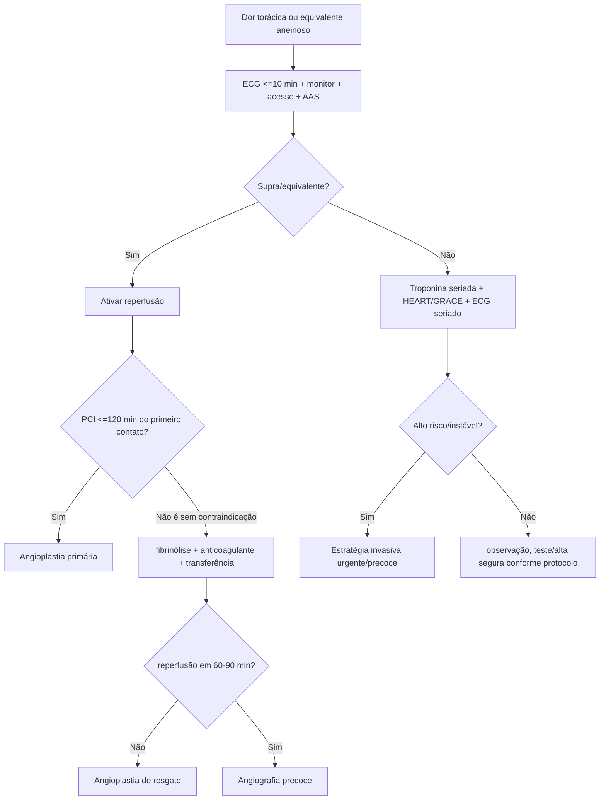
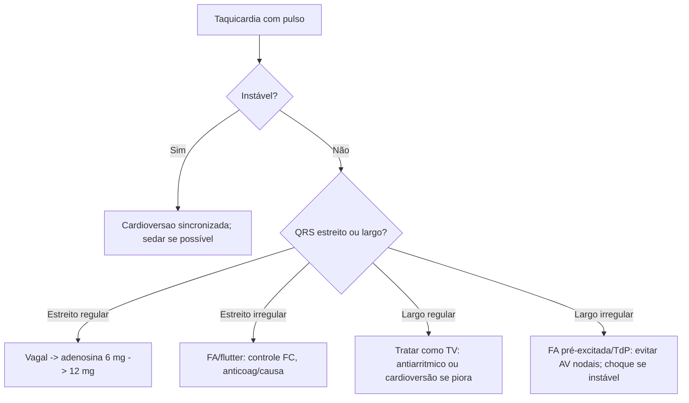
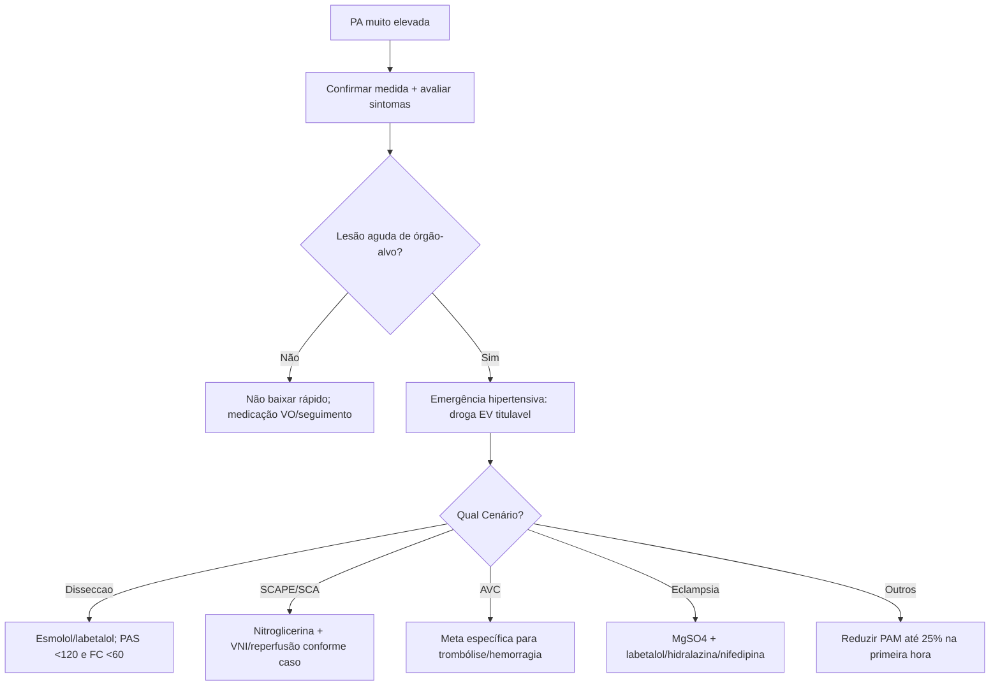

# SCA, Arritmias E Emergências hipertensivas

## Leitura de 30 segundos

- Dor torácica suspeita de SCA = ECG em até 10 min, monitor, acesso, AAS, troponina seriada e decisão de reperfusão se supra/equivalente.
- IAM com supra é tempo para angioplastia > 120 min = pensar fibrinólise se dentro da janela e sem contraindicação.
- Oxigênio no IAM não é rotina se SatO2 está boa; use se hipoxemia, desconforto respiratório ou choque.
- Taquiarritmia com instabilidade = cardioversão sincronizada. Bradicardia instável = atropina, marca-passo e/ou catecolamina.
- QRS largo irregular ou FA pré-excitada: não bloqueie nodo AV.
- PA muito alta sem lesão aguda de órgão-alvo não é emergência hipertensiva. Lesão aguda muda tudo.
- SCAPE/EAP hipertensivo = VNI + nitrato EV cedo; diurético entra, mas não pode ser a única resposta.

## Por que cai

Cardio cai porque mistura tempo-dependencia, ECG, droga e priorização. A banca TEME gosta de situações em que a conduta certa é simples, mas a alternativa tenta seduzir com uma etapa atrasada.

O que já apareceu no padrão TEME:

- STEMI/IAMCST no APH e no DE: destino para hemodinâmica, fibrinólise quando angioplastia atrasa, AAS/P2Y12/enoxaparina/tenecteplase.
- Bradicardia instável/BAVT: atropina, marcapasso transcutaneo/transvenoso, dopamina/adrenalina.
- Taquicardia instável: cardioversão sincronizada; TV monomorfica, FA, TSV, torsades.
- Choque cardiogênico e pós-IAM: SCAI, hipotensão, congestão, lactato e hemodinâmica.
- Emergências hipertensivas: eclampsia/pós-parto, SCAPE/EAP hipertensivo, AVC e dissecção.
- Estação prática 2024: BAVT instável + IAMCST + marca-passo + evolução para FV.

Mensagem de prova: primeiro reconheça instabilidade e doença tempo-dependente. Depois escolha a droga.

## Abordagem prática

### 1. Dor torácica/Suspeita De SCA

Conduta inicial:

1. Sala monitorada, desfibrilador próximo, acesso IV, sinais vitais.
2. ECG de 12 derivações em até 10 minutos.
3. Se dor inferior, fazer V3R-V4R. Se suspeita posterior, V7-V9.
4. AAS mastigado se não houver alergia verdadeira.
5. Troponina de alta sensibilidade seriada se sem supra/equivalente.
6. Procurar equivalentes de supra: posterior, VD, de Winter, Wellens, Searbossa/Smith em BRE/marca-passo quando aplicável.
7. Definir: reperfusão imediata, estratégia invasiva precoce ou observação/alta segura.

Se IAMCST/equivalente:

- Angioplastia primária é preferida se tempo porta-balão/sistema permite.
- Se não consegue PCI em até 120 min do primeiro contato médico e sintomas geralmente < 12 h: fibrinólise se sem contraindicação.
- Após fibrinólise: avaliar sucesso em 60-90 min. Se falha, angioplastia de resgate. Se sucesso, angiografia precoce.

Se SCA sem supra:

- Estratifique risco: HEART para dor torácica na emergência; GRACE/TIMI para SCASEST confirmada.
- Instabilidade, dor refratária, arritmia grave, IC/choque, alteração dinâmica de ST/T ou troponina muito elevada = estratégia invasiva urgente/precoce.
- Baixo risco com ECG sem isquemia e troponina seriada negativa pode ir para alta orientada/seguimento conforme protocolo.

### 2. Pacote Inicial De SCA

Pense em **AAS + P2Y12 + anticoagulante + estatina + reperfusão/estratificação**, e use anti-isquêmicos conforme contexto.

| Medida | Quando usar | Cuidado |
|---|---|---|
| AAS | Praticamente toda SCA sem alergia verdadeira | Mastigar ataque |
| P2Y12 | IAMCST/fibrinólise/PCI/SCASEST conforme estratégia | Escolha varia por fibrinólise, idade e PCI |
| Heparina/enoxaparina | Anticoagulação na SCA | Ajustar renal/idade/peso |
| Estatina alta intensidade | Precoce | Atorvastatina 80 ou rosuvastatina 20-40 |
| Nitrato | Dor persistente, congestão, hipertensão | Evitar hipotensão, infarto de VD, uso de PDE5 |
| Beta-bloqueador | Se hipertenso/taquicardico sem contraindicação | Evitar choque, IC aguda, BAV, bradi, broncoespasmo grave |
| Oxigênio | SatO2 baixa, desconforto, choque | Não é rotina se SatO2 normal |
| Morfina | Dor refratária | Pode atrasar absorcao de P2Y12; uso restrito |

### 3. Bradicardia Instável

Instabilidade: hipotensão, choque, dor isquêmica, edema agudo de pulmão, síncope/rebaixamento.

Conduta:

1. Monitor, acesso IV, ECG, O2 se hipoxemia.
2. Procurar causa: IAM inferior, hiperK, intoxicação por beta-bloqueador/bloqueador de canal de cálcio/digoxina, hipotermia, hipóxia.
3. Atropina 1 mg IV, repetir a cada 3-5 min até 3 mg.
4. Se falha ou BAV alto grau com instabilidade importante: marca-passo transcutâneo.
5. Ponte/alternativa: adrenalina 2-10 mcg/min ou dopamina 5-20 mcg/kg/min.
6. Preparar marca-passo transvenoso se BAVT/Mobitz II/instabilidade persistente.

Pegada TEME: Mobitz II, BAV avançado e BAVT não são lugar para "esperar atropina fazer milagre".

### 4. Taquicardia Com Pulso

Primeira Pergunta: está instável por causa da taquicardia?

- Instável: cardioversão sincronizada imediata, sedar se der tempo.
- Sem pulso: algoritmo de PCR, desfibrilação se ritmo chocável.
- estável: classificar QRS estreito/largo e regular/irregular.

Conduta por padrão:

| ECG | Diagnósticos prováveis | Conduta |
|---|---|---|
| Estreito regular | TSV, flutter 2:1, sinusal | Vagal, adenosina; cardioversão se instável |
| Estreito irregular | FA, flutter variável, MAT | Controle de frequência se estável; tratar causa |
| Largo regular | TV até prova em contrário | Cardioversao se instável; antiarritmico se estável |
| Largo irregular | FA pré-excitada, TV polimórfica/TdP | Evitar AV nodais; cardioversão/desfibrilação se instável |

FA pré-excitada/WPW:

- Suspeite se FA irregular muito rápida, QRS largo variável, FC muito alta.
- Evite adenosina, beta-bloqueador, diltiazem/verapamil, digoxina e amiodarona IV.
- Se instável: cardioversão.
- Se estável: procainamida ou ibutilida conforme disponibilidade/protocolo.

Torsades:

- Sulfato de magnésio 2 g IV.
- Corrigir K/Mg, suspender droga que prolonga QT.
- Se instável/sem pulso: choque não sincronizado/desfibrilação.
- Se recorrente com bradicardia: overdrive pacing/isoproterenol em contexto selecionado.

### 5. PA Muito Alta: É emergência?

Não trate número isolado. Procure lesão aguda de órgão-alvo:

- Neurológico: encefalopatia, AVCi/AVCh, HSA, convulsão.
- Cardiovascular: SCA, dissecção de aorta, EAP/SCAPE.
- Renal: IRA/oligúria/hematúria.
- Obstétrico: pré-eclampsia grave/eclampsia/HELLP.
- Retina: papiledema/retinopatia grave, se disponível.

Se não há lesão aguda:

- Repetir PA com técnica correta, analgesia/ansiedade/retenção urinária.
- Ajuste VO e seguimento; redução agressiva EV faz mal.

Se há emergência hipertensiva:

- Preferir EV titulavel.
- Regra geral: reduzir PA media até 25% na primeira hora; depois perto de 160/100 em 2-6 h; depois gradual em 24-48 h.
- Exceções tem metas proprias.

### 6. situações Hipertensivas Que A Banca Gosta

| situação | Meta/conduta |
|---|---|
| Disseccao de aorta | FC < 60 e PAS < 120 rapidamente; beta-bloqueador antes do vasodilatador |
| SCAPE/EAP hipertensivo | VNI + nitroglicerina EV; diurético se congestão/hipervolemia |
| SCA + hipertensão | Nitroglicerina, analgesia, antitrombóticos/reperfusão; evitar queda brusca |
| AVCi candidato a trombólise | PA < 185/110 antes; manter < 180/105 depois |
| AVCi sem reperfusão | Geralmente tratar se > 220/120; reduzir cerca de 15% em 24 h |
| Hemorragia intracraniana | redução controlada; alvo comum PAS 140-160, evitando hipotensão |
| Eclampsia/pré-eclampsia grave | Sulfato de magnésio + labetalol/hidralazina/nifedipina; obstetrícia |
| Encefalopatia hipertensiva | Reduzir PA media até 25% na primeira hora |

SCAPE/EAP hipertensivo:

1. Sentar o paciente.
2. VNI precoce se desconforto/hipoxemia.
3. Nitroglicerina EV titulada; em SCAPE grave, muitos protocolos usam doses altas/bolus.
4. Furosemida se congesto/hipervolêmico, mas não espere a diurese para melhorar pós-carga.
5. Procurar SCA, valvopatia, arritmia, falha renal.

## Conceitos que sustentam a conduta

### SCA: Tempo E Miocardio

No IAMCST, a Pergunta principal não é "qual troponina?", é "como reperfundir?". Troponina pode confirmar necrose, mas não deve atrasar hemodinâmica ou fibrinólise quando o ECG e o contexto fecham IAMCST/equivalente.

No SCASEST, o risco manda. Um paciente com dor recorrente, instabilidade, IC, choque, arritmia grave, alteração dinâmica de ST/T ou troponina alta não é "dor torácica para observar no corredor".

### Arritmia: Instabilidade Vem Antes Do Nome Bonito

Taquicardia instável é elétrica até prova em contrário: cardioversão sincronizada. Bradicardia instável precisa aumentar frequência/perfusão: atropina pode ajudar, mas marcapasso e catecolamina devem estar prontos.

QRS largo em emergência deve ser tratado como TV até prova em contrário. O erro fatal e bloquear nodo AV em FA pré-excitada ou tentar "amiodarona para tudo".

### Emergência Hipertensiva: Lesão De Órgão-Alvo

PA alta crônica pode ser assustadora, mas a urgência real é a lesão aguda. Reduzir PA agressivamente em paciente sem LOA pode causar AVC, IAM, síncope e lesão renal. Em contraste, dissecção, eclampsia, SCAPE e encefalopatia pedem tratamento imediato.

## Fluxograma

### Dor torácica/SCA

### Taquicardia Com Pulso

### PA Elevada

## Doses, alvos e números

### SCA

| Item | Dose/alvo |
|---|---|
| ECG | Até 10 min da chegada/primeiro contato |
| AAS ataque | 162-325 mg VO mastigado |
| AAS manutenção | 75-100 mg/dia |
| Ticagrelor ataque | 180 mg VO; manutenção 90 mg 12/12 h |
| Clopidogrel ataque PCI | 600 mg VO comum em PCI |
| Clopidogrel fibrinólise | 300 mg se <75 anos; sem ataque se >=75 anos em muitos protocolos |
| HNF | 60 U/kg IV max 4000; depois 12 U/kg/h max 1000 U/h |
| Enoxaparina | 1 mg/kg SC 12/12 h; ajustar se ClCr <30 |
| Enoxaparina no IAMCST/fibrinólise | 30 mg IV bolus se <75 anos, depois 1 mg/kg SC 12/12 h |
| Atorvastatina | 80 mg VO precoce |
| Nitroglicerina SL | 0,4 mg ou isordil 5 mg SL, repetir até 3 doses se PA permite |
| Nitroglicerina EV | 5-10 mcg/min, titular; curso usa 10 mcg/min inicial |
| Oxigênio | Usar se SatO2 <90%, desconforto respiratório ou choque |
| PCI preferencial | Se consegue em até 120 min do primeiro contato |
| fibrinólise | Ideal porta-agulha até 30 min quando PCI atrasada |
| Sucesso litico | Dor melhora + supra reduz >50% em 60-90 min |

### Arritmias

| situação | Dose/energia |
|---|---|
| Atropina bradicardia | 1 mg IV a cada 3-5 min, max 3 mg |
| Adrenalina bradicardia | 2-10 mcg/min |
| Dopamina bradicardia | 5-20 mcg/kg/min |
| Adenosina TSV | 6 mg IV rápido; depois 12 mg |
| Cardioversao estreita regular | 50-100 J sincronizado |
| Cardioversao estreita irregular | 120-200 J bifasico sincronizado |
| Cardioversao larea regular | 100 J sincronizado |
| TV estável amiodarona | 150 mg IV em 10 min, repetir se necessário; depois infusão |
| Torsades | MgSO4 2 g IV |
| FA pré-excitada estável | Procainamida/ibutilida se disponível; cardioversão se instável |

### Emergências Hipertensivas/IC

| situação/fármaco | Dose/alvo |
|---|---|
| Regra geral | Reduzir PAM até 25% na 1a hora |
| Disseccao aórtica | PAS <120 e FC <60 em cerca de 20 min |
| AVCi trombólise | <185/110 antes; <180/105 após |
| AVCi sem trombólise | Tratar se >220/120; reduzir ~15% em 24 h |
| Nitroglicerina EV | 5-200 mcg/min, titular |
| Nitroprussiato | 0,3-10 mcg/kg/min; monitorização rigorosa |
| Esmolol | 500 mcg/kg bolus; 50-300 mcg/kg/min |
| Labetalol | 10-20 mg IV, repetir/titular conforme protocolo |
| Hidralazina gestação | 5-10 mg IV, repetir a cada 20-30 min |
| Nifedipina gestação | 10 mg VO, repetir conforme protocolo |
| MgSO4 eclampsia | Ataque 4-6 g IV; manutenção 1-2 g/h |
| Furosemida ICA | 20-40 mg IV se virgem ou 1-2x dose VO usual; curso usa 1 mg/kg |
| Dobutamina | 2,5-20 mcg/kg/min |
| Noradrenalina | 0,05-1 mcg/kg/min, titular |

## Pegadinhas TEME

- **Troponina antes da hemodinâmica no IAMCST claro:** errado se atrasa reperfusão.
- **Oxigênio para todo IAM:** errado. Se SatO2 normal, não é rotina.
- **Nitrato em infarto de VD/hipotensão/PDE5:** perigoso.
- **Morfina como pilar obrigatório da SCA:** hoje uso restrito para dor refratária.
- **Angioplastia vai demorar >120 min e não pensar trombólise:** pegadinha clássica.
- **Bradicardia instável: ficar repetindo atropina sem preparar marca-passo:** erro de estação.
- **BAV Mobitz II/BAVT como se fosse vasovagal:** errado.
- **Toda taquicardia larea = amiodarona lenta:** se instável, choque sincronizado.
- **FA pré-excitada + diltiazem/verapamil/beta-bloqueador/digoxina/adenosina:** pode degenerar para FV.
- **PA 220/120 assintomatica = nitroprussiato:** errado sem lesão de órgão-alvo.
- **Emergência hipertensiva = baixar PA para normal:** errado, salvo exceções; evite hipoperfusão.
- **Eclampsia = benzodiazepínico como primeira linha:** errado. Sulfato de magnésio.
- **SCAPE = esperar furosemida:** errado. VNI e vasodilatação mudam o jogo.

## Erros fatais na prática

- Não fazer ECG em até 10 minutos em dor torácica.
- Não reconhecer equivalentes de supra ou deixar de fazer derivações direitas/posteriores.
- Fibrinolisar paciente com contraindicação absoluta sem checar sangramento/AVCh/dissecção.
- Mandar IAMCST para hospital sem hemodinâmica sem estratégia de rede.
- Cardioverter sem sincronizar uma taquicardia com pulso organizada.
- Tentar sedar longamente paciente instável antes do choque.
- Dar bloqueador AV em FA pré-excitada.
- Ignorar hipercalemia/intoxicação em bradicardia grave.
- Reduzir PA de forma abrupta em AVCi ou PA elevada sem LOA.
- Tratar SCAPE só com diurético e oxigênio, sem VNI/nitrato quando PA permite.

## Para prova vs na prática

| Tema | Resposta TEME | Atualização/Prática |
|---|---|---|
| SCA inicial | ECG <=10 min, AAS, monitor, troponina e reperfusão se supra | Troponina de alta sensibilidade e protocolos 0/1h ou 0/2h ajudam alta segura em baixo risco |
| Oxigênio no IAM | Usar se hipoxemia/dispneia/choque | AHA/ACC 2025 não recomenda rotina se oxigenação normal |
| fibrinólise | Se PCI >120 min e sem contraindicação | Rede local manda; após litico, resgate se falha e angiografia precoce se sucesso |
| P2Y12 | Clopidogrel no litico; ticagrelor/prasugrel comuns em PCI | Ajustar por idade, sangramento, anticoagulação, AVC prévio e estratégia invasiva |
| FA aguda | Instável = cardioversão | Se pré-excitada, evite AV nodais; se >48 h/tempo incerto, anticoag/TEE se não emergencial |
| Bradicardia | Atropina 1 mg; marca-passo/catecolamina se falhar | Em BAV alto grau, prepare marca-passo cedo |
| PA alta | Emergência só com LOA aguda | Termo "urgência hipertensiva" vem perdendo valor; evitar redução EV em assintomaticos |
| SCAPE | VNI + nitrato + diurético | Nitrato em dose alta/bolus pode ser usado por protocolos experientes; monitorar hipotensão |

## Checklist de revisão

- [ ] Sei fazer abordagem inicial da dor torácica em até 10 min.
- [ ] Sei quando IAMCST vai para PCI e quando considerar fibrinólise.
- [ ] Sei doses de AAS, Clopidogrel/ticagrelor, heparina/enoxaparina e nitrato.
- [ ] Sei que oxigênio não é rotina no IAM com SatO2 normal.
- [ ] Sei contraindicações críticas de nitrato e fibrinólise.
- [ ] Sei tratar bradicardia instável e quando preparar marca-passo.
- [ ] Sei classificar taquicardia por instabilidade, QRS e regularidade.
- [ ] Sei que FA pré-excitada não recebe bloqueador nodal.
- [ ] Sei reconhecer emergência hipertensiva por lesão de órgão-alvo.
- [ ] Sei metas de PA em dissecção, AVCi trombólise, AVCi sem trombólise, eclampsia e SCAPE.
- [ ] Sei que SCAPE precisa VNI + nitrato precoce se PA permite.

## Questões e estações relacionadas

- **TEME22:** IAM e oxigênio; doenças hipertensivas da gestação; bradicardia/hipercalemia; STEMI com choque; bradicardia instável; fibrinólise quando PCI atrasa.
- **TEME23:** SCA, choque, síncope, arritmias, PA em AVC e emergências obstétricas.
- **TEME24:** estação prática com BAVT instável, IAMCST, marca-passo e FV; prova com tamponamento/choque, pós-RCE e arritmias.
- **TEME25:** TV/taquicardia instável, atendimento APH do IAMCST, eclampsia pós-parto, choque cardiogênico SCAI, FV refratária, marca-passo transvenoso, intoxicações com bradicardia e IC terminal/paliativos.
- **Emergency Talks:** Aula 34 - Síncope e Arritmias; Aula 36 - Síndrome Coronariana Aguda; Aula 47 - Emergências hipertensivas e IC Aguda; Aula 48 - Pericardite, Miocardite e Endocardite.

## Referências

- Conteúdo programático TEME26 e referências oficiais do edital.
- Provas teóricas TEME22, TEME23, TEME24 e TEME25 disponíveis no projeto.
- Estações práticas TEME22-25 disponíveis no projeto.
- Emergency Talks: Aula 34 - Síncope e Arritmias; Aula 36 - Síndrome Coronariana Aguda; Aula 47 - Emergências hipertensivas e IC Aguda; Aula 48 - Pericardite, Miocardite e Endocardite.
- Resumo do Emergency.docx, arquivo do usuário.
- ACC/AHA/ACEP/NAEMSP/SCAI. 2025: [Guideline for the Management of Patients With Acute Coronary Syndromes](0).
- European Society of Cardiology. 2023: [Guidelines for the management of acute coronary syndromes](1).
- American Heart Association. 2025: [Adult Advanced Life Support](2).
- ACC/AHA/ACCP/HRS. 2023: [Guideline for the Diagnosis and Management of Atrial Fibrillation](3).
- European Society of Cardiology. 2024: [Guidelines for the management of elevated blood pressure and hypertension](4).
- American Heart Association. 2024: [The Management of Elevated Blood Pressure in the Acute Care Setting](5).
