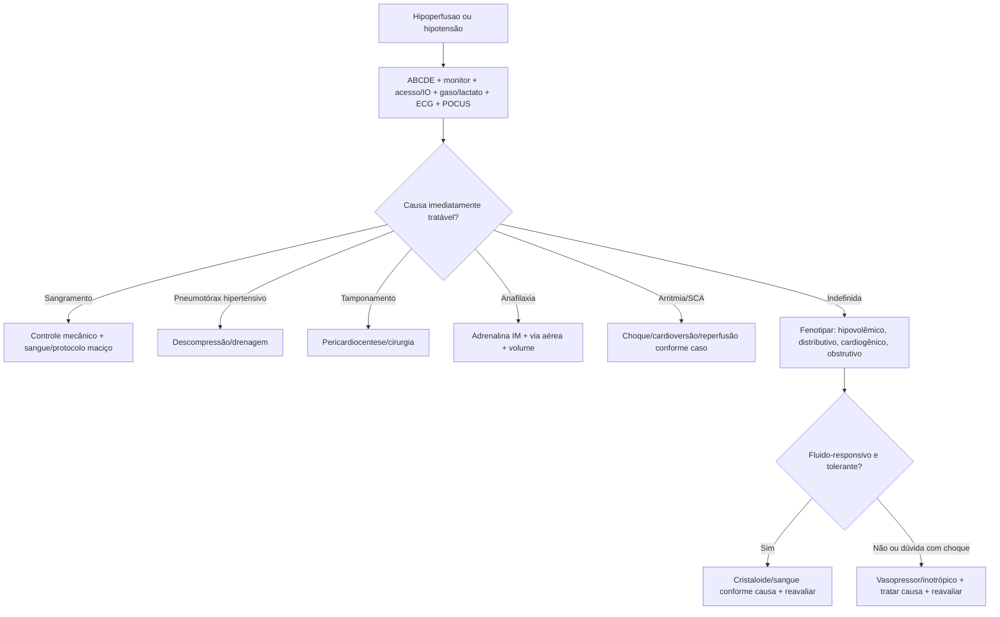
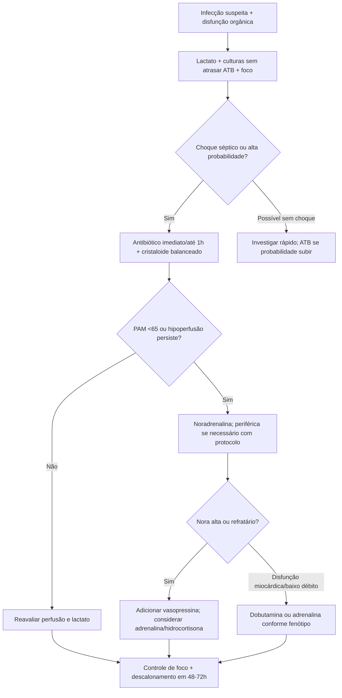
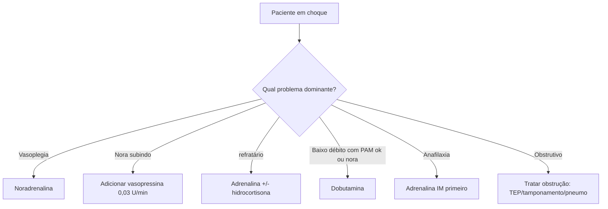

# Choque, Sepse E Drogas Vasoativas

## Leitura de 30 segundos

- Choque e hipoperfusão, não apenas hipotensão: confusão, TEC lento, moteamento, pele fria, oligúria, lactato e base déficit contam.
- Primeiro minuto: ABCDE, monitor, dois acessos/IO, gaso/lactato, ECG, POCUS/RUSH, tratar causa obvia e não atrasar vasopressor se colapsando.
- Sepse = infecção + disfunção orgânica; choque séptico = vasopressor para PAM >=65 após volume adequado + lactato >2.
- Na prova, sepse grave/choque pede culturas se não atrasar, antibiótico precoce, cristaloide 30 mL/kg em até 3 h, lactato seriado, noradrenalina e controle de foco.
- Na prática, depois do volume inicial, o jogo e reavaliação: fluido-responsividade, fluido-tolerância, VTI/PLR, B-lines, VCI, perfusão e lactato.
- Noradrenalina é vasopressor de primeira linha no choque séptico; vasopressina entra como poupadora; adrenalina entra em refratário; dobutamina e inotrópico.
- Choque anafilático = adrenalina IM primeiro. Corticoide e anti-histamínico são coadjuvantes, não salvam o colapso.

## Por que cai

Choque e sepse aparecem porque a banca consegue testar raciocínio de sala vermelha em qualquer área: trauma, pediatria, gestante, SCA, TEP, infecção, anafilaxia, intoxicação e ventilação mecânica.

O que já apareceu no padrão TEME:

- TEME22: choque hipovolêmico pediátrico, shock index, sepse com POCUS/VCI/B-lines, noradrenalina periferica/sem esperar CVC, resposta a ressuscitação por lactato/BE/diurese.
- TEME23: definição e fisiologia do choque, DO2/VO2, fluido-responsividade, VCI, choque hipovolêmico/obstrutivo no RUSH.
- TEME24: choque neurogênico versus hemorrágico, trauma com FAST negativo, choque cardiogênico, pós-RCE e reavaliação.
- TEME25: choque cardiogênico SCAI, TEP com choque, anafilaxia com hipotensão, sepse urinária com altas doses de vasopressor, TRALI/TACO e lactato.
- Estações práticas: trauma hemorrágico, POCUS em choque, BAVT/IAMCST com choque e decisão de marca-passo/vasoativo.

Mensagem de prova: se a alternativa trata a PA e esquece perfusão/fonte, ou da volume sem reavaliar, desconfie.

## Abordagem prática

### 1. Reconheça Choque Antes Da Hipotensão

Sinais de hipoperfusão:

- Estado mental alterado, agitação ou sonolência.
- TEC > 2-3 s, pele fria, moteamento, livedo.
- Pulso fino, extremidades frias ou pulso amplo em distributivo inicial.
- Oliguria: < 0,5 mL/kg/h.
- Lactato > 2 mmol/L ou lactato subindo.
- Base déficit/metabólica, acidose, ScvO2 baixa quando disponível.
- Shock index > 0,9 sugere risco, principalmente no trauma/hemorragia.

Regra TEME: choque pode existir com PA "normal", especialmente jovem, gestante, pediátrico, hipertenso crônico e paciente em catecolamina endógena alta.

### 2. Primeiros 5 Minutos

1. ABCDE, monitor, desfibrilador próximo se instável.
2. Oxigênio se hipoxemia/desconforto; considerar IOT se falência respiratória, mas preparar vasopressor antes.
3. Dois acessos calibrosos ou IO; colher gaso, lactato, hemograma, eletrólitos, renal, coagulograma, culturas se infecção provável e sem atraso.
4. ECG e POCUS/RUSH se disponível.
5. Tratar causa obvia imediata: sangramento, pneumotórax hipertensivo, tamponamento, anafilaxia, TEP maciço, arritmia, SCA.
6. Iniciar volume, sangue, vasopressor ou inotrópico conforme fenótipo.
7. Reavaliar em ciclos curtos: PA/PAM, pulso, TEC, pele, consciência, diurese, lactato, POCUS.

Frase de plantão: "Estou tratando hipoperfusão enquanto descubro o tipo de choque; não vou esperar todos os exames para ressuscitar."

### 3. Classifique Por fenótipo

| Tipo | Pista clínica | POCUS/lab | Conduta inicial |
|---|---|---|---|
| Hipovolêmico/hemorrágico | História de perda, trauma, HDA, desidratação; pele fria | VE pequeno/hiperdinâmico, VCI colabável, lactato/BE | Cristaloide como ponte se não hemorrágico; sangue/controle fonte se hemorrágico |
| Distributivo/séptico | Febre/hipotermia, foco, vasodilatação, pele quente inicial ou fria tardia | VCI variável, VE hiperdinâmico ou disfunção séptica, lactato | ATB, foco, cristaloide balanceado, noradrenalina |
| Anafilático | Exposição + pele/mucosa, broncoespasmo/edema, hipotensão | Diagnóstico clínico | Adrenalina IM, via aérea, volume, broncodilatador |
| Cardiogênico | SCA, IC, arritmia, B3, congestão, extremidades frias | VE ruim, B-lines, VCI cheia, lactato | Noradrenalina se hipotenso, dobutamina se baixo débito, tratar causa |
| Obstrutivo | TEP, tamponamento, pneumotórax, VM/auto-PEEP | VD grande, derrame pericárdico, sliding ausente, VCI cheia | Desobstruir: trombólise/anticoag, pericardiocentese, toracostomia |
| Neurogênico | Trauma medular, hipotensão + bradicardia, pele quente/seca | FAST negativo ajuda, mas não exclui hemorragia | Excluir sangramento primeiro; vasopressor, volume critérioso, atropina se bradi grave |

### 4. Sepse E Choque Septico

Suspeite de sepse quando infecção vem com disfunção orgânica:

- Hipotensão/PAM baixa ou necessidade de vasopressor.
- Lactato > 2.
- Rebaixamento, delirium, oligúria, creatinina subindo.
- Hipoxemia, plaquetopenia, bilirrubina alta, coagulopatia.
- qSOFA >=2 ajuda a perceber risco, mas não deve ser usado sozinho para excluir sepse.

Pacote inicial prático:

1. Reconhecer e acionar fluxo de sepse se existir.
2. Dosar lactato; repetir em 2-4 h se elevado ou se choque.
3. Coletar hemoculturas e culturas do foco antes do antibiótico se não atrasar.
4. Antibiótico empirico amplo precoce.
5. Cristaloide balanceado se hipoperfusão/septic shock; 30 mL/kg em até 3 h e reavaliação frequente.
6. Noradrenalina se PAM <65 ou hipoperfusão persistente; não esperar CVC se o paciente está colapsando.
7. Controle de foco: drenar, retirar cateter, operar, desobstruir, limpar, conforme fonte.

Antibiótico:

- **Choque séptico ou sepse provável/definida grave:** imediato, alvo clássico de até 1 h.
- **Possível sepse sem choque:** investigue rápido e trate cedo se a probabilidade subir; não transforme todo SIRS em meropenem automático.
- Reavaliar 48-72 h para descalonar, estreitar, suspender se não era infecção e ajustar por cultura.

### 5. Fluido: Responsividade E tolerância

Perguntas antes de repetir volume:

1. O paciente ainda está hipoperfundido?
2. Ele é fluido-responsivo?
3. Ele é fluido-tolerante?
4. Existe uma fonte que precisa ser controlada em vez de "mais soro"?

Ferramentas:

- Passive leg raise com VTI/VS: aumento de 10-15% sugere responsividade.
- Mini-bolus 250-500 mL com VTI/PA/perfusão.
- VCI: útil como parte do conjunto; isolada engana.
- pulmão: B-lines novas/difusas indicam baixa tolerância.
- Clínica: TEC, moteamento, diurese, ausculta, congestão, trabalho respiratório.

Depois de 30 mL/kg na sepse ou volume inicial no choque, pare de agir no automático. O excesso de fluido também mata.

### 6. Drogas Vasoativas: Escolha Pelo Problema

| Problema | Droga principal | Comentario |
|---|---|---|
| Vasoplegia/séptico | Noradrenalina | Primeira linha para PAM >=65 |
| Noradrenalina subindo | Vasopressina 0,03 U/min | Poupadora de noradrenalina; não é primeira linha isolada |
| Choque refratário | Adrenalina | Alternativa/adicional; pode aumentar lactato |
| Baixo débito/miocárdio ruim | Dobutamina | Inotrópico; pode causar hipotensão/taquiarritmia |
| Anafilaxia | Adrenalina IM | Primeira linha; IV só em refratário por equipe experiente |
| Bradicardia instável | Adrenalina/dopamina/marca-passo | Ver capítulo de arritmias |
| Neurogênico | Noradrenalina geralmente boa escolha | Fenilefrina pode piorar bradi; individualizar |

Noradrenalina periférica:

- Pode ser iniciada por acesso periférico calibroso/proximal com monitorização e protocolo local.
- Não use acesso duvidoso, mão/pe fráeil ou bomba sem vigilância.
- Se extravasar: parar, aspirar, elevar, marcar área, tratar conforme protocolo.
- CVC e desejavel se dose alta, uso prolongado ou múltiplas drogas, mas esperar CVC em choque profundo e erro.

### 7. Corticoide, Transfusão E Adjuntos

- Hidrocortisona 200 mg/dia no choque séptico com necessidade persistente de vasopressor.
- Hemoglobina alvo restritivo geralmente 7 g/dL, salvo sangramento ativo, isquemia miocárdica, hipoxemia grave ou contexto específico.
- Controle glicêmico: iniciar insulina se glicose >=180 mg/dL, evitando hipoglicemia.
- Bicarbonato: não corrige choque; considerar em acidemia grave selecionada, hipercalemia ou indicações específicas.
- Albumina pode ser considerada se grande volume de cristaloide e necessidade persistente, mas não é a primeira ampola da sepse.
- Controle de foco e antibiótico certo importam mais que vitamina C, "coquetel" ou moda de UTI.

## Conceitos que sustentam a conduta

### DO2, VO2 E Lactato

Choque é falha em entregar oxigênio suficiente ao tecido. A oferta de oxigênio depende de conteúdo arterial de O2 e débito cardíaco. Quando a oferta cai abaixo do ponto crítico, o consumo passa a depender da oferta, aparece metabolismo anaeróbio e o lactato sobe.

Lactato é marcador de risco e perfusão, mas não é "choquímetro perfeito". Beta-agonista, convulsão, hepatopatia, intoxicações, isquemia regional e adrenalina podem elevar lactato sem significar apenas falta de volume.

### PAM 65 E Perfusão Individual

PAM >=65 mmHg e alvo inicial razoável no choque séptico. Mas a meta real e perfusão: mentacao, pele, TEC, diurese, lactato, acidose, órgãos. Hipertenso crônico, DRC, HIC, gestante e cardiopata podem precisar ajuste.

### qSOFA, SIRS E Bom Senso

qSOFA ajuda a identificar paciente infectado com risco maior de mau desfecho, mas é pouco sensível para triagem isolada. SIRS é sensível demais e acende em dor, trauma, pancreatite, abstinência, TEP e ansiedade. Na prova, saiba os critérios; na prática, use julgamento clínico e disfunção orgânica.

## Fluxograma

### Choque Indiferenciado

### Sepse/Choque Septico

### Escolha Rápida Do Vasoativo

## Doses, alvos e números

### Reconhecimento E Metas

| Item | Número/alvo | observação TEME |
|---|---:|---|
| PAM inicial | >=65 mmHg | Ajustar ao paciente e perfusão |
| Lactato | >2 mmol/L anormal | Repetir se elevado/choque |
| Lactato muito alto | >=4 mmol/L | Alto risco; acionar ressuscitação agressiva |
| Diurese | >=0,5 mL/kg/h | Alvo simples de perfusão renal |
| TEC | <2-3 s | Usar seriado, junto de pele/moteamento |
| Shock index | >0,9 | Sugere risco; FC/PAS |
| qSOFA | FR >=22, PAS <=100, GCS <15 | >=2 = risco; não exclui sepse se baixo |

### Fluido E Sepse

| Item | Dose/alvo |
|---|---|
| Cristaloide inicial sepse/choque | 30 mL/kg em até 3 h se hipoperfusão/septic shock |
| Crianças choque hipovolêmico | 20 mL/kg cristaloide, reavaliando |
| Mini-bolus adulto | 250-500 mL e reavaliar |
| PLR/VTI | Aumento 10-15% sugere responsividade |
| Culturas | Antes do ATB se não atrasar |
| Controle de foco | Idealmente precoce; SSC 2026 sugere alvo em até 6 h quando necessário |

### Vasoativos E Adjuntos

| Droga | Dose inicial comum | Uso principal |
|---|---:|---|
| Noradrenalina | 0,05-1 mcg/kg/min, titular | Primeira linha no choque séptico/vasoplégico |
| Vasopressina | 0,03 U/min fixa | Adjuvante/poupadora de noradrenalina |
| Adrenalina infusão | 0,01-0,5 mcg/kg/min, titular | refratário, alternativa, anafilaxia refratária |
| Dobutamina | 2,5-20 mcg/kg/min | Baixo débito/disfunção miocárdica |
| Dopamina | 5-20 mcg/kg/min | Evitar rotina; selecionados com bradicardia/baixo risco arritmico |
| Fenilefrina | 0,2-3 mcg/kg/min | situações selecionadas; não primeira linha em sepse |
| Hidrocortisona | 200 mg/dia | Choque séptico com vasopressor persistente |
| Adrenalina anafilaxia adulto | 0,5 mg IM, 1 mg/mL, vasto lateral | Repetir a cada 5 min se necessário |
| Cristaloide anafilaxia adulto | 500-1000 mL rápido | Repetir conforme resposta |

### Antibiótico Empirico: Atalho Mental

| Foco provável | Esquema mental inicial |
|---|---|
| Pneumonia comunitaria grave | Ceftriaxona + azitromicina ou quinolona respiratória; ampliar se risco Pseudomonas/MRSA |
| Urinario complicado/urosepse | Ceftriaxona, cefepime ou piperacilina-tazobactam; drenar obstrução |
| Intra-abdominal | Ceftriaxona + metronidazol ou piperacilina-tazobactam; cirurgia/drenagem |
| Pele grave/fascite | Vancomicina + piperacilina-tazobactam/meropenem + clindamicina; cirurgia urgente |
| Meningite suspeita | Ceftriaxona + vancomicina +/- ampicilina; dexametasona antes/junto |
| Neutropenia febril | Cefepime ou piperacilina-tazobactam; ampliar conforme risco/local |

## Pegadinhas TEME

- **Choque = PAS <90:** errado. Choque e hipoperfusão.
- **Lactato normal exclui choque:** errado, principalmente cedo ou regional.
- **Lactato alto = dar soro até normalizar:** errado. Reavaliar responsividade/tolerância e causa.
- **qSOFA baixo exclui sepse:** errado.
- **Coletar cultura pode atrasar antibiótico:** não deve. Se vai atrasar, ATB primeiro.
- **30 mL/kg significa desligar o cérebro:** errado. É ponto inicial na sepse com hipoperfusão, sempre com reavaliação.
- **Noradrenalina só depois de CVC:** errado em choque profundo; iniciar periférica com segurança/protocolo.
- **Dopamina é primeira linha no choque séptico:** errado.
- **Vasopressina substitui noradrenalina:** errado; e adjuvante.
- **Dobutamina aumenta PA de todo mundo:** pode derrubar PA se vasodilatar; use se baixo débito.
- **Hidrocortisona é para toda sepse:** não. Choque com vasopressor persistente/refratário.
- **Anafilaxia melhora com corticoide/anti-histamínico primeiro:** errado. Adrenalina IM primeiro.
- **Choque neurogênico no politrauma antes de excluir hemorragia:** erro clássico.

## Erros fatais na prática

- Intubar paciente em choque sem vasopressor pronto e plano de colapso peri-IOT.
- Dar litros de cristaloide em choque hemorrágico sem sangue/controle de fonte.
- Atrasar noradrenalina enquanto "espera fazer central".
- Tratar sepse sem procurar foco drenável/retirável/operável.
- Confundir SIRS não infeccioso com sepse e esquecer diagnóstico real: TEP, pancreatite, hemorragia, crise convulsiva, intoxicação.
- Não repetir lactato/perfusão após intervenção.
- Não perceber congestão/B-lines/VD ruim antes de repetir volume.
- Usar adrenalina IV bolus em anafilaxia fora de PCR por erro de diluicao.
- Não reconhecer TEP/tamponamento/pneumotórax como choque obstrutivo tratável.
- Ficar com PAM bonita e paciente ainda moteado, confuso e oligúrico.

## Para prova vs na prática

| Tema | Resposta TEME | Atualização/Prática |
|---|---|---|
| Definição de choque | Hipoperfusao com ou sem hipotensão | Use sinais clínicos seriados, lactato, gaso, POCUS é resposta ao tratamento |
| Sepse | Infecção + disfunção orgânica; qSOFA aparece como triagem | SSC recomenda não depender de qSOFA isolado; julgamento clínico e disfunção orgânica mandam |
| Antibiótico | Até 1 h em sepse grave/choque | SSC 2026 diferencia probabilidade: choque/sepse provável = imediato; possível sem choque = investigação rápida sem atrasar se piora |
| Fluido | 30 mL/kg em 3 h na sepse com hipoperfusão | Depois disso, personalizar com medidas dinâmicas e tolerância; evitar tanto sub quanto hiperressuscitação |
| Vasopressor | Noradrenalina primeira linha | Pode iniciar periférico com protocolo; CVC se dose alta/uso prolongado |
| Vasoativo refratário | Vasopressina, adrenalina, hidrocortisona, dobutamina conforme fenótipo | fenótipo importa mais que sequência decorada |
| Lactato | Repetir e buscar queda | Não é ordem para dar volume infinito; adrenalina, beta-agonista e hepatopatia confundem |
| Anafilaxia | Adrenalina IM | IV apenas refratária/PCR ou por equipe treinada; anti-H1/corticoide são coadjuvantes |

## Checklist de revisão

- [ ] Sei reconhecer choque por hipoperfusão, não só PA.
- [ ] Sei diferenciar hipovolêmico, distributivo, cardiogênico, obstrutivo e neurogênico.
- [ ] Sei abordagem dos primeiros 5 minutos do choque.
- [ ] Sei pacote inicial de sepse/choque séptico.
- [ ] Sei que culturas não podem atrasar antibiótico.
- [ ] Sei quando usar 30 mL/kg e quando parar para reavaliar.
- [ ] Sei usar PLR/VTI, VCI, B-lines, TEC e lactato para reavaliação.
- [ ] Sei que noradrenalina é primeira linha no choque séptico.
- [ ] Sei papel de vasopressina, adrenalina, dobutamina e hidrocortisona.
- [ ] Sei dose de adrenalina IM na anafilaxia.
- [ ] Sei que choque neurogênico em trauma é diagnóstico depois de excluir hemorragia.

## Questões e estações relacionadas

- **TEME22:** choque hipovolêmico pediátrico; shock index; sepse com B-lines/VCI/VTI; noradrenalina sem esperar CVC; TEP com choque; eFAST no choque; lactato/BE/diurese como resposta.
- **TEME23:** definição/fisiologia de choque, DO2/VO2, RUSH, VCI, fluido-responsividade, choque hipovolêmico e obstrutivo.
- **TEME24:** trauma com FAST negativo, choque neurogênico versus hemorrágico, SCA/choque, pós-RCE e metas de perfusão.
- **TEME25:** choque cardiogênico SCAI, TEP com choque, anafilaxia, sepse urinária com vasopressor, TRALI/TACO e lactato.
- **Emergency Talks:** Aula 13 - Choque; Aula 22 - Sepse; Aula 63 - Emergências Infecciosas; Aula 47 - IC/choque cardiogênico; Aula 53 - intoxicações com choque/bradicardia.

## Referências

- Conteúdo programático TEME26 e referências oficiais do edital.
- Provas teóricas TEME22, TEME23, TEME24 e TEME25 disponíveis no projeto.
- Estações práticas TEME22-25 disponíveis no projeto.
- Emergency Talks: Aula 13 - Choque; Aula 22 - Sepse; Aula 47 - Emergências hipertensivas e IC Aguda; Aula 53 - Intoxicações; Aula 63 - Emergências Infecciosas.
- Resumo do Emergency.docx, arquivo do usuário.
- Society of Critical Care Medicine/ESICM. 2026: [Surviving Sepsis Campaign International Guidelines for Management of Sepsis and Septic Shock](0).
- SCCM. 2026: [SSC Adult Quick Guide Infographic](1).
- Society for Cardiovascular Angiography and Interventions. 2022: [SCAI SHOCK Stages Classification Expert Consensus Update](2).
- World Allerey Organization. 2020: [Anaphylaxis Guidance](3).
