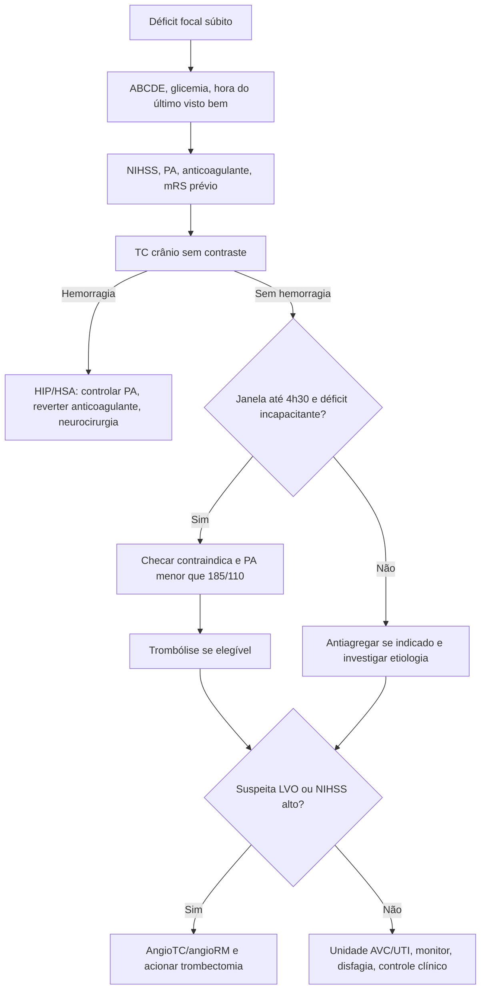
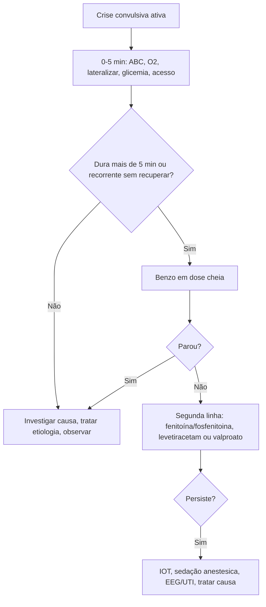
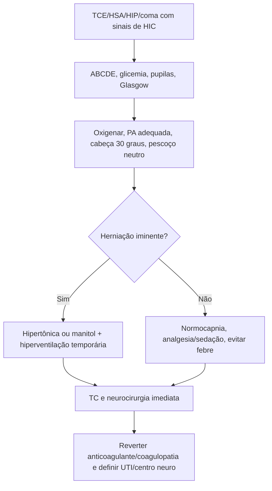

# Emergências neurológicas: AVC, Crise Convulsiva, HIC E TCE

## Leitura de 30 segundos

- Em neuro, a banca cobra decisão tempo-dependente: glicemia, hora do último visto bem, TC sem contraste, indicação de reperfusão, PA-alvo e o que não pode atrasar.
- Status epilepticus e crise no box são prova de método: ABC, glicemia, benzodiazepínico em dose cheia, segunda linha cedo e IOT/anestésico se refratário.
- HIC/TCE e estação prática cobram alvos: oxigenação, ventilação, PA, sedação/analgesia, cabeça a 30 graus, solução hiperosmolar, reversão de coagulopatia e neurocirurgia.
- Morte encefálica não é "paciente com Glasgow 3": precisa causa conhecida irreversível, coma aperceptivo, ausência de reflexos de tronco, apneia persistente e ausência de confundidores.

## Por que cai

- **Recorrência em provas/estações:** AVCi/trombólise/trombectomia, HSA/HIP, convulsão/eclampsia, coma, ONSD/HIC, TCE grave e morte encefálica aparecem de forma repetida entre TEME22-25.
- **O que a banca costuma testar:** primeiro exame, janela, critérios de inclusao/exclusao, dose de alteplase/tenecteplase, PA antes/depois de trombólise, NIHSS/ASPECTS, conduta no status, manitol/hipertônica, hiperventilação, alvos em TCE e impeditivos do protocolo de ME.
- **Como costuma aparecer:** caso clínico com muitos distratores. Exemplo clássico: "convulsão" que era síncope, "AVC leve" mas incapacitante, TCE com hipoxemia/hipotermia em que não se pode abrir ME, ou cefaleia explosiva com TC negativa em que a suspeita de HSA segue viva.

## Abordagem prática

### 1. Neurológico grave no primeiro minuto

1. **ABCDE antes do diagnóstico fino:** via aérea, SpO2, capnografia se intubado, circulação, temperatura e glicemia capilar.
2. **Defina a síndrome:** déficit focal súbito, crise convulsiva, cefaleia explosiva, rebaixamento, trauma ou infecção.
3. **Procure mímicos reversíveis:** hipoglicemia, hiponatremia, hipercapnia, hipoxemia, intoxicação, abstinência, sepse, eclampsia, pós-ictal.
4. **Chame ajuda cedo:** neurologia/teleAVC, neurocirurgia, hemodinâmica/trombectomia, UTI e transporte regulado quando necessário.
5. **Não sedar a prova neurológica sem motivo:** se precisa intubar, documente Glasgow, pupilas, déficit focal e drogas usadas antes.

### 2. Déficit focal agudo: pensar AVC até prova em contrário

1. **Hora zero:** último visto bem, uso de anticoagulante, cirurgia/sangramento recente, PA, glicemia, NIHSS e status funcional prévio.
2. **TC sem contraste imediata:** objetivo inicial é excluir hemorragia. Não espere laboratório se não há suspeita de anticoagulação/coagulopatia relevante.
3. **Se TC sem sangramento e janela até 4h30:** avaliar trombólise, corrigindo PA para menos de 185/110 se necessário.
4. **Se suspeita de oclusão de grande vaso:** angioTC/angioRM e acionar trombectomia; até 6 h critérios mais diretos, até 24 h selecionados por imagem/mismatch.
5. **Se não reperfundir:** antiagregação após excluir hemorragia, controle de fatores e investigação etiológica. Não baixar PA agressivamente sem indicação.

> **Resposta de prova TEME:** déficit focal súbito + TC sem contraste sem sangramento + janela elegível = trombólise se sem contraindicação; se LVO/NIHSS alto/ASPECTS adequado = trombectomia.
>
> **Atualização clínica:** tenecteplase 0,25 mg/kg em bolus único é alternativa forte em várias diretrizes internacionais, especialmente em candidato a trombectomia. No PCDT brasileiro de AVCi agudo, atualizado em 2025, a alteplase segue como trombolítico preconizado, e a tenecteplase não é recomendada por ausência de indicação aprovada em bula para AVCi no Brasil.

### 3. Crise convulsiva e status epilepticus

1. **Se convulsão ativa:** lateralizar/proteger, aspirar se necessário, O2, acesso, glicemia, temperatura, monitor e procurar causa.
2. **Status é operacionalmente >5 min:** não espere 30 min para tratar como emergência neurológica.
3. **Benzodiazepínico em dose cheia:** midazolam IM/IN se sem acesso; lorazepam/diazepam IV se acesso. Repetir uma vez se necessário.
4. **Se persiste após benzo:** segunda linha sem demora: fenitoína/fosfenitoina, levetiracetam ou valproato conforme disponibilidade e contraindicações.
5. **refratário:** IOT, analgesia/sedação, anestésico contínuo, EEG quando disponível e UTI. Corrija etiologia em paralelo.

> **Eclampsia:** crise convulsiva em gestante/puérpera é sulfato de magnésio, não fenitoína como primeira linha. Pense também em AVC/HSA/TVC se déficit focal, cefaleia explosiva ou rebaixamento persistente.

### 4. Cefaleia grave, HSA, HIP e TVC

1. **Cefaleia explosiva/pior da vida:** TC sem contraste. Se TC negativa e suspeita persistente, considerar LP ou angio/estratégia local.
2. **HSA aneurismática provável:** analgesia, antiemético, PA controlada, nimodipina, neurocirurgia/intervenção para clipagem ou embolização.
3. **Hemorragia intraparenquimatosa:** PA com controle contínuo e suave, suspender/reverter anticoagulante, corrigir coagulopatia, avaliar HIC e neurocirurgia.
4. **Trombose venosa cerebral:** jovem, puerpério, anticoncepcional, trombofilia, cefaleia subaguda, crise ou déficit; pedir angioTC/venoRM. Anticoagulação com heparina pode ser indicada mesmo com hemorragia venosa, salvo contraindicação.
5. **Meningite/encefalite:** se febre + cefaleia + rigidez/RNC, não atrase antibiótico/aciclovir por LP quando há indicação de TC antes.

### 5. HIC e herniação iminente

Suspeite se cefaleia progressiva, vômitos em jato, rebaixamento, papiledema, VI par, anisocoria, Cushing, postura anormal, TCE grave, HSA/HIP volumosa ou tumor/abscesso.

Conduta de ponte:

1. Cabeceira 30 graus e cabeça neutra.
2. Oxigenar e evitar hipoxemia; se intubado, capnografia.
3. PaCO2 35-40 mmHg como regra; hiperventilar temporariamente se herniação enquanto faz terapia definitiva.
4. Sedação/analgesia se agitado ou intubado.
5. Manitol ou salina hipertônica conforme volemia, sódio, pressão e disponibilidade.
6. TC, neurocirurgia e destino definitivo.

> **ONSD/POCUS:** bainha do nervo óptico aumentada sugere HIC e pode acelerar decisão quando o paciente está instável ou a TC vai demorar. Não substitui TC se ela está disponível.

### 6. TCE grave

1. **Prioridade e evitar lesão secundária:** hipoxemia e hipotensão matam neurônio recuperável.
2. **IOT se Glasgow <=8, perda de reflexos protetores, hipoxemia, agitação que impede cuidado ou necessidade de transporte/TC segura.**
3. **Antes/depois da TC:** sedação contínua, analgesia, ventilação protetora, capnografia, PA-alvo, solução isotônica, evitar febre e corrigir coagulopatia.
4. **Neurocirurgia imediata:** hematoma extradural/subdural volumoso, desvio de linha media, deterioração, anisocoria, fratura afundada complexa, contusão expansiva ou HIC refratária.
5. **Não usar corticoide para TCE.** Profilaxia anticonvulsivante pode ser considerada nos primeiros 7 dias em TCE grave/lesão cortical, conforme protocolo local.

### 7. Morte encefálica na sala vermelha

Antes de pensar em protocolo:

1. Causa conhecida, documentada e irreversível.
2. Coma aperceptivo.
3. Ausência de reatividade supraespinhal.
4. Apneia persistente.
5. Sem hipotermia, hipoxemia, choque, distúrbio metabólico grave ou droga depressora confundindo exame.

> **Pegadinha de estação:** TCE grave + TC catastrofica + sem reflexos de tronco, mas hipotermico, hipoxêmico ou sob sedação relevante, não permite iniciar/concluir protocolo. Primeiro corrija confundidores e estabilize.

## Conceitos que sustentam a conduta

### AVCi: tempo, tecido e elegibilidade

O objetivo da emergência é separar rápido três grupos: hemorragia, isquemia reperfundível e mímico. A TC sem contraste tira hemorragia do caminho; NIHSS mede gravidade; ASPECTS estima área já infartada; angio identifica oclusão de grande vaso. O erro clássico é pensar que "NIHSS baixo" sempre significa "não tratar": o que manda é déficit incapacitante, janela, imagem e risco.

Janela básica para trombólise é até 4h30 desde o último visto bem. Para trombectomia, a prova gosta de NIHSS >=6, ASPECTS >=6, mRS prévio bom e oclusão de grande vaso, com janela clássica até 6 h e janela estendida até 24 h em selecionados.

### Hemorragia: pressão, coagulação e neurocirurgia

HIP/HSA não são "só observar". As primeiras horas definem expansão do hematoma, ressangramento, HIC e necessidade cirúrgica. O controle pressor deve ser contínuo e titulado, evitando picos e quedas bruscas. Anticoagulante em hemorragia intracraniana é emergência de reversão: varfarina pede PCC 4 fatores + vitamina K; dabigatrana pode pedir idarucizumabe; inibidor Xa pode pedir andexanet ou PCC conforme disponibilidade.

### Status epilepticus: receptor muda com o tempo

Quanto mais tempo a crise dura, menos responsiva fica ao benzodiazepínico e maior a chance de lesão, acidose, rabdomiólise, hipertermia e broncoaspiração. Por isso a sequência é em fases: estabilização 0-5 min, benzo 5-20 min, segunda linha 20-40 min, anestésico/UTI se refratário.

### HIC/TCE: PPC e lesão secundária

TCE grave e HIC são doenças de perfusão. Hipoxemia, hipotensão, febre, hipercapnia importante, hipocapnia prolongada, anemia grave e coagulopatia reduzem reserva cerebral. A hiperventilação baixa a PIC por vasoconstrição, mas também pode piorar isquemia; use como ponte curta em herniação, não como rotina.

## Fluxograma

### Deficit Focal Agudo

### Status Epilepticus

### HIC/TCE Com deterioração

## Doses, alvos e números

### AVCi E Hemorragias

| Item | Número | observação TEME |
|---|---:|---|
| TC no AVC | imediata; meta prática porta-imagem <=20-25 min | A prova quer TC sem contraste antes de trombólise |
| Alteplase AVCi | 0,9 mg/kg, max 90 mg | 10% bolus, 90% em 60 min, até 4h30 |
| Tenecteplase AVCi | 0,25 mg/kg, max 25 mg | Atualização; em prova brasileira, cuidado com PCDT/bula |
| PA antes da trombólise | <185/110 mmHg | Se refratária, contraindica trombólise |
| PA após trombólise | <180/105 mmHg por 24 h | Monitor frequente |
| AVCi sem reperfusão | tratar se >=220/120; reduzir ~15% em 24 h | Evitar queda abrupta da perfusão |
| Trombectomia até 6 h | LVO anterior, mRS 0-1/2, NIHSS >=6, ASPECTS >=6 | Banca gosta de ACM M1/carotida interna |
| Trombectomia 6-24 h | selecionados por DAWN/DEFUSE/mismatch | Não é "todo AVC até 24 h" |
| HIP leve-moderada com PAS 150-220 | alvo PAS 140; manter 130-150 | Evitar PAS <130 |
| Varfarina + HIC | PCC 4 fatores + vitamina K IV | Não esperar "lavar" anticoagulante |
| Plaquetas em sangramento SNC/TCE | mirar >100.000/mm3 | Estação prática costuma cobrar alvo alto |
| HSA aneurismática | nimodipina 60 mg VO/enteral 4/4 h por 21 dias | Se hipotensão, ajustar com neuro/UTI |

### Convulsão E Status

| Item | Número | observação TEME |
|---|---:|---|
| Status epilepticus | crise >5 min ou crises sem recuperar consciência | Não esperar 30 min |
| Midazolam IM | 0,15-0,2 mg/kg, usual max 10 mg | Boa opção sem acesso |
| Midazolam IN/bucal | 0,2 mg/kg, max 10 mg | Útil no APH/pediatria, conforme disponibilidade |
| Lorazepam IV | 0,1 mg/kg, max 4 mg por dose | Repetir 1 vez se necessário |
| Diazepam IV | 0,15-0,2 mg/kg, max 10 mg | Mais recorrência que lorazepam |
| Fenitoína IV | 20 mg/kg | Em SF 0,9%; max 50 mg/min; monitor ECG/PA |
| Fosfenitoina IV/IM | 20 mg PE/kg | Melhor tolerância, se disponível |
| Levetiracetam IV | 40-60 mg/kg, max 4,5 g | Pouca interacao; alternativa moderna |
| Valproato IV | 20-40 mg/kg, max 3 g | Evitar hepatopatia, plaquetopenia, gestação |
| Eclampsia | MgSO4 4-6 g IV ataque; 1-2 g/h manutenção | Anticonvulsivante de escolha |

### HIC E TCE

| Item | Número | observação TEME |
|---|---:|---|
| Cabeceira | 30 graus | Cabeça neutra, sem compressão jugular |
| PaCO2 TCE/HIC sem herniação | 35-40 mmHg | Normocapnia; capnografia obrigatória se IOT |
| Hiperventilação de ponte | PaCO2 ~30-35 mmHg por curto período | Só herniação/deterioração até terapia definitiva |
| Manitol 20% | 0,25-1 g/kg IV | Evitar hipovolemia/choque/IRA importante |
| NaCl 3% | 2-3 mL/kg ou bolus 100-250 mL | Ajustar a protocolo local |
| NaCl 20% | 30 mL bolus | Número apareceu em aula/curso; checar protocolo |
| PAS mínima TCE grave | >=100 mmHg se 50-69 anos; >=110 se 15-49 ou >70 | Na sala vermelha, "sem hipotensão" é a ideia-mãe |
| Saturação | >94% | Evitar hipoxemia e hiperoxia sem alvo |
| Temperatura | normotermia; tratar febre | Hipotermia terapêutica rotineira não melhora desfecho |
| Corticoide no TCE | não usar | Aumenta mortalidade em TCE grave |
| Profilaxia crise TCE grave | 7 dias, conforme protocolo | Fenitoína ou levetiracetam; não previne epilepsia tardia |

## Pegadinhas TEME

- **Não medir glicemia no "AVC":** hipoglicemia e mímico clássico e deve ser corrigida antes de carimbar AVC.
- **Confundir último visto bem com hora em que foi encontrado:** para janela de reperfusão, vale o último momento assintomático conhecido.
- **NIHSS baixo = sem trombólise:** errado se déficit e incapacitante. O que não se trombolisa e déficit leve não incapacitante.
- **Crise no início exclui AVC:** não exclui; pode ser AVC com crise ou paresia de Todd. A decisão depende do déficit residual e da imagem.
- **Esperar INR/plaqueta de todo mundo para trombolisar:** se não há suspeita de anticoagulação/coagulopatia, não atrasar. Em varfarina/heparina/coagulopatia, precisa checar.
- **Baixar PA forte no AVCi sem reperfusão:** pode piorar penumbra. Trate agressivamente só sé indicação específica.
- **Trombectomia até 24 h para qualquer AVC:** precisa LVO e selecao por imagem/critérios.
- **Benzodiazepínico subdosado no status:** dose quebrada falha; faça dose plena e avance para segunda linha.
- **Fenitoína para eclampsia:** primeira linha é sulfato de magnésio.
- **LP antes da TC em RNC/focal/papiledema/crise recente/imunossupressão:** risco de herniação e erro de prova.
- **Hiperventilar todo TCE grave:** ponte para herniação, não rotina.
- **Hipotensão permissiva no TCE:** permissiva vale para hemorragia sem TCE; no TCE grave, evite hipotensão.
- **Corticoide para edema do TCE:** contraindicado.
- **Nimodipina na HSA traumática:** benefício é para HSA aneurismática; em traumática não é rotina de prova.
- **Abrir ME com hipotermia, hipoxemia ou sedação:** não. Primeiro corrigir confundidores.

## Erros fatais na prática

- Não proteger via aérea em paciente com rebaixamento, vômitos, sangramento orofaríngeo ou hipoxemia antes de transporte/TC.
- Não registrar último visto bem, anticoagulantes, NIHSS, pupilas e Glasgow antes de sedar/intubar.
- Atrasar TC/angioTC em AVC candidato a reperfusão por exames que não mudam a decisão imediata.
- Dar trombolítico em suspeita de HSA, sangramento intracraniano, INR alto, plaqueta <100.000 ou PA refratária.
- Repetir benzodiazepínico indefinidamente e esquecer segunda linha/status refratário.
- Fazer LP em paciente com sinais de HIC sem imagem/segurança.
- Deixar TCE grave hipotenso, hipoxêmico, hipercápnico ou febril.
- Não reverter anticoagulação em hemorragia intracraniana.
- Não acionar neurocirurgia/intervencionista cedo quando há lesão expansiva, hidrocefalia, HSA aneurismática ou LVO.
- Concluir morte encefálica sem preencher pré-requisitos legais e fisiológicos.

## Para prova vs na prática

| Tema | Para prova TEME | Na prática clínica |
|---|---|---|
| AVCi trombólise | Alteplase 0,9 mg/kg até 4h30, TC sem sangramento, PA <185/110 | Muitos centros usam tenecteplase 0,25 mg/kg em protocolos; alinhar com neurologia, PCDT, farmacia e bula/local |
| AVCi leve | Não trombolisar déficit leve sem incapacidade | Afasia, hemianopsia, mão dominante, ataxia incapacitante ou profissao podem tornar "leve" clinicamente relevante |
| Trombectomia | NIHSS >=6, ASPECTS >=6, LVO, janela até 6 h; até 24 h selecionado | Imagem avançada, transferência e discussão com centro de AVC decidem muito |
| PA no AVCi | <185/110 antes e <180/105 depois do litico; sem litico tratar se >=220/120 | Ajustar se dissecção, IAM, EAP, encefalopatia hipertensiva ou trombectomia |
| HIP | PAS alvo 140, manter 130-150 se leve-moderada | Evitar queda brusca; individualizar em hematoma grande, HIC, cirurgia e comorbidades |
| HSA | TC; se suspeita persiste, investigar; nimodipina e neurocirurgia | LP, angioTC, RM e fluxo local variam conforme tempo da cefaleia e qualidade da TC |
| Status epilepticus | Benzo dose cheia, depois fenitoína/fosfenitoina/levetiracetam/valproato | Levetiracetam e valproato cresceram por praticidade; fenitoína segue muito cobrada |
| TCE/HIC | HOB 30, normocapnia, manitol/hipertônica, evitar hipoxemia/hipotensão | Monitorizacao invasiva, sedação, osmoterapia e neurocirurgia dependem do centro |
| ME | Não iniciar/concluir com confundidores | Seguir estritamente CFM, hospital, CIHDOTT/OPO e documentação |

## Checklist de revisão

- [ ] Sei fazer abordagem inicial de coma/déficit focal/crise sem esquecer glicemia.
- [ ] Sei dose e janela de alteplase e quando lembrar da tenecteplase.
- [ ] Sei metas de PA no AVCi com litico, AVCi sem litico e HIP.
- [ ] Sei critério básico de trombectomia e que janela estendida exige selecao.
- [ ] Sei tratar status em fases e não ficar preso em benzodiazepínico.
- [ ] Sei quando TC deve vir antes da LP.
- [ ] Sei medidas iniciais de HIC e quando hiperventilar.
- [ ] Sei alvos de TCE grave: oxigenação, PA, PaCO2, temperatura e coagulação.
- [ ] Sei que corticoide não é tratamento de TCE.
- [ ] Sei por que não abrir ME com hipotermia/hipoxemia/sedação/confundidores.

## Questões e estações relacionadas

- **TEME22:** TCE grave/possível ME; AVCi e decisão após TC; mal agudo da montanha; encefalopatia hepática; crise/lesões em imunossuprimido; VNI contraindicada em AVE com rebaixamento/disfagia/secreção.
- **TEME24 prática:** TCE pediátrico com indicação de imagem; estação de neuro com TCE, HSA traumática/hematoma intraparenquimatoso, ausência de reflexos de tronco e impeditivos para ME.
- **TEME25 teórica/prática:** tenecteplase vs alteplase; eclampsia pós-parto; síncope simulando convulsão; ONSD >6 mm e HIC; TCE/via aérea; AVCi com NIHSS alto/ASPECTS; pré-requisitos de morte encefálica.
- **Emergency Talks:** aulas 02, 03, 12, 18, 40 e 45; `Resumo do Emergency.docx`.

## Referências

**Prova/TEME**

- Conteúdo programático TEME26.
- Referências bibliográficas TEME26, incluindo Manual de Via aérea 2025, Tratado ABRAMEDE 2024 e materiais oficiais indicados no edital.
- Provas teóricas TEME22-25 e estações práticas TEME24-25 disponíveis no projeto.

**Material local**

- Emergency Talks - Aula 02: Déficit focal agudo e AVCi.
- Emergency Talks - Aula 03: Cefaleia e sangramentos do SNC.
- Emergency Talks - Aula 12: Convulsões e infecções do SNC.
- Emergency Talks - Aula 18: POCUS trauma, vascular e neuro.
- Emergency Talks - Aula 40: Alteração do nível de consciência e HIC.
- Emergency Talks - Aula 45: Trauma cranioencefálico.
- `Resumo do Emergency.docx`.

**Atualização clínica**

- Ministério da Saúde. PCDT Acidente Vascular Cerebral Isquêmico Agudo, Portaria Conjunta SAES/SECTICS n 29, 12/12/2023, páeina atualizada em 21/01/2025: https://www.gov.br/saude/pt-br/assuntos/pcdt/a/acidente-vascular-cerebral-isquemico-agudo/view
- Ministério da Saúde. Linha de Cuidado AVC Isquêmico até 4 horas: https://linhasdecuidado.saude.gov.br/portal/acidente-vascular-cerebral-%28AVC%29-no-adulto/unidade-hospitalar/avc-isquemico-menor-igual-4horas/
- Powers WJ et al. AHA/ASA 2019 update to 2018 Guidelines for the Early Management of Acute Ischemic Stroke: https://www.ahajournals.org/doi/10.1161/STR.0000000000000211
- Alamowitch S et al. European Stroke Organisation expedited recommendation on tenecteplase for acute ischaemic stroke, 2023: https://pmc.ncbi.nlm.nih.gov/articles/PMC10069183/
- Greenberg SM et al. AHA/ASA 2022 Guideline for Spontaneous Intracerebral Hemorrhage: https://pubmed.ncbi.nlm.nih.gov/35579034/
- Hoh BL et al. AHA/ASA 2023 Guideline for Aneurysmal Subarachnoid Hemorrhage: https://pubmed.ncbi.nlm.nih.gov/37212182/
- Brain Trauma Foundation. Guidelines for the Management of Severe TBI, 4th Edition: https://braintrauma.org/coma/guidelines/severe-tbi
- Glauser T et al. American Epilepsy Society guideline for convulsive status epilepticus: https://www.acep.org/siteassets/uploads/uploaded-files/acep/clinical-and-practice-management/clinical-policies/aesconvulsivestatusepilepticus.pdf
- Cook AM et al. Neurocritical Care Society Guidelines for the Acute Treatment of Cerebral Edema in Neurocritical Care Patients, 2020: https://pubmed.ncbi.nlm.nih.gov/32227294/
- Conselho Federal de Medicina. Resolução CFM n 2.173/2017 e critérios de morte encefálica: https://portal.cfm.org.br/noticias/cfm-atualiza-resolucao-com-criterios-de-diagnostico-da-morte-encefalica/
