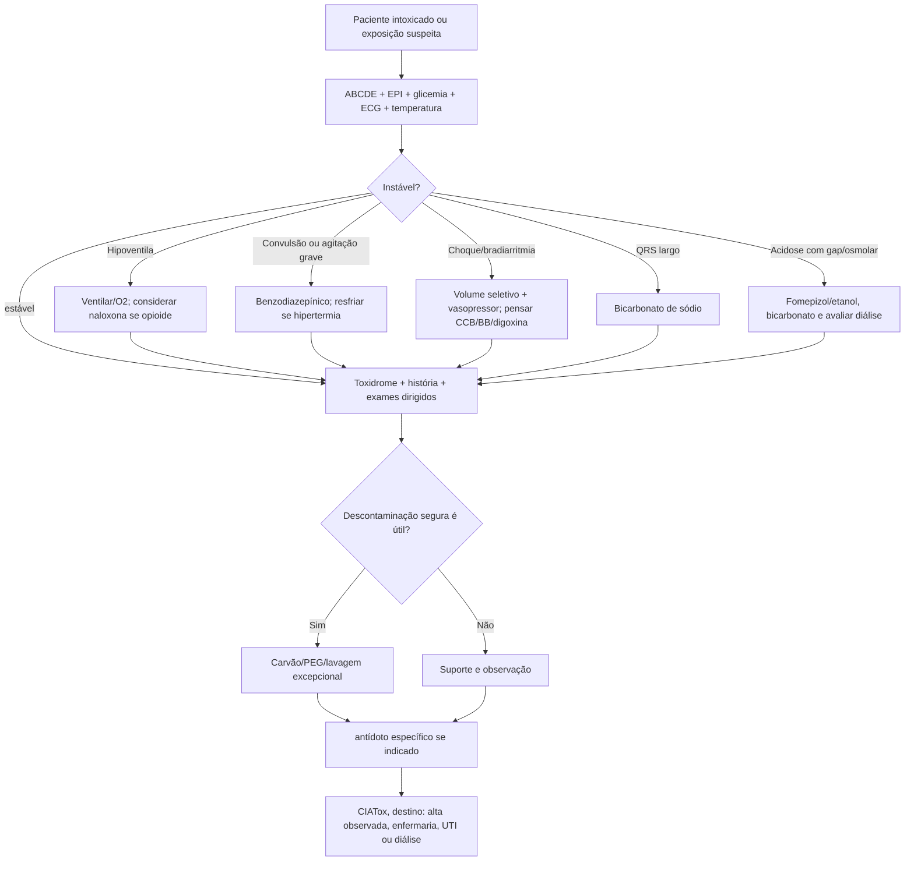
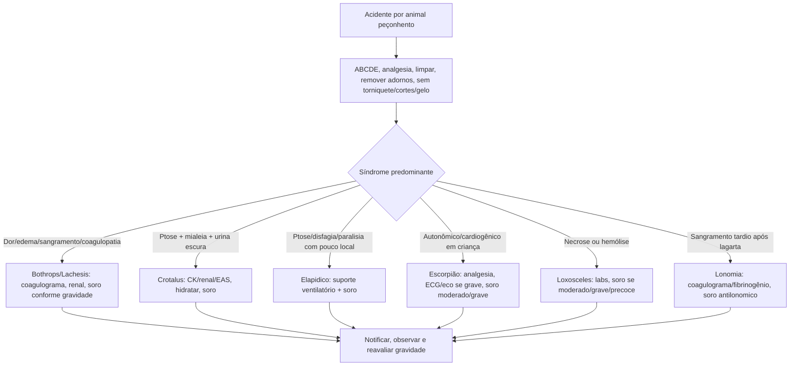

# Toxicologia E Animais Peçonhentos

## Leitura de 30 segundos

- Intoxicação grave se resolve em prioridades, não em "descobrir a substância": ABCDE, glicemia, ECG, temperatura, gasometria/lactato e suporte vem antes do antídoto.
- A prova ama seis síndromes: opioide, colinérgica, simpatomimética, bloqueador de canal de cálcio/beta-bloqueador, bloqueio de canal de sódio por tricíclico e acidose com gap/osmolar por alcoois tóxicos/salicilato.
- Descontaminação não é reflexo automático: carvão ativado só se exposição recente, substância adsorvível e via aérea segura; lavagem gástrica é exceção.
- Em acidente peçonhento, o que aprova é reconhecer o padrão: Bothrops sangra/coagula, Crotalus paralisa e faz rabdomiólise, coral paralisa com pouco local, escorpião grave em criança faz vômitos/EAP/choque, Lonomia sangra.
- Soro antiveneno não é calculado por peso; e por tipo de acidente e gravidade. Criança recebe a mesma quantidade de frascos-ampolas do adulto.

## Por que cai

- **Recorrência em provas/estações:** TEME22-25 cobrou carvão/lavagem, opioide/naloxona, álcool tóxico, tricíclico, LAST, cocaína/hipertermia, paraquat, metais, botulismo, chumbinho, Bothrops, Crotalus/coral, escorpionismo, abelhas e estação prática pediátrica com carbamato/organofosforado.
- **O que a banca costuma testar:** antídoto certo, quando não usar antídoto, indicação de diálise, QRS alargado, acidose metabólica com anion gap, osmolar gap, indicação de soro antiveneno, diferença entre alergia e envenenamento e condutas que não podem atrasar suporte.
- **Como costuma aparecer:** caso com sintomas mistos é uma alternativa tentadora que faz "procedimento de descontaminação" ou "antídoto famoso" antes de ventilar, fazer RCP, resfriar, dar bicarbonato ou aplicar soro específico.

## Abordagem prática

### 1. Intoxicado grave no primeiro minuto

1. **ABCDE e proteção da equipe:** tire o paciente da fonte, use EPI se organofosforado/carbamato, retire roupas contaminadas, lave pele/olhos quando exposição cutanea.
2. **Corrija os matadores:** hipoxemia, hipoventilação, hipoglicemia, hipertermia, choque, convulsão, arritmia e acidose grave.
3. **Monitorize cedo:** ECG de 12 derivações, capnografia se sedado/intubado, temperatura central se hipertérmico, glicemia, gasometria/lactato, eletrólitos, função renal/hepática, CK, coagulograma conforme caso.
4. **Procure toxíndrome, não nome comercial:** pupilas, pele, secreções, frequência respiratória, PA/FC, temperatura, estado mental, neuromuscular e ECG.
5. **Acione CIATox/toxicologista quando grave, desconhecido, gestante/criança, necessidade de antídoto raro, diálise, soro, ou exposição ocupacional/coletiva.**

> **Resposta de prova TEME:** suporte inicial, glicemia e ECG aparecem antes da "toxicologia completa". Se o paciente não ventila, ventile; se está em PCR, RCP/ACLS primeiro.
>
> **Atualização clínica:** em 2026, a tendência de toxicologia e individualizar protocolos fixos, principalmente NAC, diálise e observação pós-naloxona. Para prova, euarde o algoritmo clássico; na prática, discuta cedo com CIATox.

### 2. Reconheça os toxíndromes de prova

| Toxidrome | Pistas | Causas clássicas | Conduta que muda jogo |
|---|---|---|---|
| Opioide | Bradipneia, RNC, miose; pode não ter miose | Heroina, morfina, fentanil, metadona | Ventilação + naloxona titulada |
| Sedativo-hipnotico | RNC, ataxia, fala arrastada, vitais relativamente preservados | Benzodiazepínicos, barbituricos, álcool | Suporte; flumazenil só em caso muito selecionado |
| Colinérgico | Broncorreia, salivação, lacrimejamento, miose, diarreia, fasciculações | Organofosforado/carbamato, "chumbinho" | Descontaminação + atropina até secar secreção + pralidoxima se organofosforado/desconhecido |
| Anticolinérgico | Pele seca/quente, midríase, delirium, retenção urinária, taquicardia | Anti-histamínico, TCA, atropínicos | Suporte, benzodiazepínico; ECG manda |
| Simpatomimético | Agitação, hipertensão, midríase, sudorese, hipertermia | Cocaína, anfetamina, MDMA | Benzodiazepínico + resfriamento agressivo |
| Bloqueio de canal de sódio | RNC, hipotensão, convulsão, QRS largo, R em aVR | TCA, difenidramina, carbamazepina, cocaína | Bicarbonato de sódio |
| CCB/BB | Bradicardia + choque; CCB tende a hiperglicemia, BB a hipoglicemia/convulsão | Verapamil, diltiazem, amlodipina, propranolol | Cálcio + insulina em alta dose euglicêmica |
| Acidose com gap/osmolar | Acidose metabólica, lactato, gap osmolar, RNC | Metanol, etilenoglicol, salicilato | Fomepizol/etanol + bicarbonato/diálise conforme caso |

### 3. Descontaminação: menos é melhor

1. **Carvão ativado:** considerar se até 1 h da ingestão, substância adsorvível, dose potencialmente grave e via aérea protegida/cooperação. Em liberação prolongada ou anticolinérgico, pode haver janela um pouco maior, mas é decisão caso a caso.
2. **Não adsorve bem:** metais pesados, ferro, lítio, álcool, ácidos/álcali, solventes, pesticidas e muitas substâncias corrosivas.
3. **Lavagem gástrica:** não é rotina. Só considerar em ingestão recente, potencialmente letal, sem alternativa melhor, com via aérea protegida e equipe treinada.
4. **Ipeca/vômito induzido:** não tem papel na sala vermelha.
5. **Irrigação intestinal total com PEG:** lembrar em body packer, drogas de liberação prolongada, ferro/lítio/potássio ou substâncias radiopacas; discutir com CIATox.

### 4. antídotos que mais caem

- **Naloxona:** opioide com hipoventilação. Titule para respirar, não para "acordar bonito".
- **N-acetilcisteína:** paracetamol potencialmente tóxico, curva de Rumack-Matthew quando aplicável, ingestão tardia/desconhecida com suspeita ou lesão hepática.
- **Bicarbonato de sódio:** TCA/bloqueador de canal de sódio com QRS >100 ms, hipotensão, arritmia ou convulsão.
- **Atropina + pralidoxima:** organofosforado/carbamato grave; atropina seca pulmão, pralidoxima ajuda nicotinico quando organofosforado e precoce.
- **Fomepizol ou etanol:** metanol e etilenoglicol.
- **Hidroxocobalamina:** cianeto, especialmente inalação de fumaça + lactato alto/choque/RNC.
- **Azul de metileno:** meta-hemoglobinemia sintomática.
- **Fab anti-digoxina:** arritmia grave, instabilidade, hipercalemia importante ou PCR associada a digoxina.
- **Emulsao lipídica 20%:** LAST e tóxicos lipofilicos refratários selecionados.

## Conceitos que sustentam a conduta

### Opioides

O marcador clínico mais útil para naloxona e ventilação: FR baixa, hipercapnia, hipoxemia ou apneia. Miose ajuda, mas ausência de miose não exclui opioide, sobretudo com hipoxemia, coingestão ou opioides sintéticos. Em PCR suspeita por opioide, naloxona pode entrar sem atrapalhar, mas não substitui compressão, ventilação, desfibrilação e adrenalina quando indicadas.

### Benzodiazepínicos e flumazenil

Intoxicação isolada por benzodiazepínico raramente mata se suporte ventilatório estiver disponível. Flumazenil pode precipitar convulsão e abstinência, principalmente em usuário crônico ou coingestão com TCA/cocaína/carbamazepina. Use como resposta de prova apenas em exposição isolada, paciente não habituado, criança com ingestão acidental ou reversão de sedação procedural.

### Triciclicos e bloqueadores de canal de sódio

TCA mata por convulsão, hipotensão e cardiotoxicidade. O ECG é o exame mais importante: QRS >100 ms, R em aVR >3 mm, QT prolongado e arritmias sugerem toxicidade. O bicarbonato aumenta sódio extracelular e alcaliniza, reduzindo ligação do tóxico ao canal de sódio. Evite flumazenil, antiarrítmico classe Ia/Ic e cardioversão "por reflexo" sem corrigir toxicidade de base.

### Cocaína, anfetaminas e hipertermia

A morte vem de hipertermia, acidose, rabdomiólise, arritmia e colapso. Benzodiazepínico é primeira linha para agitação, hipertensão e demanda adrenérgica. Resfriamento físico é prioridade quando temperatura alta. Se precisar intubar paciente hipertérmico/rabdomiólise, prefira rocurônio a succinilcolina.

> **Para prova TEME:** evite beta-bloqueador isolado em intoxicação por cocaína/simpatomimético.
>
> **Na prática clínica:** a contraindicação absoluta de todo beta-bloqueador é cada vez mais questionada. Em crise hipertensiva/IAM por cocaína, benzodiazepínico, nitroglicerina e bloqueador de canal de cálcio seguem escolhas seguras; uso de beta-bloqueio combinado alfa/beta deve ser individualizado e supervisionado.

### Paracetamol

Na ingestão aguda conhecida, dosar paracetamol a partir de 4 h e aplicar nomograma de Rumack-Matthew. Se >8 h, tempo desconhecido, ingestão repetida, tentativa de suicídio com história ruim ou transaminase alterada, não espere tudo ficar perfeito para iniciar NAC. O protocolo clássico IV entrega 300 mg/kg em 21 h; oral clássico e 140 mg/kg seguido de 70 mg/kg de 4/4 h por 17 doses.

> **Atualização clínica 2026:** a ACMT reforca que NAC IV não deve ser interrompida automaticamente em 21 h se ainda houver paracetamol detectavel, AST/ALT subindo, INR >=2 ou marcadores ruins como acidose, lactato, creatinina ou fosfato. Para prova, decore a dose; na prática, pare por critério clínico-laboratorial.

### Salicilatos

Salicilato e traiçoeiro porque o paciente compensa a acidose hiperventilando. Intubar sem manter ventilação minuto alta pode derrubar pH rapidamente e aumentar entrada do salicilato no SNC. Tratamento: carvão se cedo, glicose mesmo sem hipoglicemia se RNC, bicarbonato para alcalinizar soro/urina e hemodialise se grave.

### Alcoois tóxicos

Metanol dá distúrbio visual, acidose e lesão neurológica. Etilenoglicol dá embriaguez inicial, cristais de oxalato, hipocalcemia, AKI e acidose. Isopropanol faz cetose sem acidose importante e não é tratado com fomepizol. Gap osmolar alto ajuda cedo, mas gap normal não exclui se o metabolismo já avançou para acidose.

### Organofosforados, carbamatos e chumbinho

O problema imediato é excesso colinérgico com broncorreia, broncoespasmo, bradicardia, secreção e falência ventilatória. Atropina deve ser repetida/dobrada até secar secreções respiratórias e melhorar ausculta, não até atineir uma dose "bonita". Pralidoxima é mais forte para organofosforado precoce; se a classe é desconhecida e o quadro é grave, não segure.

### Bloqueador de canal de cálcio e beta-bloqueador

Ambos podem dar bradicardia e choque refratário a atropina. CCB costuma cursar com hiperglicemia; BB, especialmente propranolol, pode dar hipoglicemia, convulsão e QRS largo. Não espere resposta mágica a uma ampola: use cálcio, insulina em alta dose euglicêmica, vasopressores, glucagon para BB, bicarbonato se QRS largo, emulsão lipídica/ECMO em refratário.

### Digoxina

Náusea, vômitos, alteração visual, confusão e arritmias em usuário de digoxina devem acender alerta. Nível "terapêutico" não exclui toxicidade se potássio/renalidade/tempo de coleta estão confusos. Fab é indicado em arritmia ventricular, bloqueio/instabilidade grave, hipercalemia importante, ingestão maciça ou PCR. Cardioversao pode precipitar arritmia; se inevitável, use baixa energia e trate a causa.

### Fumaça: CO e cianeto

CO da cefaleia, confusão, síncope, isquemia, acidose e COHb elevada; oximetria comum engana. Trate com O2 a 100%. Câmara hiperbárica entra na conversa se COHb >25-30%, RNC/síncope, isquemia, acidose grave, gestação ou quadro neurológico/cardíaco relevante. Cianeto deve ser pensado em incêndio fechado com hipotensão, RNC e lactato muito alto; hidroxocobalamina não deve esperar confirmação laboratorial se o quadro é compatível.

### Metais, paraquat e botulismo

- **Arsenico:** gastroenterite intensa, diarreia tipo "água de arroz", choque, QT/torsades, linhas radiopacas possíveis no Rx. Se sintomático e exposição forte, quela antes de confirmação, com toxicologista.
- **Chumbo:** encefalopatia em criança ou adulto exposto é indicação de quelação urgente; carvão não resolve metal pesado.
- **Paraquat:** lesão cáustica oral/GI, lesão renal/hepática e fibrose pulmonar tardia. Não há antídoto salvador; descontaminação precoce e CIATox importam. Evite oxigênio liberal, usando apenas para hipoxemia.
- **Botulismo:** paralisia flacida descendente, simétrica, com pares cranianos, diplopia/ptose/disfagia, pupilas alteradas, sem déficit sensitivo e geralmente consciente. Suporte ventilatório e antitoxina precoce; não espere laboratório.

### LAST

Toxicidade sistêmica por anestésico local pode começar com parestesia perioral, zumbido, gosto metálico, agitação e convulsão, evoluindo para hipotensão/arritmia/PCR. Trate diferente do ACLS padrão: via aérea, benzodiazepínico para convulsão, doses menores de adrenalina, evitar vasopressina/beta-bloqueador/bloqueador de canal de cálcio e fazer emulsão lipídica 20%.

## Animais Peçonhentos: Padrão De Prova

### Conduta geral

1. **Não faça dano:** não earrotear, cortar, sugar, queimar, aplicar gelo/álcool/querosene, nem dar AAS.
2. **Suporte e dor:** analgesia, limpeza, remover anéis/objetos apertados, marcar progressão de edema, atualizar tétano, hidratar se risco renal/rabdomiólise.
3. **Classifique por síndrome:** local/coagulante, neuro-miotóxico, neuroparalítico, autonômico/cardiogênico, hemorrágico.
4. **Laboratório dirigido:** hemograma, coagulograma/tempo de coagulação, fibrinogênio se disponível, CK, creatinina, EAS/mioglobinúria, eletrólitos, ECG conforme caso.
5. **Soro específico precoce quando indicado:** dose por gravidade, mesma dose adulto/criança, IV, sob monitorização e preparo para anafilaxia.
6. **Notifique e regule:** acidentes por animais peçonhentos são de notificação; transferência não deve atrasar suporte e soro quando disponível.

### Serpentes

| Acidente | Pistas | Complicacao-chave | Soro de prova |
|---|---|---|---|
| Bothrops | Dor/edema progressivo, equimose, sangramento, coagulopatia | Hemorragia, síndrome compartimental, AKI | Antibotrópico ou combinado disponível |
| Crotalus | Ptose/diplopia, facies miastenica, mialeia, urina escura, pouco local | Rabdomiolise e AKI | Anticrotalico |
| Lachesis | Quadro local tipo Bothrops + Vagal: vômito/diarreia, bradicardia, hipotensão | Choque, sangramento | Antilachetico/combinado |
| Elapidico/coral | Pouco local + ptose, disfagia, fraqueza, paralisia respiratória | Insuficiência ventilatória | Antielapídico |

**Bothrops filhote e pegadinha:** pode ter pouca reação local e coagulopatia importante. Não descarte Bothrops só porque o edema é pequeno nas primeiras horas.

### Escorpionismo

Leve é dor/parestesia local. Moderado tem sintomas autonômicos de menor intensidade: sudorese, náuseas/vômitos, agitação, alteração de FC/PA. Grave tem vômitos incoercíveis, sudorese profusa, sialorreia, RNC, convulsão, priapismo, insuficiência cardíaca, EAP, choque ou insuficiência respiratória. Crianças, especialmente pequenas, descompensam mais.

> **Resposta de prova TEME:** criança com vômitos, sudorese, choque, disfunção ventricular/EAP, hiperglicemia ou pancreatite depois de picada = escorpionismo grave por Tityus; analgesia isolada não basta.

### Aranhas e Lonomia

- **Loxosceles:** pouca dor inicial, depois eritema/edema, placa marmórea, necrose; forma sistêmica com hemólise, icterícia, hemoglobinúria e AKI.
- **Phoneutria:** dor imediata muito intensa, edema local, sudorese, agitação, hipertensão, náuseas/vômitos, priapismo em criança.
- **Latrodectus:** dor, contraturas, rigidez abdominal, sudorese e sintomas autonômicos.
- **Lonomia:** contato com lagarta; dor/queimação local discreta pode enganar, depois coagulopatia, equimoses, sangramentos, hematúria e IRA. Evite AAS, IM e procedimentos desnecessários.

### Abelhas

Uma picada pode matar por anafilaxia: adrenalina IM, via aérea e suporte. Muitas picadas podem matar por envenenamento direto: hemólise, rabdomiólise, CIVD, lesão renal, choque e necessidade de diálise. Não confunda "muitas abelhas" com "só alergia".

## Fluxograma

### Intoxicado Na Sala Vermelha

### Picada/Ferroada/Contato Com Animal Peçonhento

## Doses, alvos e números

### antídotos e medidas de toxicologia

| Item | Número | observação TEME |
|---|---:|---|
| Carvão ativado | 1 g/kg VO/SNG; adulto comum 50 g | Preferir até 1 h, substância adsorvível, via aérea segura |
| Naloxona | 0,04-0,4 mg IV titulando; 0,4-2 mg se apneia/grave | Alvo é FR/ventilação, não abstinência; repetir ou infundir se rebaixar de novo |
| Flumazenil | 0,2 mg IV, repetir a cada 60 s até resposta | Apenas BZD isolado/não habituado; evitar em TCA, convulsão, abstinência |
| NAC oral | 140 mg/kg, depois 70 mg/kg 4/4 h x17 | Protocolo clássico; iniciar cedo se dúvida grave |
| NAC IV | 300 mg/kg em 21 h | Não parar se APAP detectavel ou lesão hepática em piora |
| Bicarbonato em TCA | 1-2 mEq/kg IV bolus; repetir | QRS >100 ms, hipotensão, arritmia, convulsão; alvo QRS <100 e pH 7,45-7,55 |
| Atropina organofosforado | Adulto 1-3 mg IV; criança 0,05 mg/kg | Dobrar a cada 5 min até secar secreção pulmonar; depois infusão |
| Infusão de atropina | 10-20% da dose total de ataque por hora | Ajustar por broncorreia/broncoespasmo |
| Pralidoxima | Adulto 1-2 g IV em 30 min; criança 25-50 mg/kg | Mais útil se organofosforado precoce; não atrasar atropina |
| Fomepizol | 15 mg/kg IV, depois 10 mg/kg 12/12 h | Metanol/etilenoglicol; ajustar se diálise |
| Etanol | Protocolo local/CIATox | Alternativa quando não há fomepizol |
| Hidroxocobalamina | 5 g IV; pode repetir 5 g | Cianeto/smoke inalation com choque/RNC/lactato alto |
| Azul de metileno | 1-2 mg/kg IV | MetaHb sintomática; cuidado com G6PD/serotoninérgicos |
| Insulina em alta dose | Bolus 1 U/kg + 1 U/kg/h, titular até 10 U/kg/h | CCB/BB em choque; glicose e K de perto |
| Glucagon em BB | 5-10 mg IV bolus, depois infusão | Mais útil em beta-bloqueador; vômitos comuns |
| Cálcio em CCB | Gluconato 10% 30-60 mL IV ou cloreto 10% 10-20 mL central | Repetir conforme ECG/hemodinâmica/calcemia |
| Emulsao lipídica 20% | 1,5 mL/kg bolus + 0,25 mL/kg/min | LAST; repetir bolus/dobrar se instável; max 12 mL/kg |
| CO | O2 100% | Considerar hiperbárica se COHb >25-30%, RNC, isquemia, acidose ou gestante |

### Antivenenos de alta recorrência

| Acidente | Leve | Moderado | Grave | observação TEME |
|---|---:|---:|---:|---|
| Bothrops | 3 FA | 6 FA | 12 FA | PCDT ofídicos MS 2026; coagulopatia pode ocorrer mesmo com edema pequeno |
| Crotalus | 5 FA | 10 FA | 20 FA | Neuro + mialeia/mioglobinúria/oligúria definem gravidade |
| Lachesis | - | 10 FA | 20 FA | Não há leve clássico; sinais vagais pesam |
| Elapidico | - | 5 FA | 10 FA | Leve observa; miastenia/paralisia pede soro |
| Escorpionismo | - | 3 FA | 6 FA | PCDT escorpiônico MS 2026; não passar de 6 FA |
| Phoneutria | - | 2-4 FA | 5-10 FA | Especialmente criança/sistêmico; analgesia e bloqueio local ajudam |
| Loxosceles | - | 5 FA | 10 FA | Melhor se precoce; forma sistêmica/hemólise pesa |
| Lonomia | - | 5 FA | 10 FA | Sangramento/coagulopatia; evitar AAS/IM |

FA = frascos-ampolas. A dose e definida por gravidade, não por peso.

## Pegadinhas TEME

- **Carvão para todo mundo:** errado. Precisa ser cedo, adsorvível e com via aérea segura.
- **Lavagem gástrica porque chegou há 30 minutos:** errado. Mesmo cedo, é exceção; risco de aspiração/trauma pesa.
- **Naloxona para "qualquer sonolento":** errado. O alvo é depressão respiratória. Sem pulso, RCP/ACLS primeiro.
- **Flumazenil no coma desconhecido:** armadilha clássica. Pode precipitar convulsão, principalmente com TCA.
- **TCA com QRS largo e cardioversão/antiarritmico:** a resposta de prova e bicarbonato.
- **Cocaína hipertensa e beta-bloqueador isolado:** para TEME, evite; benzo e vasodilatador são mais seguros.
- **Salicilato intubado como qualquer outro:** perigoso. Se intubar, mantenha hiperventilação compensatoria e bicarbonato.
- **álcool tóxico sem osmolar gap:** não exclui. Gap osmolar cai quando vira acidose.
- **Organofosforado: parar atropina por taquicardia/midríase:** errado. Pare pelo pulmão seco e perfusão.
- **Chumbinho:** pense carbamato/organofosforado; na estação pediátrica, atropina em bolus foi ponto de prova.
- **Bothrops filhote com pouco edema:** pode ser botrópico com coagulopatia importante.
- **Crotalus vs coral:** Crotalus dá miotoxicidade/urina escura/AKI; coral dá paralisia com pouco local e sem rabdomiólise marcante.
- **Escorpião em criança com vômitos e EAP:** não é "só dor"; é grave até prova em contrário.
- **Multiplas abelhas:** pode ser envenenamento sistêmico, não apenas anafilaxia.
- **Lonomia:** contato com lagarta + sangramento/coagulopatia; não precisa ter mordida/picada evidente.

## Erros fatais na prática

- Intubar intoxicado sem preparar vasopressor, capnografia e plano de ventilação, especialmente salicilato/acidose.
- Dar carvão para paciente sonolento sem proteger via aérea.
- Atrasar bicarbonato em TCA com QRS largo enquanto espera dosagem toxicológica.
- Tratar hipertermia simpatomimética só com antitérmico; o tratamento e sedação e resfriamento físico.
- Usar succinilcolina em organofosforado/carbamato grave ou hipertermia/rabdomiólise por estimulante.
- Fazer "dose única" de atropina em organofosforado e abandonar secreção pulmonar.
- Transferir acidente peçonhento grave sem soro disponível no serviço de origem quando o soro está indicado e acessível.
- Fazer torniquete/corte/succao em picada de serpente.
- Confundir escorpionismo grave pediátrico com sepse/bronquiolite e perder janela do soro.
- Dar adrenalina como eixo para envenenamento por múltiplas abelhas sem reconhecer rabdomiólise/hemólise/CIVD/AKI; adrenalina é para anafilaxia.

## Para prova vs na prática

> **Para prova TEME:** se o caso tem opioide + hipoventilação, responda naloxona e ventilação; se tem TCA + QRS largo, bicarbonato; se tem organofosforado/chumbinho, atropina até secar secreção e pralidoxima; se tem Bothrops, soro antibotrópico; se tem escorpião grave em criança, soro antiescorpiônico/antiaracnídico.
>
> **Na prática clínica:** ligue cedo para CIATox, ajuste antídotos à disponibilidade local, peso, diálise é tempo de exposição. Protocolos de NAC, EXTRIP/diálise e manejo de cocaína com beta-bloqueio mudam com evidências e contexto. O material marca a resposta provável da banca, mas a assistência real deve seguir protocolo institucional e especialista quando possível.

> **Para prova TEME:** soro antiveneno é por gravidade, não por kg; criança recebe a mesma quantidade de FA.
>
> **Na prática clínica:** confira tabela atual do Ministério da Saúde e estoque local. O PCDT ofídicos 2026 usa Bothrops 3/6/12 FA; materiais antigos podem trazer 2-4/4-8/12.

## Checklist de revisão

- [ ] No intoxicado grave, eu faco ABCDE, glicemia, ECG, temperatura e suporte antes de "nomear" o veneno.
- [ ] Sei quando usar e quando evitar carvão, lavagem e flumazenil.
- [ ] Sei reconhecer opioide, colinérgico, simpatomimético, TCA, CCB/BB e álcool tóxico.
- [ ] Sei as doses centrais: naloxona, bicarbonato, atropina, pralidoxima, NAC, fomepizol, hidroxocobalamina, HDI e lipídica.
- [ ] Sei que naloxona não substitui RCP em PCR.
- [ ] Sei que salicilato intubado precisa manter ventilação minuto alta.
- [ ] Sei diferenciar Bothrops, Crotalus, Lachesis, elapídico, escorpião, Loxosceles, Phoneutria e Lonomia.
- [ ] Sei as doses de soro mais prováveis: Bothrops 3/6/12, Crotalus 5/10/20, escorpião 0/3/6.
- [ ] Sei as pegadinhas de Bothrops filhote, coral vs Crotalus, escorpião grave em criança e múltiplas abelhas.
- [ ] Sei quando acionar CIATox/toxicologista.

## Questões e estações relacionadas

- **TEME22 Q55:** insuficiência respiratória tipo II e intoxicação por opioide/inhalacao como mecanismos possíveis.
- **TEME22 Q85:** abstinência álcoolica, crise convulsiva e avaliação de causas associadas.
- **TEME22 Q96:** descontaminação gastrointestinal, carvão, lavagem, diálise e risco de procedimento invasivo.
- **TEME22 Q108:** álcool tóxico com acidose/gap e necessidade de antídoto + hemodialise.
- **TEME22 Q114:** acidentes por animais peçonhentos e diferença entre escorpião, crotalico e elapídico.
- **TEME23 Q30:** etilenoglicol com acidose e cristais de oxalato.
- **TEME23 Q40:** inalação de fumaça, CO/cianeto e hidroxocobalamina.
- **TEME23 Q70:** escorpionismo e pancreatite aguda.
- **TEME23 Q73/Q82:** opioide, naloxona, miose ausente e ventilação.
- **TEME23 Q97:** chumbo/encefalopatia e quelação.
- **TEME24 Q1/Q65:** Bothrops filhote, coagulopatia importante e pouco achado local.
- **TEME24 Q2:** descontaminação gástrica e lavagem.
- **TEME24 Q23:** LAST e emulsão lipídica 20%.
- **TEME24 Q30:** TCA com QRS largo, bicarbonato e contraindicação ao flumazenil.
- **TEME24 Q57:** paraquat.
- **TEME24 Q79:** múltiplas picadas de abelha e envenenamento sistêmico.
- **TEME24 Q82:** PCR associada a drogas: RCP/ACLS antes de antídoto.
- **TEME25 prática pediátrica:** chumbinho/carbamato-organofosforado e atropina.
- **TEME25 Q1:** cocaína, hipertermia, benzodiazepínico, resfriamento e rocurônio.
- **TEME25 Q11:** escorpionismo grave em criança com disfunção ventricular/EAP.
- **TEME25 Q27:** arsenico, diarreia intensa, QT/torsades, Rx radiopaco e quelação antes de confirmação se sintomático.
- **TEME25 Q36:** naloxona/flumazenil e marcadores clínicos de resposta.
- **TEME25 Q38:** botulismo alimentar e paralisia descendente.
- **TEME25 Q64:** CCB/BB com choque bradicardico e insulina em alta dose.

## Referências

**Prova/TEME**

- Conteúdo programático TEME26.
- Referências bibliográficas TEME26.
- Provas teóricas TEME22, TEME23, TEME24 e TEME25.
- Estações práticas TEME25, especialmente pediatria/chumbinho.

**Material local**

- Emergency Talks: Aula 53 - Abordagem geral do paciente intoxicado.
- Emergency Talks: Aula 54 - Manejo específico das intoxicações I.
- Emergency Talks: Aula 55 - Manejo específico das intoxicações II.
- Emergency Talks: Aula 62 - Animais peçonhentos.
- Emergency Talks: Resumo do Emergency.docx.
- Emergency Talks: Adendos para complementar.docx.

**Atualização clínica**

- Ministério da Saúde. PCDT dos acidentes ofídicos, 2026: https://www.gov.br/saude/pt-br/centrais-de-conteudo/publicacoes/svsa/animais-peconhentos/pcdt-dos-acidentes-ofidicos.pdf/@@download/file
- Ministério da Saúde. PCDT dos acidentes escorpiônicos, 2026: https://bvsms.saude.gov.br/bvs/publicacoes/pcdt_acidentes_escorpionicos.pdf
- Ministério da Saúde. Guia de bolso, orientação terapêutica nos acidentes por animais peçonhentos: https://bvsms.saude.gov.br/bvs/publicacoes/guia_bolso_6ed.pdf
- American Heart Association. Adult and Pediatric Special Circumstances of Resuscitation: https://cpr.heart.org/en/resuscitation-science/cpr-and-ecc-guidelines/adult-and-pediatric-special-circumstances-of-resuscitation
- American College of Medical Toxicology. Duration of IV NAC Therapy Following Acetaminophen Overdose, 2026: https://www.acmt.net/wp-content/uploads/2026/01/ACMT-Duration-of-IV-NAC-STATEMENT-1_21_26.pdf
- EXTRIP Workeroup. Recommendations for extracorporeal treatment in poisonine: https://www.extrip-workgroup.org/
- CDC. Clinical Overview of Botulism: https://www.cdc.gov/botulism/hcp/clinical-overview/
- ATSDR/CDC. Arsenic Medical Management Guidelines: https://wwwn.cdc.gov/tsp/MMG/MMGDetails.aspx?mmgid=1424&toxid=3
- CDC. Clinical Guidance for Carbon Monoxide Poisonine: https://www.cdc.gov/carbon-monoxide/hcp/clinical-guidance/index.html
- ASRA. Local Anesthetic Systemic Toxicity Checklist, 2020: https://asra.com/docs/default-source/guidelines-articles/local-anesthetic-systemic-toxicity-rgb.pdf
