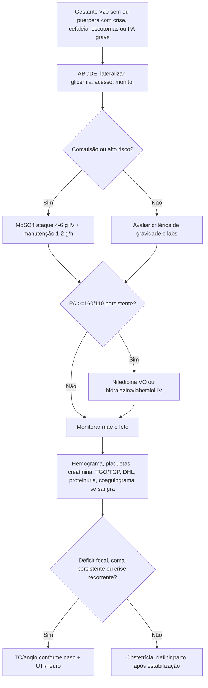
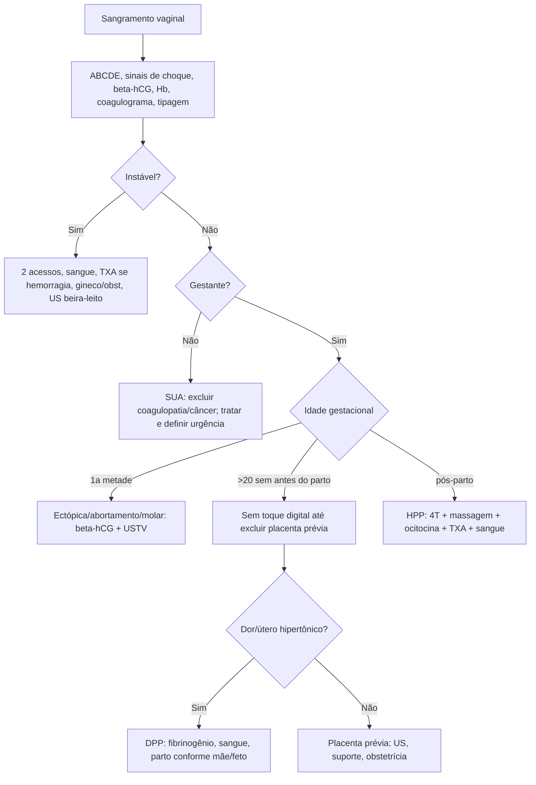

# Emergências obstétricas E Ginecológicas

## Leitura de 30 segundos

- Mulher em idade fertil com dor abdominal, síncope, choque ou sangramento vaginal: faça beta-hCG e pense em gravidez ectópica até provar o contrário.
- Gestante/puérpera com convulsão, cefaleia, escotomas, epigastralgia ou PA >=160/110: trate como pré-eclampsia grave/eclampsia com sulfato de magnésio e controle pressor, sem esperar proteinúria.
- Hemorragia pós-parto e pacote simultâneo: chamar ajuda, massagem uterina/bimanual se atonia, 2 acessos, protocolo transfusional, ocitocina, TXA precoce, procurar os 4 T e escalar para balão/cirurgia.
- Sangramento na segunda metade: placenta prévia e sangramento vivo indolor; DPP e dor, hipertonia uterina, sofrimento fetal e fibrinogênio baixo; não fazer toque vaginal antes de excluir placenta prévia.
- Gineco aguda de prova: DIP é diagnóstico clínico com baixo limiar para antibiótico; torção ovariana pode ter Doppler normal; violência sexual não exige boletim de ocorrência para atendimento.

## Por que cai

- **Recorrência em provas/estações:** TEME22-25 cobrou eclampsia/pré-eclampsia grave, cesárea perimortem/histerotomia de reanimação, hemorragia puérperal, SUA, violência sexual, DIP, prolapso de cordão, gravidez ectópica e DPP/fibrinogênio.
- **O que a banca costuma testar:** primeira conduta, droga de escolha, quando pedir TC na eclampsia, quando não tocar a gestante sangrando, quando operar/transferir, e qual exame/laboratório muda gravidade.
- **Como costuma aparecer:** caso com distrator "obstétrico" que não pode atrasar sala vermelha. A resposta costuma ser ABCDE + intervenção tempo-dependente, não uma investigação longa.

## Abordagem prática

### 1. Mulher em idade fertil na emergência

1. **Teste de gravidez cedo:** dor abdominal, síncope, choque, sangramento, vômitos persistentes, sepse, trauma, cefaleia/convulsão ou antes de medicação/procedimento relevante.
2. **Se instável:** sala vermelha, 2 acessos calibrosos ou IO, hemograma/coag/tipagem/prova cruzada, lactato/gaso, US beira-leito quando ajudar, gineco/obstetrícia e banco de sangue.
3. **Defina o eixo:** gestante? idade gestacional? primeira metade, segunda metade, parto/pós-parto ou não gestante?
4. **Evite o erro clássico:** em gestante com sangramento depois de 20 semanas, não faça toque vaginal digital antes de excluir placenta prévia.
5. **Feto importa, mas a mãe vem primeiro:** no trauma, choque, PCR, eclampsia e hemorragia, salvar perfusão/oxigenação materna é a melhor ressuscitação fetal.

### 2. Convulsão/PA alta na gestante ou puérpera

1. ABCDE, lateralizar, O2 se hipoxemia, aspirar secreção, glicemia, acesso, monitor, proteger via aérea se coma/aspiração/hipoxemia.
2. Se gestante >20 semanas ou puérpera com crise convulsiva: **sulfato de magnésio imediato.**
3. Se PA >=160/110 mmHg persistente: anti-hipertensivo de ação rápida, sem normalizar PA.
4. Coletar: hemograma/plaquetas, creatinina, TGO/TGP, DHL, bilirrubina, urina/proteinúria se possível, coagulograma se sangramento/HELLP.
5. Acionar obstetrícia/UTI/anestesia/neonatal. O tratamento definitivo da eclampsia e interrupção da gestação, depois de estabilizar a mãe.

> **Resposta de prova TEME:** convulsão em gestante/puérpera com pré-eclampsia = sulfato de magnésio. Benzodiazepínico e fenitoína não são primeira linha.
>
> **Na prática clínica:** se crise persiste apesar de MgSO4 adequado, faça dose adicional de 2 g e trate status epilepticus com suporte de via aérea/UTI e outro anticonvulsivante. Déficit focal, coma persistente ou convulsão recorrente pedem neuroimagem.

### 3. Sangramento vaginal: primeira metade

1. **Instável ou peritonite:** pense em ectópica rota, rotura de cisto, abortamento complicado; ressuscite e chame cirurgia/gineco.
2. **Beta-hCG + US transvaginal:** intrauterina? ectópica? sem saco? massa anexial? líquido livre?
3. **Ameaça de abortamento:** pouco sangramento, colo fechado, dor leve, vitalidade presente; orientação e seguimento.
4. **Abortamento inevitável/incompleto:** sangramento/cólica, colo aberto, restos; AMIU/curetagem ou misoprostol conforme idade gestacional, estabilidade e protocolo.
5. **Abortamento infectado:** febre, dor importante, secreção fétida, peritonite ou sepse; antibiótico EV amplo + esvaziamento uterino após estabilização.
6. **Ectópica:** dor + sangramento + atraso menstrual. Instável = cirurgia; estável selecionada = metotrexato e seguimento rigoroso.
7. **Molar:** sangramento + uterino maior que idade, hiperemese/hipertireoidismo/pré-eclampsia precoce, US em "tempestade de neve"; estabilizar e esvaziar por aspiração.

### 4. Sangramento vaginal: segunda metade

| Diagnóstico | Pistas | Conduta TEME |
|---|---|---|
| Placenta prévia | Sangramento vermelho vivo, indolor, útero relaxado | US antes de toque; suporte; obstetrícia; cesárea se instável/termo/sangramento importante |
| DPP | Dor, sangramento escuro, útero hipertônico, hipertensão/trauma, sofrimento fetal | Ressuscitar, coagulograma/fibrinogênio, parto conforme mãe/feto, sangue cedo |
| Rotura uterina | Dor súbito intensa, perda de estação fetal, BCF some, choque, cicatriz uterina | Laparotomia/cesárea imediata |
| Vasa prévia | Sangramento após rotura de membranas + sofrimento fetal | Cesarea emergencial |

**Fibrinogênio cai cedo no DPP/HPP grave.** Na prova, se pereuntarem qual exame se correlaciona com severidade, CIVD e transfusão no DPP, marque fibrinogênio.

### 5. Hemorragia pós-parto

Pense nos **4 T**:

- **Tone:** atonia uterina, causa mais comum.
- **Trauma:** laceracao cervical/vaginal/perineal, rotura uterina, hematoma.
- **Tissue:** placenta/restos retidos.
- **Thrombin:** coagulopatia, DPP, HELLP, anticoagulante, CIVD.

Conduta inicial:

1. Chamar obstetrícia/anestesia/enfermagem/banco de sangue; estimar perda e calcular índice de choque.
2. Massagem uterina se atonia; compressão bimanual se sangramento importante.
3. 2 acessos calibrosos, cristaloide aquecido com parcimonia, hemocomponentes cedo se choque/sangramento persistente.
4. Ocitocina e TXA precoce; não esperar resposta lenta se a paciente está sangrando.
5. Esvaziar bexiga; revisar canal de parto; procurar restos placentários; avaliar coagulopatia.
6. Se refratária: uterotônicos de segunda linha, balão intrauterino, suturas compressivas, embolização ou cirurgia/histerectomia.

> **Resposta de prova TEME:** atonia = útero flácido + sangramento pós-parto. A primeira manobra mecânica clássica e massagem/compressão uterina bimanual, associada a ocitocina e ressuscitação.
>
> **Atualização clínica:** OMS/FIGO/OPAS caminham para pacote simultâneo de primeira resposta: massagem uterina, uterotonico, TXA, fluidos IV, exame do trato genital e escalonamento. TXA deve ser precoce, idealmente até 3 h do parto.

### 6. Parto, RPM, trabalho prematuro e prolapso de cordão

- **Trabalho de parto prematuro:** contrações + modificação cervical antes de 37 semanas. Entre 24 e 34 semanas, tocolise por até 48 h pode ganhar tempo para corticoide/transferência se não houver contraindicação.
- **RPM:** perda de líquido antes do trabalho de parto. Diagnóstico por história + especular; evite toque digital repetido. Sinais de corioamnionite mudam tudo.
- **Prolapso de cordão:** cordão abaixo/apresentação, bradicardia fetal ou cordão palpável/visível. Elevar apresentação com mão, posição genupeitoral/Trendelenburg, evitar manipular cordão, chamar cesárea emergencial se feto viável.
- **HIV em trabalho de parto sem adesão/viral load desconhecida:** zidovudina IV e via de parto conforme obstetrícia/protocolo, mas prolapso de cordão é emergência obstétrica de cesárea.

### 7. Trauma e PCR na gestante

- Avaliação primária **focada na mãe**; feto sofre antes de a PA materna cair.
- Gestante pode mascarar choque por hipervolemia fisiológica; FC maior e PA menor podem confundir.
- Oxigenação, controle de hemorragia, pelve, eFAST, TXA quando indicado, hemocomponentes, evitar hipotermia.
- Deslocamento uterino manual para esquerda se útero acima do umbigo.
- Rh negativo com trauma abdominal: imunoglobulina anti-D idealmente até 72 h; teste de Kleihauer-Betke ajuda a quantificar hemorragia feto-materna.
- PCR gestante com útero no nível/acima do umbigo: RCP de alta qualidade, deslocamento uterino, via aérea antecipada, desfibrilação normal. Se sem RCE rápido, histerotomia de reanimação a partir de 4 min, nascimento em torno de 5 min.

### 8. Emergências ginecológicas não obstétricas

**Sangramento uterino anormal (SUA):**

1. Excluir gestação.
2. Instabilidade/anemia sintomática: ressuscitar, tipagem/prova cruzada, corrigir coagulopatia, gineco.
3. Tratamento pode incluir estrogênio IV, progestágeno, anticoncepcional combinado, AINE, TXA, tamponamento vaginal/uterino e procedimento conforme causa.
4. pós-menopausa, massa cervical, sangramento pós-coito, instabilidade, dor/peritonite ou suspeita de câncer = avaliação ginecológica urgente.

**Torção ovariana:**

- Dor unilateral intensa/intermitente + náuseas/vômitos; pode ocorrer com cisto/massa e em idade reprodutiva.
- US pode mostrar ovario aumentado, massa/cisto, líquido livre; **Doppler normal não exclui**.
- Diagnóstico definitivo e cirúrgico. Suspeita alta = gineco/centro cirúrgico, não alta por Doppler.

**DIP:**

- Dor pélvica/baixo ventre + dor a mobilização do colo, dor uterina ou anexial, corrimento/febre/dispareunia.
- Diagnóstico é clínico; imagem ajuda a excluir apendicite, ectópica e abscesso, mas não deve atrasar antibiótico.
- Internar se gravidez, abscesso tubo-ovariano, doença grave, vômitos/intolerância VO, falha em 72 h, impossibilidade de excluir emergência cirúrgica ou seguimento ruim.

**Miocardiopatia periparto:**

- Dispneia, ortopneia, edema, linhas B difusas, VE hipocinetico/dilatado no fim da gestação ou meses após parto.
- Fatores de risco: pré-eclampsia/hipertensão, idade materna avançada, multiparidade, gestação multipla, ascendencia africana, história prévia.
- Trate como IC aguda ajustada a gestação/lactacao: O2/VNI se necessário, diurético se congestão, vasodilatador se PA permite, UTI/cardio/obstetrícia.

### 9. Violência sexual

1. Atender primeiro: acolhimento, privacidade, consentimento, analgesia, tratar trauma, risco suicida e segurança.
2. **Boletim de ocorrência não é condição para atendimento.** Exame genital não deve ser forçado; exame físico completo e documentação cuidadosa.
3. Notificação compulsória em até 24 h pelo serviço de saúde.
4. Coletar exames e vestígios conforme tempo, consentimento e rede local, sem atrasar profilaxias.
5. Contracepção de emergência, PEP HIV se risco e até 72 h, profilaxia IST, hepatite B e HPV conforme status.

> **Resposta de prova TEME:** em vítima adolescente de violência sexual, levonorgestrel dose única é alternativa correta; BO não é indispensável; notificação não é "em até 72 h", e sim em até 24 h.
>
> **Na prática clínica:** siga fluxo local de violência sexual, preserve autonomia, evite revitimizar e acione rede psicossocial/proteção. Em menor de idade, há dimensões legais e tutelares obrigatórias.

## Conceitos que sustentam a conduta

### pré-eclampsia, eclampsia e HELLP

pré-eclampsia não é apenas PA + proteinúria. Hipertensão após 20 semanas com lesão de órgão-alvo também fecha gravidade: plaquetas baixas, creatinina alta, TGO/TGP elevadas, dor epigástrica/hipocôndrio direito, edema pulmonar, cefaleia persistente ou distúrbio visual. Eclampsia é crise convulsiva no contexto de pré-eclampsia, inclusive no pós-parto.

HELLP é hemólise, enzimas hepáticas elevadas e plaquetopenia. Dor epigástrica/hipocôndrio direito, náuseas, mal-estar e plaquetas baixas podem aparecer antes de crise. A conduta é estabilização materna, MgSO4 se grave/eclampsia/risco, controle pressor e parto conforme idade gestacional e gravidade.

### O que não esperar na eclampsia

Não espere proteinúria para tratar. Não espere obstetra para dar MgSO4. Não espere TC antes do anticonvulsivante se o quadro é típico. TC entra se crise persistente, déficit focal, coma prolongado, cefaleia explosiva, trauma, anticoagulação ou dúvida diagnóstica relevante.

### Por que fibrinogênio importa em DPP/HPP

Na gestação, fibrinogênio basal e alto. Um valor "normal baixo" para não gestante pode já ser preocupante na obstetrícia. DPP consome fibrinogênio e pode evoluir com CIVD; por isso fibrinogênio se correlaciona melhor com sangramento grave e necessidade transfusional que INR/plaquetas isolados.

### Por que Doppler normal não exclui torção ovariana

O ovário tem duplo suprimento arterial e a torção pode ser intermitente. Primeiro ocorre obstrução venosa/linfática, edema e congestão; fluxo arterial pode permanecer. Se história e exame gritam torção, a resposta segura é consulta cirúrgica.

## Fluxograma

### Gestante/Puérpera Com Convulsão Ou PA Grave

### Sangramento Vaginal Na Emergência

## Doses, alvos e números

### Hipertensão/eclampsia

| Item | Número | observação TEME |
|---|---:|---|
| PA grave na gestação/puerpério | >=160 sistolica ou >=110 diastolica | Tratar se persistente; não esperar lesão irreversível |
| Alvo após tratamento | manter <160/110; comum 140-150/90-100 | Evitar queda brusca e hipoperfusão placentaria/cerebral |
| MgSO4 ataque | 4-6 g IV em 15-20 min | Primeira linha na eclampsia |
| MgSO4 manutenção | 1-2 g/h IV | Manter conforme protocolo, geralmente até 24 h pós-parto/última crise |
| Nova crise em MgSO4 | 2 g IV adicional | Depois pensar UTI, neuroimagem e outro anticonvulsivante |
| Monitorar MgSO4 | FR >=12/min, reflexos presentes, diurese >=25-30 mL/h | Creatinina >1,3: reduzir dose/medir magnésio conforme MS |
| antídoto MgSO4 | Gluconato de cálcio 10%, 10 mL IV lento | Depressao respiratória, arreflexia ou toxicidade |
| Hidralazina | 5-10 mg IV, repetir em 20-30 min | opção se inconsciente/sem VO |
| Nifedipina IR | 10 mg VO, repetir conforme resposta | Não usar sublingual como rotina |
| Labetalol | 20 mg IV, depois 40/80 mg escalonado | Evitar em asma grave, IC, BAV/bradicardia |

### Hemorragia obstétrica

| Item | Número | observação TEME |
|---|---:|---|
| HPP clássica | >=500 mL vaginal, >=1000 mL cesárea ou qualquer sangramento com instabilidade | Na prova, clínica supera volume estimado |
| Índice de choque | FC/PAS >1 alerta; >1,4 sugere gravidade/transfusão maciça | TEME23 cobrou SI >1,4 |
| Ocitocina HPP | 10 UI IM ou 5 UI IV lento + 20-40 UI em 500 mL SF | Evitar bolus EV rápido de dose alta |
| TXA HPP | 1 g IV em 10 min, ideal até 3 h | Repetir 1 g se sangramento persiste/recorre conforme protocolo |
| Metilereometrina | 0,2 mg IM | Contraindicada em hipertensão/pré-eclampsia |
| Carboprost | 250 mcg IM a cada 15-90 min, max 2 mg | Contraindicado em asma |
| Misoprostol | 800-1000 mcg VO/SL/retal | Útil se sem acesso/uterotonico indisponivel |
| Fibrinogênio | <200 mg/dL grave; <300 já preocupa em obstetrícia | DPP/HPP: queda precoce e preditiva |

### Gineco/violência sexual

| Item | Número | observação TEME |
|---|---:|---|
| Metotrexato ectópica | 50 mg/m2 IM dose única | Só estável, sem hemoperitônio, massa <4 cm, sem BCF, beta-hCG baixo e seguimento |
| Abortamento infectado | Clindamicina 900 mg IV 8/8 h + gentamicina | Associar ampicilina/metronidazol conforme protocolo/sepse |
| DIP ambulatorial | Ceftriaxona 500 mg IM dose única + doxiciclina 100 mg 12/12 h 14 d + metronidazol 500 mg 12/12 h 14 d | CDC 2021; imagem não deve atrasar se clínica forte |
| Violência sexual: CE | Levonorgestrel 1,5 mg VO dose única | Preferir até 72 h; pode considerar até 120 h conforme MS |
| PEP HIV | iniciar o quanto antes, max 72 h; 28 dias | Não atrasar por exames pendentes |
| HBV violência sexual | Vacina + IGHAHB 0,06 mL/kg IM se não imunizada/incompleta | Ideal 24-48 h; max 14 dias |
| IST não virais violência sexual BR | Penicilina benzatina 2,4 mi UI IM + ceftriaxona 500 mg IM + azitro 1 g VO + metronidazol 2 g VO | Metronidazol pode ser postergado se CE/PEP; evitar 1º trimestre |

## Pegadinhas TEME

- **Eclampsia = diazepam/fenitoína primeiro:** errado. E MgSO4.
- **pré-eclampsia precisa sempre de proteinúria:** errado. Lesão de órgão-alvo basta.
- **PA 140/90 = cesárea imediata:** errado. Urgência e PA grave/LOA; parto depende de contexto.
- **Nitroprussiato e droga de escolha na pré-eclampsia grave:** errado. Use nifedipina, hidralazina ou labetalol.
- **TC antes de MgSO4 na eclampsia típica:** errado. TC é para déficit focal, coma/crise persistente ou dúvida.
- **Placenta prévia pode receber toque para avaliar dilatação:** armadilha. Primeiro US.
- **DPP depende de sangramento externo volumoso:** errado. Pode ser oculto e grave.
- **HPP e retenção placentaria como causa principal:** errado; causa mais comum e atonia uterina.
- **Ocitocina só EV:** errado. Pode ser IM, muito útil no APH/sem acesso.
- **Massagem uterina bimanual está em desuso:** errado na hemorragia por atonia.
- **Torção ovariana com Doppler normal excluída:** errado; até 60% podem ter fluxo.
- **DIP precisa imagem para diagnóstico:** errado; diagnóstico é clínico é tratamento empirico precoce.
- **Ectópica excluída por ausência de sangramento vaginal/estabilidade:** errado.
- **Violência sexual precisa BO para atendimento:** errado.
- **Notificação de violência sexual em 72 h:** errado; notificação compulsória em até 24 h.

## Erros fatais na prática

- Dar benzodiazepínico e esquecer MgSO4/controle pressor na eclampsia.
- Intubar eclâmptica sem tratar hipertensão grave, hipoxemia e risco de broncoaspiração.
- Fazer toque vaginal digital em sangramento de segunda metade sem excluir placenta prévia.
- Subestimar choque na gestante porque PAS ainda parece "aceitável".
- Tratar HPP em sequência lenta, esperando uma droga falhar antes de chamar ajuda/sangue.
- Fazer bolus rápido de grande dose de ocitocina EV e causar hipotensão.
- Dar metilereometrina para paciente hipertensa/pré-eclâmptica.
- Dar alta para dor pélvica com Doppler normal quando a história sugere torção.
- Esperar imagem/laboratório para iniciar antibiótico em DIP clínica com risco.
- Revitimizar paciente de violência sexual ou condicionar atendimento a boletim de ocorrência.

## Para prova vs na prática

> **Para prova TEME:** euarde respostas secas: eclampsia = MgSO4; HPP por atonia = massagem/compressão uterina + ocitocina; DPP grave = fibrinogênio; torção = cirurgia mesmo com Doppler normal; violência sexual = atendimento sem BO + levonorgestrel + profilaxias.
>
> **Na prática clínica:** use protocolos locais, obstetrícia e CI/UTI cedo. Muitas condutas obstétricas dependem de idade gestacional, vitalidade fetal, recurso neonatal, banco de sangue, disponibilidade de centro cirúrgico e desejo/consentimento da paciente.

> **Para prova TEME:** TXA aparece como 1 g EV e pode haver material antigo falando em repetir após 8 h.
>
> **Atualização clínica:** OMS/FIGO recomendam TXA precoce na HPP, idealmente até 3 h do parto, com segunda dose se sangramento persiste após 30 min ou recorre em até 24 h, conforme protocolo.

## Checklist de revisão

- [ ] Toda mulher em idade fertil com dor/sangramento/choque tem beta-hCG considerado.
- [ ] Sei diagnosticar eclampsia e dar MgSO4 antes de benzo/fenitoína.
- [ ] Sei tratar PA >=160/110 na gestação/puerpério.
- [ ] Sei quando pedir TC na eclampsia.
- [ ] Sei diferenciar placenta prévia, DPP, rotura uterina e vasa prévia.
- [ ] Sei os 4 T da HPP e o pacote inicial.
- [ ] Sei doses de MgSO4, hidralazina/nifedipina/labetalol, ocitocina e TXA.
- [ ] Sei critérios de ectópica para cirurgia vs metotrexato.
- [ ] Sei que DIP é clínica e que torção pode ter Doppler normal.
- [ ] Sei o fluxo mínimo de violência sexual: acolher, não exigir BO, notificar 24 h, CE/PEP/IST/HBV.

## Questões e estações relacionadas

- **TEME22 Q21:** doenças hipertensivas da gestação; MgSO4, TC se déficit neurológico e anti-hipertensivos corretos.
- **TEME22 Q82:** PCR gestante e cesárea/histerotomia perimortem após 4 min se PCR persiste.
- **TEME22 Q107:** HPP por atonia: útero flácido, sangramento e massagem/compressão uterina.
- **TEME22 Q109:** violência sexual; exame físico completo e lesões extragenitais.
- **TEME22 Q113:** SUA em não gestante e opções de manejo.
- **TEME23 Q7:** PCR em gestante, RCP otimizada, desfibrilação e histerotomia precoce.
- **TEME23 Q59:** hemorragia puérperal, shock index, ocitocina IM/EV e massagem uterina.
- **TEME23 Q84:** pré-eclampsia grave; trombocitopenia grave é indicação de parto; MgSO4 não é só após convulsão.
- **TEME23 Q92:** SUA não gestante é indicação de avaliação ginecológica emergencial.
- **TEME24 Q14:** PCR gestante 32 semanas, histerotomia de reanimação.
- **TEME24 Q18:** DIP clínica; dor a mobilização do colo e imagem para diferenciais/complicações.
- **TEME24 Q78:** prolapso de cordão em gestante termo; cesárea emergencial.
- **TEME24 Q96:** mulher em choque com líquido livre; pensar ectópica rota/hemoperitônio.
- **TEME25 Q2:** eclampsia com rebaixamento/risco de aspiração é indicação de via aérea sem atrasar MgSO4/PA.
- **TEME25 Q37:** eclampsia no 10o dia pós-parto; primeira conduta MgSO4.
- **TEME25 Q59-Q60:** violência sexual, levonorgestrel, notificação, HBV/IST/PEP.
- **TEME25 Q61:** miocárdiopatia periparto e fatores de risco.
- **TEME25 Q85:** DPP e fibrinogênio como marcador de gravidade/transfusão.
- **Emergency Talks:** Aulas 46, 51, 52, 57 e 58.

## Referências

**Prova/TEME**

- Conteúdo programático TEME26.
- Referências bibliográficas TEME26.
- Provas teóricas TEME22, TEME23, TEME24 e TEME25.
- Estações práticas TEME22-25.

**Material local**

- Emergency Talks: Aula 46 - Trauma em populações especiais I: idoso e gestante.
- Emergency Talks: Aula 51 - intercorrências da 1a metade da gestação.
- Emergency Talks: Aula 52 - intercorrências do parto e pós-parto.
- Emergency Talks: Aula 57 - Emergências ginecológicas.
- Emergency Talks: Aula 58 - intercorrências da 2a metade da gestação.
- Emergency Talks: Resumo do Emergency.docx.
- Emergency Talks: Adendos para complementar.docx.

**Atualização clínica**

- Ministério da Saúde. Manual de Gestação de Alto Risco, 2022: https://bvsms.saude.gov.br/bvs/publicacoes/manual_gestacao_alto_risco.pdf
- Ministério da Saúde. Violência sexual: https://www.gov.br/saude/pt-br/assuntos/saude-de-a-a-z/s/saude-da-mulher/saude-sexual-e-reprodutiva/violencia-sexual
- Ministério da Saúde. PEP pós-exposição ao HIV, ISTs e hepatites virais: https://www.gov.br/aids/pt-br/assuntos/prevencao-combinada/pep-profilaxia-pos-exposicao-ao-hiv
- Ministério da Saúde. PCDT Atenção Integral as Pessoas com IST, seção violência sexual: https://bvsms.saude.gov.br/bvs/publicacoes/protocolo_clinico_diretrizes_terapeutica_atencao_integral_pessoas_infeccoes_sexualmente_transmissiveis.pdf
- Hospital das Clínicas UFMG/Ebserh. Protocolo Hemorragia Pós-parto, 2024: https://www.gov.br/hubrasil/pt-br/hospitais-universitarios/regiao-sudeste/hc-ufmg/saude/protocolos-assistenciais-hc-ufmg-ebserh/PRT_UMUL_380_Hemorragia_posparto_V01.pdf
- WHO. Recommendations on assessment of postpartum blood loss and treatment bundle for postpartum haemorrhage, 2023: https://www.who.int/publications/i/item/9789240085398
- CDC. Pelvic Inflammatory Disease, STI Treatment Guidelines: https://www.cdc.gov/std/treatment-guidelines/pid.htm
- CDC. Sexual Assault and Abuse and STIs, STI Treatment Guidelines: https://www.cdc.gov/std/treatment-guidelines/sexual-assault-adults.htm
- CDC. Nonoccupational HIV Postexposure Prophylaxis Recommendations, 2025: https://www.cdc.gov/mmwr/volumes/74/rr/rr7401a1.htm
