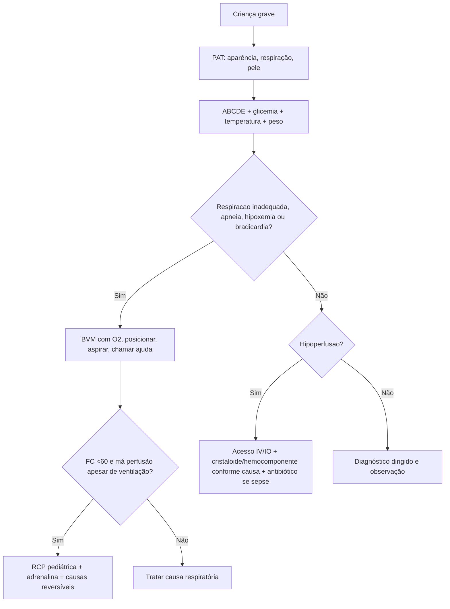
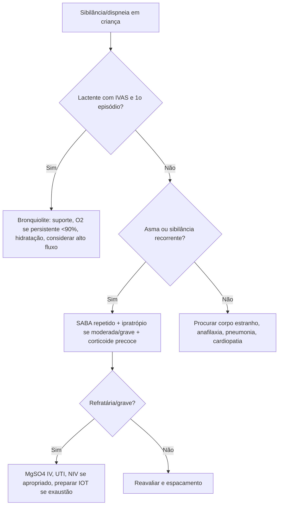
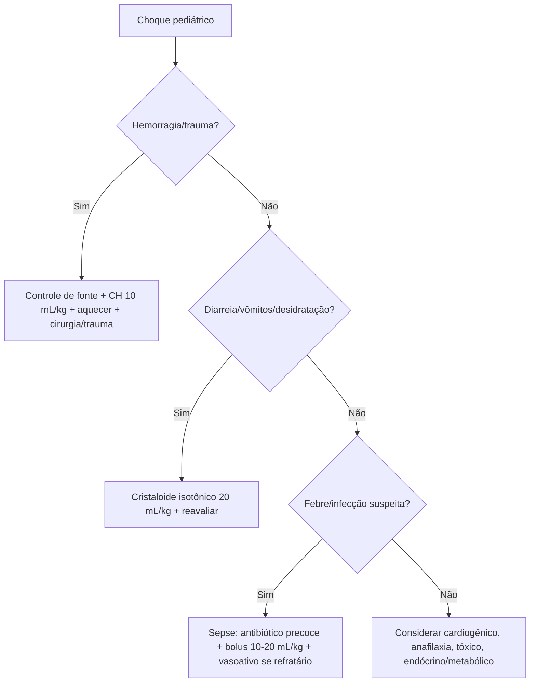

# Emergências pediátricas

## Leitura de 30 segundos

- Criança grave não avisa com hipotensão cedo. Letargia, TEC prolongado, extremidade fria, pulso ruim, taquipneia e taquicardia são choque até prova em contrário.
- Parada pediátrica costuma ser respiratória. Se a criança está bradicárdica, hipóxica ou exausta, ventile bem antes de procurar Explicação rara.
- Bronquiolite e suporte; asma grave e SABA + ipratrópio + corticoide precoce + MgSO4 se refratária. Intubação em asma é último recurso, com ventilação protetora contra auto-PEEP.
- Choque hipovolêmico/desidratação em prova TEME: cristaloide isotônico 20 mL/kg e reavaliação. Sepse atual: bolus de 10-20 mL/kg, reavaliar a cada etapa e vasoativo cedo se refratário.
- Trauma pediátrico: PECARN para TCE, imagem cervical com critério pediátrico, FAST tem menor sensibilidade, concentrado de hemácias 10 mL/kg se hemorragia.
- Estação prática pediátrica premia o simples: glicemia capilar, oxigênio, aquecer, estimular, acesso IV/IO, reconhecer toxíndrome e usar dose por peso.

## Por que cai

- **Recorrência em provas/estações:** TEME22-25 cobrou choque hipovolêmico/desidratação, via aérea pediátrica, succinilcolina e trismo, bronquiolite com bradicardia, asma grave, exantemas, síndrome do choque tóxico, trauma pediátrico, FAST negativo, PECARN, imagem cervical e intoxicação por "chumbinho".
- **O que a banca costuma testar:** primeira conduta, diferença entre criança compensada e descompensada, ventilação antes de atropina, bolus em mL/kg, TOT por idade, critérios de imagem é tratamento de doenças respiratórias comuns.
- **Como costuma aparecer:** caso curto com sinais vitais que parecem "quase normais". O candidato aprovado reconhece gravidade por perfusão, consciência e trabalho respiratório, não apenas por PA.

## Abordagem prática

### 1. Primeiro minuto da criança grave

1. **Triâneulo de avaliação pediátrica:** aparência, trabalho respiratório e circulação da pele. Criança quieta, sonolenta, pálida/cianótica/moteada ou com gemência/retrações entra direto na sala vermelha.
2. **ABCDE com duas medidas obrigatórias:** glicemia capilar e temperatura. Hipoglicemia e hipotermia mudam consciência, perfusão e prognóstico.
3. **Peso estimado cedo:** fita, comprimento, peso informado ou formula local. Toda droga e fluido depende disso.
4. **Monitor, O2, acesso:** se IV não sai rápido, intraosseo. Em choque/convulsão/parada, IO e via definitiva, não "plano B vereonhoso".
5. **Reavaliar depois de cada intervenção:** FC, FR, SatO2, PA, TEC, pulso, ausculta, hepatomegalia, diurese e nível de consciência.

> **Resposta de prova TEME:** na estação pediátrica de 2025, a sequência pontuava glicemia capilar, oxigênio, aquecer, estimular e acesso venoso periférico.
>
> **Na prática clínica:** se a criança está em choque ou convulsão e o IV falhou em 60-90 s ou 2 tentativas, faça IO sem perder tempo.

### 2. Desconforto respiratório e insuficiência respiratória

Classifique rápido:

- **Sem comando/drive:** TCE, intoxicação, pós-ictal, hipoglicemia, lesão medular, fraqueza neuromuscular.
- **Obstrução alta:** crupe, epiglotite, corpo estranho, anafilaxia, edema de via aérea.
- **Obstrução baixa:** bronquiolite, asma, corpo estranho bronquico.
- **Parênquima/difusao:** pneumonia, edema pulmonar, SDRA, sepse.

Conduta inicial:

1. Posicionar, aspirar secreção, abrir via aérea e dar O2.
2. Se esforço ineficaz, apneia, rebaixamento ou bradicardia: **ventilação com bolsa-valvula-máscara e O2.**
3. Se falha de BVM, proteção de via aérea ou exaustão: chamar ajuda para via aérea avançada.
4. Depois de estabilizar, trate a causa provável.

### 3. Bronquiolite

- Lactente, IVAS viral, piora entre dias 2-5, taquipneia, retrações, sibilos/crepitantes, dificuldade de mamar.
- Avalie gravidade por apneia, exaustão, hipoxemia persistente, desidratação, idade pequena, prematuridade, cardiopatia ou pneumopatia.
- Tratamento: aspiração nasal se secreção, hidratação, O2 se hipoxemia persistente, considerar cateter nasal de alto fluxo/CPAP se trabalho respiratório importante.
- Não pedir RX/labs de rotina se quadro típico e estável.

> **Resposta de prova TEME:** lactente com bronquiolite, SatO2 70%, inconsciente e FC 48 precisa de ventilação com pressão positiva e O2; se FC segue <60 com má perfusão apesar de ventilação, iniciar compressão.
>
> **Atualização clínica:** AAP/NICE recomendam não usar salbutamol, adrenalina, corticoide, antibiótico ou RX de rotina na bronquiolite típica. Um teste de broncodilatador pode aparecer em protocolos locais para criança maior/atópica, mas não é tratamento padrão do lactente clássico.

### 4. Crupe, anafilaxia e corpo estranho

**Crupe:**

- Tosse ladrante, rouquidão, estridor, piora noturna, geralmente após IVAS.
- Manter criança calma, evitar procedimentos desnecessários.
- Dexametasona para todos os quadros relevantes; adrenalina nebulizada se estridor em repouso/moderado-grave; observar 2-4 h após adrenalina.

**Anafilaxia:**

- Exposição possível + pele/mucosa, respiratório, hipotensão/síncope ou gastrointestinal agudo.
- Primeira droga é adrenalina IM na face anterolateral da coxa. Anti-H1, beta-2 e corticoide são adjuvantes, não substituem adrenalina.
- Choque: cristaloide 20 mL/kg e repetir conforme resposta.

**Corpo estranho:**

- Tosse/engasgo abrupto, assimetria auscultatoria ou estridor.
- Se tosse efetiva: estimular tosse e monitorar.
- Se obstrução grave: manobras de desobstrução por idade; se inconsciente, RCP e olhar boca antes de ventilar.

### 5. Asma aguda grave

1. O2 para hipoxemia, monitor e gravidade por fala, tiragem, SatO2, ausculta, consciência e fadiga.
2. Salbutamol inalatorio em doses repetidas na primeira hora.
3. Ipratrópio nas crises moderadas/graves na primeira hora.
4. Corticoide sistêmico precoce, de preferencia VO se tolerar.
5. Se grave/refratária: MgSO4 IV, considerar NIV se colaborativa, chamar UTI.
6. Intubar se exaustão, rebaixamento, hipoxemia persistente, parada iminente, silêncio auscultatório ou hipercapnia progressiva com fadiga.

Pontos de ventilação pós-IOT na asma:

- Baixa frequência respiratória, tempo expiratório longo, permissão de hipercapnia se pH aceitável.
- Evitar empilhar volume: auto-PEEP mata.
- Sedação profunda; ketamina pode ajudar pela broncodilatacao.

> **Resposta de prova TEME:** MgSO4 em asma grave pediátrica pode ser feito 50-75 mg/kg EV em 20 min quando indicado; não precisa esperar magnesemia normal para usar. Adrenalina/terbutalina não são rotina na asma, salvo anafilaxia ou protocolo específico.
>
> **Na prática clínica:** muitos protocolos usam MgSO4 25-50 mg/kg, max 2 g. Use protocolo local, mas a lógica de prova é "asma grave refratária = magnésio".

### 6. Pneumonia e sepse respiratória

- Criança toxemiada, hipoxêmica, com tiragem, incapaz de beber, vomitando tudo, convulsão, gemência, saturação baixa ou com comorbidade merece sala vermelha/observação.
- Primeira conduta: O2, acesso, glicemia, antitérmico/analgesia, hidratação cuidadosa, antibiótico quando suspeita bacteriana/sepse e imagem depois de estabilizar se necessaria.
- Não intube pneumonia só porque há febre e taquipneia; intube se falência ventilatória/oxigenatória, rebaixamento, choque refratário ou exaustão.

### 7. Choque, desidratação e sepse

Choque em criança e hipoperfusão, não hipotensão. Procure:

- Estado mental alterado, irritabilidade ou letargia.
- TEC >2-3 s, extremidades frias, pele marmórea, pulso fino ou diferencial central/periférico.
- Taquicardia persistente, taquipneia, oligúria.
- Hipotensão e bradicardia: sinais tardios.

Conduta:

1. ABCDE, O2, monitor, glicemia, temperatura, acesso IV/IO.
2. Se hipovolemia/desidratação com choque: cristaloide isotônico 20 mL/kg e reavaliar.
3. Se sepse/choque séptico: antibiótico precoce, culturas se não atrasarem, bolus de 10-20 mL/kg, reavaliar sobrecarga, perfusão e pulmão.
4. Se choque refratário a fluidos ou risco de sobrecarga: vasoativo cedo, inclusive periférico/IO enquanto obtém acesso melhor.
5. Se sangramento/trauma: hemocomponente cedo, aquecer, TXA quando indicado por protocolo de trauma, controle de fonte.

> **Resposta de prova TEME:** lactente com diarreia, vômitos, TEC 3-4 s, PA baixa e sonolência = choque hipovolêmico; tratamento inicial = SF 0,9% 20 mL/kg.
>
> **Atualização clínica:** em sepse pediátrica, diretrizes atuais favorecem bolus menores de 10-20 mL/kg, guiados por reavaliação frequente, com limite e vasoativo precoce se não melhorar. Em desidratação hipovolêmica clássica, a banca ainda cobra 20 mL/kg.

### 8. Convulsão, crise febril e status epilepticus

**Crise em andamento:**

1. ABC, lateralizar, aspirar se necessário, O2 se hipoxemia, glicemia capilar.
2. Se >5 min ou crise repetida sem recuperar: benzodiazepínico.
3. Pode repetir benzodiazepínico uma vez; depois, segunda linha sem atrasar.
4. refratário: UTI, via aérea, anestésico e EEG quando disponível.

**Crise febril simples:**

- 6 meses a 5 anos, generalizada, <15 min, única em 24 h, criança volta ao basal e não há infecção do SNC.
- Tratamento e procurar causa da febre, antitérmico para conforto e orientação familiar.
- Não fazer CT, EEG, anticonvulsivante crônico ou punções/exames extensos de rotina se criança bem, vacinada e sem sinais de menineite.

**Red flags:**

- <6 meses ou >5 anos, crise focal, >15 min, repetida em 24 h, déficit persistente, menineismo, petéquias/púrpura, imunossupressão, trauma, rebaixamento prolongado, fontanela abaulada ou antibiótico prévio com suspeita de menineite.

### 9. DKA, hipoglicemia e distúrbios metabólicos

**Hipoglicemia:** sempre medir em criança rebaixada, convulsionando, hipotermica, séptica, intoxicada ou lactente que não mama.

**Cetoacidose diabetica:**

- Suspeite em vômitos, dor abdominal, Kussmaul, desidratação, perda de peso, poliuria/polidipsia ou rebaixamento.
- ABCDE, glicemia, cetona, gasometria, eletritos, potássio e ECG se grave.
- Fluido inicial se choque/desidratação importante, insulina IV sem bolus depois de iniciar fluido e conhecer potássio.
- Repor potássio conforme K e diurese.
- Edema cerebral: cefaleia, bradicardia, hipertensão, queda do nível de consciência, vômitos recorrentes. Tratar com salina hipertônica ou manitol e UTI.

> **Pegada de prova:** não dar bolus de insulina na DKA pediátrica e não corrigir bicarbonato de rotina.

### 10. Trauma pediátrico

1. **XABCDE com controle térmico:** criança perde calor fácil; hipoglicemia também confunde choque e TCE.
2. **Via aérea:** língua proporcionalmente maior, epiglote maior/floppy, occipital proeminente. Pequenos muitas vezes precisam coxim sob ombros, não sob a cabeça.
3. **TCE:** evitar hipóxia e hipotensão. IOT se GCS <=8, proteger cervical, cabeceira elevada quando possível.
4. **Hernia cerebral:** salina hipertônica 3% 2-5 mL/kg ou manitol 0,5-1 g/kg.
5. **Imagem de crânio:** use PECARN em TCE leve. Na estação TEME24, a banca queria TC de crânio e citar PECARN.
6. **Coluna cervical:** regra de adulto não resolve tudo em criança. Na estação TEME24, a banca queria radiografia cervical, não TC cervical/coluna total.
7. **Abdome:** FAST tem menor sensibilidade em crianças. FAST negativo não exclui abdome, pelve, retroperitônio, ossos longos ou sangramento externo.
8. **Hemorragia:** concentrado de hemácias 10 mL/kg; pensar em protocolo maciço quando necessidade >40 mL/kg em adolescente ou >50 mL/kg em criança/bebê.

> **Resposta de prova TEME:** criança atropelada, perfusão ruim e FAST negativo ainda pode estar em choque hemorrágico. Não tranquilize pelo FAST. Procure abdômen, pelve, retroperitônio, membros e sangramento externo.

### 11. Queimaduras e maus-tratos

1. ABCDE, retirar roupas/adornos, interromper queimadura, analgesia forte, cobrir com campo limpo e seco, aquecer a criança.
2. Suspeite lesão inalatória se queimadura facial, vibrissas chamuscadas, fuligem, rouquidão, estridor, queimadura em ambiente fechado ou rebaixamento.
3. Estimar SCQ com tabela pediátrica/Lund-Browder quando disponível. Cabeça pesa mais em lactentes; regra dos 9 do adulto erra.
4. Queimadura extensa: cristaloide aquecido conforme protocolo de queimados + manutenção com glicose em crianças pequenas; titule por perfusão e diurese.
5. Procurar hipotermia, hipoglicemia, intoxicação por CO/cianeto em incêndio e trauma associado.
6. Transferir cedo se queimadura profunda/extensa, face/mãos/pés/genital/períneo/articulações, elétrica/quimica, inalatória, comorbidade, maus-tratos ou recurso local insuficiente.

Red flags de maus-tratos: história incompatível com desenvolvimento, demora em procurar atendimento, lesões em diferentes idades, queimadura por imersão com borda nítida, marcas de objeto, fraturas inexplicadas, lesões em orelha/pescoço/tronco ou cuidador muda historia.

### 12. Exantemas, Kawasaki e choque tóxico

| Diagnóstico | Pistas | Conduta de prova/prática |
|---|---|---|
| Exantema súbito | Lactente, febre alta 3-5 dias, rash depois da defervescencia | Suporte; pode ter crise febril |
| Escarlatina | Farineite, febre, língua em framboesa, rash em lixa, linhas de Pastia | Penicilina/amoxicilina; prevenir febre reumatica |
| Eritema infeccioso | "Face esbofeteada", rash rendilhado, parvovirus B19 | Suporte; cuidado em gestante, hemólise e imunossupressão |
| Mão-pe-boca | Vesiculas orais, mãos e pes, Coxsackie/enterovirus | Suporte e hidratação; avaliar desidratação |
| Sarampo | Febre, tosse, coriza, conjuntivite, Koplik, rash cefalocaudal | Isolamento respiratório/aerossol, notificar, suporte/vitamina A conforme protocolo |
| Kawasaki | Febre >=5 dias + conjuntivite, mucosa oral, rash, extremidades, linfonodo | IVIG + AAS e ecocardiograma; considerar incompleto |
| Choque tóxico | Febre, hipotensão, rash/descamação, GI/mucosa, disfunção orgânica | Ressuscitação, vasopressor, clindamicina + cobertura staph/strep e controle de foco |

> **Resposta de prova TEME:** criança com febre, hipotensão, língua em framboesa, rash difuso/descamativo e disfunção inflamatoria pode ser síndrome do choque tóxico estafilococico/estreptococico, não apenas escarlatina simples.

### 13. Intoxicações e animais peçonhentos em criança

- Criança com rebaixamento, miose, sialorreia, broncorreia, vômitos/diarreia, bradicardia ou fasciculações: pense em organofosforado/carbamato, inclusive "chumbinho".
- Conduta inicial de estação: EPI, ABCDE, glicemia, O2, aspiração, acesso, monitor, descontaminação segura quando indicada, contato com CIATox.
- Atropina e para sinais muscarínicos graves, principalmente broncorreia/broncoespasmo/bradicardia/choque.
- Escorpionismo em criança pode evoluir com vômitos, sudorese, taquicardia, hipertensão/choque e edema pulmonar; classificar gravidade e indicar soro quando moderado/grave conforme protocolo.

> **Resposta de prova TEME25:** diante do "pote de chumbinho", identificar carbamato/aldicarb e fazer atropina EV em bolus; a estação pontuava atropina 0,5 mg.

## Conceitos que sustentam a conduta

### Criança compensa até despencar

A criança aumenta FC e resistência vascular para manter PA. Por isso, PA normal não exclui choque. Quando aparece hipotensão, já houve perda de reserva. O exame de perfusão, a consciência e a tendência dos sinais vitais importam mais que um único número.

### Respiratório vem antes do circulatório em muitas paradas pediátricas

Hipoxia leva a bradicardia, má perfusão e PCR. Em bronquiolite grave, pneumonia, asma e intoxicação, a primeira intervenção que salva pode ser uma BVM bem feita. Atropina sem corrigir ventilação é uma armadilha.

### Bronquiolite mudou mais que os slides antigos

Muitos cursos ainda mostram salbutamol, salina hipertônica ou corticoide em aleoritmos antigos. A resposta atual para lactente típico é suporte: nariz, hidratação, oxigenação e ventilação não invasiva/invasiva se falência. A exceção é a criança maior com fenótipo de sibilância recorrente/asma, onde um teste de broncodilatador pode ser razoável.

### Trauma pediátrico exige humildade com imagem

FAST negativo não "limpa" abdome pediátrico. PECARN ajuda a reduzir TC desnecessária no TCE leve, mas criança instável, rebaixada, com déficit, sinais de fratura ou mecanismo de alto risco sai do modo calculadora e entra no modo trauma.

## Fluxograma

## Doses, alvos e números

| Item | Número | observação TEME |
|---|---:|---|
| PA sistolica minima 1-10 anos | 70 + 2 x idade | Hipotensão e tardia; não espere PA cair para chamar choque |
| Cristaloide no choque hipovolêmico/desidratação | 20 mL/kg | TEME22/23 cobrou SF 0,9% 20 mL/kg |
| Bolus em sepse pediátrica atual | 10-20 mL/kg por bolus | Reavaliar perfusão e sobrecarga; vasoativo cedo se refratário |
| Concentrado de hemácias no trauma | 10 mL/kg | Estação TEME24 |
| Transfusão maciça pediátrica | >40 mL/kg adolescente; >50 mL/kg criança/bebê | Associar plasma/plaquetas conforme protocolo |
| Glicose hipoglicemia | D10 5 mL/kg | Lactente/neonato pode usar D10 2-3 mL/kg conforme protocolo |
| Adrenalina anafilaxia IM | 0,01 mg/kg de 1 mg/mL | Max 0,3 mg prepubere; 0,5 mg adolescente; repetir 5-15 min |
| Fluido na anafilaxia com choque | 20 mL/kg | Repetir conforme resposta |
| Salbutamol MDI asma | 4-10 jatos a cada 20 min x 3 | Usar espacador; depois espaciar conforme resposta |
| Salbutamol nebulizado | 2,5-5 mg/dose | Pode ser contínuo em UTI/sala vermelha conforme protocolo |
| Ipratrópio asma moderada/grave | 250-500 mcg a cada 20 min x 3 | Melhor benefício na primeira hora |
| Prednisolona asma | 1-2 mg/kg/dia | Max usual 40-60 mg; VO se possível |
| Dexametasona crupe | 0,6 mg/kg dose única | VO/IM/EV; doses menores existem em protocolos |
| Adrenalina nebulizada crupe | L-adrenalina 1 mg/mL: 0,5 mL/kg, max 5 mL | Ou racemica 2,25% 0,5 mL; observar 2-4 h |
| MgSO4 asma grave | 50 mg/kg EV em 20 min | TEME25 aceita 50-75 mg/kg; max usual 2 g |
| Midazolam crise convulsiva | 0,2 mg/kg IN/IM/bucal ou 0,1 mg/kg EV | Repetir uma vez se necessário |
| Diazepam crise convulsiva | 0,2 mg/kg EV ou 0,5 mg/kg retal | Cuidado com depressão respiratória |
| Levetiracetam status | 40-60 mg/kg EV | Alternativa de segunda linha |
| Fenitoína/fosfenitoina | 20 mg/kg EV ou 20 mg PE/kg | Monitorar ECG/PA; não misturar com SG |
| Insulina na DKA pediátrica | 0,05-0,1 U/kg/h EV | Sem bolus; após fluido inicial e avaliação do K |
| Salina hipertônica 3% no TCE/HIC | 2-5 mL/kg | Herniação ou edema cerebral |
| Manitol no TCE/HIC | 0,5-1 g/kg | Se hemodinamicamente tolerado |
| TOT sem cuff | idade/4 + 4 | Formula clássica |
| TOT com cuff | idade/4 + 3,5 | Confirmar por capnografia e ausculta |
| Profundidade oral do TOT | 3 x diâmetro interno | Ex: TOT 5,5 -> cerca de 16,5 cm |
| Estação TEME24 TOT | 5,5 | Criança do caso prático |
| Ventilação com pulso/avançada PALS 2025 | 20-30/min | Evitar hiper e hipoventilação |
| RCP pediátrica | 30:2 um socorrista; 15:2 dois | Com via aérea avançada, compressões continuas + ventilações |
| Bradicardia com má perfusão | FC <60 após O2/ventilação | Iniciar compressão |
| Desfibrilacao pediátrica | 2 J/kg, depois 4 J/kg | Seguir algoritmo PALS |
| Adrenalina na PCR | 0,01 mg/kg EV/IO | 0,1 mL/kg da solução 0,1 mg/mL, a cada 3-5 min |
| Diurese alvo em criança queimada/choque | >=1 mL/kg/h | Em queimadura, associar manutenção com glicose em crianças pequenas |

Sinais vitais aproximados para não cair em "normal para idade":

| Idade | FR | FC | PAS aproximada |
|---|---:|---:|---:|
| 0-1 mes | 30-60 | 110-180 | 50-70 |
| 1 mes-1 ano | 25-50 | 100-160 | 70-95 |
| 1-3 anos | 20-30 | 90-150 | 80-100 |
| 3-6 anos | 20-25 | 80-140 | 80-100 |
| 6-12 anos | 15-20 | 70-120 | 80-110 |
| 12-18 anos | 12-16 | 60-100 | 90-110 |

## Pegadinhas TEME

- **"PA normal, então não é choque":** falso. Choque pediátrico e perfusão ruim; hipotensão e tardia.
- **"Bronquiolite grave com FC 48: atropina primeiro":** falso. É hipóxia até prova em contrário; ventile com O2.
- **"Bronquiolite sempre melhora com salbutamol/corticoide":** falso na prática atual. Suporte é o padrão.
- **"Asma com silêncio auscultatório está melhorando":** falso. Pode ser falência ventilatória.
- **"CO2 normal em asma grave tranquiliza":** cuidado. Em criança exausta, normalizar/subir CO2 e mau sinal.
- **"Crise febril simples pede TC/EEG/anticonvulsivante":** falso.
- **"FAST negativo exclui lesão abdominal":** falso, especialmente em criança.
- **"NEXUS/Canadian C-spine resolvem cervical pediátrica":** cuidado. TEME24 cobrou imagem cervical pediátrica e radiografia.
- **"Masseter travou após IOT: foi rocurônio":** TEME23 apontou succinilcolina; lembrar hipertermia maligna/trismo.
- **"Kawasaki e escarlatina são iguais porque tem língua em framboesa":** falso. Kawasaki tem febre persistente, conjuntivite, extremidades, linfonodo, risco coronariano e precisa IVIG/eco.
- **"Chumbinho e sempre organofosforado":** no Brasil, frequentemente carbamato/aldicarb; trate toxíndrome colinérgico com atropina se muscarínico grave.

## Erros fatais na prática

- Não ventilar uma criança bradicárdica e hipóxica porque está tentando pegar acesso.
- Dar varios bolus sem reavaliar hepatomegalia, estertores, perfusão e estado mental.
- Intubar asma grave e ventilar com frequência alta, causando auto-PEEP e PCR.
- Alta de lactente com bronquiolite que não mama, faz apneia, dessatura persistente ou está exausto.
- Tratar anafilaxia com corticoide/anti-histamínico antes de adrenalina IM.
- Esquecer glicemia em convulsão, choque, rebaixamento ou hipotermia.
- Confiar em FAST negativo em criança instável por trauma.
- Não aquecer criança traumatizada/queimada/choque, piorando coagulopatia e acidose.
- Usar dose de adulto "aproximada" sem peso estimado em droga de alto risco.

## Para prova vs na prática

> **Para prova TEME:** desidratação grave/choque hipovolêmico = SF 0,9% 20 mL/kg; bronquiolite com bradicardia/hipoxemia = ventilação com pressão positiva; trauma pediátrico = PECARN, radiografia cervical na estação, TOT 5,5, CH 10 mL/kg e FAST com menor sensibilidade.
>
> **Na prática clínica:** em sepse, faça bolus de 10-20 mL/kg com reavaliação estreita e comece vasoativo cedo se refratário; em bronquiolite típica, evite broncodilatador/corticoide/antibiótico de rotina; em asma grave, MgSO4 e suporte ventilatório devem seguir protocolo local e experiência da equipe.

## Checklist de revisão

- [ ] Sei reconhecer criança grave pelo triâneulo de avaliação pediátrica.
- [ ] Sei que hipotensão e bradicardia são sinais tardios.
- [ ] Sei ventilar primeiro na bronquiolite grave/bradicardia hipóxica.
- [ ] Sei diferenciar bronquiolite, crupe, anafilaxia, corpo estranho e asma.
- [ ] Sei as doses: bolus 20 mL/kg, sepsis 10-20 mL/kg, CH 10 mL/kg, adrenalina IM 0,01 mg/kg, MgSO4, midazolam e D10.
- [ ] Sei quando tratar crise febril simples sem excesso de exames.
- [ ] Sei que DKA pediátrica não recebe bolus de insulina.
- [ ] Sei conduzir queimadura pediátrica inicial com aquecimento, analgesia, SCQ pediátrica, manutenção com glicose e diurese alvo.
- [ ] Sei usar PECARN e não confiar no FAST negativo.
- [ ] Sei as pistas de Kawasaki, sarampo, escarlatina, exantema súbito e choque tóxico.
- [ ] Sei a conduta da estação de chumbinho: ABCDE, glicemia/O2/aquecer/estimular/acesso, carbamato/aldicarb e atropina EV se toxíndrome colinérgico.

## Questões e estações relacionadas

- **TEME22 Q12-13:** lactente com diarreia/vômitos, choque hipovolêmico e SF 0,9% 20 mL/kg.
- **TEME23 Q14:** particularidades de via aérea pediátrica; lâmina reta pode elevar epiglote; criança pequena pode precisar coxim sob ombros; máscara laríngea não é proibida só por idade <2 anos.
- **TEME23 Q16:** espasmo de masseter após medicação de IOT associado a succinilcolina.
- **TEME23 Q17:** febre, hipotensão, rash/língua em framboesa e inflamação sistêmica = síndrome do choque tóxico.
- **TEME23 Q50-51:** choque hipovolêmico/desidratação e cristaloide 20 mL/kg.
- **TEME24 Q15:** bronquiolite com rebaixamento, SatO2 70% e FC 48: ventilação com pressão positiva e O2; compressão se FC <60 persistir com má perfusão.
- **TEME24 Q16/Q38:** asma grave pediátrica, corticoide, MgSO4 e indicações de via aérea.
- **TEME24 Q32:** exantemas, especialmente exantema súbito/HHV6-7.
- **TEME24 Q95:** fatores de risco para imagem cervical pediátrica.
- **TEME24 Estação I:** trauma pediátrico: TC crânio/PECARN, radiografia cervical, TOT 5,5, CH 10 mL/kg, FAST menos sensível e fontes ocultas de choque.
- **TEME25 Estação Ped:** "chumbinho": glicemia, O2, aquecer, estimular, acesso; carbamato/aldicarb; atropina 0,5 mg EV em bolus.
- **TEME25 Q39:** trauma pediátrico com perfusão ruim e FAST negativo; não excluir choque/lesão oculta.

## Referências

**Prova/TEME**

- Conteúdo programático TEME26.
- Provas teóricas TEME22, TEME23, TEME24 e TEME25.
- Estações práticas TEME24 e TEME25.
- Referências oficiais do edital: Tratado ABRAMEDE 2024, Manual de Via aérea 2025 e materiais correlatos de emergência pediátrica/trauma/reanimação.

**Material local**

- Emergency Talks: Aula 30 - Emergências pediátricas I.
- Emergency Talks: Aula 43 - Emergências pediátricas II - respiratórias.
- Emergency Talks: Aula 49 - Trauma em populações especiais II - Pediátrico.
- Resumo do Emergency.docx.
- Adendos para complementar.docx.

**Atualização clínica**

- American Heart Association/American Academy of Pediatrics. Pediatric Basic Life Support: 2025 Guidelines. https://publications.aap.org/pediatrics/article/157/1/e2025074350/205235/Part-6-Pediatric-Basic-Life-Support-2025-American
- American Heart Association/American Academy of Pediatrics. Pediatric Advanced Life Support: 2025 Guidelines. https://cpr.heart.org/en/resuscitation-science/cpr-and-ecc-guidelines/pediatric-advanced-life-support
- Survivine Sepsis Campaign. International Guidelines for the Management of Septic Shock and Sepsis-Associated Organ Dysfunction in Children, 2020. https://www.sccm.org/survivingsepsiscampaign/guidelines-and-resources/surviving-sepsis-campaign-pediatric-guidelines
- American Academy of Pediatrics. Clinical Practice Guideline: The Diagnosis, Management, and Prevention of Bronchiolitis. https://publications.aap.org/pediatrics/article/134/5/e1474/75848/Clinical-Practice-Guideline-The-Diagnosis
- NICE NG9. Bronchiolitis in children: diagnosis and management. https://www.nice.org.uk/guidance/ng9/chapter/Recommendations
- Global Initiative for Asthma. 2025 GINA Summary Guide/Report. https://ginasthma.org/2025-gina-summary-guide/
- Canadian Paediatric Society. Acute management of croup in the emergency department. https://cps.ca/en/documents/position/acute-management-of-croup
- American Academy of Pediatrics. Anaphylaxis. https://publications.aap.org/pediatriccare/article/doi/10.1542/aap.ppcqr.396245/136/Anaphylaxis
- CDC. Clinical Overview of Measles. https://www.cdc.gov/measles/hcp/clinical-overview/index.html
- American Heart Association. Kawasaki disease complications and treatment. https://www.heart.org/en/health-topics/kawasaki-disease/kawasaki-disease-complications-and-treatment
- PECARN cervical spine injury prediction rule, 2024. https://www.sciencedirect.com/science/article/pii/S2352464224001044
- PECARN pediatric head trauma rule, Lancet 2009/PubMed. https://pubmed.ncbi.nlm.nih.gov/19758692/
- ISPAD Clinical Practice Consensus Guidelines 2022: Diabetic ketoacidosis and hyperelycemic hyperosmolar state. https://onlinelibrary.wiley.com/doi/10.1111/pedi.13406
- American Burn Association. Clinical Practice Guidelines on Burn Shock Resuscitation. https://pubmed.ncbi.nlm.nih.gov/?term=38051821
