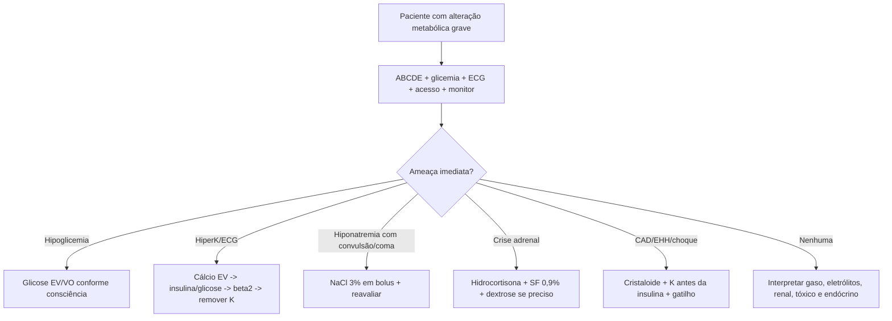
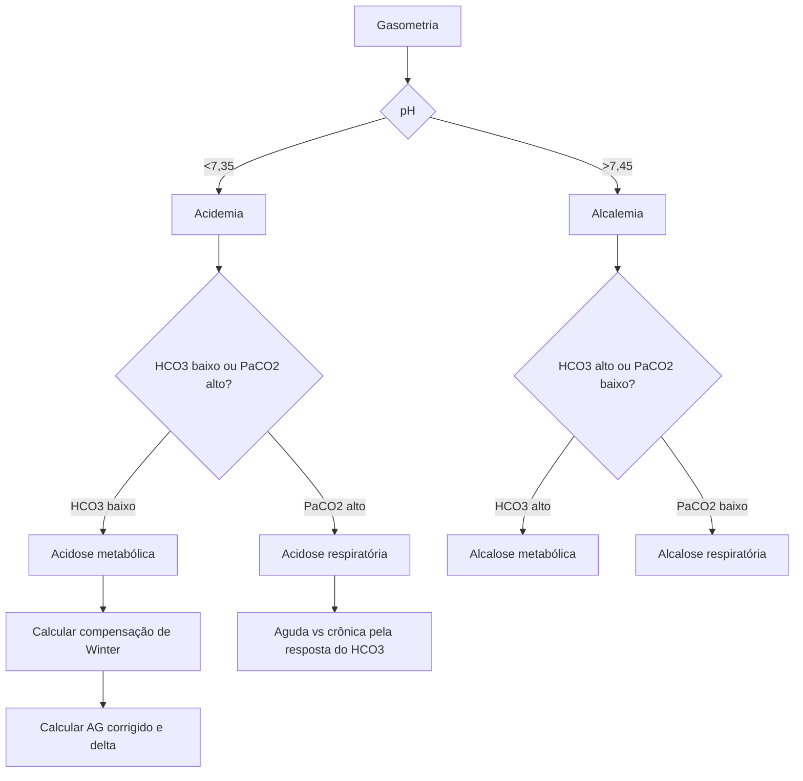
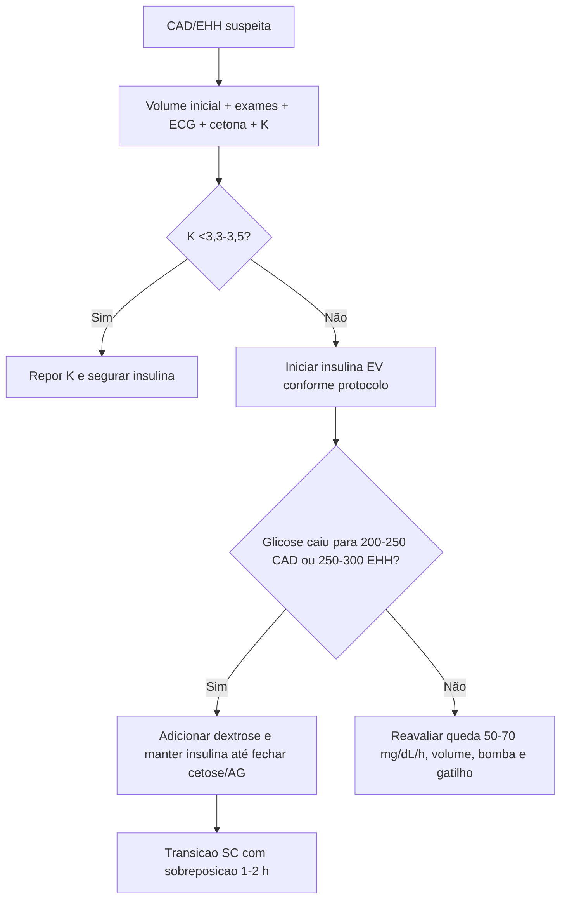
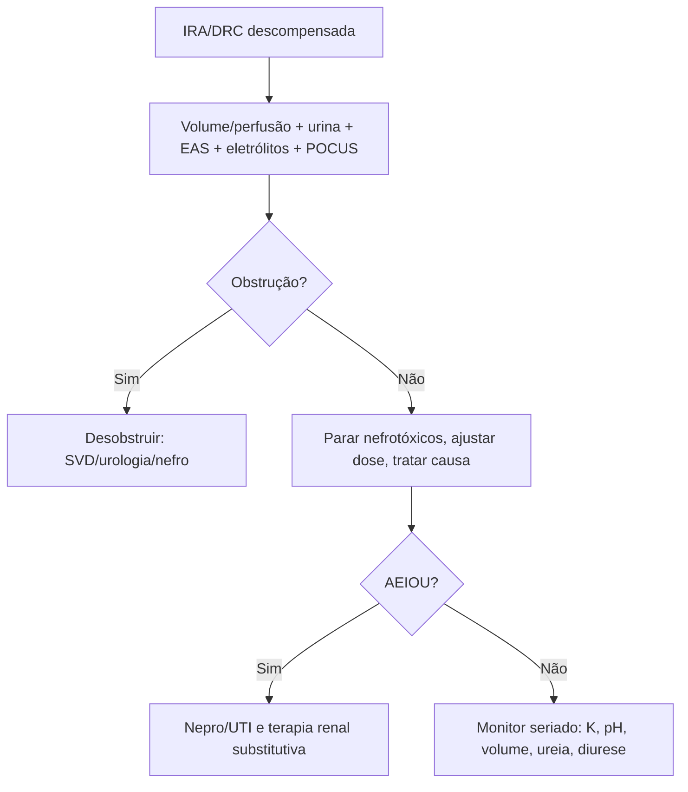

# Distúrbios Metabólicos, endócrinos, Renais E Gasometria

## Leitura de 30 segundos

- Metabólico grave na sala vermelha: ABCDE, glicemia, ECG, gaso/lactato, Na/K/Ca/Mg/P, ureia/creatinina, cetona, osmolaridade quando indicado e busca ativa de gatilho.
- Gasometria de prova: pH -> distúrbio primário -> compensação -> anion gap corrigido -> delta/delta -> oxigenação. Não pule a compensação.
- HiperK com ECG, arritmia, fraqueza ou K muito alto: cálcio primeiro, depois deslocar K para dentro da célula e remover K do corpo. Resina não é tratamento de emergência.
- Hiponatremia com convulsão/coma: salina 3% em bolus. O alvo inicial e melhorar sintoma/subir 4-6 mEq/L, não normalizar o sódio.
- CAD/EHH: volume e potássio antes de insulina plena. TEME cobrou CAD como glicemia >250 + pH <7,3 + cetonemia positiva.
- IRA/rabdomiólise: trate causa, pare nefrotóxicos, monitore K/acidose/volume e lembre AEIOU para diálise.
- Endócrino que mata: hipoglicemia, crise tireotóxica, coma mixedematoso e crise adrenal. Na dúvida de adrenal, hidrocortisona não espera laboratório.

## Por que cai

- **Recorrência em provas/estações:** TEME22-25 cobrou CAD, conduta inicial em CAD com choque/infecção, definição de CAD, gasometria/ácido-base em VM/DPOC/choque, etilenoglicol por anion gap + oxalato, crise renal esclerodérmica, bicarbonato em antidepressivo tricíclico, insuficiência renal por abelhas, torsades/magnésio, bicarbonato não rotineiro pós-RCE e crise tireotóxica.
- **O que a banca costuma testar:** primeira conduta segura, formula simples, quando não dar bicarbonato, quando não iniciar insulina, quando fazer cálcio, quando dialisar, e diferença entre resposta de prova e prática atual.
- **Como costuma aparecer:** caso com muitos números. A alternativa correta costuma evitar intervenção automática perigosa: insulinizar sem K, corrigir sódio até normal, usar bicarb em toda acidose, dar resininha para hiperK emergente ou esperar exame em crise adrenal.

## Abordagem prática

### 1. Primeiro minuto do metabólico grave

1. ABCDE, monitor, ECG de 12 derivações se K/Ca/Mg/tóxico/torácico/síncope.
2. Glicemia capilar imediata em rebaixamento, convulsão, choque, sepse, hipotermia, intoxicação e criança.
3. Gasometria venosa ou arterial conforme Pergunta clínica: pH/CO2/HCO3/lactato; arterial se precisa avaliar oxigenação real.
4. Laboratório: Na, K, Cl, HCO3, Ca, Mg, P, ureia, creatinina, osmolaridade, cetona/beta-hidroxibutirato, EAS, CPK, função hepática conforme caso.
5. Procurar gatilho: infecção, IAM/AVC, trauma/esmagamento, pancreatite, gestação, uso irregular de insulina, diurético, IECA/BRA, AINE, contraste, corticoide, antipsicótico, álcool/tóxico.

> **Resposta de prova TEME:** em paciente com glicemia alta, choque e suspeita de CAD, a conduta imediata pode ser volume + tratamento do gatilho. Insulina, potássio e bicarbonato "em pacote" sem K/pH e sem reavaliação é armadilha.
>
> **Na prática clínica:** use protocolos institucionais para CAD/EHH e eletrolitos. O importante e não atrasar intervenção tempo-dependente: cálcio na hiperK instável, salina 3% na hiponatremia grave, glicose na hipoglicemia e hidrocortisona na crise adrenal.

### 2. Gasometria em 5 passos

1. **pH:** acidemia <7,35; alcalemia >7,45.
2. **Primário:** HCO3 baixo/alto = metabólico; PaCO2 alto/baixo = respiratório.
3. **Compensação:** se não bate com a formula, existe distúrbio misto.
4. **Anion gap:** AG = Na - (Cl + HCO3). Corrija pela albumina se disponível.
5. **Delta/delta e contexto:** acidose metabólica com AG alto pode esconder alcalose metabólica ou acidose hipercloremica associada.

Pontos de prova:

- Saturação boa não exclui hipoventilação. Oxímetro não mede CO2.
- Gasometria venosa costuma servir para pH/HCO3 em muitos cenários, mas PaO2/hipoxemia exige gasometria arterial ou outra avaliação de oxigenação.
- Lactato, BE, diurese e perfusão ajudam a acompanhar choque, mas não substituem exame clínico.

### 3. Acidose metabólica com anion gap aumentado

Pense em ácido novo no sangue: lactato, cetonas, uremia, tóxicos.

Conduta prática:

1. Tratar choque/hipóxia/sepses/convulsão/hipoperfusão.
2. Checar glicemia, cetona, lactato, função renal, osmolar gap e história tóxica.
3. Não dar bicarbonato automaticamente. Corrigir causa costuma corrigir pH.
4. Considerar bicarbonato em situações específicas: antidepressivo tricíclico com QRS largo/choque, salicilato selecionado, hipercalemia com acidose grave, DKA com pH extremamente baixo, acidose grave refratária com indicação de diálise.

> **Resposta de prova TEME23:** acidose metabólica com anion gap aumentado + QT prolongado + cristais de oxalato de cálcio na urina = etilenoglicol.

### 4. Hiperpotassemia

Trate como emergência se:

- ECG alterado, arritmia, PCR, fraqueza/paralisia.
- K >=6,5 ou subida rápida.
- IRA/DRC, rabdomiólise, lise tumoral, queimadura, esmagamento, uso de IECA/BRA/espironolactona ou acidose importante.

Sequência:

1. **Estabilizar membrana:** cálcio EV se ECG/instabilidade/hiperK grave.
2. **Deslocar para dentro:** insulina regular + glicose; beta-2 agonista nebulizado; bicarbonato se acidose metabólica relevante.
3. **Remover do corpo:** diurético se urina e volume permitem; diálise se grave/refratária/renal; resinas/quelantes não resolvem emergência.
4. **Rechecar:** K e glicemia seriados; hipoglicemia pós-insulina é comum.

> **Pegada TEME:** ECG normal não exclui hiperK grave; ECG alterado com suspeita forte não deve esperar laboratório para cálcio.

### 5. Hipopotassemia, cálcio e magnésio

**HipoK:**

- Grave se <2,5, fraqueza/paralisia, arritmia, QT/U wave, uso de digoxina, IAM/IC.
- Corrija Mg junto, porque hipomagnesemia impede corrigir K.
- Evite glicose na infusão se hipoK importante: estimula insulina e piora K.

**Hipocalcemia:**

- Parestesia, tetania, broncoespasmo, convulsão, hipotensão, QT longo, pós-transfusão maciça, pancreatite, lise tumoral.
- sintomática/ECG = cálcio EV.

**Hipercalcemia:**

- Desidratação, constipação, confusão, coma, QT curto, malignidade/hiperPTH.
- Tratamento inicial: SF 0,9% se tolera volume; calcitonina para efeito rápido; bisfosfonato para efeito sustentado; diálise se grave/refratária/DRC/instabilidade.
- Furosemida não é primeira linha; use apenas se sobrecarga.

**Magnésio:**

- Hipomagnesemia causa torsades, QT longo, convulsão e hipoK refratária.
- Hipermagnesemia iatrogênica/DRC: hiporreflexia, hipotensão, bradicardia, bloqueios, depressão respiratória; trate com cálcio EV se instável, suporte, diurese/diálise.

### 6. Hiponatremia e hipernatremia

**Hiponatremia:**

1. Confirmar se e hipotonica quando possível: glicose alta, hiperlipidemia/proteina e manitol podem enganar.
2. Classificar por sintomas: convulsão, coma, rebaixamento importante, vômitos persistentes, cefaleia intensa = grave.
3. Se grave: salina hipertônica 3% em bolus, repetir até melhora clínica ou aumento inicial de 4-6 mEq/L.
4. Depois, corrigir devagar. Risco de mielinólise aumenta com álcoolismo, desnutrição, hepatopatia, hipocalemia e Na muito baixo.
5. Hipovolêmica = cristaloide isotônico; euvolêmica/hipervolêmica = restrição hídrica e tratar causa, com exceções.

**Hipernatremia:**

1. Se choque/hipoperfusão: primeiro SF 0,9% ou Ringer, mesmo com Na alto.
2. Depois, calcular déficit de água e repor água livre por VO/SNE ou SG 5%.
3. Se crônica/desconhecida, reduzir em geral até 10-12 mEq/L/dia.
4. Se aguda por carea de sódio, pode corrigir mais rápido com monitorização.

> **Resposta de prova/local:** aula Emergency Talks usa salina 3% 100 mL em 10 min na hiponatremia com convulsão refratária.
>
> **Atualização clínica:** diretrizes europeias usam bolus de 150 mL de NaCl 3% em 20 min para sintomas graves. O conceito comum e igual: bolus pequeno, reavaliar e não normalizar rápido.

### 7. CAD e EHH

**CAD clássica de prova:**

- Glicemia >250 mg/dL.
- pH <7,3 ou bicarbonato baixo.
- Cetonemia positiva.

**EHH clássico:**

- Glicemia geralmente >600 mg/dL.
- Osmolaridade efetiva alta, típicamente >320 mOsm/kg nos materiais de prova.
- Pouca ou nenhuma cetose; pH geralmente >=7,3.
- Desidratação mais intensa e sintomas neurológicos comuns.

Conduta:

1. ABCDE, monitor, 2 acessos, glicemia horaria, gaso, cetona, Na/K/Cl/HCO3/Mg/P, ureia/creatinina, ECG e gatilho.
2. Cristaloide isotônico inicial. Em choque, ressuscitar primeiro.
3. Potássio manda na insulina:
   - K baixo: repor K e segurar insulina.
   - K normal: iniciar insulina e repor K na solução.
   - K alto: iniciar insulina sem K inicial, monitorando de perto.
4. Insulina regular EV depois de volume inicial e avaliação do K.
5. Quando glicose cair, trocar para solução com dextrose e manter insulina até fechar cetose/AG.
6. Tratar gatilho: infecção, IAM, AVC, pancreatite, omissão de insulina, gestação, drogas.

> **Resposta de prova TEME22:** adolescente com suspeita de CAD, choque/infecção e glicemia 390: a alternativa correta foi hidratação com SF 0,9% + antibiótico na primeira hora, evitando bolus de insulina, bicarbonato e KCl as cegas.
>
> **Atualização clínica 2024:** o consenso internacional reduziu o limiar diagnóstico de hiperglicemia da CAD para >=200 mg/dL ou diabetes conhecido, quando há cetose significativa e acidose. Para TEME, memorize a tríade cobrada: >250 + pH <7,3 + cetonemia.

### 8. Hipoglicemia

1. Se acordado e consegue eneolir: carboidrato VO e reavaliar em 15 min.
2. Se rebaixado, convulsionando, NPO ou risco de aspiração: glicose EV.
3. Sem acesso: glucagon IM/SC/IN se disponível, mas em álcoolismo/desnutrição/hepatopatia pode falhar por pouco glicogênio.
4. Desnutrido/álcoolista/risco de Wernicke: tiamina 100 mg EV/IM junto, sem atrasar glicose se grave.
5. Sempre procurar causa: insulina/sulfonilureia, sepse, insuficiência adrenal, renal/hepática, álcool, jejum, erro de dose.

### 9. IRA, DRC descompensada e diálise de urgência

**Definição KDIGO de IRA:**

- Creatinina +0,3 mg/dL em 48 h; ou
- Creatinina >=1,5 vezes basal em até 7 dias; ou
- Diurese <0,5 mL/kg/h por 6 h.

Abordagem:

1. pré-renal: hipovolemia, choque, sepse, ICC/cirrose com baixo volume efetivo, IECA/BRA/diurético/AINE.
2. Renal: NTA por sepse/isquemia/tóxico, glomerulonefrite, NIA, vasculite, microangiopatia, rabdomiólise.
3. pós-renal: bexigoma, HPB, sonda obstruída, cálculo, tumor, coagulação. POCUS de bexiga/hidronefrose ajuda muito.
4. Manejo: restaurar perfusão, aliviar obstrução, parar nefrotóxicos, ajustar dose, tratar K/acidose/volume/uremia.

**Diálise de urgência: AEIOU**

- **A:** acidose metabólica grave/refratária.
- **E:** eletrólito, principalmente hiperK grave/refratária.
- **I:** intoxicações dializaveis, como lítio, salicilato grave, etilenoglicol/metanol selecionados.
- **O:** overload, hipervolemia/edema pulmonar refratário.
- **U:** uremia sintomática: encefalopatia, pericardite, sangramento, convulsão.

> **Pegada TEME:** creatinina alta sozinha não indica diálise. A indicação é complicação clínica/laboratorial ameaçadora ou refratária.

### 10. Rabdomiolise e esmagamento

- Suspeite em trauma/esmagamento, crise convulsiva prolongada, hipertermia, drogas, estatina, imobilização prolongada, choque elétrico, exercício extremo, infecção viral.
- Exames: CPK, K, Ca, P, ácido úrico, creatinina, EAS/mioglobinúria, gaso se grave.
- Tratamento principal: volume cristaloide precoce se não houver contraindicação, alvo de diurese 200-300 mL/h ou 2-3 mL/kg/h.
- Monitorar compartimental, hiperK, hipocalcemia inicial, hipercalcemia tardia, acidose e IRA.
- Bicarbonato/manitol/alcalinização não são rotina universal; podem aparecer em protocolos de esmagamento selecionados.
- Diálise não remove mioglobina por si só de forma preventiva: diálise por AEIOU.

> **Resposta de aula/prova:** além da hidratação, não há "padrão-ouro" obrigatório para rabdomiólise. Furosemida, manitol e alcalinização não substituem volume e monitorização.

### 11. Crise tireotóxica, mixedema e adrenal

**Crise tireotóxica:**

- Diagnóstico clínico: febre, taquicardia/descompensação cardíaca, agitação/delirium, vômitos/diarreia, disfunção hepática e hipertireoidismo conhecido ou TSH suprimido/T4 alto.
- Tratamento em blocos: suporte/UTI, tratar gatilho, beta-bloqueio se tolerado, tionamida, iodo depois da tionamida, corticoide, resfriamento e antitérmico sem AAS.
- Se choque/IC grave, cuidado com propranolol; considerar beta-bloqueio curto/titulado e suporte intensivo.

**Coma mixedematoso:**

- Nem sempre está em coma. Pense em hipotireoidismo + rebaixamento, hipotermia, bradicardia, hipoventilação, hiponatremia/hipoglicemia, derrame/pericárdico, gatilho infeccioso/frio/sedativo.
- Tratamento: suporte ventilatório/hemodinâmico, aquecimento passivo, hidrocortisona antes/junto, levotiroxina EV, tratar gatilho.

**Crise adrenal:**

- Choque ou hipotensão refratária + vômitos/dor abdominal, hipoglicemia, hiponatremia, hipercalemia, hiperpigmentação, uso crônico/suspensao de corticoide, sepse ou doença autoimune.
- Não espere cortisol se instável: hidrocortisona imediata + SF 0,9% + dextrose se hipoglicemia.

> **Resposta de prova TEME25:** crise tireotóxica provável = antitireoidiano + beta-bloqueador + corticoide, com iodeto após antitireoidiano. Em hepatopatia importante, metimazol pode ser preferido a PTU.

## Conceitos que sustentam a conduta

### Bicarbonato não é "antídoto da acidose"

Acidose é marcador de causa: choque, hipóxia, cetose, uremia, tóxico, diarreia, hipoventilação. Bicarbonato pode piorar CO2, sódio/osmolaridade e volume. Use quando há mecanismo em que ele muda desfecho: tricíclico com QRS largo, salicilato, hiperK com acidose, acidemia extrema selecionada, ou como ponte para diálise.

### Insulina sem potássio pode parar o coração

Na CAD, o K corporal total costuma estar baixo mesmo quando o K serico está normal/alto. Insulina desloca K para dentro da célula. Se K já está baixo, iniciar insulina antes de repor K pode precipitar arritmia fatal.

### Corrigir sódio é uma maratona com sprint inicial

Hiponatremia grave sintomática precisa de bolus de salina 3% para tirar o cérebro do risco imediato. Depois disso, a correção deve desacelerar. A prova gosta de alternativas que tentam "normalizar" o sódio em poucas horas: isso é perigoso.

### IRA é diagnóstico de processo, não de creatinina isolada

Creatinina sobe tarde e depende de massa muscular. Em emergência, diurese, K, acidose, congestão, uremia, exposições e obstrução importam mais para conduta imediata.

## Fluxograma

## Doses, alvos e números

| Item | Número | observação TEME |
|---|---:|---|
| pH normal | 7,35-7,45 | pH define acidemia/alcalemia |
| PaCO2 normal | 35-45 mmHg | Oxímetro não avalia ventilação |
| HCO3 normal | 22-26 mEq/L | Metabólico gira em torno dele |
| AG | Na - (Cl + HCO3) | Normal local: 10 +/- 2 |
| AG corrigido albumina | AG + 2,5 x (4 - albumina) | Hipoalbumina máscara AG alto |
| Winter | PaCO2 esperada = 1,5 x HCO3 + 8 +/- 2 | Acidose metabólica |
| Alcalose metabólica | PaCO2 esperada = 0,7 x HCO3 + 21 +/- 5 | Se fora, distúrbio misto |
| Na corrigido glicemia | Na + 0,02 x (glicose - 100) | Formula da aula; equivale a 2 mEq por 100 mg/dL |
| Osm efetiva | 2 x Na + glicose/18 | Ureia não conta para tonicidade efetiva |
| Osm calculada total | 2 x Na + glicose/18 + BUN/2,8 | BUN = ureia/2,14 |
| Osmolar gap | Osm medida - osm calculada | Alto sugere álcool tóxico, entre outros |
| CAD prova | Glicose >250 + pH <7,3 + cetonemia | TEME22/23 |
| EHH prova | Glicose >600 + osm >320 + pouca/sem cetose | Desidratação e SNC |
| Queda glicêmica alvo CAD | 50-70 mg/dL/h | Aula Emergency Talks |
| Insulina regular CAD adulto | 0,1 U/kg/h EV | Iniciar após volume e K adequado; muitos protocolos não usam bolus |
| Segurar insulina | K <3,3-3,5 mEq/L | Repor K primeiro |
| Bicarbonato na DKA | pH <6,9-7,0 | Não é rotina |
| Resolução CAD | pH >7,3, HCO3 >=18, cetose/AG resolvendo | Cetonuria pode enganar |
| Glicose hipoglicemia adulto | 15-20 g VO se alerta; 25 g EV se grave | D50 50 mL ou D10 250 mL, conforme protocolo |
| Tiamina | 100 mg EV/IM | Alcoolismo/desnutrição; não atrasar glicose grave |
| Hidrocortisona crise adrenal | 100 mg EV/IM, depois 200 mg/24 h ou 50 mg 6/6 h | Não esperar cortisol se instável |
| HiperK emergente | K >=6,5 ou ECG/sintomas | Cálcio primeiro se instável/ECG |
| Gluconato de cálcio 10% | 10-30 mL EV | Repetir se ECG não melhora |
| Cloreto de cálcio 10% | 10 mL EV | Preferir acesso central/PCR |
| Insulina hiperK | Regular 10 U EV + glicose 25 g | Monitorar hipoglicemia por 4-6 h |
| Salbutamol hiperK | 10-20 mg nebulizado | Adjuvante, não substitui cálcio/insulina |
| KCl IV | 10 mEq/h periférico; até 20 mEq/h monitorizado | Corrigir Mg junto |
| NaCl 3% hiponatremia grave | 100 mL em 10 min ou 150 mL em 20 min | Bolus e reavaliação; alvo inicial +4-6 |
| Limite correção Na crônica | 8-10 mEq/L em 24 h | Mais conservador se alto risco |
| Hipernatremia crônica | Reduzir até 10-12 mEq/L/dia | Primeiro tratar choque com isotônico |
| Hipocalcemia sintomática | Gluconato Ca 10% 10-20 mL EV | Convulsão, QT, tetania, instabilidade |
| Hipermagnesemia instável | Cálcio EV | Depois volume/diurese/diálise |
| Mg torsades | 1-2 g EV | Mesmo se Mg normal |
| IRA KDIGO | Cr +0,3/48h; 1,5x/7d; diurese <0,5 mL/kg/h por 6h | Definição |
| Rabdomiolise | CPK >1000 ou >5x LSN | Risco maior com >5000 |
| Diurese alvo rabdo | 200-300 mL/h ou 2-3 mL/kg/h | Se tolera volume |
| Crise renal esclerodérmica | IECA/captopril | TEME22 Q63: captopril |
| Tricíclico com QRS largo/choque | Bicarbonato 1-2 mEq/kg EV | Alvo QRS estreitar/pH 7,45-7,55 |
| Crise tireotóxica | Tionamida + beta-bloq + corticoide + iodo depois | Tratar gatilho e evitar AAS |
| Mixedema | Hidrocortisona + levotiroxina EV + suporte | Aquecimento passivo |

## Pegadinhas TEME

- **CAD = glicemia >600:** falso. Isso é mais EHH. CAD de prova e >250 + pH <7,3 + cetonemia.
- **Insulina em bolus sempre primeiro na CAD:** falso. Primeiro volume e K; no caso TEME22, a melhor resposta imediata foi SF 0,9% + antibiótico.
- **Bicarbonato em toda acidose metabólica:** falso. Trate causa; reserve para indicações específicas.
- **K alto com ECG alterado: glicose-insulina primeiro:** incompleto. Cálcio estabiliza membrana e vem antes se ECG/instabilidade.
- **ECG normal exclui hiperK:** falso.
- **Resina/Sorcal resolve hiperK emergente:** falso. início tardio e efeitos GI; não é resposta de sala vermelha.
- **Hiponatremia grave precisa normalizar Na:** falso. Bolus inicial para sintomas; depois corrigir devagar.
- **Hipernatremia com choque não pode receber SF 0,9%:** falso. Perfusão vem primeiro.
- **Furosemida para hipercalcemia como rotina:** falso. Volume, calcitonina e bisfosfonato são base; furosemida só se sobrecarga.
- **Creatinina alta isolada indica diálise:** falso. Use AEIOU.
- **Rabdomiolise tem que alcalinizar urina/manitol:** falso como rotina.
- **Crise tireotóxica espera TSH/T4 ou rastreio infeccioso:** falso. Diagnóstico é clínico; tratar cedo.
- **Crise adrenal espera cortisol:** falso se instável.
- **Cetonuria negativa encerra CAD:** falso. Beta-hidroxibutirato/cetose e AG importam mais.

## Erros fatais na prática

- Dar insulina em CAD com K baixo ou sem checar K.
- Não fazer ECG em hipercalemia/hipocalemia/hipocalcemia/tóxico.
- Tratar hipoglicemia rebaixada com dieta VO.
- Corrigir Na de 110 para normal em poucas horas.
- Dar volume agressivo em IRA congesta sem reavaliar pulmão/VCI/perfusão.
- Não procurar obstrução urinária reversível em IRA.
- Intubar acidose metabólica grave e hipoventilar depois, piorando pH.
- Usar propranolol em crise tireotóxica com choque/IC grave sem cautela.
- Não dar corticoide antes de levotiroxina em mixedema ou diante de suspeita de crise adrenal.
- Liberar rabdomiólise com K/creatinina/CPK subindo ou risco compartimental.

## Para prova vs na prática

> **Para prova TEME:** CAD = glicemia >250 + pH <7,3 + cetonemia; CAD com choque/infecção pede SF 0,9% e antibiótico antes de insulinizar as cegas; etilenoglicol = AG alto + oxalato; crise renal esclerodérmica = captopril/IECA; TCA instável = bicarbonato; hiperK emergente = cálcio.
>
> **Na prática clínica:** CAD adulta atual pode ser diagnosticada com glicemia >=200 se houver diabetes/cetose/acidose; salina balanceada pode reduzir acidose hipercloremica; protocolos de sódio usam limites de correção mais conservadores em alto risco; beta-bloqueio na tireotoxicose deve ser individualizado se choque/IC.

## Checklist de revisão

- [ ] Sei interpretar gasometria em 5 passos e calcular compensação.
- [ ] Sei calcular AG, corrigir por albumina e pensar em osmolar gap.
- [ ] Sei tratar hiperK emergente na ordem: cálcio, shift, remoção.
- [ ] Sei que ECG normal não exclui hiperK.
- [ ] Sei tratar hiponatremia grave com bolus de NaCl 3% sem normalizar rápido.
- [ ] Sei diferenciar CAD e EHH e não iniciar insulina com K baixo.
- [ ] Sei quando bicarbonato ajuda e quando atrapalha.
- [ ] Sei AEIOU da diálise de urgência.
- [ ] Sei manejar rabdomiólise com volume, diurese alvo e monitorização de K/IRA.
- [ ] Sei reconhecer crise tireotóxica, mixedema e crise adrenal.
- [ ] Sei as questões TEME: CAD >250/pH<7,3/cetonemia; etilenoglicol; captopril na crise renal esclerodérmica; bicarbonato no TCA.

## Questões e estações relacionadas

- **TEME22 Q51:** suspeita de CAD com choque/infecção: hidratação com SF 0,9% + antibiótico na primeira hora; evitar bolus de insulina/bicarbonato/KCl as cegas.
- **TEME22 Q58:** definição de CAD: glicemia >250 mg/dL + pH <7,3 + cetonemia positiva.
- **TEME22 Q63:** crise renal esclerodérmica com PA alta, convulsão, creatinina/proteinúria/hematúria: captopril.
- **TEME22 Q57:** melhora pós-ressuscitação no choque: queda de lactato, melhora de BE e diurese.
- **TEME23 Q30:** etilenoglicol: acidose metabólica com anion gap aumentado, QT prolongado e cristais de oxalato de cálcio.
- **TEME23 Q63:** repetiu definição de CAD.
- **TEME24 Q30:** intoxicação por tricíclico com instabilidade/ECG: bicarbonato de sódio, volume/vasoativo e via aérea após estabilização inicial.
- **TEME24 Q79:** múltiplas picadas de abelha podem causar síndrome de envenenamento com IRA e necessidade de hemodialise.
- **TEME25 Q83:** pós-RCE pediátrico: não usar bicarbonato de sódio rotineiramente para acidose metabólica.
- **TEME25 Q97:** crise tireotóxica: antitireoidiano + beta-bloqueio + corticoide, iodeto após antitireoidiano.
- **Emergency Talks Aula 16:** IRA, DRC, indicações de diálise e rabdomiólise.
- **Emergency Talks Aula 33:** gasometria, compensações, AG, delta e osmolar gap.
- **Emergency Talks Aula 42:** K, Na, Ca, Mg é tratamento emergente.
- **Emergency Talks Aula 59:** hipoglicemia, CAD/EHH, mixedema, tireotoxicose e adrenal.

## Referências

**Prova/TEME**

- Conteúdo programático TEME26.
- Provas teóricas TEME22, TEME23, TEME24 e TEME25.
- Referências oficiais do edital: Tratado ABRAMEDE 2024, Medicina de Emergência HCFMUSP, POCUS ABRAMEDE e demais capítulos de clínica de emergência.

**Material local**

- Emergency Talks: Aula 16 - Insuficiência renal e rabdomiólise.
- Emergency Talks: Aula 33 - Gasometria.
- Emergency Talks: Aula 42 - Distúrbios hidroeletrolíticos e ácido-básicos.
- Emergency Talks: Aula 59 - Emergências endocrinológicas.
- Resumo do Emergency.docx.
- Adendos para complementar.docx.

**Atualização clínica**

- ADA/EASD/JBDS/AACE/DTS. Hyperelycemic Crises in Adults With Diabetes: A Consensus Report, 2024. https://diabetesjournals.org/care/article/47/8/1257/156808/Hyperglycemic-Crises-in-Adults-With-Diabetes-A
- UK Kidney Association. Clinical Practice Guideline: Treatment of Acute Hyperkalaemia in Adults, 2023. https://guidelines.ukkidney.org/hyperkalaemia/
- European Society of Endocrinology/ERA-EDTA/ESICM. Clinical Practice Guideline on Diagnosis and Treatment of Hyponatraemia. https://academic.oup.com/ejendo/article/170/3/G1/6668025
- KDIGO. Clinical Practice Guideline for Acute Kidney Injury. https://kdigo.org/guidelines/acute-kidney-injury/
- AAST Critical Care Committee. Rhabdomyolysis: Clinical Consensus Document, 2022. https://tsaco.bmj.com/content/7/1/e000836
- Society for Endocrinology. Emergency Guidance: Adrenal Crisis. https://www.endocrinology.org/clinical-practice/clinical-guidance/adrenal-crisis/
- American Thyroid Association. Hyperthyroidism and Other Causes of Thyrotoxicosis Guidelines, 2016. https://www.liebertpub.com/doi/10.1089/thy.2016.0229
- American Thyroid Association. Guidelines for the Treatment of Hypothyroidism, 2014. https://www.liebertpub.com/doi/10.1089/thy.2014.0028
