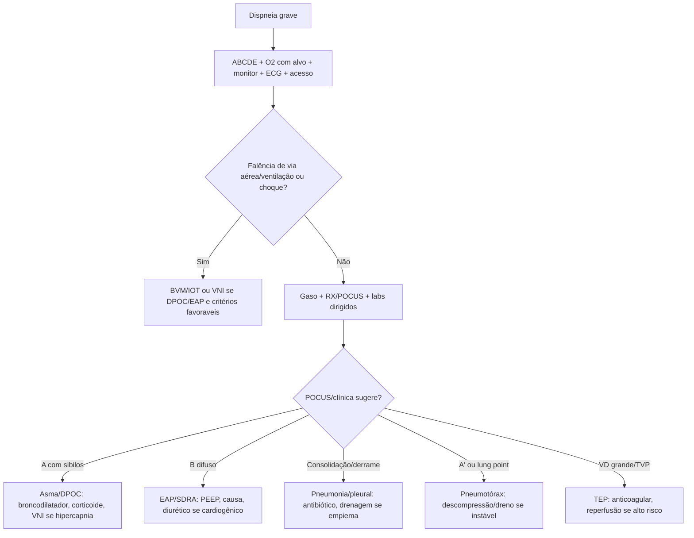
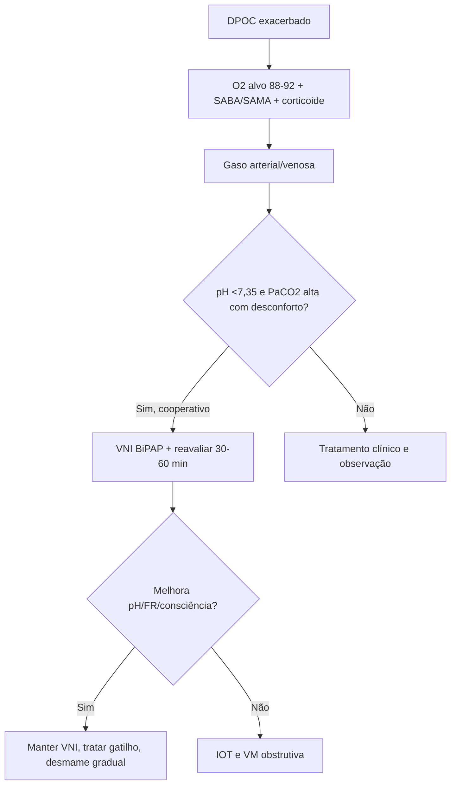
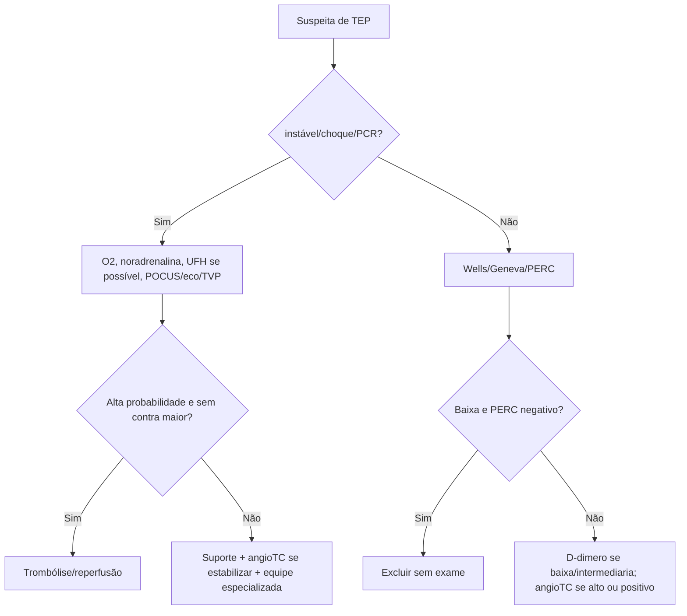
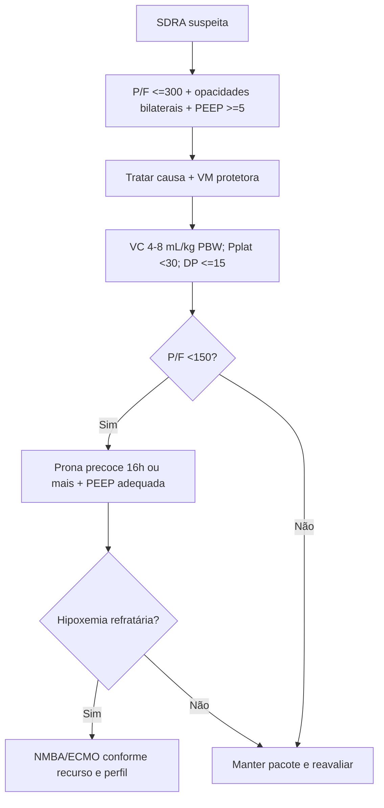

# Emergências Respiratórias

## Leitura de 30 segundos

- Dispneia grave e sala vermelha até prova em contrário: aparência, fala, musculatura acessoria, consciência, choque, SpO2, ausculta, ECG, gaso e POCUS.
- Oxigênio e droga: alvo 94-98% na maioria dos agudos; 88-92% se risco de retenção de CO2, como DPOC grave, obesidade-hipoventilação e neuromuscular.
- DPOC com pH <7,35 + PaCO2 alta + desconforto, se acordado e protegendo via aérea: VNI/BiPAP cedo. Não afogue o paciente em O2 sem alvo.
- Asma grave: SABA + ipratrópio + corticoide precoce + MgSO4 se refratária. Silêncio auscultatório, sonolência ou CO2 normal/subindo são falência iminente.
- Pneumonia: gravidade decide local e tempo. CURB-65/PSI ajudam, mas choque, hipoxemia, confusão e necessidade de VM mandam mais. Hospitalar clássico: beta-lactâmico + macrolídeo.
- TEP: estável = probabilidade clínica + D-dimero/angioTC; instável = suporte, heparina se possível, eco/POCUS e reperfusão se alto risco sem contra.
- SDRA: trate causa e ventile protegendo pulmão: VC 4-8 mL/kg peso predito, Pplat <30, driving <=15, PEEP adequada e prona se P/F <150.

## Por que cai

- **Recorrência em provas/estações:** TEME22-25 cobrou POCUS pulmonar, escolha de dispositivo de O2, metas de saturação, gasometria arterial para hipoxemia, DPOC hipercápnico/VNI, pneumonia/choque, TEP pós-operatório, pneumotórax por POCUS, mecanismos de IRpA hipoxêmica, SDRA/prona, auto-PEEP, síndrome torácica aguda e asma grave com fadiga.
- **O que a banca costuma testar:** primeira conduta, alvo de SpO2, diferença entre VNI e IOT, quando trombolisar TEP, como não errar DPOC, quando usar prona, e leitura de POCUS/curvas.
- **Como costuma aparecer:** caso de dispneia com distratores cardíacos, infecciosos e obstrutivos. A resposta certa é a que estabiliza fisiologia e usa exame beira-leito para encurtar o caminho.

## Abordagem prática

### 1. Primeiro minuto da dispneia grave

1. **Olhe antes de auscultar:** fala frases? postura tripode? uso de acessorios? sudorese? cianose? confusão? exaustão?
2. **ABCDE:** via aérea, ventilação, circulação, consciência, temperatura e exposição.
3. **Oxigênio com alvo:** não deixe hipóxico; depois ajuste para alvo, principalmente no retentor de CO2.
4. **Monitor + ECG + acesso + gaso/lactato:** ECG pode revelar SCA, arritmia, TEP, hiperK; gaso separa hipoxemia de hipercapnia e acidose.
5. **POCUS cedo:** pulmão, coração, VCI e veias de MMII quando muda conduta.
6. **Decida suporte ventilatório:** O2 simples/CNAF, VNI ou IOT.

Sinais de falência iminente:

- Rebaixamento, agitação que impedé tratamento, apneia, exaustão, fala impossivel.
- Hipoxemia refratária, choque, arritmia instável.
- PaCO2 subindo com acidemia e trabalho respiratório.
- Secreção/vômito/aspiração ou incapacidade de proteger via aérea.

### 2. Classifique a insuficiência respiratória

| Eixo | Pistas | Causas que matam |
|---|---|---|
| Via aérea alta | Estridor, voz abafada, edema, engasgo | Anafilaxia, corpo estranho, angioedema, tumor/abscesso |
| Via aérea baixa | Sibilos, expiração prolongada, tórax silencioso | Asma, DPOC, broncoespasmo por anafilaxia |
| Parênquima | Febre, crepitantes, infiltrado, linhas B/consolidação | Pneumonia, SDRA, edema pulmonar, contusão |
| Pleura | Dor pleuritica, assimetria, MV abolido, POCUS | Pneumotórax, Hemotórax, derrame volumoso/empiema |
| Cardiovascular | Sincopa, hipotensão, VD/VE alterado, edema | TEP, IC aguda, valvopatia, tamponamento |
| Neuromuscular | Fraqueza, disfagia, tosse fraca, hipercapnia | Guillain-Barre, miastenia, botulismo, lesão medular |
| Sistêmica | Gaso/metabólico desproporcional | Sepse, CAD, IRA, intoxicação, anemia grave |

> **Resposta de prova TEME:** IRpA hipoxêmica se diferencia melhor pelos mecanismos e pelo gradiente alvéolo-arterial; SDRA não é hipoventilação simples.

### 3. Oxigênio, VNI e IOT

**Alvos de SpO2:**

- Maioria dos pacientes agudos: 94-98%.
- Risco de hipercapnia: 88-92% até gasometria orientar.
- Crítico instável/trauma/choque: O2 alto inicialmente, depois titule quando estabilizar e tiver gaso.

**Dispositivos que a banca gosta:**

- Cateter nasal: baixo fluxo, pouca FiO2, paciente leve.
- Venturi: FiO2 controlada, útil no DPOC/retentor.
- máscara não reinalante: hipoxemia grave/ponte para suporte avançado.
- CNAF: hipoxemia com alto drive, paciente acordado; monitorar falha.
- BVM: ventilação de resgate.

**VNI funciona melhor em:**

- DPOC exacerbado com acidose respiratória.
- Edema agudo cardiogênico.
- Aleuns imunossuprimidos/pós-extubação selecionados.

**Evite ou pare VNI se:**

- Rebaixamento, vômitos, aspiração, secreção importante, trauma de face, instabilidade grave, parada iminente, pneumotórax não drenado, incapacidade de cooperar ou piora em 1-2 h.

**IOT se:**

- Não protege via aérea, não oxigena, não ventila, exaustão, choque/rebaixamento, curso clínico de piora previsível.

> **Resposta de prova TEME22:** DPOC com SpO2 86% em ar ambiente = máscara de Venturi com FiO2 controlada. Hipoventilacao por obesidade pode ter alvo 88-92%.

### 4. Asma aguda grave

Tratamento inicial:

1. O2 para alvo 94-98%.
2. Salbutamol repetido ou contínuo conforme gravidade.
3. Ipratrópio nas crises moderadas/graves na primeira hora.
4. Corticoide sistêmico precoce.
5. MgSO4 EV se grave/refratária.
6. Considerar VNI apenas em paciente colaborativo e equipe experiente; não atrasar IOT se falência.

Sinais de alto risco:

- História de IOT/UTI, uso excessivo de SABA, atraso de corticoide, má adesão, comorbidade psiquiátrica/social.
- Fala palavras, exaustão, confusão, tórax silencioso, SpO2 baixa apesar de O2, PaCO2 normal/subindo.

Pós-IOT na asma:

- Tubo calibroso quando possível.
- Baixa FR, tempo expiratório longo, fluxo alto, VC 6 mL/kg, permissão de hipercapnia se pH tolerável.
- Sedação profunda; ketamina e boa opção se broncoespasmo/choque.
- Procurar auto-PEEP se hipotensão pós-IOT.

> **Atualização clínica:** GINA 2025 reforca que SABA isolado não deve ser plano de alta. Depois de controlar a crise, revisar corticoide inalatorio/formoterol ou controlador com ICS, técnica inalatória e plano escrito.

### 5. DPOC exacerbado

Pense em DPOC, mas procure o que imita/mata: pneumonia, TEP, pneumotórax, IC, arritmia, SCA e sedativos.

Conduta:

1. O2 controlado com alvo 88-92% até gaso.
2. Salbutamol + ipratrópio inalatorios.
3. Corticoide sistêmico curto.
4. Antibiótico se escarro purulento com piora de dispneia/volume, necessidade de ventilação, pneumonia ou alta suspeita bacteriana.
5. Gasometria: pH <7,35 + PaCO2 alta + desconforto = VNI se não houver contra.
6. Reavaliar em 30-60 min: pH, PaCO2, FR, consciência, sincronia e fadiga.

VNI/BiPAP inicial de prova:

- Comece com EPAP 4-5 cmH2O e IPAP 10-12 cmH2O, ajuste para reduzir trabalho e melhorar pH/PaCO2.
- O2 acoplado para SpO2 88-92%.

IOT em DPOC:

- Rebaixamento, falha de VNI, choque, secreção/aspiração, acidose grave com deterioração.
- Ventile como obstrutivo: FR baixa, tempo expiratório longo, evitar auto-PEEP.

> **Resposta de prova TEME:** DPOC com pH 7,25, PaCO2 70, consciente e obedecendo comandos = iniciar VNI por BiPAP, não intubar automaticamente.
>
> **Atualização clínica GOLD 2026:** antibiótico deve ser mais dirigido: purulência, infecção bacteriana documentada ou necessidade de ventilação. Corticoide sistêmico curto, em geral 5 dias, e suficiente.

### 6. Pneumonia e sepse respiratória

Diagnóstico:

- Sintomas respiratórios + sinal sistêmico + infiltrado novo quando possível.
- Nenhum achado clínico isolado exclui pneumonia.
- POCUS pode mostrar consolidação, broncograma aéreo, derrame/parapneumonico e linhas B focais.

Gravidade:

- CURB-65: confusão, ureia >43 mg/dL, FR >=30, PAS <90 ou PAD <=60, idade >=65.
- Critérios fortes de UTI: choque com vasopressor ou necessidade de VM.
- Cuidado com hipoxemia, confusão, hipotensão, multilobar, plaqueta baixa, hipotermia, leucopenia, BUN alto.

Tratamento:

1. O2, acesso, culturas se grave e não atrasarem, lactato se sepse, antibiótico precoce.
2. internação comum: beta-lactâmico + macrolídeo ou fluoroquinolona respiratória conforme protocolo/local.
3. CAP grave: beta-lactâmico + macrolídeo tende a ser a dupla mais cobrada.
4. Cobrir MRSA/Pseudomonas se isolamento prévio ou internação recente com antibiótico EV, ou risco local forte.
5. Aspiração: pneumonite química logo após macroaspiracao não pede antibiótico automático; pneumonia aspirativa infectada trata. Cobertura anaerobia rotineira não é necessaria salvo abscesso/empiema/periodontal grave.

> **Resposta de prova TEME22:** paciente pós-trauma torácico com febre, choque, base opacificada e derrame/hipotransparência = infecção pulmonar com sepse/choque séptico; expansão volêmica e antibiótico imediato.
>
> **Na prática clínica:** corticoide na PAC grave mudou bastante. ATS/IDSA 2019 não recomendava rotina salvo choque refratário; estudos recentes apoiam hidrocortisona em PAC grave selecionada. Para prova, use corticoide quando houver indicação explicita: choque refratário, DPOC/asma associada, COVID ou protocolo local de PAC grave.

### 7. Derrame pleural, empiema e pneumotórax

**Derrame pleural:**

- Punir se: derrame novo sem causa clara, febre/sepsis, suspeita de empiema, alívio sintomático, neoplasia/TB, unilateral importante.
- Light: exsudato se proteina pleural/soro >0,5, LDH pleural/soro >0,6 ou LDH pleural >2/3 do limite superior serico.

**Parapneumonico/empiema:**

- Pus, Gram/cultura positiva, loculacao, pH baixo ou glicose baixa indicam drenagem.
- Atualização BTS 2023: pH pleural <=7,2 = alto risco e deve drenar se houver colecao acessível.

**Pneumotórax:**

- Hipertensivo é diagnóstico clínico: choque/hipoxemia + assimetria/enfisema/desvio. Descomprimir antes de RX.
- No POCUS: ausência de lung sliding + linhas A; lung point praticamente confirma.

### 8. Tromboembolismo pulmonar

**estável:**

1. Probabilidade clínica: Wells/Geneva ou gestalt estruturada.
2. Baixa probabilidade: PERC pode excluir sem exames se todos negativos.
3. Baixa/intermediaria: D-dimero; considerar corte ajustado por idade/probabilidade.
4. Alta probabilidade: angioTC, e anticoagulação enquanto aguarda se baixo risco de sangramento.
5. Estratificar risco: PESI/sPESI, VD no eco/CT, troponina/BNP.

**instável/alto risco:**

- Hipotensão persistente, choque, PCR, necessidade de vasopressor por suspeita de TEP.
- Suporte: O2, norepinefrina se choque, bolus pequeno de cristaloide se necessário, evitar excesso de volume no VD.
- Heparina não fracionada se reperfusão/procedimento provável e sem contra.
- Eco/POCUS pode sustentar decisão se paciente não vai ao TC: VD dilatado/disfuncional, trombo em transito, TVP em compressão.
- reperfusão: trombólise sistêmica se alto risco e sem contra; alternativa catheter/surgical se contra/falha e recurso disponível.

> **Resposta de prova TEME22:** pós-operatório com dor torácica, dispneia, hipotensão e suspeita de TEP não é "alteplase automática" se há alto risco de sangramento e ainda sem confirmação; a banca aceitou suporte inicial com pequeno bolus de Ringer 500 mL.
>
> **Na PCR por TEP:** considerar trombólise durante RCP quando suspeita forte, especialmente com VD dilatado no eco. O material local usa alteplase 50 mg em bolus e reanimação prolongada.

### 9. SDRA

Definição prática:

- início em até 1 semana de insulto.
- Opacidades bilaterais não explicadas completamente por IC/hipervolemia.
- PEEP/CPAP >=5 cmH2O.
- P/F: leve 200-300, moderada 100-200, grave <=100.

Conduta:

1. Tratar causa: pneumonia, sepse, pancreatite, trauma, aspiração, transfusão, COVID etc.
2. VM protetora: VC 4-8 mL/kg peso predito, usual 6; Pplat <30; driving pressure <=15 se possível.
3. PEEP adequada e FiO2 pela tabela, evitando hiperoxia prolongada.
4. Se P/F <150 apesar de ajuste: prona precoce por sessões longas.
5. Considerar bloqueio neuromuscular em SDRA grave com assincronia/hipoxemia; ECMO em centro experto para refratários.
6. Estratégia de fluidos mais conservadora após choque resolvido.

> **Resposta de prova TEME:** paciente intubado, FiO2 100%, PaO2 81, P/F 81 = SDRA grave; conduta de prova é posição prona, não oxido nitrico/ECMO antes do básico.

### 10. POCUS pulmonar na dispneia

| Achado | Significado prático | Armadilha |
|---|---|---|
| Linhas A + sliding | pulmão aerado | Asma/DPOC possível; não exclui TEP |
| Linhas A sem sliding | Pneumotórax possível | Confirme com lung point se possível |
| Lung point | Pneumotórax | Altissima especificidade |
| Linhas B difusas bilaterais | Síndrome intersticial/congestão | Pneumonia/SDRA também podem dar B, olhe distribuição |
| Linhas B focais | Lesão focal | Pneumonia, contusão, atelectasia |
| Consolidação + broncograma | Pneumonia/atelectasia | Broncograma dinâmico favorece pneumonia |
| Derrame anecoico | Líquido pleural | Use US para punir com segurança |
| VD dilatado | TEP/cor pulmonale/hipertensão pulmonar | Não diagnostica TEP isoladamente |

> **Resposta de prova TEME22:** POCUS pulmonar avalia pleura e artefatos ar-tecido. Perfil A' com lung point = pneumotórax, não TEP.

### 11. Hemoptise em 6 linhas

- Primeiro: diferenciar hemoptise de hematemese/epistaxe.
- Ameaçadora = risco de asfixia, não apenas volume. Instabilidade, hipoxemia, sangramento ativo ou grande volume vao para sala vermelha.
- Lado sangrante para baixo, O2, acesso, tipagem, corrigir coagulopatia, chamar broncoscopia/intervenção.
- TC/angioTC costuma localizar causa se estável.
- Causas comuns: bronquite/bronquiectasia, TB, câncer, pneumonia, TEP, anticoagulação.
- Hemoptise pequena com RX normal pode seguir investigação ambulatorial/TC conforme risco, mas não se alto risco oncológico/TB/recorrente.

## Conceitos que sustentam a conduta

### O2 demais também faz mal

Hipoxemia mata rápido; hiperoxia e hipercapnia iatrogênica também machucam. A resposta elegante é dar O2 alto quando necessário e titular assim que possível para alvo. Na TEME, DPOC/obesidade-hipoventilação = 88-92%.

### VNI e teste terapêutico com relógio

VNI que melhora pH, FR, sincronia e consciência salva intubação. VNI que não melhora em 1-2 h só atrasa IOT e aumenta aspiração/parada. O candidato precisa escrever reavaliação, não apenas "colocar BiPAP".

### Dispneia sem alteração pulmonar pode ser TEP

pulmão limpo, dor torácica/síncope/hipotensão, VD grande, TVP ou pós-operatório recente devem puxar TEP para cima. D-dimero em paciente de alta probabilidade ou instável só atrasa.

### SDRA é uma estratégia, não uma P/F isolada

P/F classifica; conduta e pacote: causa, VC baixo, pressão baixa, PEEP, prona, sincronia, fluido, infecção e evitar lesão induzida pelo ventilador.

## Fluxograma

## Doses, alvos e números

| Item | Número | observação TEME |
|---|---:|---|
| SpO2 alvo maioria aguda | 94-98% | Titular O2, evitar hiperoxia prolongada |
| SpO2 alvo risco hipercapnia | 88-92% | DPOC grave, obesidade-hipoventilação, neuromuscular |
| PaO2 hipoxemia | <60 mmHg | IR hipoxêmica clássica |
| PaCO2 hipercapnia | >45 mmHg | Interpretar com pH e HCO3 |
| VNI DPOC | pH <7,35 + PaCO2 >45 + desconforto | Se consciente/cooperativo |
| BiPAP inicial | IPAP 10-12 / EPAP 4-5 cmH2O | Ajustar por trabalho, VT, escape e gaso |
| Salbutamol asma/DPOC | 4-10 jatos q20min x3 ou 2,5-5 mg neb | Pode ser contínuo em grave |
| Ipratrópio | 0,5 mg neb q20min x3 | Primeira hora em crise grave |
| Prednisona/prednisolona asma/DPOC | 40-50 mg VO/dia | DPOC geralmente 5 dias |
| MgSO4 asma grave adulto | 2 g EV em 20 min | Refratária/grave |
| Saturação alta no DPOC | Evitar >92% se retentor | Fazer gaso e titular |
| CURB-65 | C, U>43, R>=30, BP baixa, idade >=65 | Ajuda internação, não substitui julgamento |
| PAC grave ATS/IDSA maior | VM invasiva ou choque com vasopressor | Um critério maior = grave |
| PAC grave menor | RR>=30, P/F<=250, multilobar, confusão, BUN>=20, leucopenia, plaqueta<100k, T<36, hipotensão com fluidos | 3 menores sugerem grave |
| Derrame parapneumonico | pH <=7,2 | Drenar se colecao acessível |
| Light exsudato | Prot P/S >0,5; LDH P/S >0,6; LDH P >2/3 LSN | Qualquer um = exsudato |
| TEP alto risco | Choque/hipotensão/PCR | reperfusão se sem contra |
| Alteplase TEP | 100 mg em 2 h | PCR: material local usa 50 mg bolus, repetir se RCE |
| Anticoagulação TEP instável | Heparina não fracionada | Fácil suspender se procedimento/trombólise |
| Bolus no TEP com VD ruim | 250-500 mL se necessário | Evitar excesso de volume |
| P/F SDRA leve | 200-300 | Com PEEP/CPAP >=5 |
| P/F SDRA moderada | 100-200 | Considerar UTI/prona se piora |
| P/F SDRA grave | <=100 | Alto risco |
| VC SDRA | 4-8 mL/kg PBW, usual 6 | Peso predito, não peso real |
| Pplat SDRA | <30 cmH2O | Básico de prova |
| Driving pressure | <=15 cmH2O | Meta fisiológica útil |
| Prona | P/F <150 | Sessao prolongada, idealmente >=16 h |
| Auto-PEEP obstrutivo | Fluxo expiratório não zera | Reduzir FR, aumentar tempo expiratório |
| POCUS linhas B | >=3 por espaco | Síndrome intersticial |
| Lung point | - | Confirma pneumotórax com alta especificidade |

## Pegadinhas TEME

- **DPOC hipóxico precisa MNR até 100%:** falso. Oxigênio controlado, alvo 88-92%, e gaso.
- **PaO2/FiO2 pode ser calculada com qualquer O2 sem saber FiO2:** cuidado. Para prova, gaso arterial em ar ambiente define gravidade de hipoxemia.
- **VNI serve para todo rebaixado:** falso. Rebaixamento/aspiração/choque grave pedem IOT.
- **Asma mais calma sempre melhorou:** falso. Pode ser fadiga e falência.
- **Silêncio auscultatório na asma e bom sinal:** falso.
- **DPOC com pH 7,25 acordado deve ser intubado imediatamente:** falso em geral; VNI se sem contra.
- **Pneumonia aspirativa sempre precisa anaerobicida:** falso. Anaerobio só em abscesso, empiema, necrose ou forte risco periodontal.
- **Pneumonite aspirativa química precisa antibiótico imediato:** falso se sem infecção.
- **D-dimero positivo diagnostica TEP:** falso. É exame de exclusão em baixa/intermediária probabilidade.
- **TEP instável sempre vai primeiro para angioTC:** falso se não tolera transporte; use eco/POCUS e trate choque.
- **VD dilatado no eco diagnostica TEP sozinho:** falso. Ajuda no contexto.
- **SDRA grave vai direto para ECMO:** falso. Primeiro pacote: VC baixo, Pplat, PEEP, prona.
- **Linhas B sempre são edema cardiogênico:** falso. Pneumonia, SDRA, fibrose e contusão podem dar B.

## Erros fatais na prática

- Não reconhecer exaustão respiratória porque a SpO2 ainda parece aceitável.
- Sedar demais DPOC/neuromuscular e perder drive sem plano de ventilação.
- Atrasar IOT em asma silenciosa, confusa e hipóxica.
- Intubar asma/DPOC e usar FR alta, gerando auto-PEEP, hipotensão e PCR.
- Tentar VNI em vômitos/rebaixamento/aspiração.
- Deixar paciente com TEP alto risco em excesso de volume, piorando VD.
- Esperar RX para descomprimir pneumotórax hipertensivo.
- Tratar SDRA com volume corrente por peso real em obeso.
- Esquecer antibiótico precoce e controle de sepse em pneumonia grave.
- Fazer toracocentese sem US quando ele está disponível.

## Para prova vs na prática

> **Para prova TEME:** Venturi no DPOC; alvo 88-92% em hipoventilação/retentor; gaso arterial em ar ambiente para gravidade da hipoxemia; DPOC hipercápnico acordado = VNI; PAC hospitalar = beta-lactâmico + macrolídeo; P/F <150 = prona; POCUS pulmonar = pleura + artefatos ar-tecido.
>
> **Na prática clínica:** O2 alto e correto no paciente criticamente hipóxico enquanto você estabiliza; depois titule. TEP alto risco exige decisão por risco de sangramento e recurso local. Corticoide em PAC grave selecionada está mais aceito em diretrizes e estudos recentes, mas não é automático para toda pneumonia.

## Checklist de revisão

- [ ] Sei reconhecer falência respiratória iminente pela aparência, não só pela SpO2.
- [ ] Sei os alvos de O2 94-98% e 88-92%.
- [ ] Sei escolher Venturi no DPOC e MNR como ponte para hipoxemia grave.
- [ ] Sei indicar VNI no DPOC hipercápnico e parar se falhar.
- [ ] Sei tratar asma grave e ventilar obstrutivo sem auto-PEEP.
- [ ] Sei usar CURB-65/critérios de gravidade sem atrasar antibiótico.
- [ ] Sei quando cobrir MRSA/Pseudomonas e quando não cobrir anaerobio.
- [ ] Sei pH pleural <=7,2 como indicação de drenagem em parapneumonico.
- [ ] Sei algoritmo de TEP estável vs instável.
- [ ] Sei pacote inicial de SDRA é indicação de prona.
- [ ] Sei perfis POCUS: A, A', B, B', C, PLAPS e lung point.

## Questões e estações relacionadas

- **TEME22 Q9:** POCUS pulmonar avalia pleura e artefatos ar-tecido.
- **TEME22 Q28:** melhor dispositivo: DPOC com SatO2 86% = Venturi FiO2 controlada.
- **TEME22 Q29:** POCUS com perfil A' e lung point = pneumotórax.
- **TEME22 Q34:** alvo 88-92% em hipoventilação por obesidade/risco hipercápnico.
- **TEME22 Q36:** melhor exame para definir gravidade da hipoxemia = gasometria arterial em ar ambiente.
- **TEME22 Q38:** suspeita de TEP pós-operatório instável; suporte inicial com pequeno bolus, não trombólise automática.
- **TEME22 Q43:** infecção pulmonar com sepse/choque = expansão volêmica e antibiótico imediato.
- **TEME22 Q46:** deterioração súbita no ventilador em SDRA/COVID: abordagem sistemática e ventilações de resgate quando necessário.
- **TEME22 Q48:** mecanismos de IRpA hipoxêmica e gradiente alvéolo-arterial.
- **TEME22 Q78-79:** DPOC/pneumonia com acidose e VNI/BiPAP.
- **TEME22 Q89:** SDRA grave com P/F muito baixo = posição prona.
- **TEME24 Q34:** meta de saturação em risco de depressão/hipoventilação.
- **TEME24 Q38:** asma grave pediátrica, corticoide EV se não deglute e MgSO4 quando indicado.
- **TEME25 Q64:** curva fluxo-tempo com auto-PEEP; reduzir FR/aumentar tempo expiratório.
- **TEME25 Q72:** síndrome torácica aguda na falciforme: O2, ceftriaxona + azitromicina e considerar transfusão se queda de Hb.
- **TEME25 Q91:** asma com "melhora" da agitação + hipoxemia/esforço persistente = fadiga/falência iminente.

## Referências

**Prova/TEME**

- Conteúdo programático TEME26.
- Provas teóricas TEME22, TEME23, TEME24 e TEME25.
- Referências oficiais do edital: Tratado ABRAMEDE 2024, Medicina de Emergência HCFMUSP, POCUS ABRAMEDE e Manual de Via aérea 2025.

**Material local**

- Emergency Talks: Aula 09 - POCUS pulmonar.
- Emergency Talks: Aula 20 - Pneumonia e doença pleural.
- Emergency Talks: Aula 28 - Insuficiência respiratória aguda.
- Emergency Talks: Aula 31 - Obstrução das vias aéreas inferiores.
- Emergency Talks: Aulas 25 e 26 - Ventilação Mecânica I e II.
- Resumo do Emergency.docx.
- Adendos para complementar.docx.

**Atualização clínica**

- British Thoracic Society. Guideline for oxygen use in adults in healthcare and emergency settings. https://bmjopenrespres.bmj.com/content/4/1/e000170
- Global Initiative for Asthma. 2025 GINA Strategy Report. https://ginasthma.org/2025-gina-strategy-report/
- Global Initiative for Chronic Obstructive Lung Disease. GOLD Report 2026. https://goldcopd.org/wp-content/uploads/2026/01/GOLD-REPORT-2026-v1.3-8Dec2025_WMV2.pdf
- ATS/IDSA. Diagnosis and Treatment of Adults with Community-acquired Pneumonia, 2019. https://www.atsjournals.org/doi/10.1164/rccm.201908-1581ST
- IDSA. CAP Clinical Pathway. https://www.idsociety.org/globalassets/idsa/practice-guidelines/community-acquired-pneumonia-in-adults/cap-clinical-pathway-final-online.pdf
- ESC/ERS. 2019 Guidelines for diagnosis and management of acute pulmonary embolism. https://academic.oup.com/eurheartj/article/41/4/543/5556136
- CHEST. Antithrombotic Therapy for VTE Disease, 2021 update. https://journal.chestnet.org/article/S0012-3692(21)01506-3/fulltext
- American Thoracic Society. Update on Management of Adult Patients with ARDS, 2024. https://www.atsjournals.org/doi/10.1164/rccm.202311-2011ST
- British Thoracic Society. Guideline for pleural disease, 2023. https://thorax.bmj.com/content/78/Suppl_3/s1
