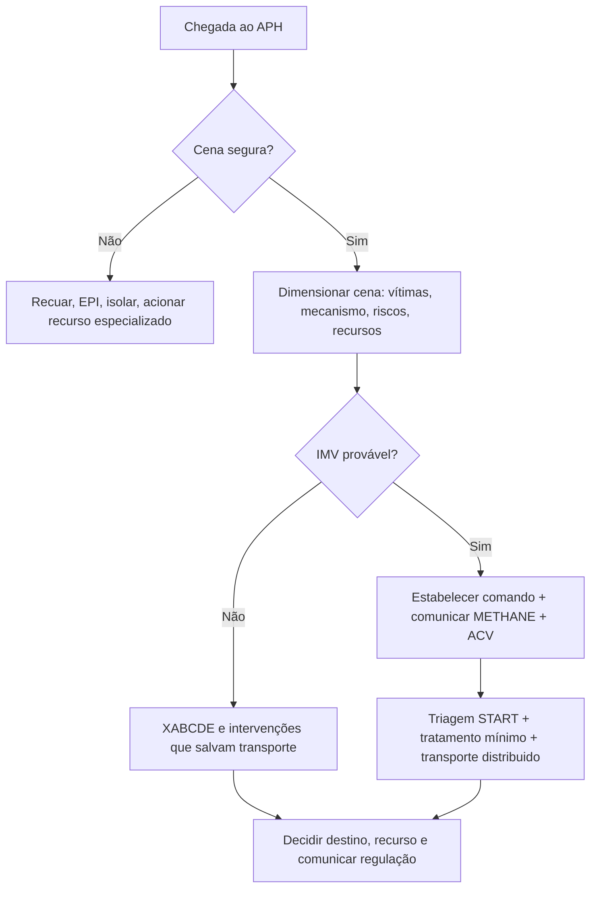
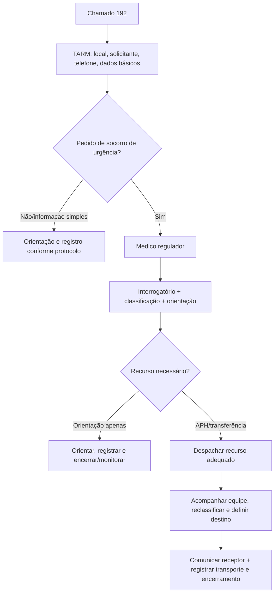
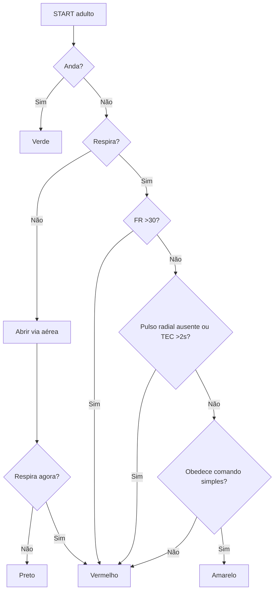
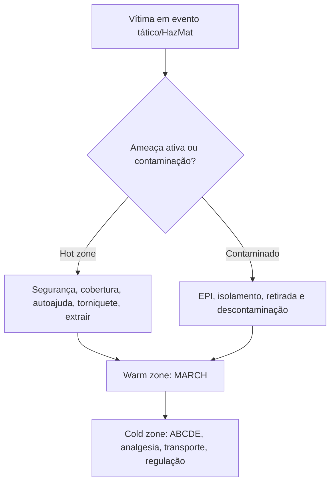

# APH, Regulação, IMV, Desastrês E Transporte

## Leitura de 30 segundos

- APH comeca antes do ABCDE: segurança da cena, EPI, posicionamento da viatura, avaliação de riscos, número de vítimas e pedido precoce de recursos.
- No SAMU, o médico regulador não é telefonista: ele classifica gravidade, orienta, decide recurso, acompanha atendimento/transporte e define destino dentro da rede.
- IMV é medicina de massa: se os recursos são insuficientes, a meta muda de "melhor para cada um" para "maior benefício para o maior número".
- START de adulto: anda = verde; não respira após abrir via aérea = preto; respira após abrir = vermelho; FR >30, perfusão ruim ou não obedece comandos = vermelho; o restante = amarelo.
- Transporte e intervenção de risco: estabilize o que mata agora, escolha o recurso correto, comunique destino e registre mudanças. Grave/riscos exige equipe e ambulância compatíveis.
- Temas ambientais que caem: afogamento = ventilação/rescue breaths; intermação = resfriar cedo; altitude = parar subida/descer; mergulho = O2 100%; hipotermia = manuseio gentil e aquecimento de tronco.

## Por que cai

- **Recorrência em provas/estações:** TEME22-25 cobrou cena de rodovia, cinemática, explosão, transporte aeromédico, mergulho/descompressão, altitude, afogamento, atendimento tático, intermação, papel do médico regulador e logística em contexto remoto/rural.
- **O que a banca costuma testar:** prioridade da primeira equipe, diferença entre APH é tratamento definitivo, START/SCI, "vaga zero", responsabilidades do regulador/transporte/receptor, zonas taticas, blast injury e condutas ambientais simples.
- **Como costuma aparecer:** caso cheio de distratores. A resposta certa geralmente protege equipe, organiza recurso, comúnica a rede e não faz procedimento heroico em cena insegura ou com acesso limitado.

## Abordagem prática

### 1. Primeiro minuto do APH

1. **Pare antes de entrar:** cena segura? EPI? tráfego? violência? eletricidade? fogo? produto químico? água? estrutura instável?
2. **Posicione a viatura como proteção:** em acidente rodoviário, use a ambulância para proteger a área e sinalizar fluxo; outros veículos ficam no mesmo lado e fora do fluxo de tráfego.
3. **Dimensione a cena:** mecanismo, número de vítimas, gravidade aparente, necessidade de bombeiros, polícia, concessionária, HazMat, suporte avançado, transporte múltiplo ou aeromédico.
4. **Declare e comunique:** informe regulação cedo. Em incidente grande, uma mensagem estruturada evita caos.
5. **Trate ameaças imediatas:** hemorragia massiva, via aérea, ventilação, choque, rebaixamento, hipotermia e dor.
6. **Defina destino e modo de transporte:** levar para o lugar certo vale mais do que ficar fazendo procedimento que não muda segurança do transporte.

Use uma mensagem tipo METHANE:

| Letra | Conteúdo | Exemplo prático |
|---|---|---|
| M | Major incident? | "Possível IMV" |
| E | Exact location | Rodovia, km, sentido, acesso |
| T | Type of incident | Capotamento, explosão, colisao multipla |
| H | Hazards | Fogo, produto químico, violência, eletricidade |
| A | Access/egress | Melhor entrada e saída |
| N | Number/severity | Número estimado e cores/críticos |
| E | Emergency services | Recursos já na cena e solicitados |

Crítico para transporte rápido:

- Via aérea ameacada ou ventilação inadequada.
- FR <10 ou >29, dispneia importante, tórax instável/deformidade grave.
- Sangramento ativo que exige torniquete, compressão ou tamponamento.
- Choque, mesmo compensado.
- Alteração de consciência, convulsão, déficit neurológico novo ou suspeita de TRM.
- Trauma penetrante exceto extremidade distal isolada.
- Amputação ou quase amputação proximal a punho/tornozelo.
- Extricacao prolongada, ejeccao, morte no mesmo compartimento ou intrusao importante.

> **Resposta de prova TEME:** a primeira equipe em cena não "sai tratando todo mundo". Ela protege a cena, dimensiona, pede recurso, organiza e só então executa intervenções que mudam sobrevida/transporte.

### 2. Médico regulador, CRU e SAMU 192

O fluxo mental:

1. TARM identifica solicitante, local, callback e dados basicos.
2. Todo pedido de socorro de urgência deve chegar ao médico regulador.
3. O regulador interroga, estima gravidade, da orientação, classifica prioridade e decide recurso.
4. Pode resolver por orientação, enviar USB, USA, motolancia, aeromédico/hidroviario ou articular outro recurso.
5. Acompanha a equipe, reavalia com dados da cena, define destino e avisa/repassa informações ao receptor.
6. Registra decisões, horários, orientações e intercorrências.

O que cai:

- O regulador tem função técnica e gestora.
- A central regula acesso ao APH e aos serviços hospitalares de urgência.
- experiência como intervencionista/urgência ajuda a estimar gravidade e coordenar recursos. Isso apareceu como armadilha no TEME25.
- Transporte e transferência não são responsabilidade "exclusiva" de uma ponta. Origem, regulador, equipe de transporte e receptor tem deveres proprios.

**Vaga zero, em uma linha:** em urgência com risco iminente e necessidade de recurso especializado, a unidade receptora deve acatar a determinação do médico regulador, independentemente de leito vago, com comunicação, registro e continuidade do cuidado.

> **Na prática clínica:** "vaga zero" não é autorização para jogar paciente sem estabilização, sem informação ou sem plano. É ferramenta regulatória excepcional para garantir acesso quando não aceitar o paciente seria mais perigoso.

### 3. Transporte terrestre e aeromédico

Antes de sair:

- Via aérea segura ou plano claro de resgate.
- Ventilação/oxigênio com reserva suficiente.
- Sangramento controlado, acesso venoso/IO funcional, drogas e bombas conferidas.
- Monitor, desfibrilador, aspiração, material de via aérea e analgesia disponíveis.
- Relatório MIST/SBAR para destino: mecanismo, lesões/queixa, sinais vitais, tratamentos, resposta.
- Documentos, exames e consentimentos quando aplicável.

Inter-hospitalar de paciente grave:

- Avaliação médica antes da remoção.
- Estabilização respiratória e hemodinâmica antes do transporte sempre que possível.
- Paciente grave ou de risco deve ir com equipe compatível, em geral suporte avançado com médico, enfermagem e condutor.
- Se o transporte for tecnicamente impossivel conforme a regra ideal, compare risco de transportar versus risco de permanecer sem recurso.

Aeromédico que a banca gosta:

| Tema | Ponto de prova |
|---|---|
| Primário | Equipe/aeronave vai até a cena |
| Secundário | Transferência inter-hospitalar |
| Asa rotativa | Acesso remoto/urbano, resgate, pouso próximo; pouca cabine, ruido, vibracao |
| Asa fixa | Distância maior, mais velocidade, cabine melhor; exige pista e transbordos |
| Altitude | Pressão cai e gases expandem na subida |
| Pneumotórax | Tratar/drenar antes do voo se risco relevante; estar pronto para descompressão |
| Cabine pressurizada | Geralmente equivale a 5.000-8.000 ft, não necessariamente nível do mar |
| Não pressurizada | Classicamente até 10.000 ft para compensação fisiológica em muitos protocolos |

Segurança com helicóptero:

- Zona de pouso isolada, sem pessoas/veículos próximos.
- Aproximar apenas com autorização da tripulacao.
- Aproximar pela frente/lateral, abaixado, com objetos abaixo dos ombros.
- Nunca aproximar pela cauda.
- Em terreno inclinado, aproximar pelo lado mais baixo.

### 4. IMV, SCI e desastres

IMV e quando a demanda ultrapassa a resposta disponível. O primeiro erro e transferir o caos para o hospital mais próximo.

Primeira equipe:

1. Estabelecer comando.
2. Confirmar segurança e zonas.
3. Dimensionar número de vítimas e recursos.
4. Comunicar regulação/defesa civil/bombeiros/hospitais.
5. Criar área de concentracao de vítimas (ACV), triagem, tratamento e transporte.
6. Distribuir pacientes por capacidade da rede, não por impulso.

Sistema de Comando de Incidentes (SCI/ICS):

- Estrutura modular: comando, operações, planejamento, logística e administracao/financas.
- Pode ser comando único ou unificado.
- Span of control clássico: 1-7 subordinados por lider; 5 é o número ideal.
- Objetivo: usar recursos disponíveis de forma eficiente, com linguagem comum e cadeia clara.

Regra de ouro:

| Cenário | Prioridade |
|---|---|
| Recursos suficientes | Mais graves primeiro |
| Recursos insuficientes | Sobrevida do maior número |
| Hospital em sobrecarga | Triagem reversa, alta segura, expansão de área e fluxo |

### 5. START adulto

START e triagem rápida, não tratamento completo. Em geral, 60-90 segundos por vítima.

1. **Consegue andar?** Verde.
2. **Não anda e não respira:** abrir via aérea.
3. **Não respira após abrir via aérea:** Preto.
4. **Respira após abrir via aérea:** Vermelho.
5. **FR >30/min:** Vermelho.
6. **Perfusão ruim:** sem pulso radial ou TEC >2 s = Vermelho.
7. **Não obedece comando simples:** Vermelho.
8. **Obedece, perfusão ok, FR <=30:** Amarelo.

Categorias:

| Cor | Nome | Significado |
|---|---|---|
| Verde | Mínimo | Deambula, baixo risco imediato |
| Amarelo | Tardio | Grave, mas pode esperar horas |
| Vermelho | Imediato | Intervenção/transporte em minutos |
| Preto | Obito/expectante | Sem chance com recurso disponível ou sem respiração após abertura |

Limites:

- START não é ideal para crianças pequenas: use JumpSTART se disponível.
- CBRN/HazMat pode exigir triagem/descontaminação específica.
- Triagem muda com tempo e recursos. Re-triagem é obrigatória.

### 6. Atendimento tático

| Zona | Prioridade | O que fazer |
|---|---|---|
| Ameaça direta / hot zone | Sobreviver e sair da linha de ameaça | Cobertura, autoajuda, torniquete em hemorragia exsanguinante, extrair para local mais seguro |
| Ameaça indireta / warm zone | MARCH | Hemorragia massiva, via aérea, respiração, circulação, hipotermia/head |
| Evacuação / cold zone | APH convencional | ABCDE, analgesia, imobilização seletiva, transporte e comunicação |

Na hot zone, não perca tempo com via aérea invasiva, RCP completa ou restrição espinhal formal. Se ainda há tiro/risco ativo, o tratamento e mover e controlar hemorragia que mata em minutos.

### 7. HazMat, CBRN e descontaminação

Sequência:

1. Não entrar sem EPI adequado.
2. Isolar área e definir zonas quente, morna e fria.
3. Identificar produto quando possível sem se expor.
4. Retirar vítimas da zona quente.
5. Remover roupas contaminadas e descontaminar antes de colocar na ambulância/hospital, se a contaminação permitir.
6. Só depois fazer atendimento clínico convencional, antídotos e transporte.

Pegada de prova: vítima contaminada não deve contaminar equipe, ambulância, sala vermelha e outros pacientes. Cena insegura é indicação de recuar, não de "coragem".

### 8. Explosão, esmagamento e queimaduras em cena

Explosão:

| Tipo | Mecanismo | Exemplo que cai |
|---|---|---|
| Primária | Onda de pressão | Ruptura timpânica, barotrauma pulmonar, concussao |
| secundária | Fragmentos/projeteis | Ferimentos penetrantes, lacerações |
| Terciária | Corpo arremessado/esmagado | Fraturas, trauma contuso |
| Quaternaria | Calor/gases/ambiente | Queimaduras, inalação, intoxicação |
| Quinaria | Agentes adicionados | Químico, biológico, radiológico |

Esmagamento/rabdomiólise em APH:

- Controle hemorragia e dor.
- Pense em hiperK antes/depois de extricacao prolongada.
- Acesso, ECG, cristaloide se indicado e coordenacao com destino.
- Não libere vítima de esmagamento prolongado sem plano de sala vermelha/nefro/UTI se risco alto.

Queimadura/elétrica/quimica:

- Cena primeiro: eletricidade e produto químico matam equipe.
- Resfriar queimadura térmica recente, remover roupas/acessorios não aderidos, analgesia, cobrir limpo/seco.
- Alta voltagem, inalação, trauma associado, face/mãos/genital, grandes áreas ou criança = regular para centro adequado.
- Em queimadura química: descontaminar conforme agente e protocolo local; não neutralizar as cegas.

### 9. Ambiental e áreas remotas

**Afogamento**

- Problema central é hipóxia. Comece por via aérea/ventilação.
- Inconsciente/apneico: posicionar via aérea e fazer 5 ventilações/rescue breaths quando aplicável.
- Não tente "drenar água" com manobra de Heimlich ou cabeça para baixo.
- O2, VNI se alerta e hipoxemia leve-moderada; IOT se rebaixado, vômitos, hipoxemia grave ou falência.
- Rx inicial pode ser normal. Se assintomático, normaliza e não piora, observação de 4-6 h costuma ser aceitável em diretriz atual; aula local usa até 8 h.

**Intermação/heat stroke**

- Suspeite se hipertermia + alteração neurológica, especialmente após esforço/calor.
- Antitermico não resolve.
- ABCDE e resfriamento agressivo. Se houver estrutura para resfriar, "cool first, transport second" é a mensagem de prova.
- Imersão em água fria é o método mais rápido quando viável; evaporativo/gelo em axila-virilha-pescoço se não.
- Alvo prático: interromper resfriamento quando temperatura central chegar perto de 38,6-39 C ou houver melhora/protocolo local.

**Altitude**

- Risco em não aclimatados acima de 2.500 m.
- AMS: cefaleia + fadiga, náuseas/vômitos, tontura, sono ruim após subida.
- Conduta: parar ascensão, repouso, analgesia/antiemético; descer se moderado/grave ou se piora. TEME cobrou descida de pelo menos 300 m.
- HACE: ataxia + alteração mental = descer/O2/dexametasona.
- HAPE: dispneia, queda de performance, tosse, hipoxemia/crepitantes = descer/O2/nifedipina se indicado.

**Mergulho**

- Pressão aumenta cerca de 1 atm a cada 10 m, somada a 1 atm da superfície. A 40 m, pressão absoluta é cerca de 5 ATA.
- Narcose por nitrogênio: parece embriaguez, clássica a partir de 30 m.
- Doença descompressiva: dor articular, rash/prurido, sintomas neurológicos ou vestibulares após mergulho/subida.
- Primeira conduta: O2 100% por máscara bem vedada/demand valve ou não reinalante 15 L/min, repouso, hidratação se alerta, contato com medicina hiperbárica/DAN e transporte.

**Hipotermia**

- Hipotermia acidental: temperatura central <=35 C ou quadro compatível quando não dá para medir bem.
- Manuseio gentil, retirar do frio, remover roupa molhada, barreira de vapor/isolamento e aquecer tronco.
- Moderada/grave: monitorização, evitar movimento brusco e aquecimento periférico isolado que favorece afterdrop.
- Se aparentemente sem pulso, checar pulso por até 1 minuto antes de iniciar RCP.
- Gasometria: não corrija valores pela temperatura para tomar decisões usuais de ventilação.

## Conceitos que sustentam a conduta

### Cena segura é tratamento

Equipe ferida vira mais vítima e reduz capacidade do sistema. Em APH, "entrar rápido" só e bom quando entrar e seguro. O primeiro procedimento pode ser estacionar bem, pedir recurso e isolar risco.

### Regulação e ato médico

Regulação de urgência envolve telemedicina, julgamento de gravidade e gestão de recursos escassos. A decisão não é só qual ambulância mandar; é orientar o solicitante, proteger a equipe, acompanhar a cena, escolher destino e garantir fluxo.

### Medicina individual vs medicina de massa

No plantão normal, a prioridade é o paciente mais grave. No IMV com recurso insuficiente, a prioridade é salvar o maior número possível. Isso explica por que uma vítima em PCR pode ser preto/expectante enquanto uma vítima vermelha respirando recebe recurso.

### Transporte pode descompensar

ambulância e aeronave são ambientes pequenos, barulhentos e com recursos finitos. Hipotensão, hipoxemia, pneumotórax, extubação, falta de O2 e falha de bateria acontecem no trajeto. Transporte seguro é checklist, não improviso.

## Fluxograma

## Doses, alvos e números

| Item | Número | observação TEME |
|---|---:|---|
| START por vítima | 60-90 s | Triagem rápida, não atendimento completo |
| START vermelho | FR >30/min | Ou respira após abrir VA, perfusão ruim, não obedece comando |
| START perfusão ruim | Sem pulso radial ou TEC >2 s | Depende do protocolo/local |
| START preto | Não respira após abrir VA | Em recurso insuficiente |
| SCI span of control | 1-7; ideal 5 | Banca cobrou estrutura flexivel |
| Queda de altura alto risco | >3 m | Cinemática de trauma |
| Intrusao veicular alto risco | >0,3 m no ocupante ou >0,5 m em qualquer área | Alem de extricacao, ejeccao, morte no mesmo compartimento |
| SpO2 trauma/crítico APH | >=94% | O2 e ventilação, depois titular |
| Aeromédico não pressurizado | Até 10.000 ft clássico | TEME22 Q66 foi anulada, cuidado com absolutos |
| Cabine pressurizada | 5.000-8.000 ft usual | Não afirmar que e nível do mar |
| Helicóptero | 30 m zona livre; espectadores 60 m; sem correr/fumar 15 m | Números de aula |
| Pressão no mergulho | +1 atm/10 m + 1 atm superfície | 40 m ~= 5 ATA |
| Narcose por nitrogênio | Típica a partir de 30 m | Parece embriaguez |
| DCS/mergulho | O2 100%; MNR 15 L/min se sem demand valve | Chamar medicina hiperbárica/DAN |
| Altitude risco | >2.500 m em não aclimatado | Pode ocorrer mais baixo em suscetiveis |
| AMS TEME | Descer pelo menos 300 m se sintomático relevante | Descida é mais efetiva |
| Heat stroke | SNC alterado + hipertermia | Antitermico não trata |
| Alvo de resfriamento | 38,6-39 C | Evitar overcooline; seguir protocolo |
| Afogamento | 5 ventilações iniciais em apneico/inconsciente | Não drenar água |
| observação afogamento | 4-6 h atual; até 8 h aula local | Se normal e sem deterioração |
| Hipotermia | <=35 C | Diagnóstico clínico se sem termometro confiável |
| Hipotermia grave | <28 C | Alto risco de arritmia/PCR |
| Checar pulso hipotermia | Até 1 min | Antes de declarar sem pulso |
| Queimadura importante adulto | >20% SCQ | Aula local; depende de contexto e recurso |
| Queimadura importante criança | >10% SCQ | Regular para centro adequado |
| Torniquete | Alto e apertado se hemorragia exsanguinante | Registrar horário |

## Pegadinhas TEME

- **Cena insegura e "ABCDE heroico":** falso. Segurança vem antes.
- **Primeira equipe em IMV deve iniciar tratamento detalhado:** falso. Primeiro comando, dimensionamento, recursos e triagem.
- **IMV = salvar o paciente mais grave sempre:** falso se recurso insuficiente; e maior benefício coletivo.
- **START verde e paciente sem lesão:** falso. Verde deambula, mas ainda precisa reavaliação.
- **Não respira = preto imediatamente:** em START adulto, abra via aérea primeiro; se passar a respirar, e vermelho.
- **FR 28 no START e vermelho:** não pelo critério respiratório isolado; vermelho se >30 ou outros critérios.
- **START serve para qualquer CBRN/HazMat:** cuidado. Pode haver algoritmo e descontaminação específicos.
- **SCI e estrutura fixa e burocratica:** falso. E modular e escalavel.
- **Span ideal do SCI e 12 por lider:** falso. Ideal clássico e 5.
- **Médico regulador só aciona viatura:** falso. Ele orienta, classifica, acompanha, decide recurso/destino e coordena fluxo.
- **Transferência assistida e responsabilidade exclusiva do regulador:** falso. Origem, transporte, regulação e receptor compartilham deveres.
- **Vaga zero dispensa estabilização/comunicação:** falso.
- **Aeronave pressurizada sempre equivale a nível do mar:** falso. Cabine costuma ficar em altitude equivalente.
- **Pneumotórax pequeno sempre pode voar sem plano:** falso. Avalie risco, pressão, ventilação positiva e capacidade de descompressão.
- **Intermação se trata com antitérmico e transporte imediato:** falso. Resfriamento agressivo é prioridade.
- **Afogamento: virar de cabeça para baixo para tirar água:** falso. Ventile.
- **Doença descompressiva leve pode apenas observar:** falso na prova. O2 100% e contato hiperbarico.
- **Ruptura timpânica em explosão é lesão secundária:** falso. É primária.
- **Hot zone tática pede RCP/VA invasiva:** falso. Controle hemorragia exsanguinante e evacue.

## Erros fatais na prática

- Entrar em cena com risco de atropelamento, violência, fogo, eletricidade ou contaminação.
- Não pedir recurso cedo e descobrir tarde que há mais vítimas do que equipe.
- Fazer procedimento demorado em paciente crítico que precisa de centro de trauma/UTI.
- Não comunicar destino, chegando com paciente grave sem preparo receptor.
- Transportar intubado sem O2/bateria/aspiração/droga suficiente.
- Não reconhecer IMV e levar todos para o hospital mais próximo.
- Misturar área contaminada com ambulância/sala vermelha.
- Errar triagem por compaixão individual e gastar recurso escasso no expectante.
- Não reavaliar verde/amarelo que deteriora.
- Levar paciente de mergulho/altitude/calor para observação simples sem tratar fisiologia tempo-dependente.
- Aquecer hipotermico grave movimentando demais e aquecendo periferia isoladamente.

## Para prova vs na prática

> **Para prova TEME:** cena segura antes do ABCDE; rodovia exige posicionamento protetor da ambulância; START adulto usa andar, respiração, FR >30, perfusão e comando; IMV exige comando e maior benefício coletivo; médico regulador tem papel técnico/gestor; intermação deve ser resfriada antes de transporte quando possível; afogamento apneico recebe abertura de VA e 5 ventilações; DCS recebe O2 100%; ruptura timpânica e blast primário.
>
> **Na prática clínica:** protocolos locais de SAMU, bombeiros, defesa civil, polícia, concessionária e hospitais definem detalhes operacionais. START é muito cobrado, mas sistemas como SALT/JumpSTART podem ser preferidos em serviços específicos. Em "vaga zero", documentação, comunicação e estabilização proporcional ao risco protegem paciente, equipe e rede.

## Checklist de revisão

- [ ] Sei que APH comeca por segurança, cena, EPI e recursos.
- [ ] Sei comunicar IMV com METHANE.
- [ ] Sei diferenciar APH normal de medicina de massa.
- [ ] Sei montar mentalmente comando, ACV, triagem, tratamento e transporte.
- [ ] Sei START adulto sem olhar.
- [ ] Sei as categorias verde, amarelo, vermelho e preto.
- [ ] Sei as funções do médico regulador e a lógica de vaga zero.
- [ ] Sei checar transporte antes de sair: VA, ventilação/O2, drogas, monitor, comunicação e relatório.
- [ ] Sei riscos do aeromédico: altitude, gases, pneumotórax e cabine.
- [ ] Sei zonas hot/warm/cold no atendimento tático.
- [ ] Sei que HazMat exige EPI, isolamento e descontaminação antes de contaminar a rede.
- [ ] Sei blast primário, secundário, terciario, quaternario e quinario.
- [ ] Sei afogamento, intermação, altitude, mergulho e hipotermia em uma linha cada.

## Questões e estações relacionadas

- **TEME22 Q1:** rodovia com vítima em faixa de rolamento: melhor posicionamento da ambulância para proteger a cena e desviar fluxo.
- **TEME22 Q25:** cinemática de trauma e risco por mecanismo.
- **TEME22 Q30:** triagem/priorização também aloca recursos, não apenas ordem de chegada.
- **TEME22 Q41:** mergulho profundo com dor articular/rash/prurido = doença descompressiva; O2 por máscara não reinalante 15 L/min.
- **TEME22 Q54:** mal agudo da montanha em 3.000 m; conduta de prova = descer pelo menos 300 m.
- **TEME22 Q56:** explosão com ruptura de membrana timpânica = lesão primária por blast.
- **TEME22 Q66:** transporte aeromédico; questão anulada, mas revisar primário/secundário, altitude e cabine.
- **TEME23 Q19:** narcose por nitrogênio, com quadro semelhante a embriaguez, clássica a partir de 30 m.
- **TEME23 Q27:** atendimento tático sob ameaça direta: autoajuda sempre que possível e controle de hemorragia exsanguinante.
- **TEME23 Q33:** afogamento inconsciente/apneico: abrir via aérea e realizar 5 ventilações.
- **TEME23 Q93:** intermação/heat stroke: resfriamento prioritário, antes do transporte quando há condição.
- **TEME25 Q70:** contexto rural/remoto: POCUS pode antecipar decisão, regulação e logística.
- **TEME25 Q75:** via aérea em cena/extricacao: considerar acesso limitado, segurança e manobras simples enquanto se organiza resgate.
- **TEME25 Q79:** médico regulador e atribuições/experiência na Central de Regulação das Urgências.
- **Emergency Talks Aula 11:** SCI, START, ACV, IMV e "não transferir o caos".

## Referências

**Prova/TEME**

- Conteúdo programático TEME26.
- Provas teóricas TEME22, TEME23, TEME24 e TEME25.
- Referências oficiais do edital: Tratado ABRAMEDE 2024, Medicina de Emergência HCFMUSP, POCUS ABRAMEDE, Manual de Via aérea 2025 e demais capítulos de APH/desastres/trauma ambiental.

**Material local**

- Emergency Talks: Aula 07 - Princípios do APH.
- Emergency Talks: Aula 11 - Incidentes com múltiplas vítimas.
- Emergency Talks: Aula 37 - Trauma ambiental I.
- Emergency Talks: Aula 56 - Trauma ambiental II e áreas remotas.
- Emergency Talks: Aula 04 - Avaliação inicial do politraumatizado.
- Resumo do Emergency.docx.
- Adendos para complementar.docx.

**Atualização clínica e normativa**

- Ministério da Saúde. Regulação Médica das Urgências. https://www.gov.br/saude/pt-br/composicao/saes/samu-192/publicacoes/regulacao_medica_urgencias.pdf/view
- Ministério da Saúde. Portaria GM/MS 2.048/2002, Regulamento Técnico dos Sistemas Estaduais de Urgência e Emergência. https://bvs.saude.gov.br/bvs/saudelegis/gm/2002/anexo/anexo_prt2048_05_11_2002.pdf
- Ministério da Saúde. Portaria GM/MS 1.010/2012, SAMU 192 e Central de Regulação das Urgências. https://bvsms.saude.gov.br/bvs/saudelegis/gm/2012/prt1010_21_05_2012_atual.html
- Ministério da Saúde. Centrais de Regulação. https://www.gov.br/saude/pt-br/composicao/saes/drac/regulacao/regulacao-do-acesso/centrais-de-regulacao/centrais-de-regulacao
- Conselho Federal de Medicina. Resolução CFM 2.110/2014, serviços pré-hospitalares móveis. https://sistemas.cfm.org.br/normas/visualizar/resolucoes/BR/2014/2110
- Conselho Federal de Medicina. Resolução CFM 1.672/2003, transporte inter-hospitalar de pacientes. https://sistemas.cfm.org.br/normas/visualizar/resolucoes/BR/2003/1672
- Conselho Federal de Medicina. Resolução CFM 2.077/2014, serviços hospitalares de urgência e emergência. https://sistemas.cfm.org.br/normas/visualizar/resolucoes/BR/2014/2077
- CHEMM/ASPR/HHS. START Adult Triage Algorithm. https://chemm.hhs.gov/startadult.htm
- CHEMM/ASPR/HHS. SALT Mass Casualty Triage Algorithm. https://chemm.hhs.gov/salttriage.htm
- FEMA. National Incident Management System, 2017. https://www.fema.gov/sites/default/files/2020-07/fema_nims_doctrine-2017.pdf
- Wilderness Medical Society. Heat Illness Clinical Practice Guidelines, 2024 update. https://journals.sagepub.com/doi/full/10.1177/10806032241227924
- Wilderness Medical Society. Acute Altitude Illness Clinical Practice Guidelines, 2024 update. https://journals.sagepub.com/doi/10.1016/j.wem.2023.05.013
- Wilderness Medical Society. Drownine Clinical Practice Guidelines, 2024 update. https://journals.sagepub.com/doi/10.1177/10806032241227460
- Wilderness Medical Society. Accidental Hypothermia Clinical Practice Guidelines, 2019 update. https://journals.sagepub.com/doi/10.1016/j.wem.2019.10.002
- Divers Alert Network. Decompression Illness: What Is It and What Is the Treatment? https://dan.org/health-medicine/health-resources/diseases-conditions/decompression-illness-what-is-it-and-what-is-the-treatment/
