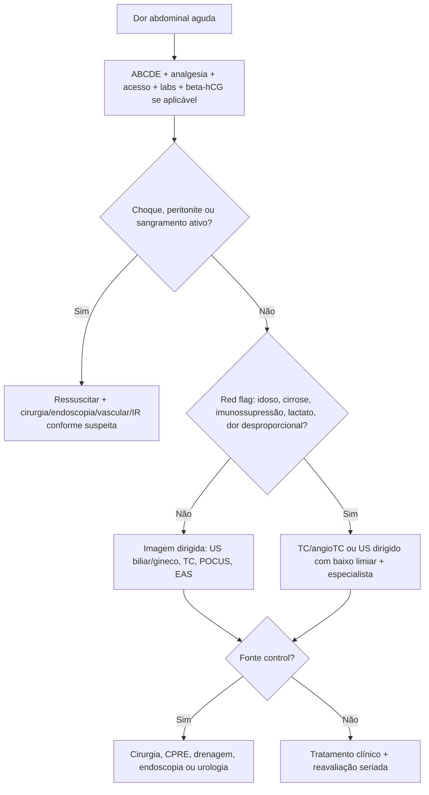
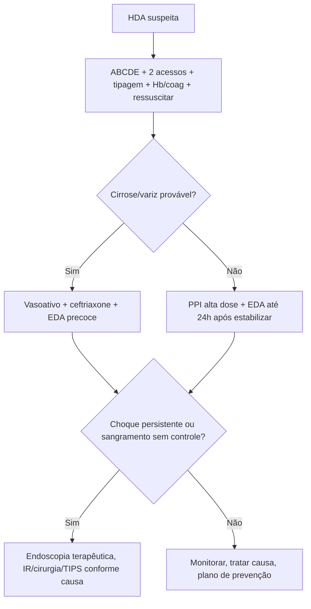
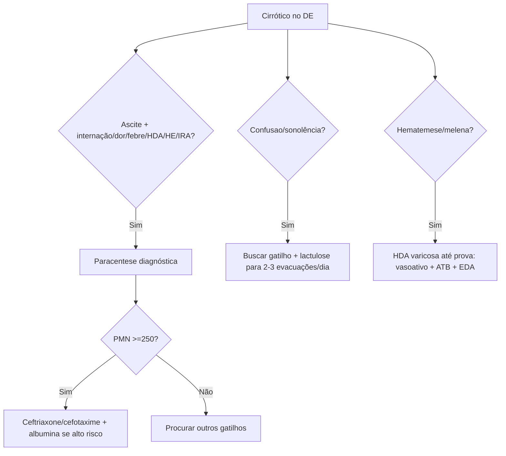
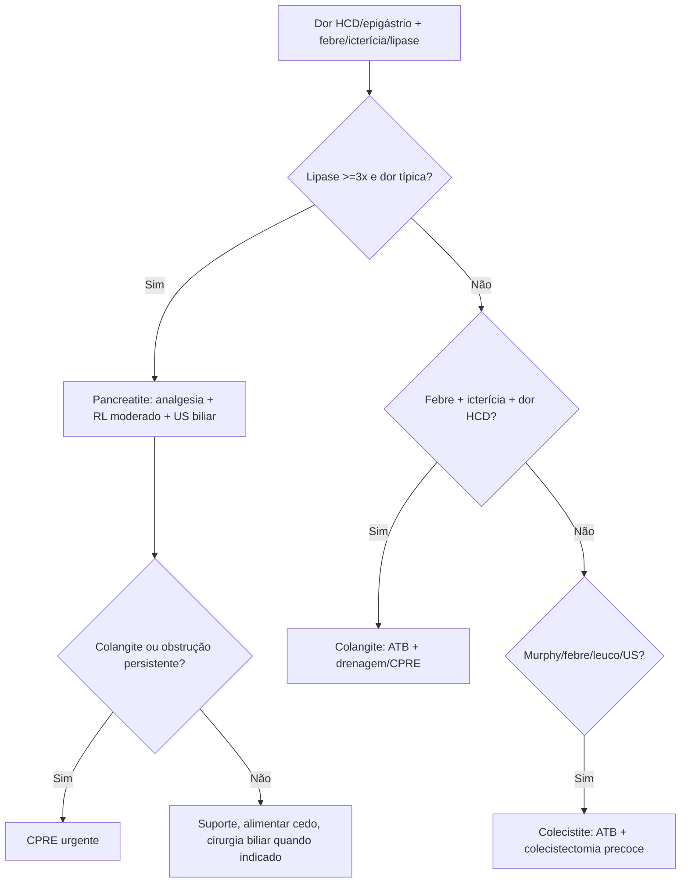

# Gastro, Hepatologia E Abdome Agudo

## Leitura de 30 segundos

- Abdome agudo no DE e primeiro fisiologia, depois etiqueta diagnóstica: choque, peritonite, sangramento, isquemia, perfuração, obstrução, gestação ectópica e AAA.
- Analgesia não atrapalha diagnóstico. Dor tratada deixa o exame melhor; não espere cirurgião para aliviar sofrimento.
- Cirrótico no pronto-socorro tem infecção e sangramento até prova em contrário: paracentese se ascite, antibiótico se HDA varicosa, lactulose se encefalopatia e cuidado com rim.
- HDA: estabilize, acesso, tipagem/prova cruzada, transfusão restritiva, PPI se não varicosa provável; se cirrose/variz, vasoativo + ceftriaxone + EDA precoce.
- Pancreatite: 2 de 3 critérios, analgesia, cristaloide balanceado moderado, alimentar cedo quando tolera; CPRE urgente só se colangite ou obstrução biliar persistente.
- Biliar: colecistite = cirurgia precoce; colangite = antibiótico + drenagem biliar/CPRE, principalmente se grave.
- Isquemia mesenterica, perfuração, AAA roto e obstrução estrangulada são diagnósticos de tempo: TC/angioTC e cirurgia/intervenção cedo.
- Ureterolitíase infectada e torção testicular são "abdome" que você não pode perder: obstrução + infecção = desobstruir; testículo torcido = urologia agora.

## Por que cai

- **Recorrência em provas/estações:** TEME22-25 cobrou HDA em cirrótico, PBE, encefalopatia/cirrose, pancreatite biliar, diverticulite, apendicite, dor abdominal em mulher, ferimento abdominal, POCUS/FAST, perfuração, ureterolitíase com obstrução, colangite, C. difficile e torção testicular.
- **O que a banca costuma testar:** primeira conduta, indicação de TC/US/POCUS, quando chamar cirurgia/urologia/endoscopia, quando não atrasar antibiótico, quando fazer paracentese, e diferença entre colecistite, colangite e pancreatite biliar.
- **Como costuma aparecer:** caso com dor abdominal + sinais discretos. A resposta certa geralmente identifica gravidade por idade, comorbidade, choque, lactato, peritonite, imunossupressão/cirrose ou falha de melhora.

## Abordagem prática

### 1. Primeiro minuto do abdome agudo

1. **ABCDE e sinais vitais repetidos:** choque, febre, hipoxemia, rebaixamento e dor desproporcional mudam prioridade.
2. **Perguntas que matam:** gestação? anticoagulante? cirrose? aneurisma? cirurgia prévia? imunossupressão? trauma? diálise? dor testicular? melena/hematemese?
3. **Exame dirigido:** peritonismo, distensão, hernias, pulsos, pele, flancos, toque retal/vaginal quando muda conduta, testículo no homem com dor baixa/lombar.
4. **Analgesia e antiemético cedo:** não espere diagnóstico fechado.
5. **Exames base:** hemograma, eletrólitos/renal, função hepática, bilirrubina, lipase, lactato/gaso se grave, coagulograma se sangramento/cirrose/anticoagulante, EAS, beta-hCG em mulher em idade fertil.
6. **Imagem por risco:** US para biliar/gineco/AAA/POCUS; TC com contraste para abdome agudo sem diagnóstico, idoso, peritonite, obstrução, diverticulite complicada, perfuração, isquemia.
7. **Fonte control:** cirurgia, endoscopia, radiologia intervencionista, CPRE ou urologia quando há foco que não resolve com remedio.

Sinais de abdome que mata:

- Dor desproporcional ao exame, acidose/lactato, FA/aterosclerose: isquemia mesenterica.
- Dor epigástrica/dorso, hipotensão, massa pulsavel, idoso: AAA roto.
- Pneumoperitonio, rigidez, peritonite: perfuracao.
- Vômitos persistentes, distensão, parada de flatos/fezes, hernia dolorosa: obstrução/estrangulamento.
- Dor HCD + febre + icterícia ou choque/confusão: colangite.
- Cirrótico com ascite + dor/febre/confusão/IRA: PBE.
- HDA + cirrose: variz até prova em contrário.
- Dor testicular súbita + náusea/vômito: torção.

> **Resposta de prova TEME:** leucograma normal não exclui abdome agudo inflamatório. Analgesia adequada não "máscara" o diagnóstico.

### 2. Exame, imagem e POCUS

| Cenário | Melhor próximo passo prático |
|---|---|
| Instável com trauma | eFAST/POCUS + ressuscitação + cirurgia/intervenção |
| Instável sem trauma e suspeita AAA | POCUS aorta; se instável, cirurgia vascular; se tolera, angioTC |
| Peritonite franca | Cirurgia; TC se não atrasar e paciente tolera |
| Idoso com dor vaga | Baixo limiar para TC com contraste |
| Mulher em idade fertil | beta-hCG antes de "abdome clínico" |
| HCD/biliar | US, labs hepaticos; POCUS pode encurtar caminho |
| Flanco/cólica renal | EAS, creatinina; POCUS hidronefrose; TC sem contraste se dúvida/complicação |
| Suspeita isquemia mesenterica | AngioTC, não espere lactato |
| HDA/HDB instável | Reanimação + endoscopia/angioTC conforme fonte provável |

POCUS ajuda, mas não absolve:

- FAST negativo não exclui lesão intra-abdominal significativa, especialmente em estável.
- Líquido livre em trauma presume sangue até prova em contrário.
- Líquido livre em cirrótico provavelmente ascite, não hemoperitônio, se contexto e POCUS compatíveis.
- Apendicite no POCUS pode ser altamente sugestiva, mas exame negativo não exclui.
- Hidronefrose + febre/sepse sugere obstrução infectada: urologia.

### 3. Hemorragia digestiva alta

Primeiras medidas:

1. ABCDE, dois acessos calibrosos, monitor, tipagem/prova cruzada, Hb seriada, coagulograma, plaquetas, lactato se grave.
2. Ressuscitar antes de endoscopia. Se choque/rebaixamento/vômito ativo, planejar via aérea.
3. Transfusão restritiva na maioria: alvo Hb 7-9 g/dL; considerar limiar maior em isquemia ativa/cardiopatia grave.
4. Não varicosa provável: PPI em alta dose, EDA em até 24 h após estabilização.
5. Varicosa/cirrose provável: vasoativo imediato + ceftriaxone + EDA idealmente em até 12 h após estabilização.
6. Falha endoscópica/choque persistente: radiologia intervencionista, cirurgia ou TIPS conforme causa/recurso.

Varicosa até prova em contrário se:

- Cirrose, ascite, icterícia, telangiectasias, esplenomegalia, plaqueta baixa.
- Hematemese importante, melena, choque.
- História de varizes ou ligadura prévia.

Conduta de variz:

- Octreotide/terlipressina assim que suspeitar, antes da EDA.
- Antibiótico profilatico: ceftriaxone e clássico em cirrótico com HDA.
- EDA com ligadura elastica se variz esofágica.
- Lactulose se encefalopatia, mas sem atrasar controle de sangramento.
- Evite excesso de volume/transfusão: aumenta pressão portal e ressangramento.

> **Pegada TEME:** em HDA varicosa, antibiótico não é "para quando tiver febre"; e profilaxia/tratamento preventivo de infecção e PBE.

### 4. Cirrose descompensada: ascite, PBE, encefalopatia e rim

Todo cirrótico internado com ascite nova, dor abdominal, febre, HDA, hipotensão, encefalopatia, IRA ou piora clínica merece paracentese diagnóstica.

PBE:

- Diagnóstico: PMN no líquido ascítico >=250 cel/mm3, independentemente de cultura.
- Tratamento clássico: ceftriaxone ou cefotaxime.
- Albumina reduz risco renal/mortalidade em PBE de maior risco: 1,5 g/kg no dia 1 e 1 g/kg no dia 3.
- Não espere cultura se o paciente está grave.

Encefalopatia hepática:

1. Procurar gatilho: HDA, PBE, constipação, sedativo/opioide, infecção, hipocalemia, alcalose, IRA, desidratação, TIPS.
2. Lactulose para 2-3 evacuações pastosas/dia.
3. Rifaximina se recorrente, grave ou resposta parcial, conforme disponibilidade.
4. Não intube só por amônia alta; intube se não protege via aérea.

Ascite tensa:

- Paracentese de alívio se desconforto respiratório/dor/tensao importante.
- Se retirar >5 L, repor albumina 6-8 g por litro removido.

Rim no cirrótico:

- Pare diuréticos/nefrotóxicos se IRA/hipovolemia.
- Trate infecção e sangramento.
- Albumina quando indicado.
- Suspeite síndrome hepatorrenal após excluir hipovolemia, choque, nefrotóxicos e lesão renal estrutural.

### 5. Pancreatite aguda

Diagnóstico: 2 de 3.

- Dor típica epigástrica, irradiando para dorso.
- Lipase/amilase >=3 vezes limite superior.
- Imagem compatível.

Conduta inicial:

1. Analgesia forte, antiemético, jejum só enquanto vomita/dor intensa.
2. Cristaloide balanceado, em geral Ringer lactato, com estratégia moderada e reavaliação.
3. Procurar etiologia: biliar, álcool, triglicerídeos, cálcio, medicações, trauma, CPRE, escorpião.
4. US de abdome para litiase biliar.
5. Alimentacao oral/enteral precoce quando tolera; não precisa "zerar dieta" por dias.
6. Antibiótico não é rotina em pancreatite esteril.
7. TC precoce não é obrigatória se diagnóstico claro e evolução boa; considerar se dúvida, grave, falha de melhora ou complicação.
8. CPRE urgente se colangite ou obstrução biliar persistente.

Gravidade:

- SIRS persistente, falência orgânica, hipotensão, hipoxemia, IRA, necrose/infecção, idade/comorbidade.
- BISAP ajuda, mas o plantão manda: lactato, diurese, BUN/ureia, creatinina, hematocrito, oxigenação e pressão.

> **Resposta de prova TEME:** pancreatite biliar sem colangite não vai automaticamente para CPRE urgente. Colangite muda tudo.

### 6. Colecistite, colangite e icterícia

| Quadro | Pistas | Conduta que cai |
|---|---|---|
| cólica biliar | Dor HCD/epigástrio pós-prandial, sem febre/peritonite, labs normais | Analgesia, antiemético, US, cirurgia eletiva se recorrente |
| Colecistite | Dor HCD >6 h, Murphy, febre/leuco, parede espessada/líquido perivesicular | Antibiótico + colecistectomia precoce se candidato |
| Colangite | Febre + icterícia + dor HCD; grave se choque/confusão | Antibiótico + drenagem biliar/CPRE urgente |
| Coledocolitiase | Icterícia/colestase, dilatação de via biliar, dor | Estratificar; CPRE se alto risco/colangite |
| Hepatite aguda | Icterícia + transaminase muito alta, dor inespecifica | Suporte, etiologia, sinais de falência hepática |

Colangite grave:

- Charcot: febre, icterícia, dor HCD.
- Reynolds: Charcot + hipotensão/confusão.
- Reanimação, hemoculturas se não atrasarem, antibiótico amplo e chamada precoce para CPRE/drenagem.

### 7. Apendicite, diverticulite e dor em mulher

**Apendicite**

- Migração da dor para FID, anorexia, náusea/vômito, febre baixa, dor localizada, peritonismo.
- US pode ser primeiro em criança/gestante; TC com contraste em adulto se dúvida.
- Antibiótico não deve ser postergado em paciente com suspeita relevante/perfuracao/sepse.
- Cirurgia é resposta clássica, especialmente complicada. Tratamento não operatório pode ser opção selecionada, mas não é "sem risco".

**Gestante/mulher em idade fertil**

- Sempre beta-hCG.
- Ectópica: dor + atraso/sangramento/síncope; US transvaginal e gineco.
- Torção ovariana: dor pélvica súbita, náusea/vômito; US Doppler ajuda, mas Doppler normal não exclui.
- DIP/abscesso tubo-ovariano: dor pélvica, febre, corrimento/dor mobilização colo; antibiótico e gineco.

**Diverticulite**

- Dor FIG, febre, alteração intestinal; TC confirma e classifica.
- Uncomplicada, imunocompetente, leve e sem sepse: pode não precisar antibiótico na prática atual.
- Antibiótico se imunossuprimido, comorbido, sepse, sintomas importantes, abscesso, perfuração, obstrução ou falha de melhora.
- Abscesso grande: drenagem percutanea quando possível.
- Peritonite/instabilidade/perfuracao livre: cirurgia.

> **Para prova TEME:** se alternativa antiga disser diverticulite aguda não complicada com antibiótico, cuidado com o ano/fonte. A prática atual aceita selecionar sem antibiótico; a banca pode cobrar conduta clássica ou atual conforme enunciado.

### 8. Obstrução, perfuração, isquemia e AAA

**Obstrução intestinal**

- Dor cólica, distensão, vômitos, parada de eliminacao de fezes/flatos.
- Passado de cirurgia = aderência; hernia = encarceramento; idoso = neoplasia/volvo.
- Instável, peritonite, febre, leucocitose importante, lactato, dor contínua, pneumatoses ou ar portal = estrangulamento/isquemia.
- Conduta: NPO, analgesia, cristaloide, corrigir eletrólitos, sonda se vômitos/distensão importante, TC com contraste, cirurgia se complicação.

**Volvo**

- Sigmoide estável sem peritonite: descompressão endoscópica pode ser inicial, depois cirurgia definitiva.
- Cecal: geralmente cirúrgico; descompressão endoscópica não é confiável.

**Perfuração**

- Dor súbita, peritonite, pneumoperitonio.
- Antibiótico amplo, ressuscitação e cirurgia.
- Úlcera perfurada pode aparecer como dor epigástrica com POCUS/RX sugerindo ar livre.

**Isquemia mesenterica**

- Dor desproporcional, FA, aterosclerose, baixo fluxo/choque, diarreia/sangue, lactato/acidosé tardios.
- AngioTC é exame-chave. Lactato normal não exclui.
- Antibiótico, heparina se arterioembólica/trombose sem contra, cirurgia/intervenção vascular cedo.

**AAA roto**

- Idoso, dor abdominal/lombar/síncope/choque. Nem sempre tem massa palpável.
- POCUS aorta no instável; angioTC se tolera.
- Não normalize PA as cegas se suspeita de ruptura; vascular agora.

### 9. Urológicas que simulam abdome

**cólica renal/ureterolitíase**

- Dor em flanco irradiada para virilha/testículo, náusea/vômito, hematúria.
- AINE e analgésico de primeira linha se rim/perfusão permitem; opioide se necessário.
- TC sem contraste é mais sensível; POCUS hidronefrose ajuda no beira-leito.
- Alta possível se dor controla, sem infecção, rim único, IRA, obstrução importante, vômitos incoercíveis ou diagnóstico alternativo.

**Pielonefrite obstrutiva**

- Febre/sepse + hidronefrose/cálculo/obstrução = antibiótico EV + drenagem urgente por duplo J ou nefrostomia.
- Não é "esperar o antibiótico fazer efeito".

**Torção testicular**

- Dor testicular súbita, náusea/vômito, testículo alto/horizontal, reflexo cremasterico ausente.
- Diagnóstico é clínico quando forte; US não deve atrasar exploração.
- Janela clássica: ideal antes de 6 h.

### 10. Diarreia, colite e C. difficile

Avalie gravidade:

- Desidratação, sangue, febre alta, dor intensa, imunossupressão, idoso, gestante, sepse, surtos, uso recente de antibiótico/internação.
- Diarreia aquosa leve sem risco: hidratação e sintomático.
- Disenteria, sepse, viajante grave ou imunossuprimido: investigar e considerar antibiótico conforme contexto.

C. difficile:

- Suspeite após antibiótico recente, internação, idade, IPP, dor cólica, febre, leucocitose.
- Testar se diarreia não explicada, geralmente >=3 evacuações liquidas/24 h.
- Inicial não fulminante: fidaxomicina preferida nas diretrizes atuais; vancomicina VO alternativa muito usada.
- Fulminante: hipotensão/choque, ileo ou megacólon = vancomicina VO/NG em dose alta + metronidazol EV; considerar vancomicina retal se ileo e cirurgia precoce se deteriora.
- Evitar loperamida em colite grave/tóxica.

## Conceitos que sustentam a conduta

### Dor tratada melhora diagnóstico

O mito da analgesia que máscara abdome agudo ainda aparece em prova. No DE moderno, dor controlada permite exame seriado melhor. O que máscara diagnóstico e não reavaliar.

### Abdome do idoso e do cirrótico fala baixo

Idoso, diabético, imunossuprimido e cirrótico podem ter pouca febre, pouca leucocitose e pouco peritonismo. A banca gosta de "abdome quase normal" com fisiologia ruim.

### Controle de foco é a palavra-chave

Antibiótico compra tempo; não drena bile infectada, não opera perfuração, não desobstrui ureter infectado, não resolve estrangulamento e não liga variz. Pergunte sempre: existe foco que precisa de procedimento?

### Cirrose muda o risco de tudo

HDA em cirrótico infecta, PBE encefalopata, diurético derruba rim, benzodiazepínico piora consciência, transfusão demais aumenta pressão portal. A conduta boa e fisiológica, não "pacote único".

## Fluxograma

## Doses, alvos e números

| Item | Número | observação TEME |
|---|---:|---|
| Transfusão HDA | Hb <7 g/dL na maioria | Considerar maior se isquemia/cardiopatia ativa |
| EDA HDA não varicosa | Até 24 h após estabilizar | Antes se instável/alto risco e recurso |
| EDA varicosa | Ideal até 12 h após estabilizar | Vasoativo + ATB antes |
| Pantoprazol alta dose | 80 mg EV bolus + 8 mg/h ou alta dose intermitente | pós/endoscopia conforme risco; muitos serviços iniciam pré-EDA |
| Octreotide | 50 mcg EV bolus, depois 50 mcg/h | Variz suspeita |
| Terlipressina | 2 mg EV 4/4 h inicialmente | Alternativa vasoativa, conforme disponibilidade |
| Ceftriaxone HDA cirrótico | 1 g EV/dia por 5-7 dias | Profilaxia infecciosa/PBE |
| PBE diagnóstico | PMN ascite >=250/mm3 | Cultura não precisa positivar |
| Albumina PBE | 1,5 g/kg dia 1 + 1 g/kg dia 3 | Maior risco renal/grave; muito cobrado |
| Paracentese de alívio | Albumina 6-8 g/L se >5 L retirados | Evita disfunção circulatória |
| Lactulose HE | 20-30 g VO/SNE/retal repetido, depois ajustar | Alvo 2-3 evacuações pastosas/dia |
| Rifaximina | 550 mg VO 12/12 h | Recorrente/parcial, conforme recurso |
| Pancreatite diagnóstico | 2 de 3 critérios | Dor, enzima >=3x, imagem |
| Pancreatite TC | 48-72 h se dúvida/falha/grave | TC precoce pode subestimar necrose |
| CPRE pancreatite biliar | Urgente se colangite/obstrução persistente | Não é rotina em toda pancreatite biliar |
| Colecistite | Colecistectomia precoce | Se candidato cirúrgico |
| Colangite grave | Drenagem biliar urgente | Antibiótico sozinho pode falhar |
| Diverticulite abscesso | Drenagem se grande, usual >=4-5 cm | Depende de recurso/local |
| START urológico infecção + obstrução | Desobstrução urgente | Duplo J ou nefrostomia |
| Torção testicular | Ideal <6 h | US não deve atrasar se clínica forte |
| C. difficile inicial | Fidaxomicina 200 mg 12/12 h 10 d ou vanco VO 125 mg 6/6 h 10 d | Diretriz atual prefere fidaxomicina |
| C. difficile fulminante | Vanco VO/NG 500 mg 6/6 h + metronidazol EV 500 mg 8/8 h | Considerar vanco retal se ileo |
| Lactato/isquemia | Normal não exclui | Dor desproporcional manda angioTC |
| AAA | Diâmetro >=3 cm define aneurisma | Instável com suspeita = vascular/POCUS |

## Pegadinhas TEME

- **Analgesia máscara abdome agudo:** falso. Analgesia adequada e reavaliação seriada.
- **Leucograma normal exclui apendicite/diverticulite:** falso.
- **FAST negativo descarta lesão abdominal:** falso, principalmente em paciente estável.
- **Toda dor abdominal em mulher e apendicite até provar:** falso. beta-hCG primeiro.
- **HDA em cirrótico espera EDA para iniciar vasoativo/ceftriaxone:** falso.
- **Antibiótico na HDA varicosa só se febre:** falso.
- **Transfundir cirrótico para Hb normal:** falso; piora pressão portal e ressangramento.
- **Amônia alta diagnostica encefalopatia isoladamente:** falso. Diagnóstico é clínico e por exclusão de gatilhos.
- **Ascite sem dor não precisa paracentese se internou:** falso no cirrótico descompensado/internado.
- **Pancreatite biliar sempre CPRE urgente:** falso sem colangite/obstrução persistente.
- **Antibiótico profilatico em pancreatite necrotica esteril:** falso.
- **Colecistite e colangite são iguais:** falso. Colangite precisa pensar em drenagem biliar.
- **Diverticulite sempre precisa antibiótico:** falso na prática atual para selecionados, mas leia o enunciado.
- **Dor desproporcional com lactato normal exclui isquemia mesenterica:** falso.
- **Volvo de ceco resolve com colonoscopia:** falso em geral; sigmoide estável pode descomprimir.
- **Pielonefrite obstrutiva é só antibiótico:** falso; precisa drenagem.
- **Torção testicular espera Doppler se clínica forte:** falso.
- **Loperamida em colite grave/febril:** perigoso.

## Erros fatais na prática

- Dar analgesia fraca e parar de reexaminar.
- Não pedir beta-hCG em mulher em idade fertil.
- Atrasar TC/angioTC em idoso com dor vaga e fisiologia ruim.
- Não reconhecer isquemia mesenterica porque o abdome "não parece tao ruim".
- Tratar colangite grave só com antibiótico, sem plano de drenagem.
- Não fazer paracentese em cirrótico com ascite e confusão/febre/IRA/HDA.
- Esquecer ceftriaxone em HDA varicosa.
- Transfundir demais HDA cirrotica.
- Dar diurético/nefrotoxico em cirrótico com IRA.
- Atrasar desobstrução de ureter infectado.
- Perder torção testicular chamando de cólica renal.
- Liberar diverticulite/abdome agudo sem plano claro de retorno e reavaliação.

## Para prova vs na prática

> **Para prova TEME:** analgesia é correta; leucograma normal não exclui abdome agudo; HDA varicosa = vasoativo + ceftriaxone + EDA; PBE = PMN >=250 e cefalosporina; pancreatite = suporte e CPRE apenas se colangite/obstrução; colangite = antibiótico + CPRE/drenagem; pielonefrite obstrutiva = antibiótico EV + desobstrução; torção testicular = clínica e urologia urgente.
>
> **Na prática clínica:** diverticulite leve não complicada pode ser manejada sem antibiótico em paciente selecionado; fidaxomicina é preferida para C. difficile inicial em diretrizes atuais, mas vancomicina VO segue muito usada por custo/acesso; estratégias de fluido na pancreatite são moderadas e guiadas por resposta, não "hidratar agressivo" sem reavaliar.

## Checklist de revisão

- [ ] Sei reconhecer abdome que mata: choque, peritonite, isquemia, perfuração, AAA, obstrução estrangulada.
- [ ] Sei que analgesia não mascara diagnóstico.
- [ ] Sei pedir beta-hCG em mulher em idade fertil.
- [ ] Sei diferenciar HDA varicosa de não varicosa e iniciar vasoativo/ceftriaxone quando cirrose.
- [ ] Sei PMN >=250 para PBE e albumina 1,5/1,0 g/kg.
- [ ] Sei lactulose para 2-3 evacuações/dia e busca de gatilho na encefalopatia.
- [ ] Sei pancreatite: 2/3 critérios, RL moderado, sem antibiótico rotineiro, CPRE só se indicado.
- [ ] Sei colecistite vs colangite.
- [ ] Sei apendicite/diverticulite e quando TC/cirurgia entram.
- [ ] Sei isquemia mesenterica: dor desproporcional e angioTC.
- [ ] Sei obstrução: sinais de estrangulamento e necessidade de cirurgia.
- [ ] Sei ureter infectado obstruido e torção testicular.
- [ ] Sei C. difficile inicial vs fulminante.

## Questões e estações relacionadas

- **TEME22 Q14:** hemorragia digestiva alta em cirrose/hipertensão portal.
- **TEME22 Q31:** pancreatite aguda/biliar e decisão sobre hidratação, imagem e CPRE.
- **TEME22 Q39-40:** diverticulite/dor abdominal com imagem.
- **TEME22 Q62:** cirrose grave/descompensação.
- **TEME22 Q90:** peritonite bacteriana espontânea em cirrótico com ascite.
- **TEME22 Q97:** abordagem do paciente com dor abdominal; leucograma normal não exclui abdome agudo inflamatório.
- **TEME23 Q4:** cirrótico com ascite volumosa, icterícia e alteração de consciência.
- **TEME23 Q13 e Q94:** ferimento por arma branca em parede anterior do abdome; conduta conforme estabilidade/peritonite/achados.
- **TEME23 Q22:** apendicite aguda é conduta inicial.
- **TEME23 Q32:** lombar/testicular com hidronefrose e infecção: pielonefrite obstrutiva + antibiótico EV + desobstrução.
- **TEME23 Q58:** obstrução intestinal baixa/volvo.
- **TEME23 Q70:** escorpião pode cursar com pancreatite aguda.
- **TEME24 Q18:** abdome agudo em mulher; diagnósticos diferenciais ginecológicos e beta-hCG.
- **TEME24 Q40:** cólica/flanco, POCUS é ureterolitíase/pielonefrite obstrutiva.
- **TEME24 Q44:** dor epigástrica com POCUS/imagem sugerindo úlcera perfurada.
- **TEME24 Q63:** analgesia em dor abdominal aguda sem etiologia definida.
- **TEME25 Q5:** cirrótico com ascite no POCUS; pensar ascite/PBE conforme contexto, não hemoperitônio automaticamente.
- **TEME25 Q37 e Q58:** HDA, estabilização e decisão endoscópica/transfusional.
- **TEME25 Q57:** dor HCD + febre/icterícia: colangite e CPRE/drenagem quando grave.
- **TEME25 Q70:** POCUS sugestivo de apendicite em contexto rural/remoto.
- **TEME25 Q89:** diverticulite não complicada em TC, sem abscesso.
- **TEME25 Q98:** diarreia após fluoroquinolona: suspeitar C. difficile.
- **TEME25 Q99:** torção testicular: dor súbita, náusea/vômito e sinais clínicos.

## Referências

**Prova/TEME**

- Conteúdo programático TEME26.
- Provas teóricas TEME22, TEME23, TEME24 e TEME25.
- Referências oficiais do edital: Tratado ABRAMEDE 2024, Medicina de Emergência HCFMUSP, POCUS ABRAMEDE e capítulos de gastroenterologia, hepatologia, cirurgia de emergência e urologia.

**Material local**

- Emergency Talks: Aula 08 - Abdome agudo I.
- Emergency Talks: Aula 14 e 15 - Abdome agudo II, icterícia e doenças.
- Emergency Talks: Aula 17 - Trauma abdominopelvico.
- Emergency Talks: Aula 24 - Emergências urológicas.
- Emergency Talks: Aula 32 - Hemorragia digestiva alta e hepatopatia crônica.
- Resumo do Emergency.docx.
- Adendos para complementar.docx.

**Atualização clínica**

- ACG. Upper Gastrointestinal and Ulcer Bleeding Guideline, 2021. https://pubmed.ncbi.nlm.nih.gov/33929377/
- Baveno VII. Renewine consensus in portal hypertension, 2022. https://pubmed.ncbi.nlm.nih.gov/35120736/
- AASLD. Diagnosis, Management, and Prevention of Ascites, SBP, and Hepatorenal Syndrome, 2021. https://journals.lww.com/hep/fulltext/2021/08000/diagnosis,_management,_and_prevention_of.33.aspx
- ACG. Management of Acute Pancreatitis Guideline, 2024. https://pubmed.ncbi.nlm.nih.gov/38268429/
- Tokyo Guidelines 2018. Acute cholaneitis and acute cholecystitis management. https://pubmed.ncbi.nlm.nih.gov/29045062/
- WSES. Diagnosis and treatment of acute appendicitis, 2020 update. https://wjes.biomedcentral.com/articles/10.1186/s13017-020-00306-3
- WSES. Acute colonic diverticulitis emergency setting guidelines, 2020 update. https://wjes.biomedcentral.com/articles/10.1186/s13017-020-00313-4
- WSES. Acute mesenteric ischemia updated guidelines, 2022. https://wjes.biomedcentral.com/articles/10.1186/s13017-022-00443-x
- WSES. Perforated and bleeding peptic ulcer guidelines, 2020. https://wjes.biomedcentral.com/articles/10.1186/s13017-019-0283-9
- IDSA/SHEA. Clostridioides difficile infection focused update, 2021. https://academic.oup.com/cid/article/73/5/e1029/6298219
- EAU. Urolithiasis Guidelines. https://uroweb.org/guidelines/urolithiasis
- ESVS. Abdominal Aorto-Iliac Artery Aneurysms Guidelines, 2024. https://academic.oup.com/ejves/article/67/2/192/7474300
