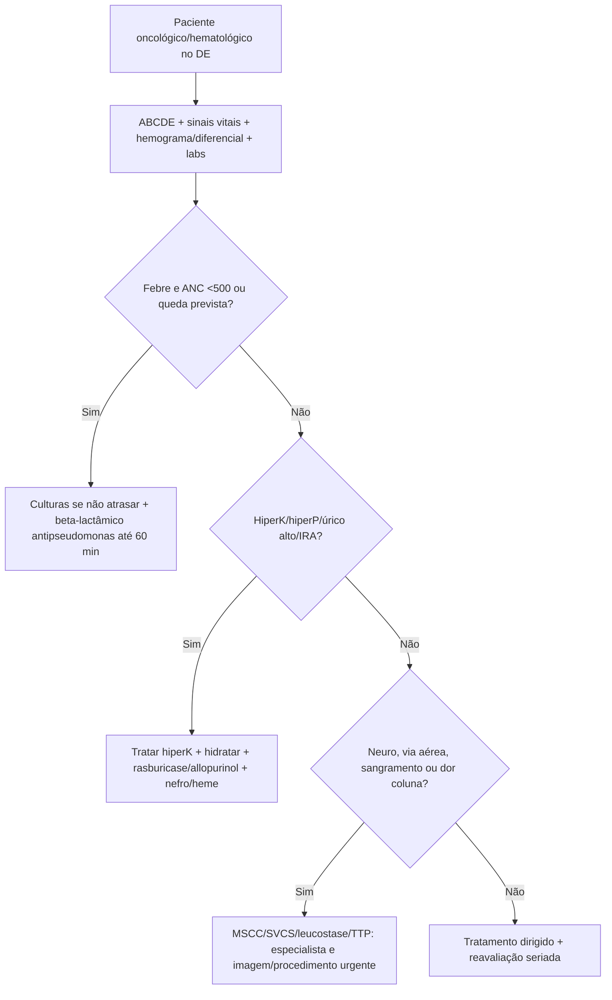
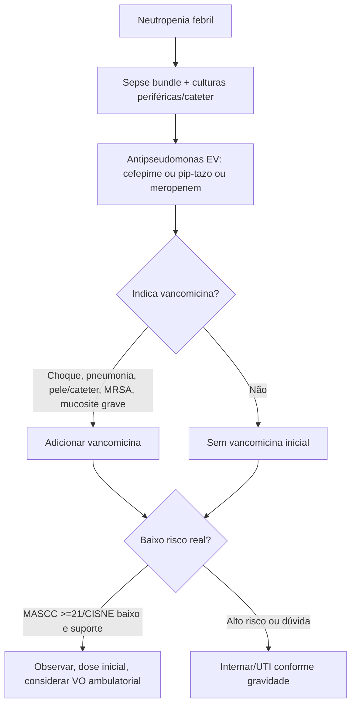
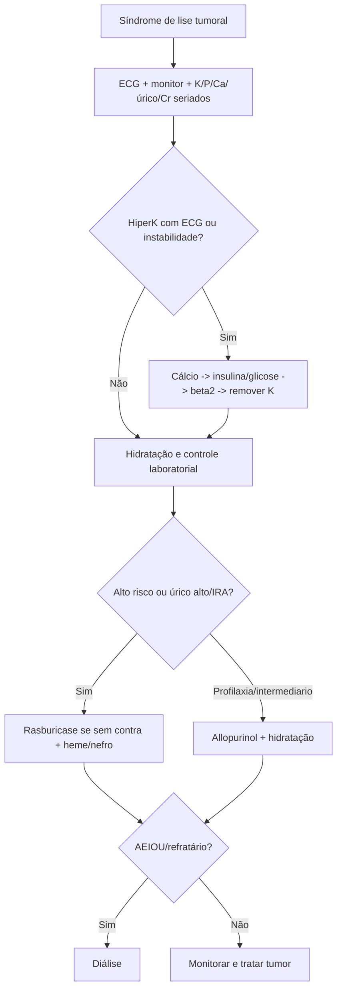
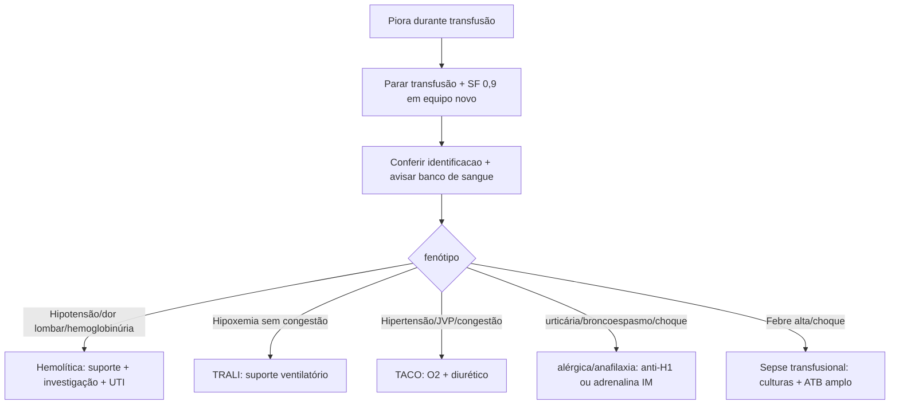

# Hemato-oncologia Na Emergência

## Leitura de 30 segundos

- Neutropenia febril e sepse até prova em contrário: cultura se não atrasar, antibiótico antipseudomonas em até 60 min e internar se alto risco.
- Síndrome de lise tumoral: Burkitt/leucemia/linfoma + hiperK, hiperP, hiperuricemia, hipocalcemia e IRA. Trate K primeiro, hidrate, rasburicase se alto risco/estabelecida e chame nefro/heme cedo.
- Leucostase e hiperviscosidade são diagnósticos clínicos: dispneia, neuro, visual, priapismo, sangramento. Não espere "número mágico" se sintomático.
- Síndrome de veia cava superior raramente mata, mas vira emergência se edema de via aérea, edema cerebral ou instabilidade. Trombose anticoagula; compressão tumoral pode precisar stent/RT/quimio.
- Compressão medular metastática: dor lombar nova em câncer + fraqueza/sensitivo/esfincter = dexametasona, RM urgente e radio/neurocirurgia.
- Falciforme com dor torácica, febre, hipoxemia ou infiltrado novo = síndrome torácica aguda: O2, antibiótico, analgesia e considerar transfusão.
- Reação transfusional: pare a transfusão, mantenha SF 0,9%, confira identificacao, avise banco de sangue e trate o fenótipo: TRALI, TACO, anafilaxia ou hemólise.
- Sangramento em anticoagulado: reverta rápido se ICH/vida-ameaça. Varfarina = 4F-PCC + vitamina K; dabigatrana = idarucizumabe; Xa = andexanet se disponível ou PCC conforme protocolo.

## Por que cai

- **Recorrência em provas/estações:** TEME22-25 cobrou transfusão maciça, HDA/anemia, encefalopatia/cirrose, falciforme/síndrome torácica aguda, neutropenia febril, síndrome de lise tumoral, síndrome de veia cava superior, reversão de coagulopatia no AVC hemorrágico, reação transfusional e dor oncológica.
- **O que a banca costuma testar:** primeira hora, dose/ordem de intervenção, quando não esperar especialista, quando não transfundir automaticamente, quando não dar plaquetas, e como diferenciar complicações parecidas.
- **Como costuma aparecer:** paciente em quimioterapia, hemopatia ou anticoagulante com febre, dispneia, sangramento, IRA, alteração neurológica ou dor. A resposta certa costuma priorizar fisiologia é tratamento tempo-dependente.

## Abordagem prática

### 1. Primeiro minuto do paciente hemato-oncológico

1. **ABCDE + sinais vitais + glicemia:** muitos chegam com sepse, hipoxemia, sangramento ou hipercalemia.
2. **Pergunte em 30 s:** tipo de câncer/hemopatia, quimio recente, transplante, cateter, neutropenia prévia, anticoagulante, transfusão, dor óssea/coluna, febre, sangramento, queda de Hb/plaqueta.
3. **Procure as emergências-tempo:** neutropenia febril, lise tumoral, leucostase, compressão medular, SVCS grave, síndrome torácica aguda, TTP, DIC, sangramento em anticoagulado.
4. **Labs iniciais:** hemograma com diferencial, reticulócitos se anemia/falciforme, eletrólitos, Ca/P/Mg, ácido úrico, renal, LDH, coagulograma, fibrinogênio, gaso/lactato se grave, culturas se febre.
5. **Imagem dirigida:** RX/TC tórax na dispneia/falciforme/neutropenia; RM coluna se déficit/dor suspeita; TC contrastada/angio conforme SVCS/TEP/sangramento.
6. **Ligue cedo:** hematologia/oncologia, infectologia, nefro, radioterapia, neurocirurgia, banco de sangue ou intervencionista conforme o "source control".

### 2. Neutropenia febril

Definição prática:

- Febre: T >=38,3 C uma vez, ou >=38,0 C sustentada por cerca de 1 h.
- Neutropenia: ANC <500/mm3, ou <1000/mm3 com queda prevista para <500.

Conduta:

1. Reconheceu? Isolamento/proteção, ABCDE e sepse.
2. Coletar culturas periféricas e de cateter se presentes, mas não atrasar antibiótico.
3. Antibiótico EV antipseudomonas em até 60 min: cefepime, piperacilina-tazobactam ou meropenem/imipenem conforme risco local.
4. Adicionar vancomicina apenas sé indicação: choque/instabilidade, pneumonia, pele/partes moles, cateter, mucosite grave, MRSA conhecido ou Gram+ em cultura.
5. Alto risco = internar: choque, comorbidade, pneumonia, dor abdominal, mucosite intensa, ANC muito baixo/prolongado, disfunção renal/hepática, leucemia/transplante, MASCC <21, CISNE >=3.
6. Baixo risco selecionado pode ir ambulatorial depois de dose inicial, observação e garantia de retorno: fluoroquinolona + amoxicilina/clavulanato e seguimento próximo, conforme protocolo.

> **Resposta de prova TEME:** neutropênico febril não espera resultado de cultura, PCR/procalcitonina ou imagem para começar antibiótico.

### 3. Síndrome de lise tumoral

Pense em:

- Linfoma de Burkitt, leucemia aguda, linfoma agressivo, massa tumoral grande, LDH alto, IRA, desidratação ou quimioterapia recente.
- Também pode ocorrer espontaneamente antes da quimio.

Padrão laboratorial:

- HiperK.
- Hiperfosfatemia.
- Hiperuricemia.
- Hipocalcemia secundária.
- IRA, acidose, arritmia, convulsão.

Conduta:

1. Monitor cardíaco e ECG: hiperK mata primeiro.
2. Cálcio EV se ECG/instabilidade por hiperK/hipocalcemia sintomática; depois insulina/glicose, beta2, bicarbonato se acidose relevante.
3. Hidratação EV com cristaloide se não congesto; alvo de diurese, sem alcalinização rotineira da urina.
4. Rasburicase se alto risco ou lise estabelecida com hiperuricemia/IRA. Checar G6PD quando possível, mas não atrasar se risco extremo e protocolo permite.
5. Allopurinol e profilaxia/intermediario: impede úrico novo, não remove úrico já formado.
6. Dosar K, P, Ca, úrico, creatinina, LDH seriados; considerar UTI.
7. Diálise se hiperK, hipocalcemia/hiperfosfatemia sintomática, sobrecarga, uremia ou acidose refratárias.

> **Resposta de prova TEME25:** Burkitt em quimioterapia com hiperK, hiperP, úrico alto, hipocalcemia e IRA = síndrome de lise tumoral clínica e laboratorial.

### 4. Leucostase, hiperviscosidade e APL

**Leucostase**

- Mais comum em AML; sintomas importam mais que o número.
- Pistas: dispneia/hipoxemia, cefaleia, confusão, déficit focal, visão turva, priapismo, sangramento.
- Conduta: heme urgente, UTI, hidratação cuidadosa, rasburicase/allopurinol conforme TLS, hidroxiureia/citorreducao e considerar leucaferese.
- Evite transfundir hemácias sem necessidade antes de reduzir viscosidade, porque pode piorar fluxo.

**Hiperviscosidade**

- Clássica em macroglobulinemia de Waldenstrom e mieloma.
- Tríade que cai: sangramento mucoso, alteração visual e sintomas neurológicos.
- Conduta: plasmaferese urgente se sintomático + tratamento da causa.

**Leucemia promielocítica aguda (APL)**

- Sangramento + DIC + blastos/pancitopenia: suspeitou, heme agora.
- ATRA deve ser iniciado precocemente quando suspeita forte, sem esperar confirmação completa, conforme hematologia.
- Suporte agressivo de coagulopatia: plaquetas, fibrinogênio/crio e plasma conforme sangramento/metas.

### 5. Compressão medular e veia cava superior

**Compressão medular metastática**

Suspeite se câncer conhecido ou red flags:

- Dor dorsal/lombar progressiva, pior noturna ou ao decubito.
- Fraqueza, alteração sensitiva, hiperreflexia, ataxia.
- Retencao urinária, incontinencia, anestesia em sela.

Conduta:

1. Dexametasona se déficit neurológico/suspeita alta, salvo contraindicação forte.
2. RM de coluna total urgente.
3. Analgesia, imobilização se instabilidade/risco, sondagem se retenção.
4. Radio-oncologia e neurocirurgia: radioterapia, cirurgia ou ambos conforme histologia, estabilidade e déficit.

**Síndrome de veia cava superior**

- Face/pescoço/MMSS inchados, pletora, veias torácicas, dispneia, tosse, rouquidão, cefaleia.
- Grave se estridor, edema de via aérea, edema cerebral, confusão, síncope ou instabilidade.
- Medidas: cabeceira elevada, O2 se preciso, TC com contraste se tolera, histologia antes de tratamento definitivo se estável.
- Se trombose/cateter: anticoagulação e considerar intervenção.
- Se grave por compressão: stent endovascular e/ou radio/quimio conforme tumor.
- Corticoide/diurético não são rotina para todos; corticoide ajuda se linfoma/timoma, edema de via aérea/cerebral ou plano oncológico.

> **Resposta de prova TEME24:** SVCS raramente e fatal, mas casos graves podem ter via aérea, edema cerebral e instabilidade. Anticoagulação não está sempre contraindicada se houver trombose.

### 6. Falciforme no DE

**Crise vaso-oclusiva dolorosa**

1. Analgesia forte cedo: opioide titulado se dor moderada/grave, associar dipirona/paracetamol/AINE se puder.
2. O2 apenas se hipoxemia; não precisa hiperoxia em Sat normal.
3. Hidratar se desidratado, mas evitar hiper-hidratação.
4. Procurar gatilhos: infecção, STA, sequestro, priapismo, AVC, osteomielite.
5. Evite meperidina.

**Síndrome torácica aguda (STA)**

Definição prática: infiltrado pulmonar novo + febre/dor torácica/tosse/dispneia/hipoxemia em falciforme.

Conduta:

- O2 para alvo >=94% ou basal do paciente.
- Ceftriaxone + azitromicina, hemoculturas se febre sem atrasar.
- Analgesia, espirometria de incentivo, broncodilatador se broncoespasmo.
- Transfusão simples se queda de Hb importante, hipoxemia, multilobar ou piora; não elevar Hb acima de 10-11.
- Exsanguineotransfusão se grave: hipoxemia importante, falência respiratória, multilobar, deterioração, AVC ou Hb alta que impede transfusão simples.

> **Resposta de prova TEME25:** criança HbSS com febre, dor torácica, infiltrado e Hb caiu de 8,2 para 6,5: ceftriaxone + azitromicina + O2 alvo >=94% e considerar transfusão pela queda >=2 g/dL.

### 7. Reação transfusional

Qualquer piora durante transfusão:

1. Pare a transfusão.
2. Mantenha acesso com SF 0,9% em equipo novo.
3. Reconfira paciente, bolsa e etiqueta.
4. Avise banco de sangue e envie bolsa/equipo/amostras conforme protocolo.
5. Trate o fenótipo.

| fenótipo | Pistas | Conduta |
|---|---|---|
| Hemolítica aguda | Febre, dor lombar/flanco, hipotensão, hemoglobinúria, DIC | Parar, suporte, volume/diurese, UTI, banco de sangue |
| Febril não hemolítica | Febre/calafrios sem hemólise | Parar e investigar; antitérmico; pode retomar só se protocolo liberar |
| alérgica leve | urticária/prurido isolado | Anti-histamínico; avaliar retomar |
| Anafilaxia | Broncoespasmo, hipotensão, angioedema | Adrenalina IM + anafilaxia |
| TRALI | Hipoxemia e infiltrado bilateral em até 6 h, sem sobrecarga | Suporte ventilatório; não diurético como eixo |
| TACO | Dispneia, hipertensão, JVP/B3, BNP, congestão, risco renal/cardíaco | O2, diurético, reduzir velocidade futura |
| Sepse transfusional | Febre alta, calafrios, choque | Culturas, antibiótico amplo, suporte |

### 8. Sangramento, plaquetas e anticoagulantes

**Primeiro:** ABCDE, local do sangramento, gravidade, última dose, função renal, anticoagulante/antiagregante, INR/TTPa, fibrinogênio, plaquetas, tipo e prova cruzada.

Reversão de anticoagulante em sangramento grave/ICH:

| Droga | Reversão de prova/prática |
|---|---|
| Varfarina | 4F-PCC + vitamina K 10 mg EV |
| Dabigatrana | Idarucizumabe 5 g EV |
| Rivaroxabana/apixabana/edoxabana | Andexanet alfa se disponível/indicado; 4F-PCC conforme protocolo |
| Heparina não fracionada | Protamina |
| HBPM | Protamina parcial, principalmente se dose recente |
| AAS/P2Y12 em ICH | Neuro/hemo; plaqueta não é automática para todo caso |

Plaquetas:

- <10.000: profilaxia em paciente estável sem sangramento.
- <20.000: febre/sepsis/mucosite ou fatores de risco.
- <50.000: sangramento ativo, procedimento invasivo, cirurgia maior.
- <100.000: neurocirurgia/olho posterior ou SNC, conforme protocolo.
- TTP/HIT: evite plaquetas salvo sangramento ameaçador.

Coagulopatia/DIC:

- Trate causa: sepse, trauma, APL, obstétrico, malignidade.
- Se sangrando: plaquetas, plasma, crioprecipitado/fibrinogênio conforme labs.
- Fibrinogênio alvo em sangramento importante costuma ser >150-200 mg/dL.

TTP:

- Plaquetopenia + anemia hemolítica microangiopática, esquistócitos, neuro/renal/febre variáveis.
- PLASMIC ajuda, mas não espere ADAMTS13 se suspeita alta.
- Plasma exchange urgente + corticoide; caplacizumabe/rituximabe conforme heme.
- Não transfundir plaquetas de rotina.

ITP com sangramento grave:

- Corticoide em alta dose + IVIG; plaquetas se sangramento que ameaça vida, junto com terapia imunomoduladora.

## Conceitos que sustentam a conduta

### Antibiótico na neutropenia é uma intervenção de ressuscitação

O neutropênico pode não formar pus, não fazer leucocitose e ter exame pobre. Febre pode ser o único sinal antes do choque. Por isso cultura e imagem não podem atrasar beta-lactâmico antipseudomonas.

### Lise tumoral mata pelo eletrólito, não pelo nome

O diagnóstico é bonito, mas a primeira morte é hiperK/arritmia. Depois vem IRA, hipocalcemia sintomática, sobrecarga e acidose. Trate o ECG enquanto chama heme/nefro.

### Nem toda massa mediastinal deve receber corticoide antes de biópsia

Se SVCS está estável, histologia orienta tratamento. Corticoide antes de biópsia pode atrapalhar diagnóstico de linfoma. Se há via aérea/cérebro em risco, a emergência manda.

### Plaqueta baixa não significa plaqueta sempre

ITP, TTP, HIT, DIC e quimioterapia não são iguais. Na TTP, plaqueta pode alimentar microtrombose; em ITP com sangramento fatal, plaqueta é ponte junto com IVIG/corticoide.

## Fluxograma

## Doses, alvos e números

| Item | Número | observação TEME |
|---|---:|---|
| Febre na neutropenia | >=38,3 C uma vez ou >=38,0 C por ~1 h | Não esperar pico repetido se grave |
| Neutropenia | ANC <500 ou <1000 com queda prevista | ANC = leucócitos x %neutrófilos |
| Antibiótico FN | Até 60 min | Antipseudomonas EV |
| Cefepime | 2 g EV 8/8 h | Ajustar renal |
| Piperacilina-tazobactam | 4,5 g EV 6/6 h | Ajustar renal |
| Meropenem | 1 g EV 8/8 h | Se ESBL/instável/risco local; ajustar renal |
| MASCC | >=21 baixo risco | Não substitui julgamento |
| CISNE | >=3 alto risco | Para aparentemente estável com tumor sólido |
| Cairo-Bishop lab TLS | K >=6, P >=4,5 adulto, úrico >=8, Ca <=7 | Ou variação >=25%; contexto importa |
| Rasburicase | 0,2 mg/kg EV ou dose fixa 3-6 mg conforme protocolo | Contra/risco em G6PD |
| Allopurinol | 300 mg/dia VO, ajustar renal | Profilaxia; não remove úrico formado |
| Hidratação TLS | Cristaloide e alvo diurese | Evitar se congesto; sem alcalinização rotineira |
| Dexametasona MSCC | 10 mg EV, depois 4 mg 6/6 h ou 16 mg/dia | Protocolos variam |
| ACS falciforme SpO2 | >=94% ou basal | O2 se hipoxemia |
| Transfusão ACS | Considerar se Hb cai >=2 g/dL ou hipoxemia/piora | Evitar Hb >10-11 |
| Hb transfusão estável | <7 g/dL em geral | AABB; individualizar oncológico/cardíaco |
| Plaqueta profilaxia | <10.000/mm3 | Se estável sem sangramento |
| Plaqueta febre/sepsis | <20.000/mm3 | Regra prática |
| Plaqueta sangramento/procedimento | >50.000/mm3 alvo | CNS/neuro geralmente >100.000 |
| Fibrinogênio sangramento | >150-200 mg/dL | Crio/concentrado conforme recurso |
| Varfarina ICH/grave | 4F-PCC + vitamina K 10 mg EV | PCC mais rápido que PFC |
| Dabigatrana | Idarucizumabe 5 g EV | 2 doses de 2,5 g |
| Xa inhibitors | Andexanet ou 4F-PCC 50 U/kg | Conforme disponibilidade/protocolo |
| Heparina UFH | Protamina 1 mg/100 U heparina recente | Max usual 50 mg, depende tempo |
| TTP | Plasma exchange urgente | Não esperar ADAMTS13 se suspeita alta |
| ITP grave sangrando | Corticoide + IVIG + plaqueta se vida-ameaça | Plaqueta isolada dura pouco |

## Pegadinhas TEME

- **neutropênico febril espera cultura para antibiótico:** falso.
- **Ceftriaxone basta para neutropenia febril de alto risco:** falso; precisa antipseudomonas.
- **Vancomicina para todo neutropênico febril:** falso; use por indicação.
- **MASCC alto libera automaticamente:** falso; instabilidade, pneumonia, dor abdominal, organ dysfunction e suporte social mandam.
- **Allopurinol trata úrico já alto rapidamente:** falso. Rasburicase degrada úrico existente.
- **Alcalinizar urina na lise tumoral é rotina:** falso na prática atual.
- **Hipocalcemia na lise sempre repor:** falso; repor se sintomática/ECG, pois pode piorar deposição Ca-P.
- **Leucostase depende só do valor de leucócitos:** falso; sintoma manda.
- **Transfundir hemacia em leucostase sempre ajuda:** pode piorar viscosidade se não indispensável.
- **SVCS sempre é emergência fatal:** falso; grave se via aérea/cérebro/instabilidade.
- **Corticoide em toda SVCS antes de biópsia:** falso; pode atrapalhar diagnóstico de linfoma.
- **Dor lombar em câncer sem trauma e "lombalgia comum":** perigoso; pensar compressão medular.
- **TTP recebe plaqueta porque plaqueta está baixa:** falso salvo sangramento ameaçador.
- **Reação transfusional: diminuir velocidade e observar:** falso se suspeita relevante; pare e investigue.
- **TRALI e TACO são iguais:** falso; TACO é sobrecarga e responde a diurético, TRALI é lesão pulmonar não cardiogênica.
- **Falciforme com Sat 93 e infiltrado pode observar sem antibiótico:** falso; STA.
- **AVC hemorrágico em varfarina reverte com PFC por ser mais disponível:** PCC + vitamina K é mais rápido/efetivo se disponível.

## Erros fatais na prática

- Atrasar beta-lactâmico antipseudomonas em neutropenia febril.
- Não fazer ECG imediato em lise tumoral com K alto.
- Hidratar agressivamente lise tumoral em paciente já congesto, sem plano de diálise.
- Não chamar hematologia cedo em leucostase, APL, TTP ou TLS.
- Dar corticoide em massa mediastinal estável antes de coletar biópsia quando linfoma e provável.
- Não investigar compressão medular em paciente oncológico com dor lombar e retenção urinária.
- Transfundir falciforme até Hb normal.
- Não parar transfusão diante de febre/hipotensão/dispneia.
- Tratar TACO como TRALI ou TRALI como TACO.
- Usar plaquetas de rotina em TTP.
- Reverter anticoagulante tarde em hemorragia intracraniana.

## Para prova vs na prática

> **Para prova TEME:** neutropenia febril = antibiótico antipseudomonas precoce; TLS = hiperK/hiperP/úrico alto/hipocalcemia/IRA em linfoma agressivo; SVCS grave pode comprometer via aérea/cérebro; STA falciforme = O2, ceftriaxone + azitro e transfusão se queda de Hb; reação transfusional = parar transfusão; ICH em varfarina = 4F-PCC + vitamina K.
>
> **Na prática clínica:** protocolos locais definem cefepime vs pip-tazo vs meropenem, dose fixa de rasburicase, uso de andexanet e metas transfusionais. Em oncologia, histologia antes de corticoide/radioterapia importa quando o paciente está estável; quando via aérea, medula ou cérebro estão em risco, a emergência manda.

## Checklist de revisão

- [ ] Sei definir febre e ANC na neutropenia febril.
- [ ] Sei iniciar cefepime/pip-tazo/meropenem em até 60 min.
- [ ] Sei quando adicionar vancomicina.
- [ ] Sei reconhecer TLS e tratar hiperK antes do resto.
- [ ] Sei diferenciar allopurinol de rasburicase.
- [ ] Sei suspeitar leucostase/hiperviscosidade por sintomas.
- [ ] Sei SVCS grave vs estável e quando corticoide não é rotina.
- [ ] Sei compressão medular metastática: dexametasona, RM e radio/neuro.
- [ ] Sei STA falciforme e quando transfundir.
- [ ] Sei parar transfusão e diferenciar TRALI/TACO/anafilaxia/hemólise.
- [ ] Sei reversão de varfarina, dabigatrana, Xa e heparina.
- [ ] Sei TTP: plasma exchange, não plaqueta de rotina.

## Questões e estações relacionadas

- **TEME22 Q45:** choque hemorrágico traumático persistente após cristaloide/torniquete: transfusão balanceada 1:1:1.
- **TEME22 Q62:** encefalopatia hepática: lactulose como medida inicial.
- **TEME22 Q90:** PBE em cirrótico: PMN no líquido ascítico >=250/mm3.
- **TEME22 Q113:** sangramento uterino anormal: corrigir coagulopatia e transfundir se anemia sintomática; cuidado com condutas inadequadas.
- **TEME23 Q20:** dor lombar com história de neoplasia exige imagem para rastrear metástase/causa grave.
- **TEME24 Q39:** falciforme com dor torácica, febre e hipoxemia: síndrome torácica aguda, O2, imagem, analgesia, ATB e considerar transfusão.
- **TEME24:** neutropenia febril em linfoma/quimioterapia: antibiótico precoce e estratificação de risco.
- **TEME24 Q71:** síndrome de veia cava superior: grave se via aérea, edema cerebral ou instabilidade; anticoagulação não é sempre contraindicada.
- **TEME25 Q29:** linfoma de Burkitt em quimioterapia com hiperK, hiperP, úrico alto, hipocalcemia e IRA: síndrome de lise tumoral.
- **TEME25:** reação transfusional com TRALI/TACO/anafilaxia/sepse: parar transfusão e tratar fenótipo.
- **TEME25 Q69:** AVC hemorrágico e reversão de coagulopatias/anticoagulantes.
- **TEME25 Q72:** síndrome torácica aguda em criança HbSS: ceftriaxone + azitromicina, O2 e considerar transfusão se queda de Hb.

## Referências

**Prova/TEME**

- Conteúdo programático TEME26.
- Provas teóricas TEME22, TEME23, TEME24 e TEME25.
- Referências oficiais do edital: Tratado ABRAMEDE 2024, Medicina de Emergência HCFMUSP, POCUS ABRAMEDE e capítulos de emergências hematológicas/oncológicas, trauma e terapia transfusional.

**Material local**

- Emergency Talks: Aula 60 e 61 - Emergências onco-hematológicas.
- Emergency Talks: Aula 22 - Sepse.
- Emergency Talks: Aula 20 - Pneumonia e doença pleural.
- Emergency Talks: Aula 33 - Gasometria.
- Emergency Talks: Aula 42 - Distúrbios hidroeletrolíticos e ácido-básicos.
- Resumo do Emergency.docx.
- Adendos para complementar.docx.

**Atualização clínica**

- ASCO/IDSA. Outpatient Management of Fever and Neutropenia in Adults Treated for Malignancy, 2018. https://www.idsociety.org/practice-guideline/fever-and-neutropenia-in-adults-with-cancer/
- NCCN. Prevention and Treatment of Câncer-Related Infections, Version 3.2024. https://pubmed.ncbi.nlm.nih.gov/39536464/
- MD Anderson. Tumor Lysis Syndrome in Adult Patients, 2025 algorithm. https://www.mdanderson.org/content/dam/mdanderson/documents/for-physicians/algorithms/clinical-management/clin-management-tumor-lysis-web-algorithm.pdf
- NCI PDQ. Superior Vena Cava Syndrome. https://www.cancer.gov/about-cancer/treatment/side-effects/cardiopulmonary-hp-pdq
- NICE NG234. Spinal metástases and metastatic spinal cord compression, 2023. https://www.nice.org.uk/guidance/ng234
- ASH. Sickle Cell Disease: Transfusion Support Guidelines, 2020. https://pmc.ncbi.nlm.nih.gov/articles/PMC6988392/
- NHLBI. Evidence-Based Management of Sickle Cell Disease Expert Panel Report. https://www.nhlbi.nih.gov/health-topics/evidence-based-management-sickle-cell-disease
- AABB. Red Blood Cell Transfusion: 2023 International Guidelines. https://www.aabb.org/news-resources/press-releases/detail/2023/10/12/new-red-blood-cell-transfusion-guidelines-recommend-an-individualized-approach
- AABB. Quick Reference Guide for NHSN Hemovigilance Module: Adverse Reaction Definitions. https://www.aabb.org/docs/default-source/default-document-library/resources/aabb-quick-reference-guide-nhsn-hemovigilance-module.pdf
- AHA/ASA. 2022 Guideline for Management of Spontaneous Intracerebral Hemorrhage. https://www.ahajournals.org/doi/10.1161/STR.0000000000000407
- ISTH. Guidelines for Diagnosis and Treatment of Thrombotic Thrombocytopenic púrpura. https://www.isth.org/TTPGuidelines
- ASH. Immune Thrombocytopenia Guidelines, 2019. https://www.hematology.org/education/clinicians/guidelines-and-quality-care/clinical-practice-guidelines/immune-thrombocytopenia-guidelines
