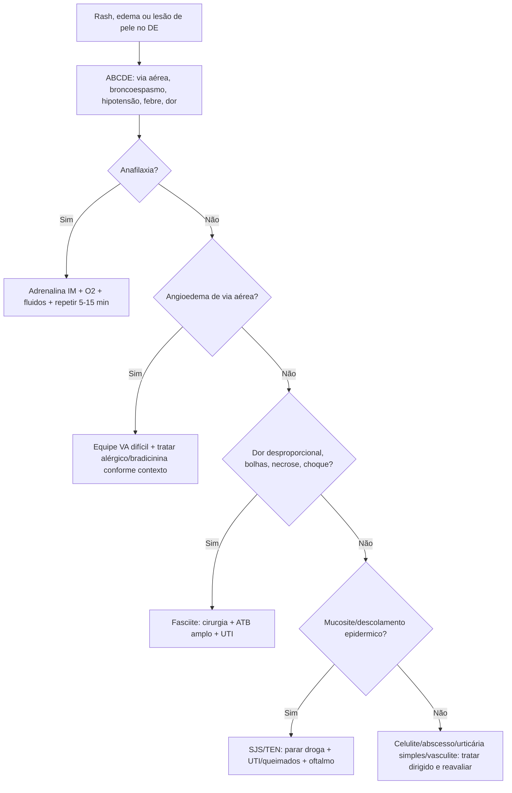
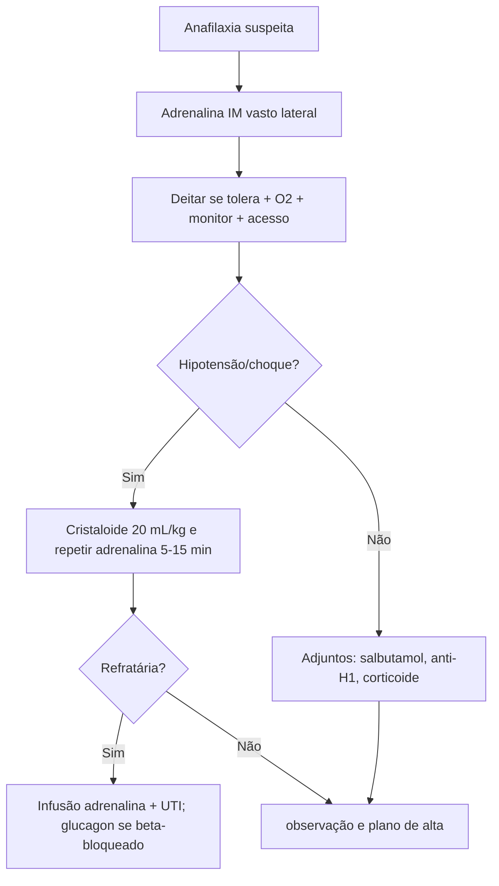
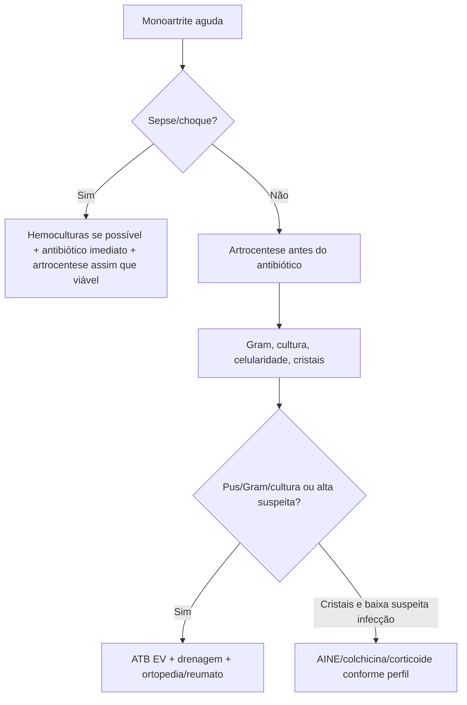

# Dermato, Reumato, Alergia E Anafilaxia

## Leitura de 30 segundos

- Anafilaxia é adrenalina IM primeiro. Anti-histamínico e corticoide são adjuntos, não salvam choque/broncoespasmo/edema de via aérea.
- Angioedema com língua, voz, disfagia, estridor ou progressão rápida e via aérea difícil antecipada. IECA/bradicinina pode não responder a adrenalina, anti-H1 ou corticoide.
- Celulite é clínica; abscesso drena; fasciite necrosante e cirurgia agora. Dor desproporcional, bolhas, necrose, crepitacao, anestesia cutanea ou choque não esperam TC.
- SJS/TEN: parar droga suspeita, suporte tipo queimado, oftalmo/dermato/UTI cedo. Antibiótico profilatico não é rotina.
- Monoartrite aguda e séptica até prova em contrário. Artrocentese antes do antibiótico, exceto se sepse/choque.
- Gota/pseudogota não exclui infecção se há febre, imunossupressão, protese ou líquido muito inflamatório.
- Arterite temporal: cefaleia nova >50 anos, claudicação mandibular ou sintomas visuais = corticoide imediato antes de biópsia/imagem.
- Crise renal esclerodérmica: hipertensão + IRA/MAHA em esclerose sistêmica = IECA/captopril agora, mesmo com creatinina alta.

## Por que cai

- **Recorrência em provas/estações:** TEME22-25 cobrou angioedema por IECA e via aérea acordada, acidente por abelhas/anafilaxia vs envenenamento, celulite/erisipela e papel do exame clínico/US, queimaduras/bolhas, crise renal esclerodérmica, dor lombar/neoplasia, e infecções de partes moles.
- **O que a banca costuma testar:** primeira droga na anafilaxia, quando antecipar via aérea, diferença entre celulite e abscesso, sinais de fasciite, quando punir articulação, e emergências reumatológicas que chegam ou destroem rim.
- **Como costuma aparecer:** caso aparentemente dermatológico, mas com risco de via aérea, choque, sepse, necrose, perda visual, articulação séptica ou lesão renal.

## Abordagem prática

### 1. Rash, edema ou dor de pele: primeiro minuto

1. ABCDE: via aérea, estridor, sibilos, hipotensão, choque, febre, dor intensa.
2. Expor pele toda: mucosa, palmas/plantas, períneo, dor a palpação, bolhas, púrpura, necrose, crepitacao.
3. Medicações novas: antibiótico, anticonvulsivante, alopurinol, AINE, sulfa, IECA, imunobiológico, quimio.
4. Risco infeccioso: diabetes, DRC, cirrose, neutropenia, HIV, corticoide, asplenia, mordida, água doce/salgada, uso de droga injetável.
5. Pergunta-chave: é alergia simples, anafilaxia, angioedema, infecção necrosante, SJS/TEN, vasculite/púrpura ou sepse?

Red flags:

- Hipotensão, síncope, broncoespasmo, estridor, edema de língua/laringe.
- Dor fora de proporcao ao exame.
- Bolhas hemorrágicas, necrose, equimose progressiva, anestesia de pele.
- Mucosite ocular/oral/genital, Nikolsky, descolamento epidermico.
- púrpura palpável com renal/abdominal, ou púrpura fulminante.
- Monoartrite febril.
- Cefaleia nova >50 anos com sintomas visuais ou mandibulares.

### 2. Anafilaxia

Diagnóstico prático: reação aguda após exposição provável com pele/mucosa e respiratório/circulatório/GI, ou hipotensão/broncoespasmo/laringe após alérgeno conhecido, mesmo sem urticária.

Conduta:

1. Chamar ajuda, retirar gatilho, deitar com pernas elevadas se tolera.
2. Adrenalina IM no vasto lateral imediatamente.
3. O2 alto se respiratório/choque, monitor, acesso, cristaloide em bolus se hipotensão.
4. Repetir adrenalina IM a cada 5-15 min se resposta incompleta.
5. Se refratária: infusão de adrenalina titulada e UTI.
6. Salbutamol se broncoespasmo; anti-H1 para urticária/prurido; corticoide como adjunto, sem atrasar adrenalina.
7. Beta-bloqueado com choque refratário: considerar glucagon.
8. Observar risco de bifásica: mais tempo se grave, precisou doses repetidas, asma, hipotensão, gatilho longo ou acesso dificil.
9. Alta: prescrever/treinar autoinjetor se disponível, plano escrito, retorno e alergologia.

> **Resposta de prova TEME:** adrenalina IM é a primeira medicação. Anti-histamínico isolado em anafilaxia é erro.

### 3. Angioedema

Separe dois mundos:

| Tipo | Pistas | Resposta esperada |
|---|---|---|
| Histaminérgico/alérgico | urticária, prurido, broncoespasmo, hipotensão, gatilho alimentar/veneno/remedio | Adrenalina se anafilaxia, anti-H1, corticoide |
| Bradicinina | IECA, hereditario, sem urticária/prurido, língua/face/laringe, dor abdominal | Via aérea + C1-INH/icatibant/FFP conforme recurso |

Conduta:

- Via aérea manda. Voz abafada, disfagia, sialorreia, estridor, língua crescente ou assoalho de boca = chamar anestesia/otorrino/cirurgia cedo.
- Se parece alérgico ou dúvida razoável, trate como anafilaxia com adrenalina IM.
- IECA: suspender definitivamente. Pode ocorrer mesmo após anos de uso.
- Angioedema por bradicinina pode precisar intubação acordada/fibro, equipe cirúrgica pronta e tubo menor.

> **Resposta de prova TEME24:** angioedema por enalapril com língua/lábios, dificuldade para falar/deglutir e estridor justifica intubação acordada pelo risco de falha de resgate/oxigenação.

### 4. Celulite, erisipela, abscesso e fasciite

**Celulite/erisipela**

- Diagnóstico é clínico: eritema, calor, dor, edema; erisipela costuma ser mais superficial e bem delimitada.
- Causas comuns: estreptococos beta-hemoliticos; S. aureus se purulência/abscesso/porta específica.
- US ajuda a achar abscesso, corpo estranho ou fascite; não é obrigatório para celulite simples.
- Trate porta de entrada: tinea pedis, ferida, edema, insuficiência venosa.

**Abscesso**

- Flutuação/pus = incisão e drenagem.
- Antibiótico se celulite extensa, SIRS, imunossupressão, face/mão/genital, falha, múltiplos abscessos ou risco MRSA.

**Fasciite necrosante**

Suspeite com:

- Dor desproporcional.
- Progressão rápida, toxicidade, choque.
- Bolhas, equimose, necrose, crepitacao.
- Anestesia cutanea.
- Hiponatremia, lactato, IRA, CPK alta podem ajudar, mas não excluem.

Conduta:

1. Cirurgia agora para exploração/desbridamento.
2. Antibiótico amplo: MRSA + Gram negativos + anaerobios + antitoxina.
3. Ressuscitação de sepse, analgesia, UTI.
4. Não atrasar por TC se paciente instável ou suspeita alta.

> **Pegada TEME:** LRINEC baixo não exclui fasciite. Exame clínico e progressão mandam.

### 5. SJS/TEN, DRESS e urticária simples

**SJS/TEN**

- Prodromo febre/mal-estar + dor de pele + lesões alvoides/violáceas + mucosite.
- Descolamento epidermico: SJS <10% SCQ, overlap 10-30%, TEN >30%.
- Medicações clássicas: alopurinol, sulfas, anticonvulsivantes, AINEs oxicam, nevirapina, antibióticos.

Conduta:

1. Parar droga suspeita imediatamente.
2. Internar em UTI/queimados/dermato conforme extensao.
3. Cuidado de pele sem trauma, aquecimento, fluidos, analgesia, nutricao.
4. Oftalmologia precoce.
5. Culturas se suspeita, antibiótico só se infecção clínica.
6. Calcular SCORTEN nas primeiras 24 h e reavaliar.

**DRESS**

- Latencia longa, típicamente 2-8 semanas após droga.
- Febre, rash, edema facial, linfonodos, eosinofilia/linfocitos atipicos e órgão-alvo: hepatite, nefrite, pneumonite, miocardite.
- Conduta: parar droga, avaliar órgãos, internar se orgânico; corticoide sistêmico se moderado/grave conforme dermato.

**urticária simples**

- Placas pruriginosas migratórias, sem hipotensão, broncoespasmo, GI importante ou via aérea.
- Anti-H1 e observação. Oriente retorno se anafilaxia.

### 6. Monoartrite e dor articular aguda

Monoartrite febril = séptica até prova em contrário.

Conduta:

1. Analgesia e avaliação de sepse.
2. Artrocentese: Gram, cultura, celularidade/diferencial e cristais.
3. Se sepse/choque, não espere punção para antibiótico.
4. Empirico usual: vancomicina + ceftriaxone/cefepime conforme risco local, eonococo, imunossupressão e Gram.
5. Drenagem seriada/artroscópica conforme articulação e ortopedia.

Cristais:

- Gota: podagra, urato, crise rápida; tratar com AINE, colchicina ou corticoide conforme rim/GI/anticoagulação.
- Pseudogota: idoso, joelho/punho, condrocalcinose, cristais de CPPD.
- Cristal no líquido não exclui infecção concomitante.
- Não iniciar alopurinol como analgésico de crise. Se já usa, em geral não suspender.

### 7. Emergências reumatológicas

**Arterite de células gigantes**

- >50 anos, cefaleia nova, dor temporal, claudicação mandibular, hipersensibilidade couro cabeludo, polimialeia, sintomas visuais.
- VHS/CRP ajudam, mas não espere para tratar se suspeita forte.
- Prednisona alta dose; se sintoma visual/ameaça visual, metilprednisolona EV e oftalmo/reumato.
- Biópsia/imagem temporal confirma depois; corticoide vem antes para evitar cegueira.

**Crise renal esclerodérmica**

- Esclerose sistêmica, hipertensão abrupta, IRA, proteinúria/hematúria, anemia hemolítica microangiopática, plaquetopenia.
- Captopril/IECA imediato e titulado. Não evitar IECA por creatinina alta nesse contexto.
- Emergência hipertensiva + nefro/reumato.

**LES/vasculites**

- Lupus com rebaixamento/convulsão, nefrite, pneumonite/hemorragia alveolar, pericardite/tamponamento ou citopenia grave = internar e especialista.
- púrpura palpável + rim/GI/neuro sugere vasculite sistêmica; procure plaquetas, urina, creatinina, hemoptise, dor abdominal.
- púrpura fulminante ou menineococcemia e sepse dermatológica: antibiótico imediato.

## Conceitos que sustentam a conduta

### Pele pode ser choque, via aérea ou cirurgia

Nem todo rash e "alergia". urticária com hipotensão e anafilaxia; eritema com dor desproporcional e fasciite; bolha com mucosite e SJS/TEN; púrpura com choque e sepse/vasculite.

### Adrenalina não tem substituto na anafilaxia

Anti-H1 melhora prurido; corticoide talvez reduza inflamação tardia, mas nenhum dos dois reverte choque, edema de laringe ou broncoespasmo no tempo certo. O atraso da adrenalina é a pegadinha principal.

### O pus da articulação é uma colecao fechada

Artrite séptica não é "dar antibiótico e ver". Precisa diagnóstico por líquido sinovial e drenagem quando confirmado/suspeito forte. Cristal e infecção podem coexistir.

### Corticoide certo no paciente certo

Na arterite temporal e na compressão visual, corticoide precoce previne cegueira. Em celulite simples ele pode confundir; em SJS/TEN e DRESS depende de gravidade e especialista; em infecção necrosante não substitui faça.

## Fluxograma

## Doses, alvos e números

| Item | Número | observação TEME |
|---|---:|---|
| Adrenalina anafilaxia | 0,01 mg/kg IM de 1 mg/mL | Max adulto 0,5 mg; criança max 0,3 mg |
| Repetir adrenalina | 5-15 min | Se resposta incompleta |
| Cristaloide anafilaxia | 20 mL/kg, repetir conforme choque | Adulto pode precisar litros |
| Glucagon beta-bloqueado | 1-5 mg EV, depois 5-15 mcg/min | Se choque refratário |
| Icatibant HAE | 30 mg SC adulto | Conforme disponibilidade |
| C1-INH HAE | 20 U/kg EV | Conforme produto/protocolo |
| SJS | <10% SCQ | Mucosa geralmente presente |
| SJS/TEN overlap | 10-30% SCQ | Alto risco |
| TEN | >30% SCQ | UTI/queimados |
| SCORTEN | 7 itens | Calcular até 24 h e reavaliar |
| Fasciite ATB | Vancomicina + pip-tazo/carbapenem + clindamicina | Não substitui desbridamento |
| Clindamicina antitoxina | 900 mg EV 8/8 h adulto | Strepto/clostridio suspeito |
| Celulite simples | 5 dias pode bastar se boa resposta | IDSA; estender se lento |
| Artrite séptica líquido | WBC >50.000 sugere, mas não define | Valor menor não exclui |
| Colchicina crise gota | 1,2 mg VO + 0,6 mg 1 h depois | Ajustar renal/interações; max 1,8 mg dia 1 |
| Prednisona gota | 30-40 mg/dia por 5-10 dias | opção se AINE/colchicina ruins |
| Arterite temporal | Prednisona 40-60 mg/dia | Se visual: metilpred EV alta dose |
| Metilpred visual GCA | 500-1000 mg EV/dia por 3 dias | Protocolos variam |
| Crise renal esclerodérmica | Captopril 6,25-12,5 mg e titular | IECA imediato |

## Pegadinhas TEME

- **Anafilaxia sem urticária não existe:** falso. Pode ser choque/broncoespasmo/laringe.
- **Anti-histamínico antes da adrenalina:** falso em anafilaxia.
- **Corticoide previne toda reação bifásica:** falso; não substitui observação.
- **IECA só causa angioedema no início do tratamento:** falso, pode ocorrer anos depois.
- **Angioedema por bradicinina responde bem a adrenalina/anti-H1:** falso em geral, mas trate como anafilaxia se dúvida.
- **Celulite precisa US para diagnóstico:** falso. US ajuda abscesso/dúvida.
- **Abscesso trata só com antibiótico:** falso; precisa drenagem.
- **Fasciite espera TC/LRINEC:** falso se suspeita alta.
- **SJS/TEN recebe antibiótico profilatico:** falso; antibiótico se infecção.
- **Cristal no líquido articular exclui artrite séptica:** falso.
- **Gota aguda inicia alopurinol para aliviar dor:** falso.
- **Arterite temporal espera biópsia para corticoide:** falso.
- **Crise renal esclerodérmica não pode receber IECA porque creatinina subiu:** falso.

## Erros fatais na prática

- Atrasar adrenalina em anafilaxia.
- Tentar RSI convencional em angioedema progressivo sem plano de via aérea dificil/cirúrgica.
- Mandar para casa angioedema de língua em progressão.
- Tratar fasciite necrosante como celulite.
- Não examinar períneo em suspeita de Fournier.
- Usar AINE em gota com DRC/desidratação/anticoagulação sem pesar risco.
- Dar corticoide em monoartrite antes de excluir infecção.
- Não punir articulação séptica.
- Perder SJS/TEN inicial como "alergia simples".
- Esperar biópsia temporal enquanto o paciente perde visão.
- Não reconhecer crise renal esclerodérmica.

## Para prova vs na prática

> **Para prova TEME:** anafilaxia = adrenalina IM; angioedema por IECA com estridor = via aérea acordada/antecipada; celulite é clínica, abscesso drena, fasciite opera; SJS/TEN para droga e suporte; monoartrite febril = artrocentese; arterite temporal = corticoide antes da confirmação; crise renal esclerodérmica = captopril/IECA.
>
> **Na prática clínica:** protocolos locais variam em icatibant/C1-INH/FFP no angioedema por bradicinina, escolha de antibiótico para SSTI/MRSA e uso de imunomoduladores em SJS/TEN. A regra operacional permanece: via aérea, choque, faça, punção e corticoide tempo-dependente quando indicados.

## Checklist de revisão

- [ ] Sei diagnosticar anafilaxia mesmo sem urticária.
- [ ] Sei dose de adrenalina IM e intervalo de repeticao.
- [ ] Sei diferenciar angioedema histaminérgico de bradicinina.
- [ ] Sei quando chamar via aérea difícil no angioedema.
- [ ] Sei celulite vs abscesso vs fasciite necrosante.
- [ ] Sei que fasciite e cirurgia, não TC.
- [ ] Sei reconhecer SJS/TEN e parar a droga.
- [ ] Sei punir monoartrite antes de antibiótico se não houver sepse.
- [ ] Sei que cristal não exclui infecção articular.
- [ ] Sei tratar crise de gota sem iniciar alopurinol como analgésico.
- [ ] Sei arterite temporal e crise renal esclerodérmica.

## Questões e estações relacionadas

- **TEME22 Q63:** crise renal esclerodérmica: PA alta, creatinina/proteinúria/hematúria e manifestações neurológicas; captopril/IECA.
- **TEME23:** celulite/erisipela: diagnóstico clínico, etiologia estrepto/staph e US quando há dúvida/abscesso, não como regra universal.
- **TEME24 Q52:** angioedema por enalapril com língua/lábios, disfagia e estridor: indicação de intubação acordada pelo risco de falha de resgate.
- **TEME24 Q71:** queimadura térmica com bolhas: reconhecer segundo grau e manejo local/analgesia/cobertura, sem tratar todo caso como grande queimado.
- **TEME24 Q79:** abelhas: diferenciar anafilaxia de síndrome de envenenamento por múltiplas picadas; esta pode cursar com CIVD, alterações neuro/cardiovasculares e IRA.
- **TEME25:** mordeduras e infecção de partes moles: gatos infectam muito; profilaxia e cobertura dependem de animal, ferida, local e risco.
- **Emergency Talks Aula 19:** emergências reumato e dermato: rash perigoso, infecções de pele, monoartrite e vasculites.

## Referências

**Prova/TEME**

- Conteúdo programático TEME26.
- Provas teóricas TEME22, TEME23, TEME24 e TEME25.
- Referências oficiais do edital: Tratado ABRAMEDE 2024, Medicina de Emergência HCFMUSP e capítulos de alergia, dermatologia, reumatologia, infecções de partes moles e toxicologia.

**Material local**

- Emergency Talks: Aula 19 - Emergências reumato e dermato.
- Emergency Talks: Aula 37 - Trauma ambiental I.
- Emergency Talks: Aula 53 - Abordagem geral do paciente intoxicado.
- Emergency Talks: Aula 62 - Animais peçonhentos.
- Resumo do Emergency.docx.
- Adendos para complementar.docx.

**Atualização clínica**

- World Allerey Organization. Anaphylaxis Guidance 2020. https://pmc.ncbi.nlm.nih.gov/articles/PMC7607509/
- AAAAI/ACAAI. Anaphylaxis: 2023 practice parameter update. https://www.guidelinecentral.com/guideline/7615/
- WAO/EAACI. Hereditary angioedema guideline, 2021 revision/update. https://pmc.ncbi.nlm.nih.gov/articles/PMC9023902/
- IDSA. Skin and Soft Tissue Infections Guideline, 2014. https://www.idsociety.org/practice-guideline/skin-and-soft-tissue-infections/
- WSES/SIS-E. Skin and soft-tissue infections consensus, 2018. https://pmc.ncbi.nlm.nih.gov/articles/PMC6295010/
- British Association of Dermatologists. SJS/TEN guideline, 2016. https://academic.oup.com/bjd/article/174/6/1194/6617016
- SANJO. Guideline for management of septic arthritis in native joints, 2023. https://jbji.copernicus.org/articles/8/29/2023/
- American College of Rheumatology. Gout Guideline, 2020. https://pmc.ncbi.nlm.nih.gov/articles/PMC10563586/
- EULAR. Large vessel vasculitis recommendations, 2018 update. https://ard.bmj.com/content/79/1/19
- EULAR. Systemic sclerosis treatment recommendations, 2023 update. https://ard.bmj.com/content/early/2024/10/17/ard-2024-226430
