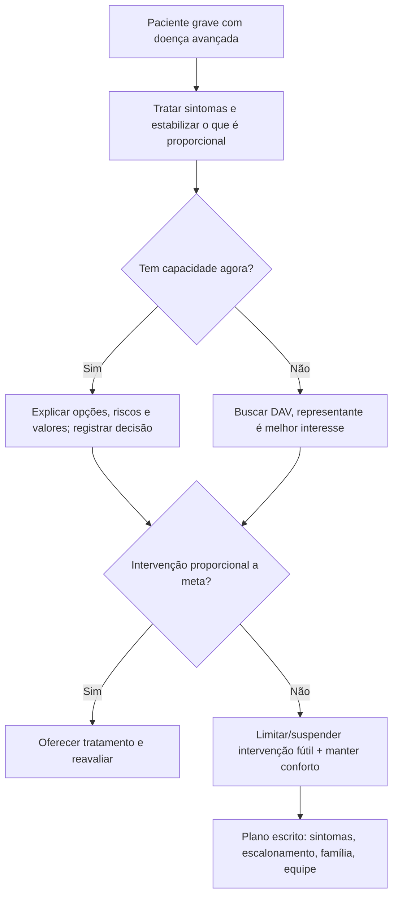
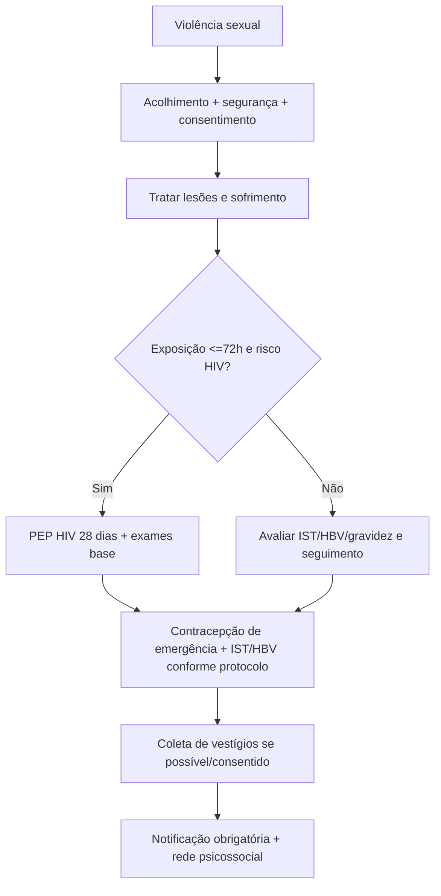
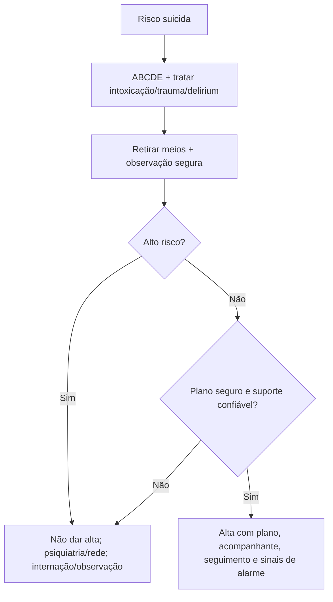
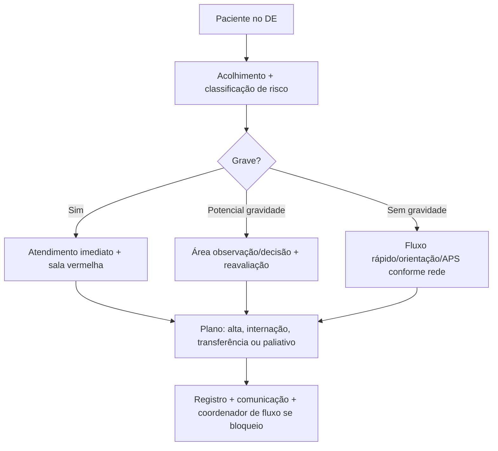

# Paliativos, Vulnerabilidades, Ética, Legislação E Gestão

## Leitura de 30 segundos

- Cuidado paliativo não é "não fazer nada": é tratar sofrimento, alinhar metas, evitar distanásia e manter cuidado proporcional.
- Código de não reanimar, limitação de suporte e terminalidade precisam de decisão clínica, comunicação, registro e plano de cuidado. Não são ordem para abandonar o paciente.
- Paciente capaz pode recusar tratamento eletivo após informação adequada; em urgência com risco relevante/morte, o médico pode intervir se não há consentimento valido disponível.
- Diretivas antecipadas de vontade devem ser consideradas se conhecidas e aplicaveis, desde que não contrariem o Código de Ética.
- Sedação paliativa exige sintoma refratário, proporcionalidade, intenção de aliviar sofrimento, consentimento/representante quando possível e registro.
- Violência sexual: acolher, tratar antes de burocracia, não exigir boletim de ocorrência, oferecer PEP HIV até 72 h por 28 dias, contracepção, profilaxias, coleta quando possível e notificação obrigatória.
- Tentativa/risco suicida: estabilizar, retirar meios, observação segura, avaliar risco/proteção, notificar e não dar alta se alto risco sem plano robusto.
- Gestão TEME: classificação de risco, coordenador de fluxo, registro, comunicação, transferência segura e limite de permanência no pronto-socorro importam tanto quanto conduta clínica.

## Por que cai

- **Recorrência em provas/estações:** TEME22-25 cobrou violência sexual/PEP, morte encefálica, regulação/CFM, classificação de risco/fluxo, alta segura, tentativa de suicídio, dor total em câncer, responsabilidade médica em transferência, documentação e vulnerabilidades.
- **O que a banca costuma testar:** diferenciar cuidado proporcional de abandono, saber quando tratar sem consentimento, conhecer PEP/notificação, reconhecer alto risco suicida, saber papel do emergencista na morte encefálica e no fluxo do DE.
- **Como costuma aparecer:** caso ético com alternativa sedutora e absoluta. A resposta certa costuma ser a que acolhe, informa, registra, protege vulnerável e mantem cuidado clínico proporcional.

## Abordagem prática

### 1. Paliativo no DE: abordagem de plantão

1. Estabilize sintomas agora: dor, dispneia, delirium, náusea, secreção, ansiedade, sangramento.
2. Identifique trajetória: câncer avançado, demência, DPOC/IC/DRC terminal, fragilidade extrema, doença neurológica, falência multiorgânica.
3. Pergunte sobre valores: "O que é mais importante se o tempo for curto?", "O que ele não aceitaria?", "Existe diretiva/procurador?"
4. Defina reversibilidade: infecção tratável? sangramento reversível? obstrução drenável? ou processo final irreversível?
5. Escreva plano: o que fazer, o que não fazer, quando reavaliar e quem foi informado.
6. Não confunda limite de suporte com limite de cuidado: analgesia, higiene, presença familiar, comunicação e alívio de sintomas seguem obrigatórios.

Frase útil:

> "Vamos continuar tratando tudo que trouxer conforto e aquilo que tiver chance real de ajuda. O que queremos evitar são procedimentos que só prolonguem sofrimento sem mudar o desfecho."

### 2. Sintomas no fim de vida

**Dor**

- Titular opioide pelo sofrimento, não pela saturação isolada.
- Se virgem de opioide e dor forte: morfina EV em pequenas doses repetidas ou fentanil se instável/DRC.
- Sempre prevenir constipação se expectativa de dias/semanas.

**Dispneia**

- Trate causa reversível se alinhada a meta: broncoespasmo, edema, derrame, ansiedade, secreção.
- Opioide em baixa dose reduz fome de ar.
- Oxigênio ajuda se hipoxemia; se não hipoxêmico, ventilador/ambiente/calor humano e opioide podem ajudar mais que máscara.

**Delirium/agitação**

- Procure gatilhos proporcionais: dor, retenção urinária, constipação, hipóxia, infecção, abstinência, medicação.
- Haloperidol é comum; benzodiazepínico se abstinência, ansiedade extrema ou sedação paliativa.

**Secreção terminal**

- Reposicionamento, explicar para família, reduzir fluidos desnecessários.
- Anticolinérgico pode reduzir ruido, mas funciona melhor se iniciado cedo.

### 3. Sedação paliativa

Indicar apenas quando:

- Paciente tem doença avançada/terminal.
- Sintoma é refratário a medidas proporcionais ou medidas causariam sofrimento excessivo.
- Objetivo e aliviar sofrimento, não apressar morte.
- Há consentimento do paciente ou representante quando possível.
- A equipe documenta indicação, fármacos, proporcionalidade e reavaliação.

Sintomas comuns: dispneia refratária, delirium/agitação refratária, dor intratável, sangramento/sofrimento extremo.

> **Pegada TEME:** sedação paliativa não é eutanásia. É tratamento proporcional para sintoma refratário.

### 4. Capacidade, consentimento e recusa

Capacidade decisional no DE:

- Entende informação?
- Aprecia consequências para si?
- Raciocina comparando opções?
- Comunica escolha consistente?

Se capaz:

- Informar diagnóstico, risco, benefícios, alternativas e consequências da recusa.
- Verificar coerência e ausência de delirium/intoxicação/psicose incapacitante.
- Registrar conversa, testemunhas e plano de retorno.

Se incapaz:

- Procurar representante/família/diretiva.
- Em risco de morte/urgência, tratar pelo melhor interesse.

Recusa terapêutica:

- E direito em tratamentos eletivos quando paciente e maior, capaz, lucido, orientado e consciente.
- Pode ser rejeitada em abuso de direito, risco a terceiros, doença transmissivel relevante ou urgência/emergência com risco relevante.

### 5. Diretivas, ortotanásia e morte encefálica

**Diretivas antecipadas**

- Preferencias registradas previamente pelo paciente sobre cuidados futuros.
- O médico deve considera-las quando o paciente não puder decidir.
- Representante designado ajuda a interpretar valores.
- Não valem para exigir conduta antiética ou sem indicação técnica.

**Ortotanásia**

- Permitir morte natural em doença terminal, limitando ou suspendendo intervenções futeis/desproporcionais.
- Manter tratamento de sintomas e suporte humano.
- Distanásia é o excesso que prolonga sofrimento sem benefício real.

**Morte encefálica**

- Diagnóstico médico-legal de morte, não "coma profundo".
- Exige causa conhecida e irreversível, ausência de fatores confundidores e protocolo completo.
- No Brasil: dois exames clínicos por médicos capacitados, teste de apneia e exame complementar conforme CFM.
- Médicos examinadores não podem integrar equipe de transplante; um deve ter especialidade/qualificação prevista.
- Comunicar família com clareza; doação de órgãos e conversa posterior por equipe adequada.

### 6. Violência sexual e outras vulnerabilidades

Violência sexual:

1. Acolher e garantir segurança.
2. Atendimento não depende de boletim de ocorrência.
3. Consentimento para exame, coleta e fotografias quando aplicável.
4. Tratar lesões, dor, ansiedade e risco de gravidez/IST.
5. PEP HIV se exposição de risco é tempo <=72 h; 28 dias.
6. Contracepção de emergência conforme tempo e gestação excluída/risco.
7. Hepatite B: vacina e imunoglobulina conforme status.
8. Profilaxia de IST conforme protocolo.
9. Notificação compulsória imediata/autoridade de saúde; criança/adolescente/idoso exige rede de proteção.
10. Seguimento psicossocial, infectologia/gineco/serviço especializado.

Outras vulnerabilidades:

- Criança/adolescente, idoso, pessoa com deficiência, rua, migrante, população LGBTQIA+, violência doméstica, tráfico humano, custódia policial.
- Use acompanhante/intérprete quando ajuda, mas entreviste sozinho se houver suspeita de coerção.
- Preservar sigilo, dignidade e nome social.
- Notificação não é denuncia policial automática em todos os casos; conheça fluxo local.

### 7. Risco suicida e crise psiquiátrica

Primeiro:

- Tratar intoxicação, trauma, abstinência, hipoglicemia, delirium, psicose, mania, dor e causas orgânicas.
- Retirar meios letais e manter observação segura.
- Não deixar sozinho em sala sem visibilidade se risco alto.

Alto risco:

- Tentativa recente com alta letalidade ou planejamento.
- Ideação persistente, desesperança, psicose, intoxicação, agitação grave.
- Tentativas prévias, transtorno mental sem tratamento, acesso a arma/medicamentos.
- Falta de suporte, luto/perda recente, dor/doença grave, violência.
- Não aceita plano, minimiza, quer ir embora, sem acompanhante confiável.

Alta só se:

- Risco baixo/moderado com melhora, avaliação psiquiátrica/clínica, plano de segurança, acompanhante responsável, retirada de meios e seguimento definido.

> **Resposta de prova TEME25:** tentativa por benzodiazepínico + álcool, tristeza, tentativas prévias, sem seguimento e pouca proteção = alto risco; não é alta simples por estar orientado.

### 8. Gestão, fluxo e responsabilidade no DE

Pontos CFM/gestão que caem:

- Serviço hospitalar de urgência deve ter acolhimento com classificação de risco.
- Classificação de risco não é diagnóstico médico definitivo; médico pode reclassificar no contato.
- Coordenador de fluxo é função médica relevante, não apenas administrativa.
- Paciente grave deve ter atendimento imediato, independentemente de burocracia.
- permanência prolongada no DE é problema de segurança; CFM 2077 trabalha limite de 24 h para permanência no setor e necessidade de internação/transferência/fluxo.
- Transferência exige estabilização proporcional, contato com receptor, documento clínico e transporte compatível.
- Registro protege o paciente: horários, reavaliações, orientações, recusas, familiares, chamadas, regulação e justificativas.

Gestão de risco:

- Superlotação: rounds de fluxo, alta segura, leitos de retaguarda, sala de decisão, protocolos e priorização.
- Evento adverso: reconhecer, tratar dano, comunicar liderança/paciente conforme política, registrar e aprender.
- Passagem de plantão: diagnóstico, gravidade, pendências, limites de cuidado, riscos e plano se piorar.

## Conceitos que sustentam a conduta

### Autonomia não é abandono

Respeitar escolha exige informar, checar capacidade, registrar e oferecer alternativas. Se o paciente recusa IOT, ainda recebe opioide para dispneia, antibiótico se desejar, família junto e reavaliação.

### Beneficência também tem freio

Fazer tudo pode virar dano. RCP, IOT, vasopressor e UTI podem ser proporcionais em sepse reversível e desproporcionais em morte ativa irreversível. O mesmo procedimento muda de valor conforme meta.

### Vulnerabilidade muda o dever de proteção

O emergencista não é juiz nem policial, mas deve proteger, notificar, acionar rede e evitar revitimização. Acolher bem e parte do tratamento tempo-dependente.

### Gestão é clínica

Fluxo ruim mata: atraso, perda de informação, paciente sem monitor, transferência improvisada e alta sem plano. A prova gosta de lembrar que Medicina de Emergência também é sistema.

## Fluxograma

## Doses, alvos e números

| Item | Número | observação TEME |
|---|---:|---|
| Morfina dor intensa opioid-naive | 2-4 mg EV a cada 10-15 min até alívio | Reduzir em idoso/fráeil/DRC |
| Morfina dispneia paliativa | 1-2 mg EV/SC ou 2,5-5 mg VO | Titular por conforto |
| Fentanil | 25-50 mcg EV titulados | Útil se DRC/instabilidade, conforme contexto |
| Haloperidol delirium/náusea | 0,5-2 mg VO/SC/EV | Cuidado QT/parkinsonismo |
| Midazolam agitação/sedação | 1-2 mg EV/SC titulados; infusão conforme protocolo | Sedação paliativa exige critério |
| Butilbrometo/hioscina secreção | 20 mg SC/EV 4/4-6/6 h | Alternativas variam por serviço |
| PEP HIV | Iniciar até 72 h | Dura 28 dias |
| Contracepção de emergência | Quanto antes; levonorgestrel até 5 dias | Melhor eficácia precoce |
| HBIG hepatite B | 0,06 mL/kg IM | Se indicada por status vacinal/fonte |
| Morte encefálica | 2 exames clínicos + teste apneia + exame complementar | Médicos capacitados e sem equipe transplante |
| permanência DE | 24 h como limite de referência CFM 2077 | Depois fluxo/internação/transferência |
| Sedação paliativa | Sintoma refratário | Proporcional, consentida e documentada |

## Pegadinhas TEME

- **Paliativo = não tratar:** falso. Trata sofrimento e condutas proporcionais.
- **DNR = não fazer analgesia/antibiótico/O2:** falso. DNR fala de RCP, não de abandono.
- **Sedação paliativa = eutanásia:** falso se sintoma refratário, proporcionalidade e intenção de conforto.
- **Paciente capaz nunca pode recusar tratamento:** falso em tratamento eletivo informado.
- **Recusa em urgência com risco de morte sempre paralisa o médico:** falso; depende de capacidade, contexto e risco.
- **DAV e pedido para qualquer conduta:** falso. Não obriga conduta antiética ou sem indicação.
- **Violência sexual exige BO para atender:** falso.
- **PEP pode esperar consulta ambulatorial:** falso se dentro de 72 h.
- **Tentativa de suicídio orientada e arrependida sempre recebe alta:** falso; risco longitudinal importa.
- **Classificação de risco é diagnóstico médico:** falso.
- **Coordenador de fluxo é apenas administrativo:** falso; é função médica de segurança/fluxo.
- **Morte encefálica depende de concordância familiar para ser morte:** falso. Família participa da comunicação/doação, não valida o diagnóstico.

## Erros fatais na prática

- Fazer RCP/IOT em morte ativa irreversível sem discutir proporcionalidade quando havia tempo e dados.
- Suspender cuidado básico ao limitar suporte.
- Não documentar conversa de metas, recusa ou DAV.
- Usar opioide em dose insuficiente por medo de "apressar morte" e deixar dispneia/dor intensa.
- Sedar sem tratar causas reversíveis proporcionais ou sem registrar refratariedade.
- Revitimizar pessoa em violência sexual com interrogatório policialesco.
- Exigir BO, familiar ou autorização policial para profilaxias.
- Dar alta para suicida de alto risco por aparente calma pós-tentativa.
- Não notificar violência autoprovocada/interpessoal quando obrigatório.
- Transferir paciente instável sem comunicação, equipe ou documento.
- Deixar paciente grave "classificado" aguardando sem reavaliação.

## Para prova vs na prática

> **Para prova TEME:** cuidado paliativo é ativo; ortotanásia é permitida quando há terminalidade e proporcionalidade; diretivas antecipadas devem ser consideradas; recusa terapêutica exige capacidade e informação; violência sexual não precisa BO e pede PEP até 72 h; tentativa de suicídio de alto risco não recebe alta simples; morte encefálica segue CFM 2173/2017; fluxo do DE segue CFM 2077/2014.
>
> **Na prática clínica:** detalhes de notificação, coleta de vestígios, PEP, transferência, sedação paliativa e limite de suporte devem seguir protocolo local, comissão de ética, NIR/regulação e rede municipal/estadual. O que não muda é: acolher, proteger, informar, registrar e reavaliar.

## Checklist de revisão

- [ ] Sei diferenciar paliativo, terminalidade, ortotanásia, distanásia e eutanásia.
- [ ] Sei conduzir uma conversa curta de metas no DE.
- [ ] Sei tratar dor, dispneia, delirium e secreção terminal.
- [ ] Sei critérios básicos de sedação paliativa.
- [ ] Sei avaliar capacidade decisional.
- [ ] Sei lidar com recusa terapêutica e urgência.
- [ ] Sei reconhecer e aplicar diretivas antecipadas.
- [ ] Sei os passos da violência sexual, PEP <=72 h e notificação.
- [ ] Sei avaliar alto risco suicida e quando não dar alta.
- [ ] Sei pontos centrais de morte encefálica.
- [ ] Sei CFM 2077: classificação de risco, coordenador de fluxo e limite de permanência.
- [ ] Sei que registro e comunicação são condutas de segurança.

## Questões e estações relacionadas

- **TEME23 Q12:** violência sexual: acolhimento, profilaxias, PEP/IST/hepatite, contracepção e seguimento.
- **TEME23 Q23:** óbito em cena/APH e decisão de reanimação conforme contexto legal e clínico.
- **TEME25:** dor total em câncer: sofrimento físico, psicológico, social e espiritual; opioide não é único cuidado.
- **TEME25 Q78:** febre baixa/risco epidemiológico e alta segura com sinais de alarme quando sem gravidade.
- **TEME25 Q81/Q87:** regulação, responsabilidade médica, CFM 2077 e papel do médico/coordenador de fluxo.
- **TEME25 Q88:** tentativa de suicídio com tentativas prévias e baixo suporte: alto risco, não alta simples.
- **TEME22-25 práticas:** comunicação, decisão compartilhada, segurança do paciente, transferência e registro aparecem como critérios de avaliação mesmo quando a estação é técnica.

## Referências

**Prova/TEME**

- Conteúdo programático TEME26.
- Provas teóricas TEME22, TEME23, TEME24 e TEME25.
- Referências oficiais do edital: Tratado ABRAMEDE 2024, Medicina de Emergência HCFMUSP, legislação/ética médica e capítulos de cuidados paliativos, gestão, vulnerabilidades e psiquiatria de emergência.

**Material local**

- Emergency Talks: Aula 23 - Emergências psiquiátricas.
- Emergency Talks: Aula 07 - Princípios do APH.
- Emergency Talks: Aula 11 - Incidentes com múltiplas vítimas.
- Emergency Talks: Aulas obstétricas/ginecológicas e infectológicas relacionadas a vulnerabilidades.
- Resumo do Emergency.docx.
- Adendos para complementar.docx.

**Atualização clínica, normativa e legal**

- Ministério da Saúde. Manual de Cuidados Paliativos, 2ª edição, 2023. https://www.gov.br/saude/pt-br/centrais-de-conteudo/publicacoes/guias-e-manuais/2023/manual-de-cuidados-paliativos-2a-edicao/view
- WHO. Palliative care fact sheet. https://www.who.int/news-room/fact-sheets/detail/palliative-care
- NICE NG31. Care of dying adults in the last days of life. https://www.nice.org.uk/guidance/ng31
- EAPC. Framework for palliative sedation. https://bmcpalliatcare.biomedcentral.com/articles/10.1186/1472-684X-9-20
- CFM. Resolução 1.805/2006, ortotanásia. https://sistemas.cfm.org.br/normas/visualizar/resolucoes/BR/2006/1805
- CFM. Resolução 1.995/2012, diretivas antecipadas de vontade. https://sistemas.cfm.org.br/normas/visualizar/resolucoes/BR/2012/1995
- CFM. Resolução 2.173/2017, morte encefálica. https://sistemas.cfm.org.br/normas/visualizar/resolucoes/BR/2017/2173
- CFM. Resolução 2.232/2019, recusa terapêutica. https://sistemas.cfm.org.br/normas/arquivos/resolucoes/BR/2019/2232_2019.pdf
- CFM. Resolução 2.077/2014, serviços hospitalares de urgência e emergência. https://sistemas.cfm.org.br/normas/visualizar/resolucoes/BR/2014/2077
- Ministério da Saúde. Violência sexual: etapas do atendimento e notificação. https://www.gov.br/saude/pt-br/assuntos/saude-de-a-a-z/s/saude-da-mulher/saude-sexual-e-reprodutiva/violencia-sexual
- Ministério da Saúde/CONITEC. PCDT PEP HIV, IST e hepatites virais, 2024/2025. https://www.gov.br/conitec/pt-br/midias/protocolos/PCDTPEP.pdf/view
- Ministério da Saúde. Prevenção do suicídio. https://www.gov.br/saude/pt-br/assuntos/saude-de-a-a-z/s/suicidio-prevencao/suicidio-prevencao
- Ministério da Saúde. Linha de cuidado ansiedade/crise em emergência e notificação de violência autoprovocada. https://linhasdecuidado.saude.gov.br/portal/ansiedade/unidade-de-pronto-atendimento/avaliacao-conduta/
