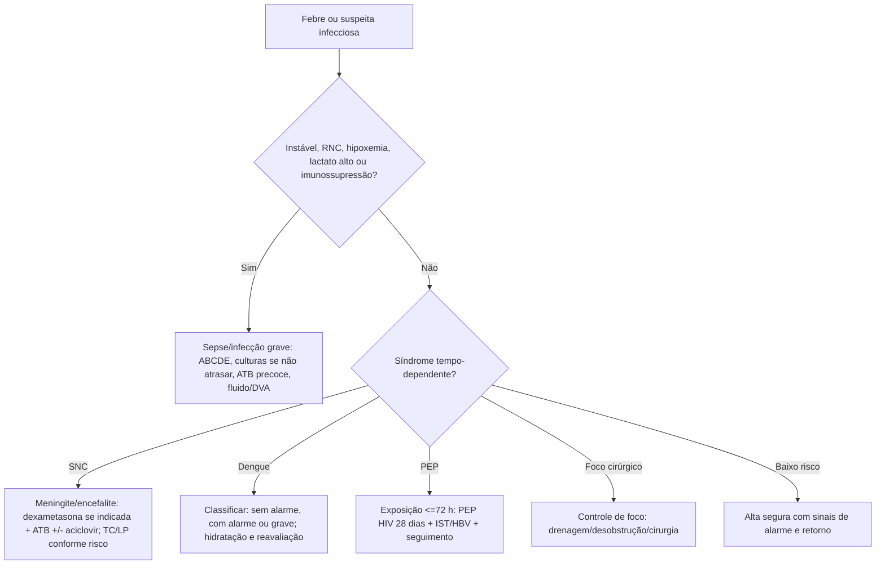

# Infectologia na Emergência

## Leitura de 30 segundos

- Infectologia no TEME é menos "decorar germe" e mais reconhecer gravidade, coletar o possível sem atrasar tratamento e iniciar antibiótico/antiviral/PEP quando tempo importa.
- Febre + disfunção orgânica = tratar como sepse enquanto procura foco. Febre + cefaleia/RNC/rigidez = meningite/encefalite até prova em contrário.
- HIV/TB, dengue/arboviroses, meningite, infecção urinária complicada, IST/violência sexual e doenças de notificação aparecem nas provas e no edital 2026.

## Por que cai

- **Recorrência em provas/estações:** TEME22-25 cobrou HIV com manifestações neurológicas, meningite tuberculosa, dengue, tuberculose, PEP HIV, infecção pulmonar/sepse e febre sem gravidade com alta segura.
- **O que a banca costuma testar:** prioridade, isolamento, notificação, antibiótico empírico, quando não esperar exame, sinais de alarme de dengue e profilaxias pós-exposição.
- **Como costuma aparecer:** paciente febril com um detalhe que muda tudo: imunossupressão, RNC, choque, viagem/área endêmica, exposição sexual, mordida, ferida contaminada ou obstrução.

## Abordagem prática

### 1. Febre no pronto-socorro

1. ABCDE e sinais de gravidade: hipotensão, confusão, hipoxemia, lactato alto, oligúria, petéquias, rigidez nucal, dor desproporcional, imunossupressão.
2. Se grave: monitor, acesso, lactato/gaso, hemoculturas se não atrasar, antibiótico na primeira hora, fluido/vasopressor conforme choque.
3. Procure foco por síndrome: respiratório, urinário, SNC, abdominal, pele/partes moles, cateter, gineco/obstétrico.
4. Decida isolamento: respiratório para TB suspeita, meningite com gotículas conforme agente, contato para diarreia/C. difficile, precaução padrão sempre.
5. Alta só se estável, sem red flags, com hipótese provável benigna, orientação escrita, retorno claro e seguimento.

### 2. Meningite e encefalite

- Suspeite: febre + cefaleia intensa, rigidez, vômitos, fotofobia, petéquias, rebaixamento, crise convulsiva ou imunossupressão.
- Antibiótico e dexametasona quando indicado não podem esperar TC/LP se houver atraso.
- TC antes da punção se RNC importante, déficit focal, papiledema, crise recente, imunossupressão ou suspeita de massa.
- Encefalite: febre + alteração comportamental/RNC/crise/focalidade. Adicione aciclovir se suspeita de HSV/VZV.
- TB/criptococo em HIV/imunossuprimido: pense em evolução subaguda, cefaleia, febre, perda ponderal, meningismo discreto.

### 3. HIV, TB e infecções oportunistas

- HIV novo ou irregular + dispneia/subagudo: TB, pneumocistose, pneumonia bacteriana e COVID/influenza entram no diferencial.
- TB pulmonar: tosse prolongada, febre vespertina, sudorese, perda ponderal, cavitação ou contato; isolar se suspeita respiratória.
- Pneumocistose: dispneia progressiva, hipoxemia, infiltrado intersticial; considerar SMX-TMP e corticoide se hipoxemia relevante conforme protocolo.
- Neuro em HIV: toxoplasmose, criptococo, TB meníngea, linfoma, PML; imagem/LP conforme estabilidade.
- Não iniciar TARV "no automático" na sala vermelha sem coordenar com infecto/protocolo, especialmente em TB meníngea/criptococo pelo risco de IRIS.

### 4. Dengue e arboviroses

- Dengue provável: febre em área de risco + mialgia, cefaleia, dor retro-orbitária, exantema, leucopenia ou prova do laço.
- Sinais de alarme: dor abdominal intensa, vômitos persistentes, sangramento de mucosa, letargia/irritabilidade, hipotensão postural, hepatomegalia, derrame/ascite, Ht subindo com plaqueta caindo.
- Dengue grave: choque, sangramento grave ou órgão-alvo grave.
- Evite AAS/AINE. Use hidratação guiada por gravidade, reavaliação e hemograma seriado quando indicado.
- Chikungunya: artralgia intensa; Zika: exantema/prurido/conjuntivite; febre amarela/leptospirose/malária entram se icterícia, sangramento, IRA, viagem ou epidemiologia.

### 5. IST, violência sexual e PEP

- Acolher e tratar antes de burocracia; boletim de ocorrência não é pré-requisito para cuidado.
- PEP HIV: iniciar o quanto antes se exposição de risco em até 72 h; curso de 28 dias.
- Cobrir IST conforme protocolo local: gonococo, clamídia, sífilis quando indicado, hepatite B e contracepção de emergência.
- Notificação e rede de seguimento são parte da conduta.

### 6. Infecções que exigem controle de foco

- Pielonefrite obstrutiva: antibiótico EV + desobstrução.
- Colangite grave: antibiótico + drenagem/CPRE.
- Fasciite necrosante: antibiótico amplo + cirurgia imediata.
- Empiema: antibiótico + drenagem.
- Abscesso: antibiótico não substitui drenagem quando há coleção.

## Conceitos que sustentam a conduta

Infecção grave mata por disfunção orgânica, carga microbiana, toxinas e resposta inflamatória desregulada. Por isso a resposta de prova é fisiológica: reconhecer gravidade, iniciar tratamento tempo-dependente, fazer controle de foco e ajustar depois com cultura/epidemiologia. Exame complementar confirma; não deve ser usado como freio quando o paciente está grave.

## Fluxograma

## Doses, alvos e números

| Item | Número | Observação TEME |
|---|---:|---|
| Antibiótico na sepse/choque | idealmente até 1 h | Coletar cultura se não atrasar |
| PEP HIV | até 72 h, por 28 dias | Urgência; iniciar quanto antes |
| Dexametasona meningite adulto | 10 mg EV 6/6 h | Antes ou junto da primeira dose se suspeita pneumococo |
| Aciclovir encefalite | 10 mg/kg EV 8/8 h | Ajustar renal; pensar HSV/VZV |
| Dengue: choque | cristaloide em bolus e reavaliação | Evitar coloide/AINE/AAS como rotina |
| TB suspeita respiratória | isolamento respiratório | Máscara/fluxo local; proteger equipe |
| Raiva pós-exposição | lavar ferida + vacina +/- imunoglobulina | Conforme risco animal/exposição e protocolo local |

## Pegadinhas TEME

- **Esperar TC para tratar meningite:** errado se isso atrasar antibiótico.
- **Dengue = hidratar muito todo mundo:** errado. Classificar risco e reavaliar; excesso de volume também mata.
- **Dengue pode AINE porque dor é intensa:** errado. Prefira dipirona/paracetamol conforme protocolo e função hepática.
- **PEP HIV depois de 72 h como rotina:** errado. Até 72 h é a janela clássica de prova; depois individualizar com especialista.
- **Antibiótico resolve obstrução infectada:** errado. Obstrução urinária/colangite/empiema/fasciite exigem controle de foco.
- **HIV febril é sempre pneumonia comum:** errado. TB, pneumocistose, criptococo, toxoplasmose e sepse comum entram no jogo.

## Erros fatais na prática

- Dar alta para febre com hipotensão postural, confusão, petéquias, imunossupressão ou dor desproporcional.
- Atrasar antibiótico/aciclovir em meningite/encefalite para "fechar o diagnóstico".
- Não isolar TB suspeita.
- Não notificar doenças compulsórias quando indicado.
- Não chamar urologia/cirurgia/endoscopia quando o problema é controle de foco.

## Para prova vs na prática

> **Para prova TEME:** febre + disfunção orgânica = sepse; meningite/encefalite não espera exame se houver atraso; dengue se classifica por sinais de alarme; PEP HIV é até 72 h por 28 dias; foco obstruído/infectado precisa controle de foco.
>
> **Na prática clínica:** antibiótico empírico depende de epidemiologia local, resistência, alergia, foco, gravidade, gestação, imunossupressão e protocolos institucionais. Em HIV/TB/meningites crônicas, coordene cedo com infectologia.

## Checklist de revisão

- [ ] Sei diferenciar febre baixa segura de febre com sinal de gravidade.
- [ ] Sei quando meningite/encefalite não espera TC/LP.
- [ ] Sei sinais de alarme e gravidade da dengue.
- [ ] Sei PEP HIV: até 72 h e 28 dias.
- [ ] Sei que antibiótico não substitui drenagem/desobstrução/cirurgia.
- [ ] Sei isolar TB suspeita e notificar quando indicado.

## Questões e estações relacionadas

- **TEME22:** HIV com crise/cefaleia, meningite tuberculosa, dengue, odontogênica, febre em contexto de vulnerabilidade.
- **TEME23:** HIV/infecção e pielonefrite obstrutiva como controle de foco.
- **TEME24:** HIV/TB, meningite/encefalite, dengue e contenção/delirium com diferencial clínico.
- **TEME25:** HIV/TB/pneumocistose, meningite/criptococo/TB, dengue, febre sem gravidade com alta segura.

## Referências

**Prova/TEME**

- Conteúdo programático TEME26.
- Referências bibliográficas TEME26: Tratado ABRAMEDE 2024; PCDT HIV adultos; PCDT coinfecções e infecções oportunistas; Portaria 2048/2002; referências de toxicologia/POCUS conforme tema.

**Material local**

- Emergency Talks: Aula 12 - Convulsões e infecções do SNC; Aula 21 - HIV e tuberculose; Aula 22 - Sepse; Aula 63 - Emergências infecciosas.

**Atualização clínica**

- Ministério da Saúde. Profilaxia Pós-Exposição: https://www.gov.br/saude/pt-br/assuntos/saude-de-a-a-z/a/aids-hiv/pep
- CDC. Clinical Guidance for PEP, 2025: https://www.cdc.gov/hivnexus/hcp/pep/index.html
- WHO. Dengue outbreak toolbox e sinais de alarme: https://www.who.int/emergencies/outbreak-toolkit/disease-outbreak-toolboxes/dengue-outbreak-toolbox
- CDC. Rabies post-exposure prophylaxis: https://www.cdc.gov/rabies/hcp/clinical-care/post-exposure-prophylaxis.html

