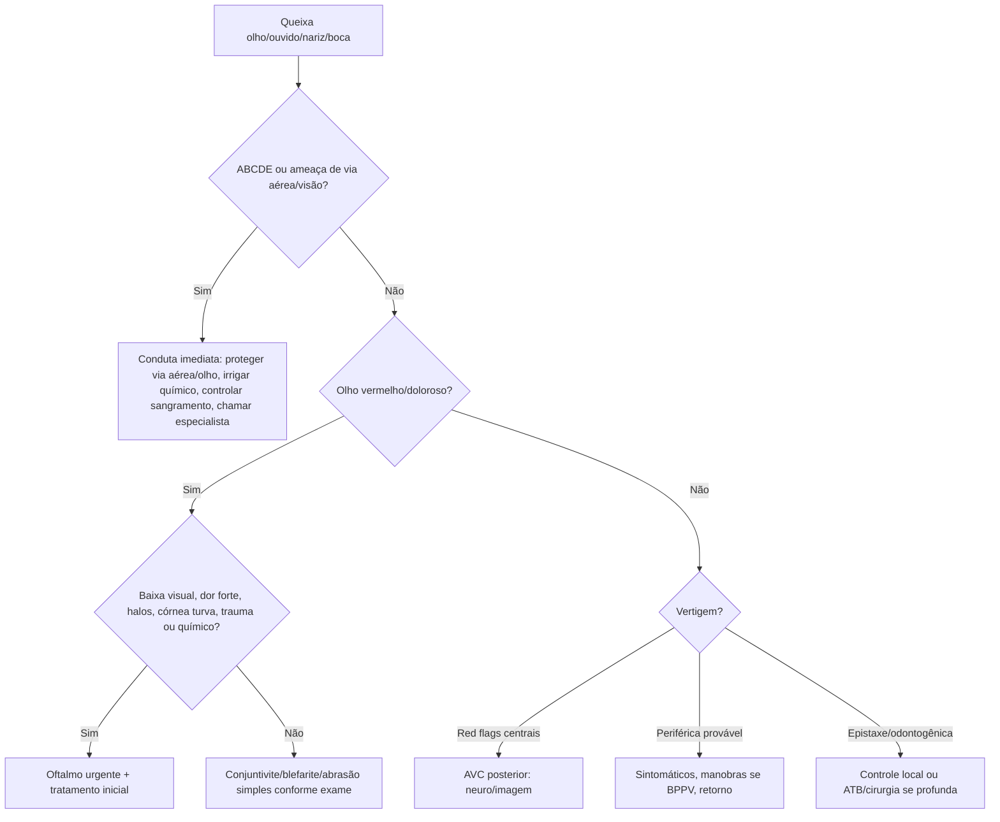

# Oftalmo, Otorrino e Odonto

## Leitura de 30 segundos

- A prova cobra o que o emergencista não pode perder: glaucoma agudo, descolamento de retina, queimadura química ocular, trauma ocular, epistaxe grave, vertigem central e infecção odontogênica com risco de via aérea.
- "Encaminhar ao especialista" pode ser correto, mas só depois de proteger olho, via aérea, hemodinâmica e dor.
- Olho vermelho com dor intensa, baixa visual, pupila alterada, córnea opaca, trauma/químico ou imunossupressão não é conjuntivite simples.

## Por que cai

- **Recorrência em provas/estações:** TEME22-25 trouxe olho/ocular/glaucoma, fotoceratite por solda, POCUS ocular, vertigem/otorrino, epistaxe, dente/infecção odontogênica e trauma facial.
- **O que a banca costuma testar:** separar benigno de ameaçador, conduta inicial antes da transferência, quando imagem/POCUS ajuda e quando não atrasar especialista.
- **Como costuma aparecer:** enunciado pequeno com uma palavra decisiva: flashes, cortina, halos, vômitos, solda, produto químico, estridor, epistaxe posterior, HINTS perigoso.

## Abordagem prática

### 1. Olho vermelho ou dor ocular

1. Cheque visão de cada olho, dor, fotofobia, trauma/químico, lente de contato, imunossupressão e cirurgia recente.
2. Examine pupila, córnea, câmara anterior, fluoresceína, pressão ocular se disponível e sem suspeita de perfuração.
3. Químico: irrigar imediatamente, retirar lentes/partículas e medir pH se possível. Não espere oftalmo para começar.
4. Red flags: baixa acuidade, dor forte, náusea/vômito, halos, pupila média fixa, córnea turva, hifema, perfuração, úlcera em usuário de lente.
5. Analgesia/antiemético/proteção ocular e oftalmo cedo quando ameaça visual.

### 2. Glaucoma agudo de ângulo fechado

- Dor ocular intensa, olho vermelho, halos, cefaleia, náuseas/vômitos, baixa visual.
- Pupila médio-dilatada/fixa, córnea turva, pressão intraocular alta se medida.
- Conduta inicial: antiemético/analgesia, colírios hipotensores conforme protocolo, acetazolamida se sem contraindicação e oftalmo urgente para tratamento definitivo.

### 3. Retina e POCUS ocular

- Flashes, moscas volantes novas, "cortina" ou perda de campo = suspeitar rasgo/descolamento.
- POCUS ocular pode ajudar quando não há fundo de olho adequado, mas não substitui oftalmo.
- Evite pressão no globo se suspeita de perfuração/trauma aberto.
- ONSD aumentado pode sugerir HIC no contexto certo, mas não é diagnóstico isolado.

### 4. Trauma ocular

- Suspeite globo aberto: mecanismo penetrante, deformidade pupilar, hifema, Seidel positivo, acuidade muito reduzida.
- Não comprimir, não manipular, não medir PIO, não retirar objeto empalado.
- Protetor rígido, antiemético, analgesia, jejum, antibiótico conforme protocolo e oftalmo/cirurgia.

### 5. Epistaxe e via aérea alta

1. ABCDE se sangramento importante, anticoagulado, idoso ou instável.
2. Compressão firme na parte mole do nariz 10-15 min, cabeça levemente para frente.
3. Vasoconstrictor tópico se disponível, cautério se ponto anterior e visualizado.
4. Tamponamento anterior se persistente; suspeitar posterior se sangramento volumoso, bilateral, pela orofaringe ou falha do anterior.
5. Reverter anticoagulação se ameaça vida conforme droga/risco.

### 6. Vertigem

- Distinguir vertigem episódica posicional, vestibular periférica contínua e AVC posterior.
- Red flags centrais: déficit neurológico, cefaleia nova intensa, incapacidade de ficar sentado/em pé, nistagmo vertical/direcional cambiante, skew positivo, perda auditiva súbita com sinais centrais, fatores vasculares fortes.
- HINTS só deve ser usado em síndrome vestibular aguda contínua e por examinador treinado.
- Vertigem + neuro red flag = imagem/neurologia, não "labirintite".

### 7. Odonto e infecção cervical

- Dor dentária simples não é sala vermelha; mas trismo, disfagia, sialorreia, voz abafada, elevação de assoalho, edema submandibular ou estridor = via aérea difícil prevista.
- Angina de Ludwig/abscesso profundo: antibiótico EV amplo, cirurgia/otorrino/bucomaxilo e plano de via aérea acordada se progressivo.
- Nunca drene "às cegas" coleção profunda no pescoço.

## Conceitos que sustentam a conduta

Olho e via aérea compartilham uma regra: tempo é tecido. Retina, glaucoma, queimadura química e globo aberto perdem visão; infecção cervical perde via aérea. A prova costuma punir a resposta passiva que só encaminha, sem iniciar proteção, irrigação, analgesia, antiemético, antibiótico ou chamada precoce.

## Fluxograma

## Doses, alvos e números

| Item | Número | Observação TEME |
|---|---:|---|
| Irrigação ocular química | imediata até pH neutro | Não esperar especialista |
| Compressão epistaxe | 10-15 min | Parte mole do nariz, cabeça para frente |
| Acetazolamida glaucoma | 500 mg VO/EV | Se sem contraindicação; protocolo local |
| Dor ocular/trauma | antiemético + analgesia | Evitar Valsalva/vômitos no globo aberto |
| Antibiótico infecção cervical | precoce EV amplo | Associar drenagem/controle de foco |
| HINTS | só em vertigem contínua | Não usar em tontura episódica ou examinador inseguro |

## Pegadinhas TEME

- **Olho vermelho = conjuntivite:** falso se dor forte, baixa visual, fotofobia, pupila/córnea alterada ou trauma/químico.
- **Queimadura química espera oftalmo:** falso. Irrigação é imediata.
- **Descolamento de retina dói muito:** geralmente não. Flashes, moscas e cortina são pistas.
- **PIO deve ser medida em todo trauma ocular:** falso se suspeita globo aberto.
- **HINTS normal por qualquer médico exclui AVC:** falso. Exige cenário e técnica corretos.
- **Infecção dentária é sempre ambulatorial:** falso se trismo, disfagia, assoalho de boca, sialorreia ou estridor.

## Erros fatais na prática

- Mandar para casa usuário de lente de contato com dor/fotofobia sem excluir úlcera de córnea.
- Atrasar irrigação ocular por busca de material perfeito.
- Comprimir globo aberto ou retirar corpo estranho empalado.
- Chamar "labirintite" em AVC de circulação posterior.
- Perder via aérea em angina de Ludwig/abscesso cervical.

## Para prova vs na prática

> **Para prova TEME:** ameaça visual recebe conduta imediata e oftalmo; químico irriga já; glaucoma agudo é emergência; flashes/cortina sugerem retina; vertigem com sinais centrais é AVC até prova em contrário; infecção odontogênica com sinais de via aérea é emergência.
>
> **Na prática clínica:** protocolos de colírios, antibióticos e disponibilidade de oftalmo/otorrino/bucomaxilo variam. O emergencista deve iniciar as medidas que preservam visão, via aérea e segurança antes da transferência.

## Checklist de revisão

- [ ] Sei red flags do olho vermelho.
- [ ] Sei glaucoma agudo: dor, halos, vômitos, pupila média, córnea turva.
- [ ] Sei retina: flashes, moscas novas e cortina.
- [ ] Sei que químico ocular é irrigação imediata.
- [ ] Sei epistaxe anterior vs posterior.
- [ ] Sei quando vertigem é AVC posterior.
- [ ] Sei sinais de infecção odontogênica ameaçando via aérea.

## Questões e estações relacionadas

- **TEME22:** fotoceratite/lesão ocular por solda; glaucoma agudo; questões com termos ocular/oftalmo/otorrino/odonto.
- **TEME24:** olho vermelho/glaucoma, vertigem/otorrino, epistaxe e POCUS ocular em contexto de prova.
- **TEME25:** POCUS ocular/descolamento de retina; ONSD/HIC em POCUS/neuro; vertigem e deficiência visual.
- **Práticas:** temas de via aérea difícil podem envolver infecção cervical/angioedema e necessidade de chamar ajuda cedo.

## Referências

**Prova/TEME**

- Conteúdo programático TEME26: grandes síndromes, olho vermelho, trauma ocular/facial, emergências infecciosas e POCUS ocular.
- Referências bibliográficas TEME26: Tratado ABRAMEDE 2024; POCUS ABRAMEDE 2024; Manual de Via Aérea 2025.

**Material local**

- Emergency Talks: Aula 41 - Emergências otorrino e odonto; Aula 64 - Emergências oftalmológicas; Aula 18 - POCUS trauma/vascular/neuro.

**Atualização clínica**

- AAO/EyeWiki. Retinal Detachment: https://eyewiki.aao.org/Retinal_Detachment
- AAO/EyeWiki. Acute angle closure/drug-induced angle closure: https://eyewiki.aao.org/Drug-induced_Acute_Angle_Closure_Glaucoma
- AAO/EyeWiki. Laser Peripheral Iridotomy: https://eyewiki.aao.org/Laser_Peripheral_Iridotomy

