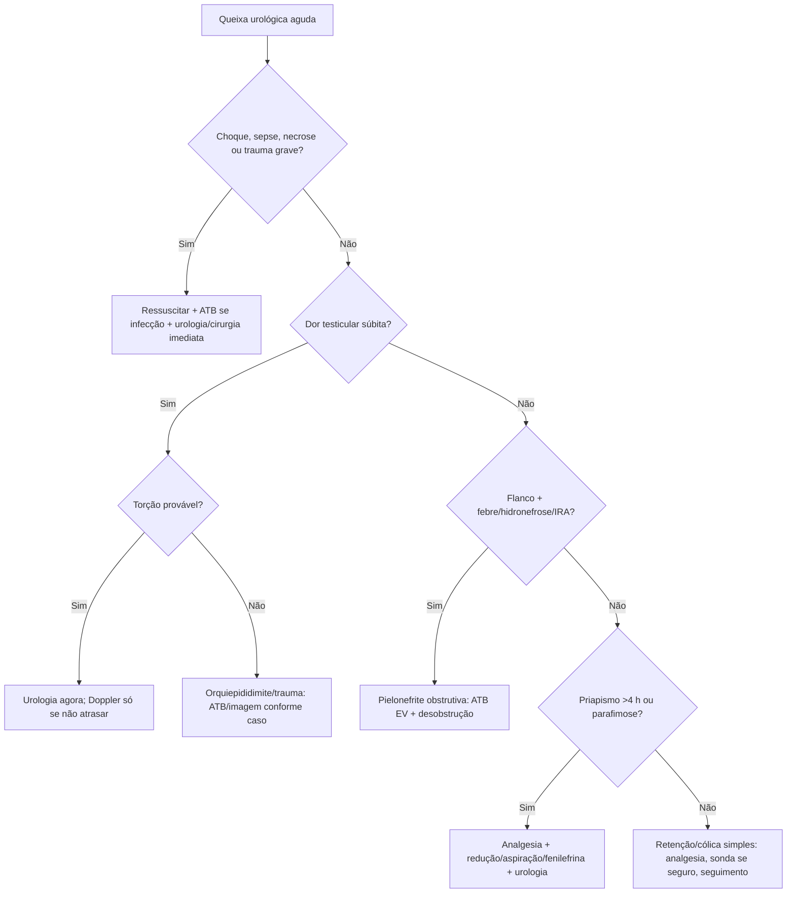

# Urologia na Emergência

## Leitura de 30 segundos

- Urologia no TEME é reconhecer tempo-dependência: torção testicular, pielonefrite obstrutiva, priapismo isquêmico, parafimose, retenção complicada e trauma urogenital.
- Dor testicular súbita com náuseas/vômitos e reflexo cremastérico ausente é torção até prova em contrário. Doppler não pode atrasar urologia quando a clínica é forte.
- Obstrução + infecção não melhora só com antibiótico: precisa drenagem/desobstrução.

## Por que cai

- **Recorrência em provas/estações:** TEME23 cobrou pielonefrite obstrutiva/hidronefrose; TEME25 cobrou torção testicular; TEME22-25 trazem termos testicular, hidronefrose, ureterolitíase, priapismo e retenção.
- **O que a banca costuma testar:** primeira conduta, quando chamar urologia, analgesia, controle de foco e armadilhas com imagem.
- **Como costuma aparecer:** dor lombar/flanco com febre, dor escrotal súbita, ereção prolongada dolorosa, prepúcio preso ou trauma pélvico com uretrorragia.

## Abordagem prática

### 1. Dor escrotal aguda

1. ABCDE se grave, analgesia e antiemético.
2. Pergunte início súbito, náusea/vômito, trauma, febre, sintomas urinários, atividade sexual.
3. Examine posição testicular, reflexo cremastérico, edema, dor à elevação e sinais de Fournier.
4. Clínica forte de torção = urologia imediata, jejum, preparo cirúrgico. US Doppler se disponível sem atrasar.
5. Orquiepididimite provável: febre/disúria/corrimento/dor gradual; ATB conforme idade/risco IST/enterobactéria.

### 2. Cólica renal e obstrução infectada

- Cólica simples: AINE se função renal/risco permitir, antiemético, hidratação sem "forçar", avaliação de complicações.
- Internar/desobstruir se febre, sepse, rim único, anúria, IRA, dor/vômitos intratáveis, gestação, imunossupressão ou cálculo grande/proximal complicado.
- Pielonefrite obstrutiva: antibiótico EV + descompressão por duplo J ou nefrostomia.

### 3. Retenção urinária

- Dor suprapúbica, bexigoma, oligúria/anúria.
- Sonda vesical de demora se sem suspeita de lesão uretral.
- Suspeita de lesão uretral: sangue no meato, trauma pélvico, períneo/scroto equimótico, próstata alta, dificuldade de sondagem = urologia/uretrografia; não insistir.

### 4. Priapismo

- Ereção >4 h, geralmente dolorosa e rígida = priapismo isquêmico até prova em contrário.
- Analgesia, gasometria cavernosa quando disponível, urologia urgente.
- Tratamento de prova: aspiração/irrigação cavernosa e fenilefrina intracavernosa titulada, além de tratar causa.
- Falciforme: oxigênio se hipoxemia, analgesia, hidratação cuidadosa, hematologia; não atrasar manejo local se isquêmico.

### 5. Parafimose e fratura de pênis

- Parafimose: glande edemaciada com anel constritor; analgesia/bloqueio, compressão/redução manual; urologia se falha/necrose.
- Fratura de pênis: estalo, dor, detumescência, hematoma em berinjela. Cirurgia precoce.
- Não sondar às cegas se uretrorragia ou retenção após trauma peniano/pélvico.

### 6. Fournier e infecção genital grave

- Dor intensa, edema, crepitação, necrose, febre, choque, diabetes/imunossupressão.
- Antibiótico amplo, ressuscitação, cirurgia/urologia imediata. Imagem não deve atrasar se instável ou suspeita alta.

## Conceitos que sustentam a conduta

Muitas emergências urológicas são síndromes compartimentais ou obstrutivas: torção corta fluxo arterial/venoso; priapismo isquêmico acidifica o corpo cavernoso; obstrução urinária infectada prende pus sob pressão; parafimose estrangula glande. O tratamento certo é aliviar a obstrução/isquemia, não apenas medicar sintomas.

## Fluxograma

## Doses, alvos e números

| Item | Número | Observação TEME |
|---|---:|---|
| Torção testicular | ideal <6 h | Não atrasar cirurgia por Doppler se clínica forte |
| Priapismo isquêmico | >4 h | Emergência; corpo cavernoso funciona como compartimento |
| Fenilefrina intracavernosa | 100-500 mcg a cada 3-5 min | Monitorar PA/ECG; urologia/protocolo local |
| Cólica renal | AINE primeira linha se seguro | Evitar se DRC avançada, sangramento, hipovolemia importante |
| Pielonefrite obstrutiva | ATB EV + drenagem | Controle de foco obrigatório |
| Retenção urinária | sondagem se sem trauma uretral | Não insistir se sangue no meato/trauma pélvico |

## Pegadinhas TEME

- **Torção espera Doppler se clínica forte:** falso.
- **Reflexo cremastérico presente exclui torção:** falso, mas ausência aumenta suspeita.
- **Obstrução infectada trata com antibiótico e observa:** falso. Precisa desobstruir.
- **Cólica renal deve receber litros de soro para expulsar cálculo:** falso. Analgesia e avaliação de complicação.
- **Priapismo é urgência ambulatorial:** falso se >4 h e doloroso.
- **Sangue no meato e trauma pélvico = passar sonda com cuidado:** falso. Chame urologia/uretrografia.

## Erros fatais na prática

- Liberar dor testicular súbita porque o Doppler demoraria.
- Não reconhecer Fournier em dor genital desproporcional.
- Insistir em sonda em trauma uretral.
- Tratar pielonefrite obstrutiva sem acionar drenagem.
- Subtratar dor escrotal/cólica renal e perder reavaliação.

## Para prova vs na prática

> **Para prova TEME:** torção testicular é clínica e cirúrgica; obstrução infectada exige ATB EV + desobstrução; priapismo isquêmico >4 h exige aspiração/fenilefrina/urologia; parafimose é redução urgente; trauma uretral não deve ser sondado às cegas.
>
> **Na prática clínica:** escolha de antibiótico, via de drenagem e técnica de priapismo depende de recurso, urologia, idade, risco de IST, cultura e protocolo local.

## Checklist de revisão

- [ ] Sei sinais de torção testicular.
- [ ] Sei que Doppler não atrasa urologia se clínica forte.
- [ ] Sei identificar pielonefrite obstrutiva.
- [ ] Sei priapismo isquêmico >4 h.
- [ ] Sei parafimose e fratura de pênis.
- [ ] Sei quando não passar sonda.
- [ ] Sei suspeitar Fournier.

## Questões e estações relacionadas

- **TEME23 Q32:** lombar/testicular, hidronefrose e infecção = pielonefrite obstrutiva; antibiótico EV + desobstrução.
- **TEME24 Q40:** cólica/flanco com POCUS/hidronefrose e risco de obstrução.
- **TEME25 Q99/Q100:** dor testicular súbita, náuseas/vômitos e sinais clínicos de torção.
- **TEME22-25:** termos hidronefrose, testicular, priapismo e retenção aparecem como distratores ou diagnósticos associados.

## Referências

**Prova/TEME**

- Conteúdo programático TEME26: emergências urológicas, escroto agudo, emergências penianas, ITU complicada e POCUS renal/litíase.
- Referências bibliográficas TEME26: Tratado ABRAMEDE 2024; POCUS ABRAMEDE 2024.

**Material local**

- Emergency Talks: Aula 24 - Emergências Urológicas; Aula 14/15 - Abdome agudo; Aula 35 - POCUS procedimentos.

**Atualização clínica**

- EAU. Urological Trauma Guidelines: https://uroweb.org/guidelines/urological-trauma/chapter/urogenital-trauma-guidelines
- EAU. Priapism: https://uroweb.org/guidelines/sexual%20-and-reproductive-health/chapter/priapism

