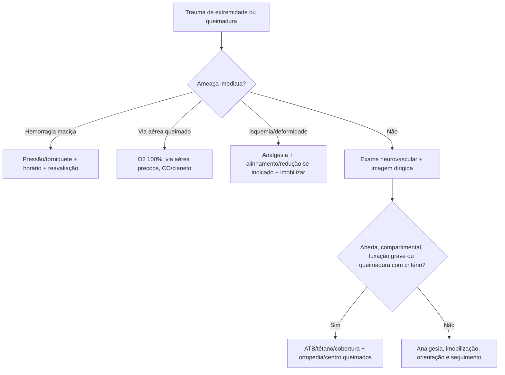

# Ortopedia, Trauma de Extremidades e Queimaduras

## Leitura de 30 segundos

- Extremidade no TEME é MARCH/ABCDE: hemorragia, perfusão, função neurovascular, alinhamento, analgesia, antibiótico/profilaxia e ortopedia.
- Fratura exposta recebe cobertura estéril, antibiótico precoce, profilaxia antitetânica, irrigação grosseira se contaminada, imobilização e cirurgia. Não é "fechar no PS".
- Queimado grave mata por via aérea, CO/cianeto, choque, hipotermia e erro de cálculo de superfície/profundidade.

## Por que cai

- **Recorrência em provas/estações:** TEME22-25 cobrou fratura exposta, controle de hemorragia em extremidade, START com fratura, luxações, síndrome compartimental, queimadura, lesão inalatória, blast, bloqueios e analgesia.
- **O que a banca costuma testar:** primeira conduta, torniquete, antibiótico, imobilização, redução urgente, quando chamar centro de queimados e quando não atrasar fasciotomia/cirurgia.
- **Como costuma aparecer:** membro deformado, dor intensa, ferida contaminada, pulso alterado, queimadura com bolhas, incêndio em local fechado ou fratura/luxação com risco neurovascular.

## Abordagem prática

### 1. Extremidade no trauma

1. Controle hemorragia: pressão direta, curativo compressivo, torniquete se sangramento ameaçador em membro.
2. Avalie e documente neurovascular antes e depois de manipular: pulso, perfusão, motricidade, sensibilidade.
3. Analgesia cedo: dipirona/paracetamol, opioide, cetamina baixa dose, bloqueio guiado por US se treinado.
4. Alinhe deformidade grosseira com isquemia/pele ameaçada quando seguro; imobilize articulação acima e abaixo.
5. Ferida aberta: cobrir estéril, antibiótico, tétano, ortopedia.

### 2. Fratura exposta

- Não atrasar antibiótico para raio X.
- Remover contaminação grosseira, irrigar de forma simples se sujo, cobrir com curativo estéril úmido/seco conforme protocolo.
- Não fechar ferida no pronto-socorro.
- Ortopedia precoce para desbridamento, estabilização e decisão cirúrgica.
- Gustilo ajuda prognóstico, mas a primeira hora é controle de hemorragia, antibiótico e imobilização.

### 3. Luxações e reduções

- Reduzir urgente se déficit neurovascular, pele ameaçada, luxação de joelho/quadril, dor intratável ou atraso de especialista.
- Ombro posterior pode passar no AP; suspeite após convulsão/choque elétrico com rotação interna.
- Quadril luxado: reduzir cedo pelo risco de necrose avascular.
- Joelho luxado: risco de lesão poplítea; ABI/angioTC conforme pulso/índice e protocolo.

### 4. Síndrome compartimental

- Dor desproporcional, dor à extensão passiva, parestesia, tensão compartimental.
- Pulso pode estar presente até tarde; ausência de pulso é sinal tardio.
- Medir pressão se dúvida e disponível, mas clínica forte exige ortopedia/fasciotomia.
- Risco: fratura de tíbia/antebraço, esmagamento, reperfusão, queimadura circunferencial, anticoagulação.

### 5. Queimaduras

1. Cena segura, retirar da fonte, remover roupas/acessórios não aderidos, resfriar queimadura térmica recente com água corrente se precoce e sem hipotermia.
2. ABCDE: rouquidão, estridor, queimadura facial, fuligem, queimadura em ambiente fechado, rebaixamento ou edema progressivo = via aérea cedo.
3. CO: oximetria comum pode ser falsamente normal; O2 100%.
4. Cianeto: incêndio fechado + lactato alto/choque/RNC = hidroxocobalamina conforme disponibilidade.
5. Calcular SCQ: não contar primeiro grau para fórmula.
6. Cobrir limpo, analgesia, aquecer, tétano e transferir se critério.

### 6. Critérios práticos de centro de queimados

- Parcial profunda/total relevante, face/mãos/pés/genitália/períneo/grandes articulações.
- Inalatória, elétrica/química, trauma associado, comorbidade, crianças, idosos, suspeita de violência/necessidade social.
- Grande queimado: ressuscitação guiada por fórmula e diurese, evitando tanto sub quanto hiper-hidratação.

## Conceitos que sustentam a conduta

Extremidade ferida pode matar por sangue, perder função por isquemia/compartimento e infectar por osso exposto. Queimadura é trauma sistêmico: edema de via aérea evolui, CO desloca oxigênio sem derrubar oximetria, e fluido demais causa complicações. A banca gosta de conduta ordenada, não de heroísmo improvisado.

## Fluxograma

## Doses, alvos e números

| Item | Número | Observação TEME |
|---|---:|---|
| Antibiótico fratura exposta | o mais precoce possível | Cefazolina é base comum; ampliar conforme gravidade/contaminação |
| Torniquete | registrar horário | Não afrouxar intermitentemente |
| Síndrome compartimental | dor à extensão passiva | Pulso presente não exclui |
| Queimadura: fórmula inicial | 2-4 mL x kg x %SCQ em 24 h | Só 2º/3º grau; metade nas primeiras 8 h desde o trauma |
| Diurese adulto queimado | 0,5 mL/kg/h | Maior alvo em elétrica/rabdomiólise conforme protocolo |
| Centro de queimados | face, mãos, pés, períneo, articulações, inalatória, elétrica/química | Critérios variam; usar referência oficial/local |
| CO | O2 100% | SatO2 pode enganar |

## Pegadinhas TEME

- **Fratura exposta espera ortopedia para antibiótico:** falso.
- **Pulso presente exclui compartimental:** falso.
- **Primeiro grau entra na fórmula de Parkland:** falso.
- **Oximetria normal exclui intoxicação por CO:** falso.
- **Queimado de face sempre precisa IOT imediata:** não sempre; mas sinais de via aérea/ambiente fechado/edema progressivo exigem agressividade.
- **Luxação posterior de ombro aparece fácil no AP:** falso.

## Erros fatais na prática

- Esquecer exame neurovascular antes/depois da redução.
- Sedar/reduzir sem preparo de via aérea, monitor e analgesia adequada.
- Cobrir fratura exposta e esquecer antibiótico/tétano.
- Hiper-hidratar queimado e piorar edema/compartimento.
- Perder lesão inalatória em incêndio fechado.

## Para prova vs na prática

> **Para prova TEME:** controle hemorragia, documente neurovascular, antibiótico precoce na fratura exposta, redução urgente se risco neurovascular/pele, compartimental é clínica e queimadura exige via aérea/CO/cálculo correto de SCQ.
>
> **Na prática clínica:** antibiótico e critério de centro de queimados seguem protocolo regional. Bloqueios e sedação são excelentes quando há equipe treinada, monitorização e plano de resgate.

## Checklist de revisão

- [ ] Sei passo inicial da fratura exposta.
- [ ] Sei avaliar neurovascular antes/depois.
- [ ] Sei sinais de síndrome compartimental.
- [ ] Sei luxações que não podem esperar.
- [ ] Sei critérios de via aérea no queimado.
- [ ] Sei calcular SCQ sem contar primeiro grau.
- [ ] Sei que CO pode ter oximetria normal.

## Questões e estações relacionadas

- **TEME22:** fratura exposta, controle de hemorragia em extremidade, START com fratura, blast/queimadura.
- **TEME23:** fraturas expostas, luxação/compartimental, lesão por fumaça e queimadura.
- **TEME24:** queimadura térmica com bolhas, analgesia/bloqueio e trauma de extremidades.
- **TEME25:** síndrome compartimental, fraturas/luxações, fratura exposta de tíbia, bloqueio guiado por US, cálculo de queimadura e trauma prático com torniquete.

## Referências

**Prova/TEME**

- Conteúdo programático TEME26: trauma de extremidades, reduções, queimaduras, explosão, eletrocussão e causas ambientais.
- Referências bibliográficas TEME26: Tratado ABRAMEDE 2024; APH ABRAMEDE 2025; diretriz europeia de sangramento no trauma.

**Material local**

- Emergency Talks: Aula 37 - Trauma ambiental I; Aula 39 - Trauma de extremidades; Aula 44 - Trauma de partes moles; Aula 56 - Trauma ambiental II e áreas remotas.

**Atualização clínica**

- American Burn Association. Burn Patient Referral Guidelines: https://www.ameriburn.org/burn-care-team/resources/guidelines-for-burn-patient-referral

