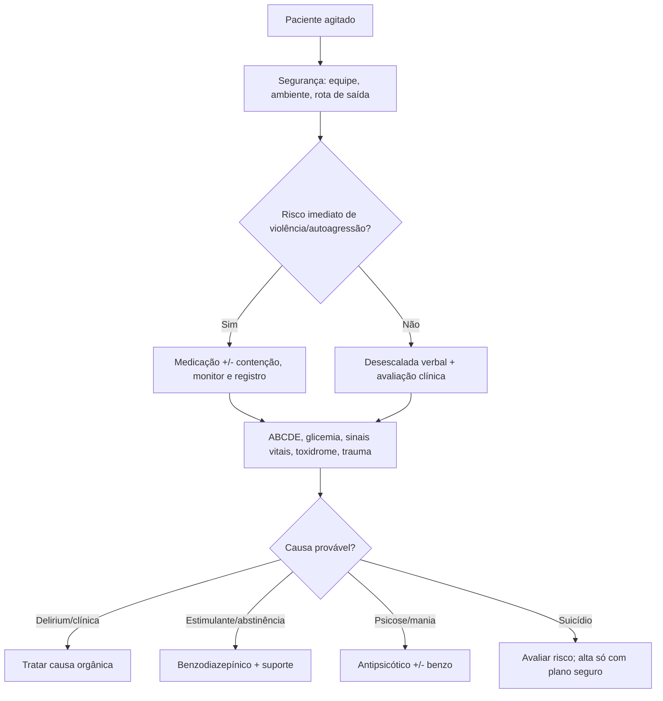

# Psiquiatria, Agitação e Contenção

## Leitura de 30 segundos

- Agitação na emergência é diagnóstico sindrômico, não "psiquiatria até prova em contrário". Primeiro proteja equipe/paciente e procure causa clínica reversível.
- Desescalada verbal e ambiente seguro vêm antes de contenção quando possível; contenção física/química precisa indicação, monitorização, reavaliação e registro.
- Tentativa de suicídio com aparente arrependimento não é alta automática. Risco longitudinal, letalidade, suporte e acesso a meios importam.

## Por que cai

- **Recorrência em provas/estações:** TEME22-25 cobrou agitação psicomotora, investigação clínica em sintomas psiquiátricos, abstinência, contenção, BARS e tentativa de suicídio.
- **O que a banca costuma testar:** diferenciar delirium/intoxicação/psicose, quando investigar causas clínicas, contenção segura, medicação por provável etiologia e alta segura.
- **Como costuma aparecer:** paciente agitado com hipoglicemia, hipóxia, abstinência, intoxicação, idoso, primeiro surto ou tentativa suicida "calma".

## Abordagem prática

### 1. Segurança e primeiro minuto

1. Chame equipe, retire objetos perigosos, mantenha saída livre e fale com distância segura.
2. ABCDE à distância: hipoxemia, trauma, hipoglicemia, pupilas, temperatura, toxidrome, sinais focais.
3. Glicemia capilar e sinais vitais são "exame psiquiátrico" obrigatório no DE.
4. Desescalada: voz baixa, frases curtas, escolha limitada, validar sem concordar com delírio.
5. Se risco imediato: medicação e/ou contenção com monitorização.

### 2. Diferencie grandes causas

| Padrão | Pistas | Conduta base |
|---|---|---|
| Delirium | flutuação, desatenção, idoso, infecção, hipoxemia, droga | Tratar causa, evitar contenção prolongada |
| Psicose/mania | delírios organizados, alucinação, insônia, história psiquiátrica | Antipsicótico +/- benzo |
| Intoxicação estimulante | midríase, sudorese, hipertensão, hipertermia | Benzodiazepínico + resfriar se hipertermia |
| Abstinência álcool/benzo | tremor, taquicardia, hipertensão, alucinose, convulsão | Benzodiazepínico, tiamina, suporte |
| Anticolinérgico | pele seca/quente, retenção, midríase, delirium | Suporte, benzo; ECG/toxico |

### 3. BARS e intensidade

- BARS 4: quieto/acordado, comportamento normal.
- BARS 5: sinais de atividade, mas redirecionável.
- BARS 6: extremamente ativo, sem necessidade imediata de contenção em todos os casos; risco alto.
- BARS 7: violento, exige proteção imediata.

> **Pegada TEME25:** BARS 6 não significa automaticamente "contenção física imediata" se há alternativa segura; primeiro segurança, desescalada/medicação conforme risco e causa.

### 4. Medicação prática

- Agitação indiferenciada sem instabilidade: haloperidol/droperidol/olanzapina ou benzodiazepínico conforme provável causa e protocolo.
- Estimulante, abstinência, catatonia ou hipertermia: benzodiazepínico é central.
- Psicose/mania: antipsicótico costuma ser base; associar benzo se muito agitado.
- Idoso/delirium: doses menores, evitar benzodiazepínico salvo abstinência ou indicação clara.
- Sempre monitorar sedação, via aérea, QT, hipotensão e interação com álcool/opioide.

### 5. Contenção física

- Indicação: risco iminente a si/equipe/terceiros e falha/impossibilidade de medidas menos restritivas.
- Técnica: equipe treinada, 4/5 pontos, proteger cabeça/via aérea, evitar prona, checar circulação.
- Depois: medicação para sofrimento/agitação, monitorização, reavaliação frequente, retirar assim que seguro, documentar indicação e alternativas tentadas.

### 6. Suicídio e alta segura

- Alto risco: tentativa recente de alta letalidade, tentativas prévias, plano persistente, psicose, intoxicação, impulsividade, desesperança, pouco suporte, acesso a meios, doença/dor grave.
- Baixo risco exige: avaliação completa, melhora sustentada, plano de segurança, acompanhante, retirada de meios, seguimento definido e retorno orientado.
- Notificação/acionamento de rede conforme violência/autolesão e regra local.

## Conceitos que sustentam a conduta

Agitação é uma falência temporária de segurança e comunicação. O erro é disputar narrativa com o paciente ou rotular tudo como psiquiátrico. No DE, a pergunta é: alguém vai se machucar nos próximos minutos? existe causa clínica reversível? qual intervenção menos restritiva funciona agora?

## Fluxograma

## Doses, alvos e números

| Item | Número | Observação TEME |
|---|---:|---|
| Glicemia capilar | imediata | Todo agitado/confuso/rebaixado |
| Haloperidol | 2,5-5 mg IM/EV/VO | Dose menor em idoso; cuidado QT/EPS |
| Droperidol | 2,5-5 mg IM/EV | Conforme disponibilidade/protocolo |
| Midazolam | 2-5 mg IM/EV/IN | Cuidado depressão respiratória, álcool/opioide |
| Diazepam abstinência | 5-10 mg EV/VO repetido | Titular por sedação leve/controle autonômico |
| Tiamina | 100 mg EV/IM | Alcoolismo/desnutrição; não atrasar glicose grave |
| BARS | 1-7 | 6 = muito ativo; 7 = violento |

## Pegadinhas TEME

- **Primeiro episódio psiquiátrico não precisa exame clínico:** falso.
- **Idoso agitado é psiquiátrico até prova em contrário:** falso; delirium é comum.
- **BARS 6 = contenção obrigatória:** falso; avalie risco e possibilidade de desescalada/medicação.
- **Benzodiazepínico serve para toda agitação:** falso; pode piorar delirium/respiração, mas é bom em abstinência/estimulante.
- **Paciente suicida calmo e arrependido pode ir embora:** falso se alto risco longitudinal.
- **Contenção é castigo:** falso; é medida temporária de segurança com monitorização e retirada precoce.

## Erros fatais na prática

- Ser o único profissional em sala com paciente violento.
- Contenção prona ou sem monitorização.
- Sedar sem avaliar via aérea, hipoglicemia, hipóxia, trauma e hipertermia.
- Dar alta para tentativa suicida de alto risco.
- Não reavaliar circulação e respiração após contenção/medicação.

## Para prova vs na prática

> **Para prova TEME:** agitação exige segurança, glicemia/sinais vitais/ABCDE, busca de causa orgânica, desescalada se possível, contenção apenas se risco e medicação conforme etiologia. Suicídio de alto risco não recebe alta simples.
>
> **Na prática clínica:** protocolos de droperidol, olanzapina, haloperidol, cetamina e benzodiazepínicos variam. Use a menor restrição eficaz, com equipe, monitorização e documentação.

## Checklist de revisão

- [ ] Sei abordar segurança no primeiro minuto.
- [ ] Sei red flags de causa clínica.
- [ ] Sei diferenciar delirium, psicose, estimulante e abstinência.
- [ ] Sei BARS 6 vs 7.
- [ ] Sei regras de contenção segura.
- [ ] Sei alto risco suicida.
- [ ] Sei doses básicas e riscos respiratórios/QT.

## Questões e estações relacionadas

- **TEME22:** tentativa de suicídio/trauma, agitação psicomotora, abstinência e investigação clínica em sintomas psiquiátricos.
- **TEME24:** agitação, contenção e delirium em casos clínicos.
- **TEME25 Q86:** BARS e conduta na agitação.
- **TEME25 Q88:** tentativa de suicídio com tentativas prévias e baixo suporte = alto risco, sem alta simples.

## Referências

**Prova/TEME**

- Conteúdo programático TEME26: agitação psicomotora, delirium, tentativa de suicídio, emergências psiquiátricas e manejo de psicofármacos.
- Referências bibliográficas TEME26: Tratado ABRAMEDE 2024; Código de Ética Médica; CFM 2077/2014.

**Material local**

- Emergency Talks: Aula 23 - Emergências psiquiátricas; Aula 53-55 - Toxicologia; Aula 17 - Paliativos/vulnerabilidades no material local.

**Atualização clínica**

- ACEP. Clinical Policy: Severe Agitation: https://www.acep.org/siteassets/new-pdfs/clinical-policies/severe-agitation-cp.pdf
- ACEP. Use of Patient Restraints: https://www.acep.org/siteassets/new-pdfs/policy-statements/use-of-patient-restraints.pdf
- Project BETA overview: https://onlinelibrary.wiley.com/doi/full/10.1002/emp2.12138

