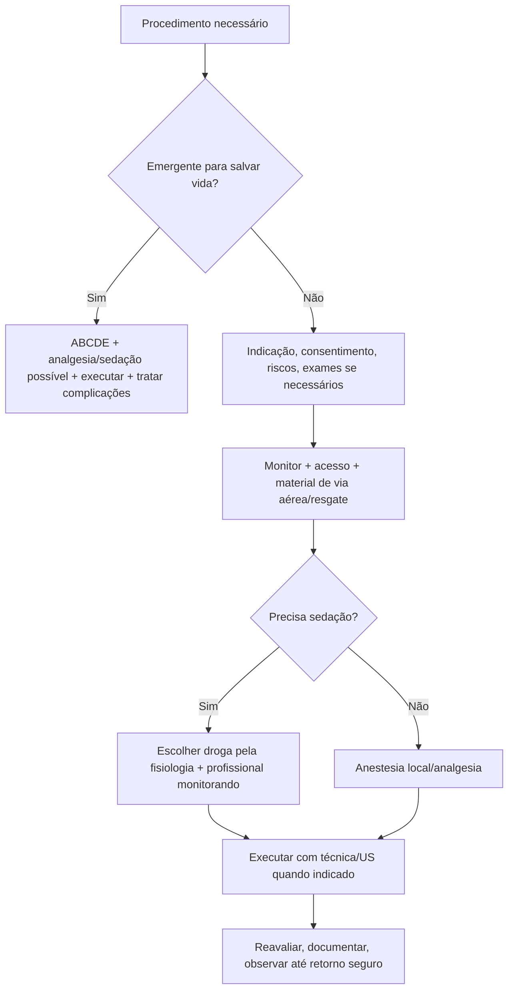

# Procedimentos, Analgesia e Sedação

## Leitura de 30 segundos

- Procedimento em emergência é pré-procedimento, execução e pós-procedimento. A banca pune quem sabe a técnica mas esquece consentimento, monitorização, via aérea, analgesia e complicações.
- Analgesia não mascara abdome agudo; melhora exame e cuidado. Sedação procedural não é anestesia improvisada.
- POCUS guiando agulha, toracocentese, paracentese, bloqueios, acesso vascular e analgesia regional já apareceram nas provas e práticas.

## Por que cai

- **Recorrência em provas/estações:** TEME22-25 cobrou analgesia em abdome/trauma, bloqueios guiados por US, toracocentese, paracentese, punção guiada na prática de POCUS, sedação pós-IOT e sedação contínua no TCE.
- **O que a banca costuma testar:** indicação, contraindicação, preparo, monitorização, escolha de droga, técnica segura e complicações.
- **Como costuma aparecer:** paciente com dor e procedimento necessário, alternativa que nega analgesia, ou estação pedindo verbalizar monitor/via aérea/agulha.

## Abordagem prática

### 1. Antes de qualquer procedimento

1. Indicação clara e alternativa: por que fazer agora?
2. Risco/benefício, consentimento se possível e time-out.
3. Checar alergia, anticoagulação/coagulopatia, plaquetas, jejum quando aplicável, gestação, via aérea e acesso.
4. Monitor: PA, FC, SpO2, ECG se sedação/risco; capnografia quando sedação moderada/profunda disponível.
5. Material de resgate: O2, aspiração, BVM, via aérea, reversores quando aplicáveis, drogas de emergência.
6. Analgesia antes da técnica.

### 2. Analgesia multimodal

- Dor leve/moderada: dipirona/paracetamol, AINE se seguro.
- Dor forte: opioide titulado, cetamina em dose analgésica, bloqueio regional quando treinado.
- Trauma de costelas: analgesia sistêmica + bloqueio plano eretor/intercostal/serrátil conforme local.
- Abdome agudo: analgesia é correta; reexaminar depois.

### 3. Sedação procedural

- Objetivo: nível de sedação suficiente para procedimento com segurança.
- Separar papéis: quem faz procedimento não deve ser o único monitorando sedação.
- Escolha por fisiologia: cetamina preserva drive/PA em muitos cenários; propofol é rápido mas hipotensor; midazolam/fentanil somam depressão respiratória; etomidato pode ser útil em cardioversão/redução curta conforme protocolo.
- Reavaliar até retorno ao basal, via aérea protegida e critérios de alta/observação.

### 4. Bloqueios guiados por US

- Verbalizar: probe correto, assepsia, imagem do nervo/plano, agulha em plano ou fora de plano, aspiração, injeção fracionada, visualizar dispersão.
- Sempre calcular dose máxima de anestésico local.
- LAST: zumbido, gosto metálico, agitação, convulsão, arritmia/choque. Tratamento com suporte, benzo e emulsão lipídica 20%.

### 5. Toracocentese e drenagem pleural

- Indicações: diagnóstico de derrame relevante, alívio, suspeita de empiema; drenagem se pus/pH baixo/glicose baixa/loculado ou pneumotórax/hemotórax conforme caso.
- Use US se disponível: reduz complicação.
- Evitar punção às cegas em derrame pequeno, coagulopatia grave não corrigida quando não emergente, instabilidade sem preparo.

### 6. Paracentese

- Cirrótico internado com ascite nova/piora, dor, febre, HDA, IRA, encefalopatia ou hipotensão merece paracentese diagnóstica.
- POCUS ajuda local e profundidade.
- PBE: PMN >=250/mm3 no líquido ascítico; antibiótico precoce.
- Albumina quando PBE com risco renal ou grande volume conforme protocolo.

### 7. Acesso vascular e punção guiada

- Linear, veia compressível, diferenciar artéria/veia, técnica estéril.
- Visualizar ponta da agulha. Na prática 2025 isso pontuou.
- Confirmar posição conforme contexto: US, retorno, flush, Rx se CVC, sinais de complicação.

## Conceitos que sustentam a conduta

Procedimento bom é aquele que resolve um problema sem criar outro. Na emergência, o risco não vem só da agulha: vem da dor, hipóxia, hipotensão, anticoagulação, anatomia difícil, sedação excessiva e falta de plano de resgate. Por isso o checklist vale ponto.

## Fluxograma

## Doses, alvos e números

| Item | Número | Observação TEME |
|---|---:|---|
| Morfina | 0,05-0,1 mg/kg EV titulado | Cuidado hipotensão/DRC; reavaliar |
| Fentanil | 0,5-1 mcg/kg EV titulado | Rápido; dose alta/rápida pode dar rigidez |
| Cetamina analgesia | 0,1-0,3 mg/kg EV | Pode ajudar trauma/procedimento |
| Cetamina dissociativa | 1-2 mg/kg EV ou 4-5 mg/kg IM | Preparar salivação/vômito/agitação |
| Propofol | 0,5-1 mg/kg EV, titular | Hipotensão/apneia |
| Midazolam | 1-2 mg EV titulado | Idoso/álcool/opioide: cuidado respiratório |
| Lidocaína sem adrenalina | 4,5 mg/kg | Checar dose total |
| Lidocaína com adrenalina | 7 mg/kg | Evitar em locais/protocolos contraindicados |
| Bupivacaína | 2-2,5 mg/kg | Mais cardiotóxica; cuidado LAST |
| Emulsão lipídica LAST | bolus 1,5 mL/kg a 20% | Depois infusão conforme protocolo |

## Pegadinhas TEME

- **Analgesia mascara abdome agudo:** falso.
- **Sedação sem capnografia é proibida:** falso se indisponível, mas monitorização e via aérea são obrigatórias; capnografia é desejável.
- **Quem faz o procedimento também monitora sedação sozinho:** armadilha.
- **Bloqueio guiado por US elimina LAST:** falso. Calcular dose e injetar fracionado.
- **Paracentese só se dor abdominal:** falso; cirrótico internado/descompensado tem várias indicações.
- **Toracocentese às cegas é igual ao US:** falso quando US está disponível.

## Erros fatais na prática

- Sedar paciente sem BVM/aspiração/O2/acesso.
- Não calcular dose máxima de anestésico local.
- Não reconhecer LAST.
- Fazer paracentese/toracocentese sem revisar anticoagulação, plaqueta e anatomia quando não emergente.
- Não reavaliar após opioide/sedação.

## Para prova vs na prática

> **Para prova TEME:** analgesia é parte da conduta; sedação exige monitor, via aérea e resgate; US deve guiar procedimentos quando disponível; paracentese é obrigatória em cirrótico descompensado/internado; bloqueio exige dose máxima e vigilância de LAST.
>
> **Na prática clínica:** drogas, doses e exigência de jejum/capnografia dependem de protocolo, treinamento e recurso. Emergência verdadeira não espera jejum, mas exige preparo proporcional.

## Checklist de revisão

- [ ] Sei checklist antes de procedimento.
- [ ] Sei doses básicas de sedação/analgesia.
- [ ] Sei dose máxima de anestésico local.
- [ ] Sei reconhecer e tratar LAST.
- [ ] Sei indicações de paracentese no cirrótico.
- [ ] Sei quando usar US em toracocentese/acesso/bloqueio.
- [ ] Sei critérios de observação pós-sedação.

## Questões e estações relacionadas

- **TEME22 Q97/Q63:** analgesia em dor abdominal e emergências reumato/renal.
- **TEME24 Q63:** analgesia em dor abdominal aguda.
- **TEME25 Q52/Q63:** bloqueio ESP e bloqueio guiado por US em trauma.
- **TEME25 prática POCUS:** punção guiada, escolha do transdutor e visualização da agulha.
- **TEME25 prática caso clínico:** sedação/analgesia contínua no neurocrítico.

## Referências

**Prova/TEME**

- Conteúdo programático TEME26: analgesia e sedação procedural adulto/pediátrica, monitorização, POCUS procedimentos, bloqueios periféricos, toracocentese e paracentese.
- Referências bibliográficas TEME26: Tratado ABRAMEDE 2024; POCUS ABRAMEDE 2024; Manual de Via Aérea 2025.

**Material local**

- Emergency Talks: Aula 35 - POCUS procedimentos; Aula 29 - POCUS cardíaco; Aula 39 - Trauma de extremidades; Aula 32 - HDA/hepatopatia.

**Atualização clínica**

- ACEP. Clinical Policy: Severe Agitation/Sedation context: https://www.acep.org/siteassets/new-pdfs/clinical-policies/severe-agitation-cp.pdf

