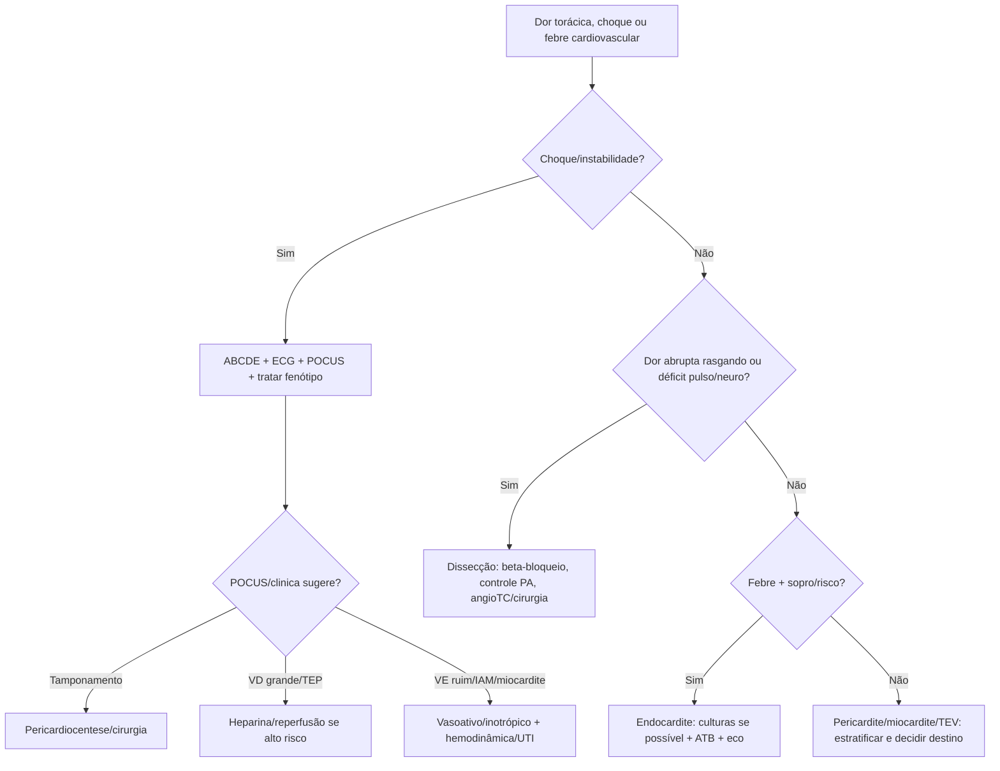

# Cardiovascular Complementar

## Leitura de 30 segundos

- Este capítulo fecha o que ficou fora de SCA/arritmia/PA: pericardite, miocardite, endocardite, tamponamento, doenças da aorta, TVP/TEV e complicações mecânicas do IAM.
- Choque com turgência, abafamento, pulso paradoxal ou POCUS com derrame/colapso = tamponamento até prova em contrário.
- Dor torácica rasgando, déficit de pulso/neuro, síncope ou dor migratória = dissecção. Controle FC/PA antes de vasodilatar.

## Por que cai

- **Recorrência em provas/estações:** TEME22-25 trouxe tamponamento/pericárdio, miocardite, endocardite, aorta/dissecção, aneurisma, TVP/TEV e choque obstrutivo/cardiogênico.
- **O que a banca costuma testar:** reconhecer fenótipo grave, usar POCUS, não trombolisar dissecção, controlar PA corretamente e chamar hemodinâmica/cirurgia.
- **Como costuma aparecer:** dor torácica com ECG confuso, choque com POCUS, paciente pós-IAM deteriorando, febre+sopro, dor lombar/síncope com AAA.

## Abordagem prática

### 1. Pericardite e tamponamento

- Pericardite típica: dor pleurítica/posicional, atrito, supra difuso/PR baixo, derrame.
- Miopericardite: troponina elevada, disfunção ventricular ou arritmia.
- Tamponamento: hipotensão/choque, turgência, abafamento, pulso paradoxal, taquicardia, POCUS com derrame + colapso AD/VD + VCI cheia.
- Instável: pericardiocentese como ponte, cirurgia quando traumático/purulento/dissecção/iatrogênico conforme caso.

### 2. Miocardite

- Pode parecer SCA, sepse, arritmia, IC ou choque.
- Pistas: viral recente, jovem, dor torácica, troponina, arritmia, disfunção de VE, choque desproporcional.
- Evitar exercício; internar se troponina alta, ECG alterado, arritmia, síncope, IC, disfunção ventricular ou instabilidade.
- Choque: suporte hemodinâmico, inotrópico/vasopressor, considerar centro com suporte circulatório.

### 3. Endocardite

- Febre + sopro novo, fenômenos embólicos, uso de droga IV, prótese valvar, dispositivo, hemodiálise ou bacteremia persistente.
- Coletar hemoculturas antes do antibiótico se estável; se choque/sepsis, não atrasar antibiótico.
- Complicações de emergência: IC aguda por regurgitação, AVC/embolias, abscesso, bloqueio AV, choque séptico.
- Eco e infecto/cardio/cirurgia conforme gravidade.

### 4. Dissecção de aorta

- Dor abrupta intensa torácica/dorsal/abdominal, síncope, déficit neurológico, assimetria de pulso/PA, novo sopro aórtico, isquemia.
- Controle primeiro: beta-bloqueador para FC <60 e PAS 100-120 se perfusão permite. Depois vasodilatador se necessário.
- Nunca dar vasodilatador isolado antes de controlar FC.
- Tipo A: cirurgia. Tipo B complicada: vascular/endovascular.
- Trombólise/anticoagulação em SCA/TEP sem excluir dissecção pode ser desastre.

### 5. AAA sintomático/roto

- Idoso, dor abdominal/lombar, síncope/choque, massa pulsátil nem sempre presente.
- POCUS aorta ajuda no instável; angioTC se estável.
- Instável com AAA provável: vascular/cirurgia, hemoderivados, permissiva até controle conforme protocolo.

### 6. TVP e TEV

- TVP: edema unilateral, dor, risco recente. US compressivo: veia não colaba.
- TEP está no capítulo respiratório, mas o raciocínio cardíaco é VD.
- Anticoagular se alta probabilidade e baixo risco de sangramento quando imagem atrasar, conforme protocolo.
- TEP alto risco: choque/hipotensão/PCR; considerar reperfusão se benefício > sangramento.

### 7. Complicações mecânicas do IAM

- Ruptura de músculo papilar: EAP/choque + sopro de IM aguda, geralmente inferior.
- CIV pós-IAM: choque + sopro novo rude.
- Ruptura de parede livre: tamponamento/PCR.
- Pseudoaneurisma/aneurisma e choque cardiogênico: POCUS/eco e cirurgia/hemodinâmica.

## Conceitos que sustentam a conduta

O capítulo inteiro é sobre não ser enganado pela dor torácica "parecida com SCA". Dissecção, miocardite, pericardite, tamponamento e TEP mudam completamente o tratamento. POCUS e ECG ajudam, mas a chave é fisiologia: obstrutivo drena/desobstrui, aorta reduz shear stress, endocardite controla infecção e complicação, complicação mecânica chama cirurgia.

## Fluxograma

## Doses, alvos e números

| Item | Número | Observação TEME |
|---|---:|---|
| Dissecção | FC <60; PAS 100-120 se tolera | Beta-bloqueador antes de vasodilatador |
| Esmolol | bolus 500 mcg/kg, infusão 50-200 mcg/kg/min | Titular; alternativa labetalol |
| Pericardiocentese | imediata se tamponamento instável | POCUS guiado quando possível |
| Pericardite baixo risco | AINE + colchicina | Internar se febre, grande derrame, anticoag, trauma, imunossupressão, miocardite |
| Hemoculturas endocardite | 2-3 pares | Se estável antes de ATB; não atrasar se choque |
| TVP US | não compressibilidade | Achado central no POCUS vascular |
| TEP alto risco | choque/hipotensão/PCR | Reperfusão se sem contra ou benefício supera risco |

## Pegadinhas TEME

- **Dor torácica com supra = trombólise sempre:** falso; dissecção/pericardite entram no diferencial.
- **Dissecção trata primeiro com nitroprussiato:** falso se sem beta-bloqueio.
- **Tamponamento precisa tríade de Beck completa:** falso; POCUS pode ser decisivo.
- **Pericardite com troponina alta é sempre alta:** falso; miopericardite muda risco.
- **Endocardite estável recebe antibiótico antes de hemocultura:** em geral colete antes se não atrasar e paciente estável.
- **VD dilatado fecha TEP:** falso; precisa contexto.

## Erros fatais na prática

- Anticoagular/trombolisar dissecção confundida com IAM/TEP.
- Não fazer POCUS em choque indiferenciado.
- Perder complicação mecânica pós-IAM em paciente que "já reperfundiu".
- Dar alta para pericardite com sinais de alto risco.
- Não acionar cirurgia/vascular em dissecção tipo A ou AAA roto.

## Para prova vs na prática

> **Para prova TEME:** dissecção = beta-bloqueio antes de vasodilatar; tamponamento instável = drenagem; endocardite estável = hemoculturas antes de antibiótico; miocardite/pericardite com alto risco interna; complicação mecânica pós-IAM exige eco e cirurgia/hemodinâmica.
>
> **Na prática clínica:** escolha de anti-hipertensivo, anticoagulação e reperfusão depende de recurso, imagem, equipe, risco de sangramento e protocolo de aorta/TEP/cardiologia.

## Checklist de revisão

- [ ] Sei diferenciar pericardite, miocardite e SCA.
- [ ] Sei sinais clínicos/POCUS de tamponamento.
- [ ] Sei metas iniciais da dissecção.
- [ ] Sei quando pensar em AAA roto.
- [ ] Sei red flags de endocardite.
- [ ] Sei complicações mecânicas do IAM.
- [ ] Sei TVP/TEP como causa obstrutiva.

## Questões e estações relacionadas

- **TEME22:** tamponamento/pericárdio, miocardite e aorta como diagnósticos diferenciais.
- **TEME23:** endocardite, tamponamento, TEV/TVP, dissecção e choque obstrutivo.
- **TEME24:** tamponamento, aorta/aneurisma, TEV e choque.
- **TEME25:** miocardite, pericárdio, TEV e choque cardiogênico/obstrutivo em questões e POCUS.

## Referências

**Prova/TEME**

- Conteúdo programático TEME26: emergências cardiovasculares, miocardites, endocardites, pericardites, tamponamento, doenças da aorta, embolia pulmonar, TVP/TEV e complicações mecânicas do infarto.
- Referências bibliográficas TEME26: Tratado ABRAMEDE 2024; POCUS ABRAMEDE 2024; ACS 2025.

**Material local**

- Emergency Talks: Aula 34 - Síncope e arritmias; Aula 36 - SCA; Aula 38 - Emergências vasculares; Aula 48 - Pericardite, miocardite e endocardite; Aula 29 - POCUS cardíaco.

**Atualização clínica**

- ACC/AHA/ACEP/NAEMSP/SCAI. ACS Guideline 2025, listado no edital TEME26.
- ESC/ERS. Pulmonary embolism guideline 2019: https://academic.oup.com/eurheartj/article/41/4/543/5556136

